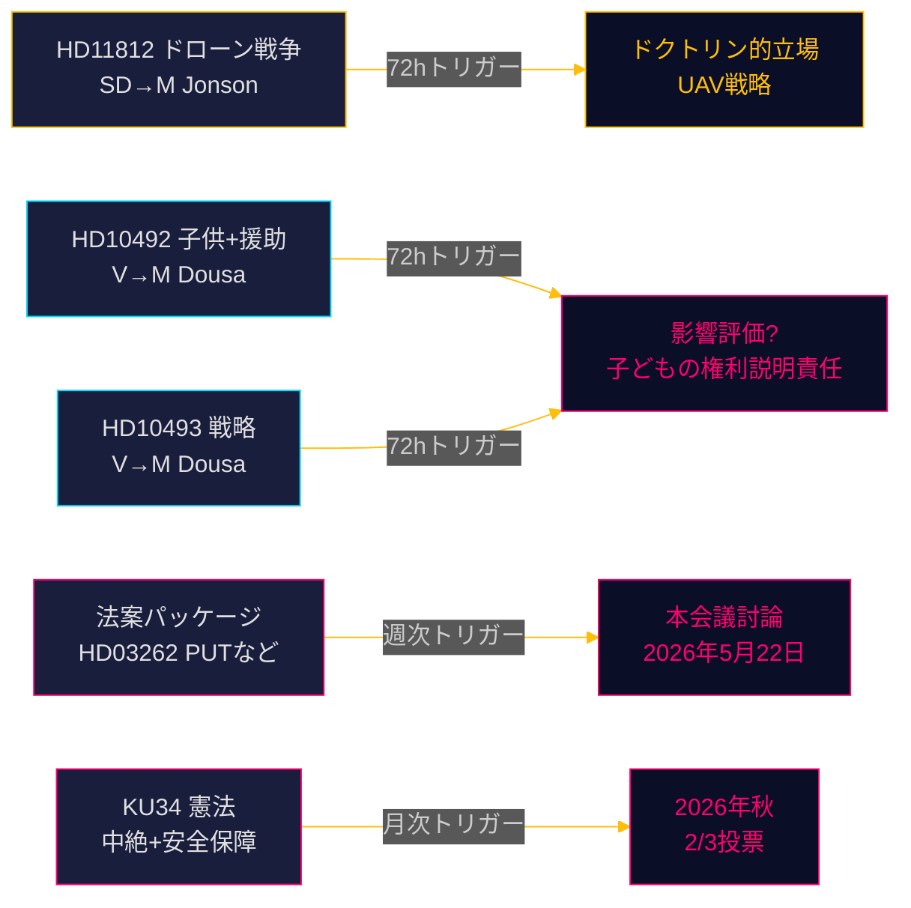

# リクスダーグモニター リアルタイムパルス — 2026年5月15日: 防衛能力と開発援助の課題

**著者**: James Pether Sörling  
**日付**: 2026-05-15  
**分類**: 🟢 公開  
**信頼度**: 高 [B2]  
**ホライゾン**: [horizon:72h] [horizon:week]

---

## 🎯 BLUF

2026年5月15日のスウェーデン政治情勢は、3つの並行する圧力によって特徴付けられる。民主党（SD）はアウロラ26演習後にドローン戦争ドクトリンについて国防大臣パール・ヨンソンを追及（HD11812、[A2]）；左翼党（V）は子供への影響と廃止された国別戦略に焦点を当て、ティード連立政権の援助削減への精査を強化（HD10492 [A2]、HD10493 [A2]）；そして本日の姉妹分析は2025/26年度の国会会期が10年で最も深い移民政策改革を含むことを確認する。総合して、5月15日は高い立法量と2026年9月選挙に向けた加速する選挙ポジショニングを伴う国会の終盤スプリントを示す。

## 🧭 このブリーフが支える3つの意思決定

1. **編集上の優先事項**: 援助討論（HD10492 / HD10493）が本日のリクスダーグモニターの主要ニュース。  
2. **安全保障政策の監視**: ドローン質問（HD11812）はUAVドクトリンとアウロラ26の教訓に関する早期シグナル文書。  
3. **移民政策の較正**: 5つの法案 + 20の反対動議 + KU34は第21週に重要な本会議討論を示す。

## ⚡ 60秒で読む

- **HD11812** [B2]: SDのマルクス・ヴィーケルが国防大臣パール・ヨンソン（M）にドローン戦争について質問 — アウロラ26演習（1万8千人参加、2026年4〜5月、ゴットランド重点）でUAV戦術的ギャップが露呈 [horizon:72h]。
- **HD10492** [A2]: VのロッタJヨンソン・フォルナルヴェがベンヤミン・ドゥサ（M）に援助削減の子供への影響説明を要求 — 子どもの権利条約第6/26/28条を援用 [horizon:week]。
- **HD10493** [A2]: 同じ質問者が廃止された援助戦略について質問 — 37戦略中14廃止、GNI1%目標放棄 [horizon:week]。
- **法案パッケージ** [A2]: HD03262を含む5法案 — 幅広い議会批判（S + C + V + MP） [horizon:week]。
- **KU34** [A2]: 二重憲法改正 — 中絶権利 + 結社の自由 — 2/3超多数決必要、2026年秋 [horizon:month]。
- **経済文脈**: スウェーデンGDP成長2.3%（WEO 2026年4月）；援助0.7%→0.36%（2026年予測）— 1970年代以来最低水準 [B1]。
- **選挙バロメーター**: アウロラ26とウクライナ戦争の教訓は、SDが「強力な防衛政策」を中心に有権者プロフィールを固めていることを示す [horizon:week]。
- **フォワードトリガー**: ヨンソンのHD11812への回答とドゥサのHD10492/10493への回答が第21週のエスカレーションを決定 [horizon:72h]。

## 🔭 最重要フォワードトリガー

**PIR-1 (72h)**: ベンヤミン・ドゥサのHD10492とHD10493への書面回答 — 影響評価の欠如を認めるか？回答は第20〜21週（5月18〜22日）に予定。

<!-- source-sha: 4dab56d2891eeda118e9fe89207421ca0f0be533 -->
