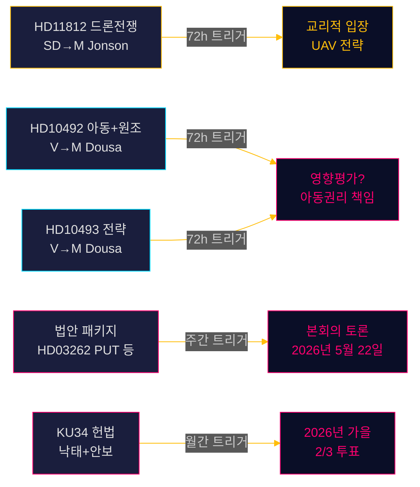

# 릭스다그모니터 실시간 펄스 — 2026년 5월 15일: 국방 역량과 개발원조 부채

**저자**: James Pether Sörling  
**날짜**: 2026-05-15  
**분류**: 🟢 공개  
**신뢰도**: 높음 [B2]  
**시계**: [horizon:72h] [horizon:week]

---

## 🎯 BLUF

2026년 5월 15일 스웨덴 정치 상황은 세 가지 병렬적 압박으로 특징지어진다: SD는 오로라 26 훈련 이후 드론 전쟁 교리에 관해 국방장관 파울 욘슨을 압박(HD11812, [A2]); 좌파당(V)은 아이들에 대한 영향과 폐지된 국가 전략에 초점을 맞추어 티도 연립의 원조 삭감에 대한 조사를 강화(HD10492 [A2], HD10493 [A2]); 오늘의 자매 분석들은 2025/26년도 국회 회기가 10년 만에 가장 깊은 이민 정책 개혁을 담고 있음을 확인한다. 종합하면, 5월 15일은 높은 입법 볼륨과 2026년 9월 선거를 앞둔 가속화된 선거 포지셔닝으로 마무리 스프린트에 있는 국회를 나타낸다.

## 🧭 이 브리핑이 지원하는 3가지 결정

1. **편집 우선순위**: 원조 토론(HD10492 / HD10493)이 오늘 릭스다그모니터의 주요 뉴스.  
2. **안보 정책 모니터링**: 드론 질문(HD11812)은 UAV 교리와 오로라 26 교훈에 관한 초기 신호 문서.  
3. **이민 정책 보정**: 다섯 가지 법안 + 20개 반대 동의 + KU34는 21주에 EU 법적 차원의 중요한 본회의 토론을 예고.

## ⚡ 60초 독서

- **HD11812** [B2]: SD의 마르쿠스 비켈이 국방장관 파울 욘슨(M)에게 드론 전쟁에 대해 질문 — 오로라 26 훈련(18,000명 참가, 2026년 4~5월, 고틀란드 집중)에서 UAV 전술적 격차 노출 [horizon:72h].
- **HD10492** [A2]: V의 로타 욘슨 포르나르베가 벤야민 도우사(M)에게 원조 삭감이 아동에게 미치는 영향 설명 요구 — 아동권리협약 제6/26/28조 원용 [horizon:week].
- **HD10493** [A2]: 동일한 질문자가 폐지된 원조 전략에 대해 질문 — 37개 중 14개 전략 해체, GNI 1% 목표 포기 [horizon:week].
- **법안 패키지** [A2]: HD03262를 포함한 5개 법안 — 광범위한 의회 비판(S + C + V + MP) [horizon:week].
- **KU34** [A2]: 이중 헌법 개정 — 낙태권 + 결사의 자유 — 2/3 초다수결 필요, 2026년 가을 [horizon:month].
- **경제적 맥락**: 스웨덴 GDP 성장 2.3%(WEO 2026년 4월); 원조 0.7% → 0.36%(2026년 예측) — 1970년대 이후 최저 수준 [B1].
- **선거 바로미터**: 오로라 26과 우크라이나 전쟁 교훈은 SD가 "강력한 국방 정책"을 중심으로 유권자 프로필을 강화하고 있음을 시사 [horizon:week].
- **포워드 트리거**: 욘슨의 HD11812 답변과 도우사의 HD10492/10493 답변이 21주 확대 여부 결정 [horizon:72h].

## 🔭 가장 중요한 포워드 트리거

**PIR-1 (72h)**: 벤야민 도우사의 HD10492와 HD10493에 대한 서면 답변 — 영향 평가 부재를 인정할 것인가? 답변은 20~21주(5월 18~22일)에 예상.

<!-- source-sha: 4dab56d2891eeda118e9fe89207421ca0f0be533 -->
