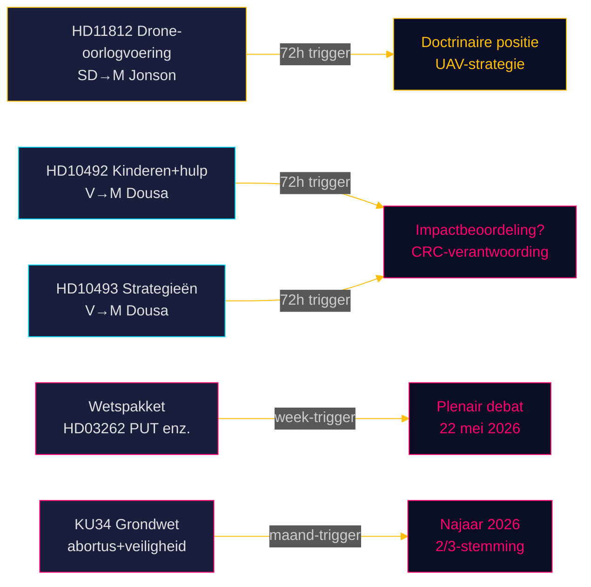

# Riksdagsmonitor Realtime Puls — 15 mei 2026: Verdedigingscapaciteit en de ontwikkelingsschulden

**Auteur**: James Pether Sörling  
**Datum**: 2026-05-15  
**Classificatie**: 🟢 OPENBAAR  
**Betrouwbaarheid**: HOOG [B2]  
**Horizon**: [horizon:72h] [horizon:week]

---

## 🎯 BLUF

Het Zweedse politieke landschap op 15 mei 2026 wordt bepaald door drie parallelle stressfactoren: SD zet minister van Defensie Pål Jonson onder druk over de drone-oorlogdoctrine na de Aurora 26-oefening (HD11812, [A2]); de Linkse Partij (V) intensiveert haar onderzoek naar de bezuinigingen op ontwikkelingshulp van de Tidö-coalitie, gericht op gevolgen voor kinderen en stopgezette landstrategieën (HD10492 [A2], HD10493 [A2]); en de zusteranalyses van vandaag bevestigen dat de rijksdag-sessie 2025/26 de diepste migratiepolitieke hervorming in een decennium omvat. Samen signaleert 15 mei een Riksdag in de eindspurt met hoog wetgevend volume en versnellende verkiezingspositionering voor september 2026.

## 🧭 3 beslissingen die dit rapport ondersteunt

1. **Redactionele prioritering**: Het hulpdebat (HD10492 / HD10493) is het hoofdverhaal van Riksdagsmonitor vandaag.  
2. **Veiligheidspolitieke bewaking**: De drone-vraag (HD11812) is een vroeg signaaaldocument over UAV-doctrine.  
3. **Migratiebeleidskalibratie**: Vijf wetsvoorstellen + 20 opposiemoties + KU34 signaleren belangrijke plenaire debatten in week 21.

## ⚡ 60-seconden lezing

- **HD11812** [B2]: Markus Wiechel (SD) vraagt minister van Defensie Pål Jonson (M) over drone-oorlogvoering — de Aurora 26-oefening (18.000 deelnemers, april–mei 2026, Gotland-focus) heeft UAV-tactische hiaten blootgelegd [horizon:72h].
- **HD10492** [A2]: Lotta Johnsson Fornarve (V) eist dat Benjamin Dousa (M) verantwoording aflegt over de gevolgen van hulpbezuinigingen voor kinderen — CRC-artikelen 6/26/28 ingeroepen [horizon:week].
- **HD10493** [A2]: Dezelfde interpellant vraagt over stopgezette hulpstrategieën — 14 van 37 strategieën afgebouwd, het 1%-van-BNI-doel opgegeven [horizon:week].
- **Wetspakket** [A2]: Vijf wetsvoorstellen incl. HD03262 (afschaffing PUT) — brede parlementaire kritiek (S + C + V + MP) [horizon:week].
- **KU34** [A2]: Dubbele grondwetswijziging — abortusrechten + verenigingsvrijheid — 2/3 supermeerderheid vereist, najaar 2026 [horizon:month].
- **Economische context**: Zweedse bbp-groei 2,3% (WEO apr-2026); hulp 0,7% → 0,36% van het bbp (2026-prognose) [B1].
- **Electorale barometer**: Aurora 26 + Oekraïne-lessen duiden erop dat SD een kiezersprofiel consolideert rond "sterke defensiepolitiek" [horizon:week].
- **Voorwaartse trigger**: Pål Jonsons antwoord op HD11812 en Benjamin Dousas antwoorden op HD10492/10493 bepalen of de vragen escaleren in week 21 [horizon:72h].

## 🔭 Belangrijkste voorwaartse trigger

**PIR-1 (72h)**: De schriftelijke antwoorden van Benjamin Dousa op HD10492 en HD10493 — erkent Dousa het ontbreken van impactbeoordelingen? Antwoorden worden verwacht in weken 20–21 (18–22 mei).

<!-- source-sha: 4dab56d2891eeda118e9fe89207421ca0f0be533 -->
