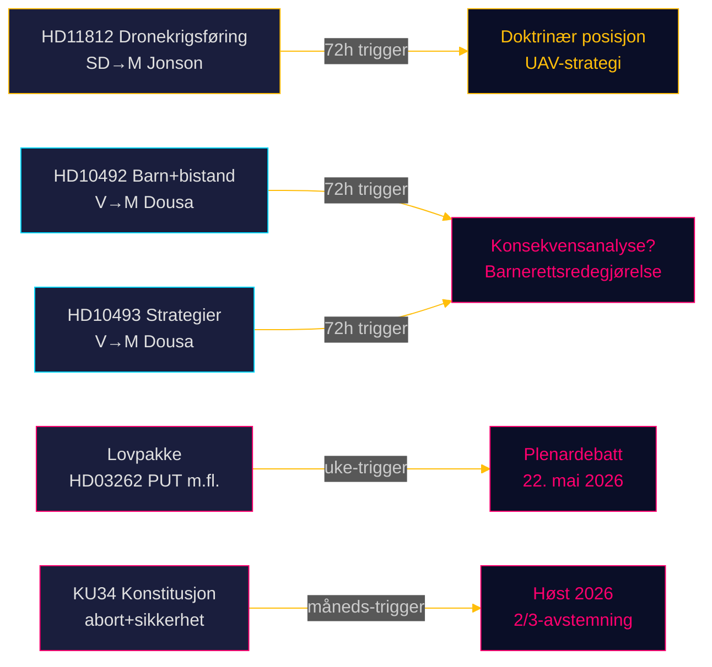

# Riksdagsmonitor Sanntidspuls — 15. mai 2026: Forsvarskapasitet og bistandsgjelden

**Forfatter**: James Pether Sörling  
**Dato**: 2026-05-15  
**Klassifisering**: 🟢 OFFENTLIG  
**Konfidensnivå**: HØY [B2]  
**Horisont**: [horizon:72h] [horizon:week]

---

## 🎯 BLUF

Sveriges politiske landskap 15. mai 2026 preges av tre parallelle stressorer: SD presser forsvarsminister Pål Jonson om dronedoktrin etter Aurora 26-øvelsen (HD11812, [A2]); Vänsterpartiet (V) intensiverer sin gransking av Tidö-regjeringens bistandskutt, med fokus på konsekvenser for barn og avviklede landestrategier (HD10492 [A2], HD10493 [A2]); og dagens søsteranalyser bekrefter at riksmøtet 2025/26 bærer preg av den dypeste migrasjonspolitiske omformingen på et tiår. Samlet sett signalerer 15. mai en riksdag i sin avsluttende sprint med høyt lovgivningsvolum og akselererende valgposisjonering frem mot september 2026.

## 🧭 3 beslutninger dette underlaget støtter

1. **Redaksjonell prioritering**: Bistantsdebatten (HD10492 / HD10493) er Riksdagsmonitors topphistorie i dag — internasjonal rekkevidde, en barnerettslig dimensjon og det globale USAID-sammenbruddet som bakteppe.  
2. **Sikkerhetspolitisk overvåking**: Dronespørsmålet (HD11812) er et tidlig signaldokument om UAV-doktrin og Aurora 26-lærdom — overvåk Pål Jonsons svar.  
3. **Migrasjonspolitisk kalibrering**: Dagens fem lovforslag + 20 opposisjonsmotioner + KU34 signalerer at plenardebatten i uke 21 (22. mai) kan avgjøre avstemningsutfall med en EU-rettslig dimensjon.

## ⚡ 60-sekunders lesning

- **HD11812** [B2]: SDs Markus Wiechel spør forsvarsminister Pål Jonson (M) om dronekrigsføring — Aurora 26-øvelsen (18 000 deltakere, april–mai 2026, Gotland-fokus) har avdekket UAV-taktiske hull [horizon:72h].
- **HD10492** [A2]: Vs Lotta Johnsson Fornarve krever at Benjamin Dousa (M) redegjør for konsekvensene for barn av bistandskuttene — Redd Barnas rapportering om stoppede underernæringsprogrammer; CRC artiklene 6/26/28 påberopes [horizon:week].
- **HD10493** [A2]: Samme interpellant spør om avviklede bistandsstrategier — 14 av 37 strategier nedmontert, 1%-av-BNI-målet forlatt [horizon:week].
- **Lovpakke** [A2]: Fem lovforslag inkl. HD03262 (PUT-avvikling) — bred parlamentarisk kritikk (S + C + V + MP) [horizon:week].
- **KU34** [A2]: Konstitusjonell dobbeltendring — abortrettigheter + foreningsfrihet — 2/3 supermajoritet kreves, høst 2026 [horizon:month].
- **Økonomisk kontekst**: Sveriges BNP-vekst 2,3% (WEO apr-2026); bistand 0,7% → 0,36% av BNP (2026-prognose) — laveste bistandsandel siden 1970-tallet [B1].
- **Valgbarometer**: Aurora 26 + Ukraina-krigens lærdom tyder på at SD konsoliderer en velgerprofil rundt "sterk forsvarspolitikk" [horizon:week].
- **Fremoverutløser**: Pål Jonsons svar på HD11812 og Benjamin Dousas svar på HD10492/10493 bestemmer om spørsmålene eskalerer til interpellasjonsdebatter i uke 21 [horizon:72h].

## 🔭 Viktigste fremoverutløser

**PIR-1 (72h)**: Benjamin Dousas skriftlige svar på HD10492 og HD10493 — vil Dousa erkjenne fraværet av konsekvensanalyser? Svar forventet i ukene 20–21 (18.–22. mai).

<!-- source-sha: 4dab56d2891eeda118e9fe89207421ca0f0be533 -->
