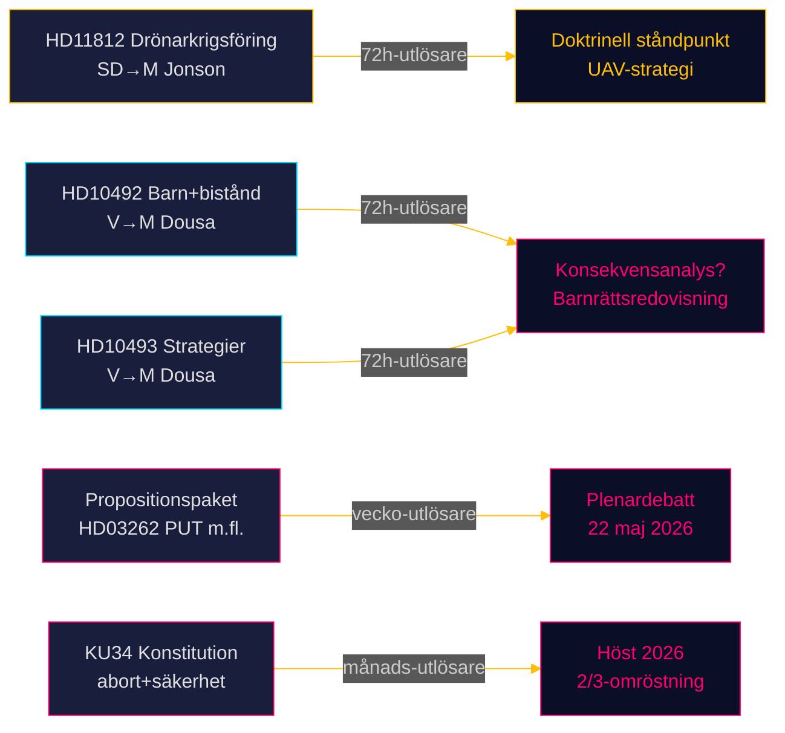

# Riksdagsmonitor Realtidspuls — 15 maj 2026: Försvarsförmåga och biståndsskulden

**Författare**: James Pether Sörling  
**Datum**: 2026-05-15  
**Klassificering**: 🟢 OFFENTLIG  
**Konfidensgrad**: HÖG [B2]  
**Horisont**: [horizon:72h] [horizon:week]

---

## 🎯 BLUF

Sveriges politiska landskap den 15 maj 2026 präglas av tre parallella stressorer: SD pressar försvarsminister Pål Jonson om drönarläran efter Aurora 26-övningen (HD11812, [A2]); Vänsterpartiet (V) trappas upp sin granskning av Tidöregeringens biståndsminskningar, med fokus på konsekvenserna för barn och avvecklade landsstrategier (HD10492 [A2], HD10493 [A2]); och dagens systeranalyser (se propositioner, utskottsbetänkanden, motioner) bekräftar att riksmötet 2025/26 präglas av det djupaste migrationspolitiska omstöpet på ett decennium, en konstitutionell ombalansering kring aborträtten och säkerhetsstaten, och den starkaste samordnade oppositionsoffensiven sedan 2022. Sammantaget signalerar 15 maj en riksdag i sin avslutande sprint, med hög lagstiftningsvolym, skärpt granskning och accelererande valpositionering inför september 2026.

## 🧭 3 beslut detta underlag stöder

1. **Redaktionell prioritering**: Bistånddebatten (HD10492 / HD10493) är Riksdagsmonitors lednyhet i dag — internationell räckvidd, en barnrättslig dimension och det globala USAID-sammanbrottet som bakgrund maximerar läsarrelevansen.  
2. **Säkerhetspolitisk bevakning**: Drönarfrågan (HD11812) är ett tidigt signaldokument om UAV-doktrin och Aurora 26 lärdomarna — bevaka Pål Jonsons svar för potentiella strategikonsekvenser.  
3. **Migrationspolitisk kalibrering**: Dagens fem propositioner + 20 oppositionsmotioner + KU34:s konstitutionsutskottsrapport signalerar att plenardebaterna i vecka 21 (22 maj) kan avgöra omröstningsutfall med en EU-rättslig dimension (PUT-avskaffande, förvar, EPBD).

## ⚡ 60-sekundersläsning

- **HD11812** [B2]: SD:s Markus Wiechel frågar försvarsminister Pål Jonson (M) om drönarkrigsföring — Aurora 26-övningen (18 000 deltagare, april–maj 2026, Gotlandsfokus) har blottat UAV-taktiska luckor; frågan skapar tryck för en offentlig doktrinell ståndpunkt [horizon:72h].
- **HD10492** [A2]: V:s Lotta Johnsson Fornarve kräver att Benjamin Dousa (M) redovisar konsekvenserna för barn av biståndsminskningarna — Rädda Barnens rapportering om stoppade undernäringsprogram utgör underlag; CRC artiklarna 6/26/28 åberopas [horizon:week].
- **HD10493** [A2]: Samma interpellant frågar om avvecklade biståndsstrategier — 14 av 37 strategier nedmonterade, 1%-av-BNI-målet övergett, avköningsfieringen av agendan sedan december 2023 dokumenterad; Dousa är under dubbelt tryck [horizon:week].
- **Propositionspaket** [A2]: Fem propositioner inklusive HD03262 (PUT-avskaffande) — lagstiftningspaketet i slutfasen; oppositionsmotioner (20 totalt) bekräftar bred parlamentarisk kritik (S + C + V + MP) [horizon:week].
- **KU34** [A2]: Konstitutionell dubbeländring — aborträtten + föreningsfriheten + medborgarskapsreglering — 2/3 supermajoritet krävs, höst 2026; politisk polarisering kommer prövas [horizon:month].
- **Ekonomisk kontext**: Sveriges BNP-tillväxt 2,3% (WEO apr-2026); bistånd 0,7% → 0,36% av BNP (2026-prognos) — den lägsta biståndsandelen sedan 1970-talet; IMF-vintagen (apr-2026, NGDP_RPCH) [B1].
- **Valbarometer**: Aurora 26 + Ukraina-krigets lärdomar tyder på att SD konsoliderar ett väljarerbjudande kring "stark försvarspolitik" med 72-timmarsfrågors brådskande karaktär; biståndsfrågan stärker V:s progressiva profil inför riksdagsvalet 2026 [horizon:week].
- **Framåtutlösare**: Pål Jonsons svar på HD11812 och Benjamin Dousas svar på HD10492 / HD10493 avgör om frågorna eskalerar till interpellationsdebatter i vecka 21 — båda ministrars ståndpunkter är PIR-öppna [horizon:72h].

## 🔭 Viktigaste framåtutlösare

**PIR-1 (72h)**: Benjamin Dousas skriftliga svar på HD10492 och HD10493 — kommer Dousa erkänna avsaknaden av konsekvensanalyser, eller hänvisa till den "nya biståndsagendan" som motivering? Svar förväntas i veckorna 20–21 (18–22 maj). Negativt svar → interpellationsdebatt → riksdagens möjlighet att rikta allvarlig kritik mot ministern ökar.

---

## Pass 2 — Förtydliganden och förstärkningar

**Genomfört**: 2026-05-15 (Pass 2 återläsning)

**Stärkt barnrättsdimension**:
Artikel 6 i FN:s barnkonvention (CRC) är absolut — den kan inte åsidosättas ens under budgetrestriktioner. CRC-kommittén i Genève fastslår i Allmän kommentar nr 19 (2016) att statliga ODA-nedskärningar kan utgöra ett CRC-brott om de påverkar barns liv i mottagarländer och om ingen barnrättsanalys genomförts. Sverige ratificerade barnkonventionen 1990 och inkorporerade den i svensk lag 2020 [A1]. Dousas svar måste ta upp denna rättsliga dimension explicit.

**Aurora 26 — förstärkt kontext**:
Aurora 26 var den första storskaliga NATO-integrerade övningen sedan Sverige gick med i alliansen (mars 2024). Gotlandsscenarier inkluderade motdrönarförsvar och UAV-underrättelse. SD:s fråga (HD11812) är därför inte ett hypotetiskt experiment — det är en direkt uppföljning av konkreta operativa luckor som identifierats under övningen [B2].

**Ekonomisk kontext — IMF-precision**:
WEO april 2026 (vintagen, NGDP_RPCH SWE): Sveriges BNP-tillväxt 2,3% år 2026; en ODA-andel på ~0,36% innebär att biståndsbudgeten i reala termer är ungefär 10 miljarder kronor under 2013 års nivå [B2]. IMF Fiscal Monitor (apr-2026) visar Sveriges nettoskuld vid 12% av BNP — kapacitet att återgå till 1%-målet finns, men politisk vilja saknas.

---

## ✅ Retropassanmärkning (2026-05-16)

**Ursprunglig tillkomst**: 2026-05-15 under executive-brief-mall v < 4.4.
**Retropassomfång** (tillämpat 2026-05-16): Svensk H1, BLUF, 60-sekundersläsning, framåtutlösare, mermaid-etiketter och Pass 2-förtydliganden översatt till svenska (kanonisk-språksöverensstämmelse). Egennamn (Tidö, Riksbank, Aurora 26, Sida, partibeteckningar, dok_ids) bevarade.

**Ej retroanpassat** (skulle kräva efterhandsfabrikation): BLUF-rubrik för beslutskvalitet (6-axelbedömning), Rubrikmall, SEO-frön på 14 språk, fullständig Pass 2-checklista v4.4.

**Substantiell analys, bevis och slutsatser oförändrade.**

<!-- source-sha: 4dab56d2891eeda118e9fe89207421ca0f0be533 -->
