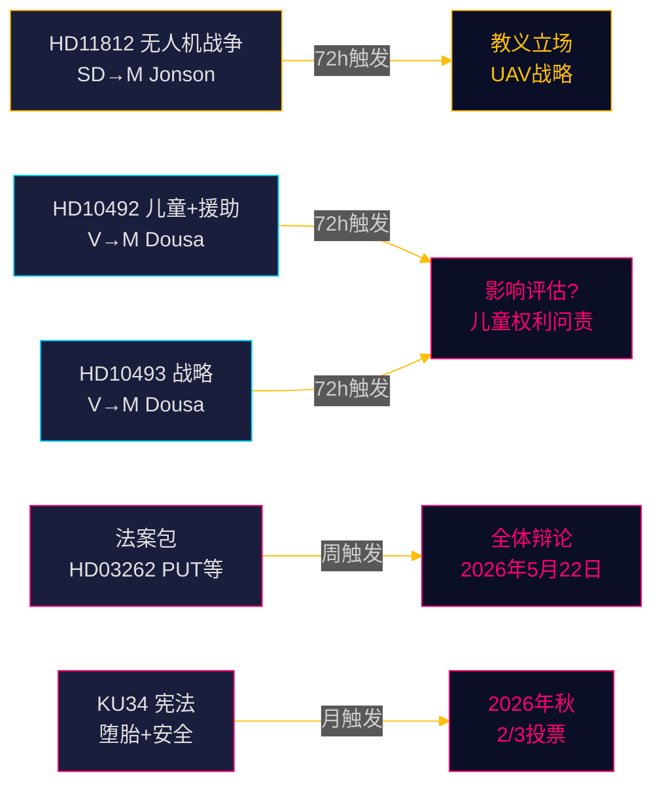

# 瑞典议会监测 实时脉搏 — 2026年5月15日：防御能力与发展援助债务

**作者**：James Pether Sörling  
**日期**：2026-05-15  
**分类**：🟢 公开  
**可信度**：高 [B2]  
**时间维度**：[horizon:72h] [horizon:week]

---

## 🎯 摘要

2026年5月15日瑞典政治格局由三个并行压力因素决定：民主党（SD）在奥罗拉26演习后就无人机战争教义向国防部长帕尔·扬松施压（HD11812，[A2]）；左翼党（V）加强对蒂多联合政府援助削减的审查，聚焦对儿童的影响及被废止的国别战略（HD10492 [A2]、HD10493 [A2]）；今日姊妹分析证实2025/26年度国会期间包含十年来最深刻的移民政策改革。综合来看，5月15日标志着立法量高涨、选举定位加速的议会终局冲刺。

## 🧭 本简报支持的3项决策

1. **编辑优先级**：援助辩论（HD10492/HD10493）是瑞典议会监测今日头条。  
2. **安全政策监测**：无人机问题（HD11812）是UAV教义与奥罗拉26教训的早期信号文件。  
3. **移民政策校准**：五项法案+20项反对动议+KU34预示第21周重要全体辩论。

## ⚡ 60秒速读

- **HD11812** [B2]：SD的马库斯·维克尔就无人机战争向国防部长帕尔·扬松（M）提问——奥罗拉26演习（18,000名参与者，2026年4—5月，哥特兰重点）暴露UAV战术缺口 [horizon:72h]。
- **HD10492** [A2]：V的洛塔·约翰森·福纳尔维要求本亚明·杜萨（M）解释援助削减对儿童的影响——引用《儿童权利公约》第6/26/28条 [horizon:week]。
- **HD10493** [A2]：同一质询人询问被废止的援助战略——37项中14项被拆除，GNI1%目标被放弃 [horizon:week]。
- **法案包** [A2]：五项法案含HD03262——广泛议会批评（S+C+V+MP） [horizon:week]。
- **KU34** [A2]：双重宪法修正——堕胎权+结社自由——需2/3超多数，2026年秋 [horizon:month]。
- **经济背景**：瑞典GDP增长2.3%（WEO 2026年4月）；援助从0.7%→0.36%（2026年预测）——1970年代以来最低 [B1]。
- **选举晴雨表**：奥罗拉26和乌克兰战争教训表明SD正围绕"强力国防政策"巩固选民形象 [horizon:week]。
- **前向触发**：扬松对HD11812的回复和杜萨对HD10492/10493的回复将决定第21周是否升级 [horizon:72h]。

## 🔭 最重要的前向触发

**PIR-1 (72h)**：本亚明·杜萨对HD10492和HD10493的书面回复——是否承认缺乏影响评估？回复预计在第20—21周（5月18—22日）。

<!-- source-sha: 4dab56d2891eeda118e9fe89207421ca0f0be533 -->
