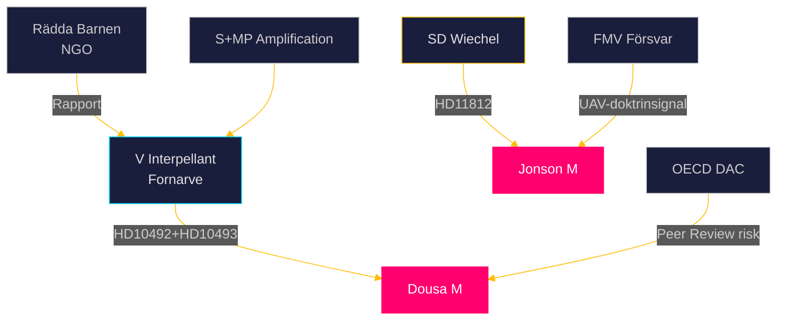

# Stakeholder Perspectives — Realtime Pulse 2026-05-15

**Author**: James Pether Sörling | **Date**: 2026-05-15  
**Confidence**: HIGH [B2]

---

## 6-Lens Stakeholder Matrix

### Lins 1: Tidöregeringen (M+SD+KD+L)

**Perspektiv**: Reformering av bistånds- och migrationspolitiken är kärnan i mandatperiodens agenda. Nedskärningarna är "omriktning" för effektivitet, inte ideologisk nedmontering.

**Inomkoalitionell spänning**:
- M (Jonson/Dousa): Väljer strategisk tvetydighet; undviker detaljkonfrontation
- SD (Wiechel): Pressar hårdare på försvarsambitioner (HD11812); nosar på biståndsskepticism
- KD: Stöder biståndsreformer av principskäl men utsatt för kritik från kristen civilsamhälle
- L: Vill bevara ODA-åtaganden; under tryck att acceptera M:s linje

**Key Actor**: Benjamin Dousa (M) — biståndsminister under dubbeltryck [B2]
**Key Actor**: Pål Jonson (M) — försvarsminister med Aurora 26 kapital [A2]

### Lins 2: Oppositionsblock (S+V+MP)

**Perspektiv**: Biståndsnedskärningarna är moraliskt och juridiskt oacceptabla. V koordinerar rättsbaserad biståndsinterpellationskampanj; S och MP amplifierar via media.

**Strategi**: Systematisk parlamentarisk granskning (interpellationer → debatter → KU-granskningar → valambitioner)

**Key Actor**: Lotta Johnsson Fornarve (V) — interpellant HD10492+HD10493 [A2]
**Key Actor**: Not specificed i data — S:s biståndspolitiske talesperson förväntas delta i debatt [B2]

### Lins 3: Mitten (C+L)

**Perspektiv**: C splittrad — jordbrukspolitisk pragmatism vs. humanistisk biståndsprofil. L vill hålla ODA-mål men vill inte bryta koalitionen.

**Risk**: KU34-röstningen om aborträtt kan splittra C+L från M-linjen [B3]

**Key Actor**: C:s biståndspolitiker — position ej offentlig per 15 maj [B3]

### Lins 4: Civilsamhälle och NGOs

**Perspektiv**: Rädda Barnen, UNICEF Sverige, Diakonia och Swedish Development Forum driver systematisk dokumentation av biståndsnedskärningarnas konsekvenser.

**Aktivitetsläge**: Aktiv lobbying; rapport-releases; media-koordination med V:s interpellationsarbete [B2]

**Evidence Base**: Rädda Barnens rapport om stoppade undernäringsprogram citerad i HD10492 [A2]

### Lins 5: Militär och Försvarssektorn

**Perspektiv**: Aurora 26 har visat på operativa förmågor men också UAV-gaps. FMV och FöU är intresserade av Jonsons svar på HD11812 som signal om kommande inköpsorders.

**Bakgrund**: FöU27 (drönarpropositionen, 2024/25) passerade 248-101 — bred parlamentarisk supportbas [A2]

**Key Actor**: Försvarsmakten (FMV) — väntar på UAV-doktrinklarläggning

### Lins 6: Internationella Aktörer

**Perspektiv**: OECD DAC, FN-organ och EU-partners följer Sveriges ODA-nedgång. USA:s USAID-kollaps 2025 har förändrat backstopp-kalkylen.

**USAID-kontexten**: Med USA:s tillbakadragande från OECD-ramverket och USAID:s avveckling i 40+ länder är EU:s och Nordens givaransvar accelererat — Sverige's minskning ger dubbla signaleffekter [B2]

**Key Actor**: OECD DAC Sekretariatet — peer review cycle 2026 möjlig [B3]
**Key Actor**: EU-kommissionen — DG INTPA monitorerar ODA-nivåer i EU-stater [B3]

## Stakeholderinteraktion Diagram

