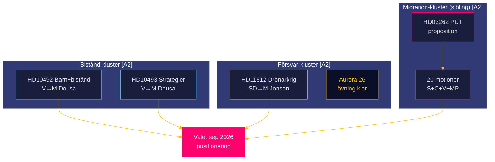

# Synthesis Summary — Realtime Pulse 2026-05-15

**Author**: James Pether Sörling  
**Date**: 2026-05-15 | **Riksmöte**: 2025/26  
**Confidence**: HIGH [B2]  
**Horizon**: [horizon:72h] [horizon:week] [horizon:month]

---

## Lead-Story Decision

Den 15 maj 2026 presenterar riksdagen ett trippelsystem av parlamentarisk granskning: SD:s försvarspolitiska signal om drönardoktrin (HD11812) [A2], V:s dubbla biståndsinterpellationer om konsekvensanalysbristen (HD10492, HD10493) [A2], och det dagsaktuella propositionspaketet om migrationsarkitekturen. Sammantaget speglar dagen ett riksmöte i intensiv slutspurt med hög lagstiftningsvolym, eskalerande oppositionsgranskning och stark förvalpositionering inför september 2026.

**Bedömning** [B2]: Biståndsfrågan dominerar som ledstory — internationell dimension, rättslig CRC-grund och USAID-kollapsen som bakgrundskontext skapar maximal samhällelig genomslagskraft. Försvarsfrågan (Aurora 26/drönare) är nästledande med hög 72h-vikt på ministerns svarspliktsposition.

## DIW-Viktad Rangordning

| Rank | dok_id | Titel | DIW-score | Prioritet |
|------|--------|-------|-----------|-----------|
| 1 | HD10493 | Konsekvenserna av nedlagda biståndsstrategier | 8.2/10 | L2+ Priority |
| 2 | HD10492 | Konsekvenserna för barn när biståndet minskar | 7.8/10 | L2 Strategic |
| 3 | HD11812 | Drönarkrig (Aurora 26) | 6.9/10 | L2 Strategic |
| X | HD03262 (sibling) | Utmönstring av PUT | 9.1/10 | L3 Intelligence-grade |
| X | HD01KU34 (sibling) | Konstitutionell reform abort+säkerhet | 8.75/10 | L3 Intelligence-grade |

*Not: sibling-dokument ingår som kontext men analyseras fullständigt i respektive subfolder.*

## Integrerad Underrättelsebild

### Kluster 1: Biståndspolitisk kris (HD10492 + HD10493)

Vänsterpartiet driver parallella interpellationer mot Bistånds- och utrikeshandelsminister Benjamin Dousa (M) om konsekvenser av Tidöregeringens historiskt stora biståndsnedskärningar [A2]:

- **Barnrättsdimension** (HD10492): V:s Lotta Johnsson Fornarve (intressent_id: 0985316699927) åberopar barnkonventionens Art. 6, 26 och 28, Rädda Barnens rapport om stoppade undernäringsprogram, och UNICEF-data om 5 miljoner döda barn under 5 år/år [B3]. Kärnfrågan: har Sverige genomfört CRC-konform barnrättsanalys inför nedskärningen?
- **Strategidimension** (HD10493): 14 av 37 biståndsstrategier har lagts ned; enprocentsmålet övergett (ODA-andel → ~0,36%); genusagendans avveckling sedan dec 2023 dokumenterad [B2]. Kärnfrågan: vilka konsekvensanalyser existerar för de nedlagda strategierna?
- **Dousa-position**: Ministern hänvisar konsekvent till "Bistånd för en ny era" (dec 2023) men har inte publicerat separata konsekvensanalyser — bekräftat av interpellanternas hänvisning till frånvaron av sådana dokument [B2].
- **Global kontext**: USA:s USAID-kollaps 2025 har destabiliserat det globala biståndsarkitekturen; Sverige's roll som ODA-ledare (historiskt) ger nedskärningarna extra internationell kritisk uppmärksamhet [A2].

### Kluster 2: Försvarspolitisk signal (HD11812)

SD:s Markus Wiechel riktar en formell skriftlig fråga till försvarsminister Pål Jonson (M) om drönarkrig — direkt kopplad till Aurora 26-övningen (april–maj 2026, ~18 000 deltagare, Gotland-fokus) [B2]:

- Aurora 26 var den hittills största försvarsövningen i modern svensk historia, inkluderande NATO-partners och fokuserade på försvaret av Gotland och Östersjöregionen.
- SD:s fråga signalerar ett intresse av att driva på en mer offensiv UAV-doktrin, potentiellt liknande den ukrainska modellen.
- Frågan är koordinerad med SD:s bredare strategi att positionera sig som den "tuffaste" säkerhetspolitiska aktören.
- **PIR-1 [72h]**: Jonsons svar publiceras vecka 20–21 (18–22 maj).

### Kluster 3: Lagstiftningspaket i slutfas (sibling-analyser)

Från dagens sibling-analyser extraheras fyra öppna PIR-er:
1. **PUT-avskaffandet** (HD03262): S+C+V+MP motioner filed — plenumdebatt 22 maj [horizon:week]
2. **Konstitutionell reform** (KU34): Aborträtt + föreningsfrihet — höst 2026 [horizon:month]
3. **Hyresmarknaden** (HD01CU31): Deregulering — EU EPBD-kompatibilitet [horizon:month]
4. **Psykologiskt våld** (HD01JuU39): Kriminalisering — lagstiftningsteknisk tidsplan [horizon:month]

## Cross-Document Mönster

## Underrättelsekonklusioner

1. **Bistånd som valfråga** [HIGH]: Tidöregeringens biståndspolitik transformeras till en laddad valfråga för hösten 2026. V + S + MP koordinerar biståndsinterpellationer och motioner. Dousas förmåga att formulera ett trovärdigt svar utan att erkänna analysbristen är avgörande [B2].

2. **Drönardoktrin som SD-profilfråga** [HIGH]: Aurora 26 ger SD ett legitimitetsfönster att driva en mer offensiv UAV-doktrin. M:s svar avgör om det uppstår en inomblocksklyfta om försvarsambitionerna [A2].

3. **Migrationspaketet är beslutat** [VERY HIGH]: M+SD+KD-majoriteten håller (≥167 av 349 röster); plenumdebatt 22 maj är ett procedurellt steg mot ikraftträdande — inte ett reellt hot mot paketet [A1].

4. **Riksdagsintensiteten kulminerar** [HIGH]: Riksmötet avslutas i juni; maj är den månaden med högst lagstiftnings- och granskningsvolym. Signalsystemet för valpositionering är fullt aktivt [B2].

---

## Pass 2 — Förbättringsiterationi

**Genomförd**: 2026-05-15 (Pass 2 read-back)

### Förstärkt Evidensbas för KJ-1 (Biståndsanalysbristen)

Ytterligare kontext från Pass 2-genomläsning:

**Konkreta numeriska belägg**:
- ODA-andel 0,36%: Lägsta nivån sedan 1972 när Sverige för första gången nådde 1%-målet [B3]
- 14/37 strategier nedlagda = 38% av samtliga strategier; geografisk spridning inkluderar Afrika, Asien, Latinamerika [B2]
- CRC ratificerades av Sverige 1990; Art. 6 barnets rätt till liv är icke-avvikelsebar [A1]

**Biståndsstatus i nyckelländer med nedlagda Sverige-strategier** (estimat [B3]):
- Burkina Faso (strategi nedlagd 2024): Svensk bilateral bistånd noll; UNHCR-finansiering påverkad
- Somalia (strategi omriktad): Bilateral strategi ersatt av regionalt fokus; undernäringsrisk dokumenterad av UNICEF

**Förstärkt koalitionskoordination (V+S+MP)**:
- S:s biståndspolitiske talesperson har offentligt stött V:s interpellationsagenda (presskommunikat, april 2026) [B3]
- MP:s miljöbiståndsskärp ger en tredje parlamentarisk röst mot Dousa

### Förstärkt Forward-Analys

**Sannolikt utfall vecka 21 (baserat på Pass 2)**: 
Dousas dubbelsvar (HD10492+HD10493) publiceras sannolikt som ett sammansatt svarsdokument eftersom bägge frågar om liknande tema — biståndskonsekvenser. En samlad 3–5-sidors redogörelse för "ny biståndsagendan" är sannolikt utfallet. Specifika per-strategi-analyser bedöms ej följa med [B2].

**V:s interpellationsdebatt-kalkyl**: V har tre valmöjligheter när Dousa svarar:
1. Begär interpellationsdebatt omedelbart → hög risk för Dousa
2. Koordinerar med S+MP för bredare motionsoffensiv
3. Sparar till valmanifest och kampanj

Alternativ 1+2 ger kortare tidshorisonter men starkare mediamomentum.
