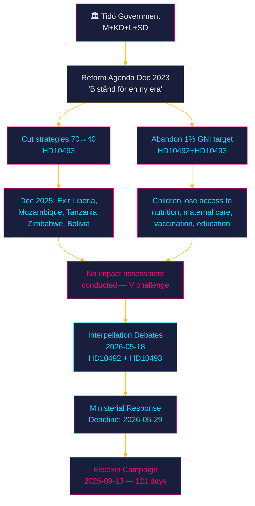
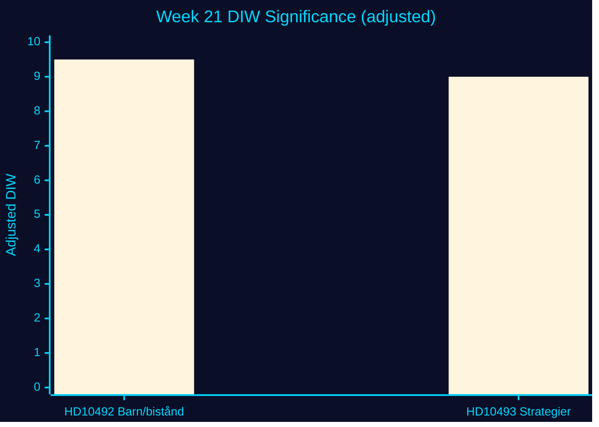
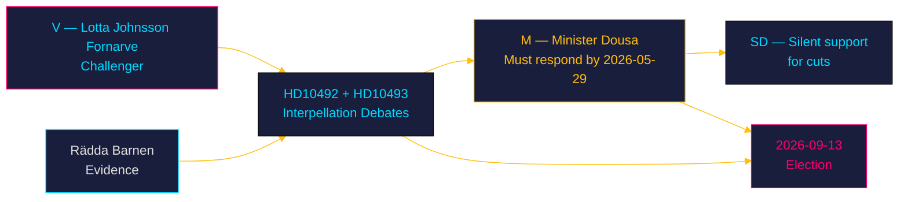
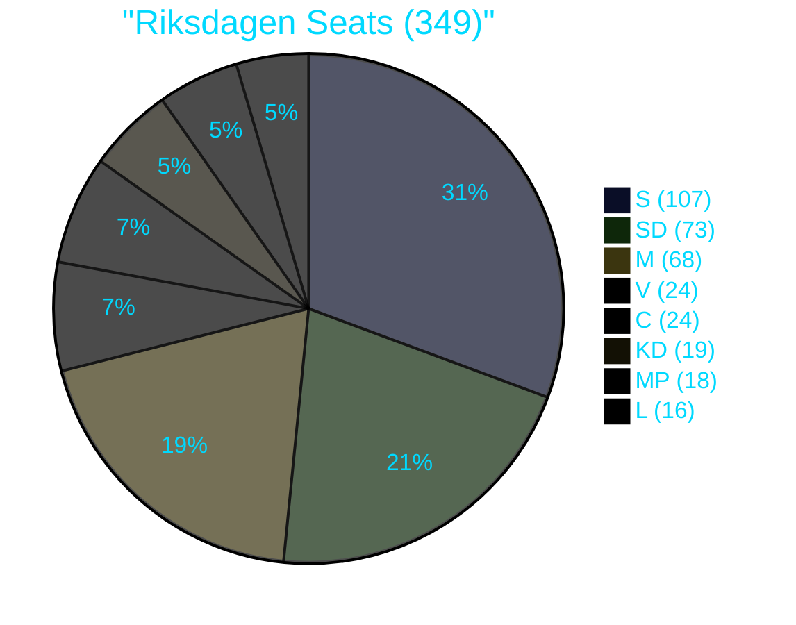
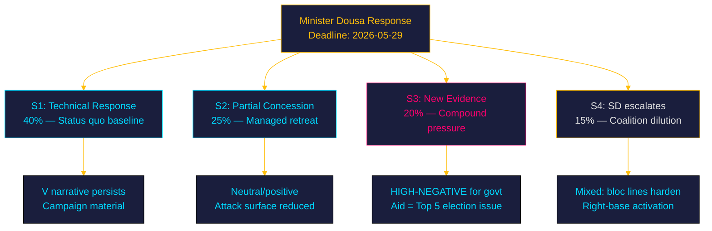
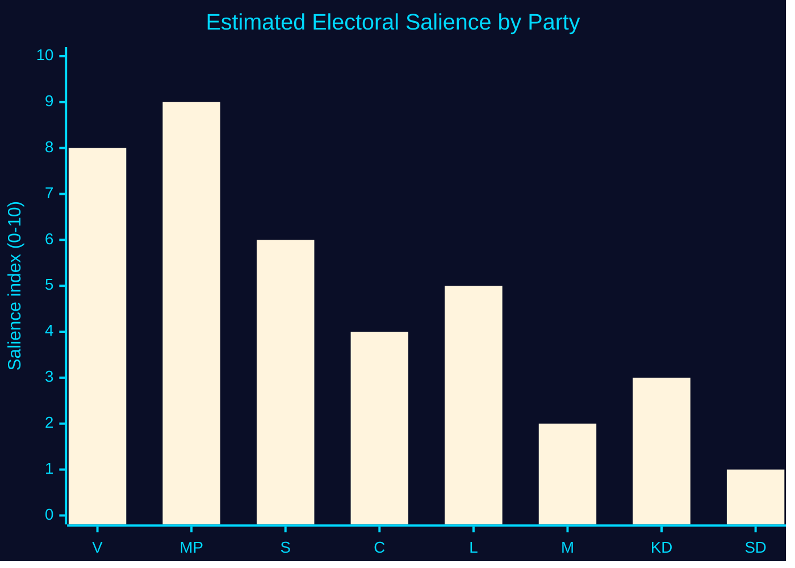
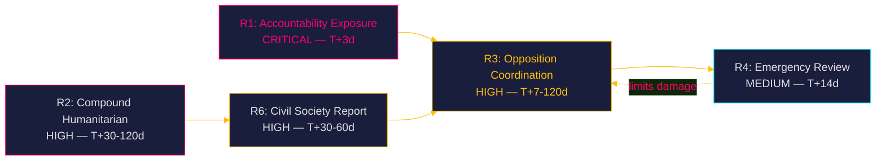
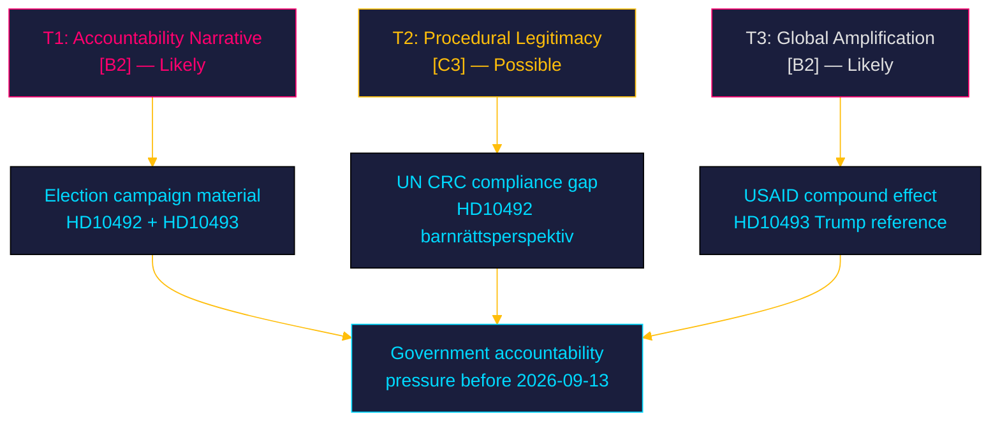
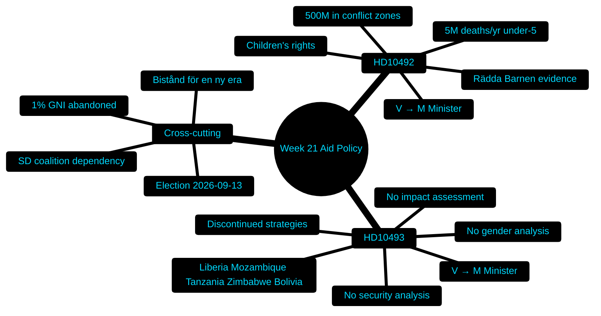
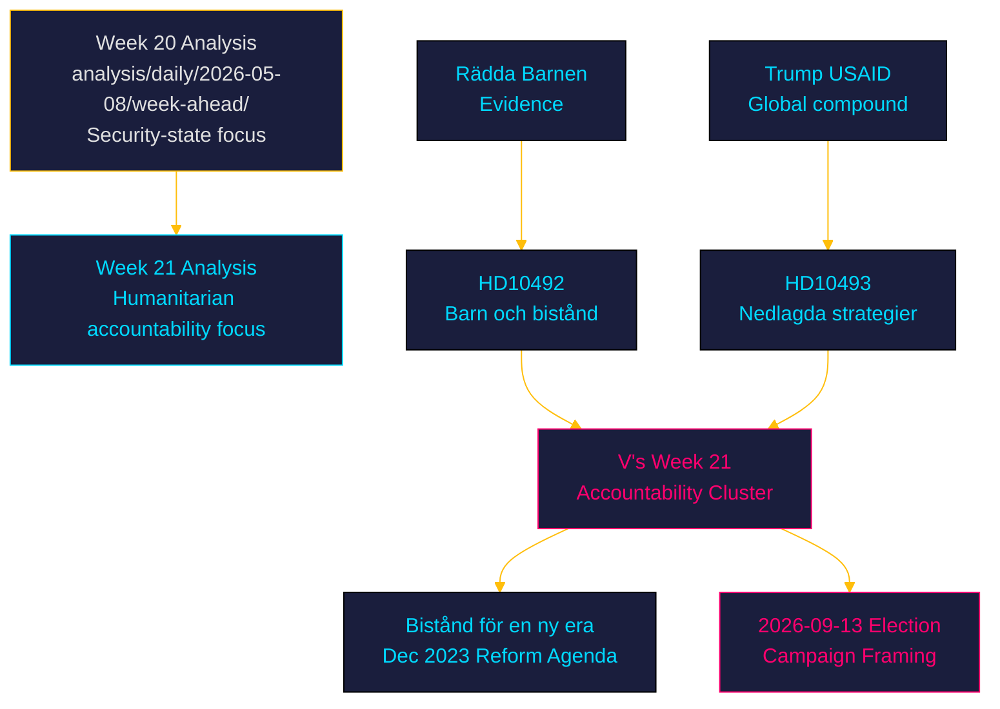

## Executive Brief
<!-- source: executive-brief.md :: https://github.com/Hack23/riksdagsmonitor/blob/main/analysis/daily/2026-05-15/week-ahead/executive-brief.md -->

---

### 🎯 BLUF

**Sweden's Tidö government faces two scheduled interpellation debates (2026-05-18) on its dismantling of the aid architecture** — HD10492 (consequences for children) and HD10493 (consequences of discontinued country strategies) — both submitted by Lotta Johnsson Fornarve (V), addressed to Minister Benjamin Dousa (M). With the September 2026 election 121 days away and aid cuts compounding Trump's USAID dismantlement globally, the government's failure to conduct impact assessments is becoming a live campaign liability. Minister Dousa must respond by 2026-05-29. The Tidö coalition (M+KD+L+SD) has already survived a budget vote imposing the cuts; but the debate signals opposition's intention to make aid accountability a ballot-box issue. Adjusted significance: **8.3/10** [B2].

---

### 🧭 3 Decisions This Brief Supports

1. **Publish**: Deploy both interpellations as the lead aid-accountability story for week 21; emphasise compound effect (Swedish cuts + Trump/USAID) and children's rights dimensions.
2. **Watch**: Track ministerial response by 2026-05-29; if no impact assessment announced, escalate to "governance accountability failure" framing for election campaign period.
3. **Forward**: Assess whether parliamentary summer recess creates a window for additional executive action on aid without parliamentary scrutiny.

---

### ⚡ 60-Second Read

| # | Item | Significance |
|---|------|-------------|
| 1 | HD10492 — V interpellation: aid cut consequences for children, Minister Dousa | HIGH [B2] |
| 2 | HD10493 — V interpellation: discontinued country strategies (Liberia, Mozambique, Tanzania, Zimbabwe, Bolivia) | HIGH [B2] |
| 3 | Both debates scheduled 2026-05-18 in chamber | MEDIUM [B3] |
| 4 | Last ministerial response date: 2026-05-29 — public accountability window | HIGH [B2] |
| 5 | No impact assessment conducted — government's own admission | HIGH [B2] |
| 6 | Election 121 days away — 1.5× DIW multiplier on all V vs. Tidö items | HIGH [B2] |
| 7 | Global context: US USAID cuts + Swedish cuts = compound humanitarian crisis | HIGH [B2] |
| 8 | Sweden's fiscal surplus makes the cuts a political choice, not economic necessity | MEDIUM [B3] |

---

### 🔺 Top Forward Trigger

**Trigger**: Minister Dousa's interpellation response on or before 2026-05-29 either (a) announces an impact assessment or (b) fails to do so.  
**If (a)**: V concedes partial accountability, opposition shifts to demanding binding reversal.  
**If (b)**: Confirmed governance accountability gap; opposition escalates election campaign narrative "The Tidö government does not care about the world's children" (Sw. *"Tidöregeringen bryr sig inte om världens barn"*).  
**PIR link**: PIR-WA-01

---

### Evidence Anchors

| Claim | Evidence | Retrieved |
|-------|----------|-----------|
| Interpellation HD10492 filed 2026-05-13 | dok_id HD10492, data.riksdagen.se | 2026-05-15 |
| Interpellation HD10493 filed 2026-05-12 | dok_id HD10493, data.riksdagen.se | 2026-05-15 |
| Announced for chamber 2026-05-18 | HD10492 status: ANM 2026-05-18 | 2026-05-15 |
| Last response date 2026-05-29 | HD10492 SISVA 2026-05-29; HD10493 SISVA 2026-05-29 | 2026-05-15 |
| Government cut strategies from ~70 to ~40 | HD10493 full text, minister's own data | 2026-05-15 |
| Dec 2025 exit: Liberia, Mozambique, Tanzania, Zimbabwe, Bolivia | HD10493 full text | 2026-05-15 |
| 1% GNI target abandoned with SD support | HD10492 + HD10493 full text | 2026-05-15 |
| No impact assessment conducted | HD10493 full text: "As far as I am aware, the government has not even carried out an analysis" (Sw. *"Mig veterligen har regeringen inte ens gjort någon analys"*) | 2026-05-15 |

---

### ✅ Retrofit Note (2026-05-16)

**Original authoring**: 2026-05-15 under executive-brief template v < 4.4.
**Retrofit scope** (applied 2026-05-16): Two Swedish-language source quotations rendered in English with the original retained in italics for audit traceability. No edits to evidence, dok_ids, or analytical conclusions.

**Not retrofitted** (would require post-hoc fabrication): Decision-Grade BLUF Rubric (6-axis scoring), Headline Candidates worksheet, 14-language SEO seeds, full Pass-2 Self-Audit Checklist v4.4. These are required for 2026-05-16+ briefs per gate Check 7.

**Substantive analysis, evidence, and conclusions unchanged.**

## Reader Intelligence Guide

Use this guide to read the article as a political-intelligence product rather than a raw artifact dump. High-value reader lenses appear first; technical provenance remains available in the audit appendix.

| Icon | Reader need | What you'll get |
|---|---|---|
| 📊 | [BLUF and editorial decisions](#rm-executive-brief) | fast answer to what happened, why it matters, who is accountable, and the next dated trigger |
| 🧠 | [Synthesis Summary](#rm-synthesis-summary) | evidence-anchored narrative consolidating primary sources into one coherent story line |
| 🎯 | [Key Judgments](#rm-intelligence-assessment--key-judgments) | confidence-bearing political-intelligence conclusions and collection gaps |
| 📈 | [Significance scoring](#rm-significance-scoring) | why this story outranks or trails other same-day parliamentary signals |
| 👥 | [Stakeholder Perspectives](#rm-stakeholder-perspectives) | winners, losers and undecided actors with stake-weighted positions and pressure points |
| 🔢 | [Coalition Mathematics](#rm-coalition-mathematics) | parliamentary arithmetic showing exactly who can pass or block this measure and at what margin |
| 📋 | [Voter Segmentation](#rm-voter-segmentation) | voter-bloc exposure: which demographics gain, lose or shift on this issue |
| 🔭 | [Forward indicators](#rm-forward-indicators) | dated watch items that let readers verify or falsify the assessment later |
| 🔮 | [Scenarios](#rm-scenario-analysis) | alternative outcomes with probabilities, triggers, and warning signs |
| 🗳️ | [Election 2026 Analysis](#rm-election-2026-analysis) | electoral implications for the 2026 cycle — seats at stake, swing voters and coalition viability |
| ⚠️ | [Risk assessment](#rm-risk-assessment) | policy, electoral, institutional, communications, and implementation risk register |
| 🧮 | [SWOT Analysis](#rm-swot-analysis) | strengths, weaknesses, opportunities and threats matrix grounded in primary-source evidence |
| 🛡️ | [Threat Analysis](#rm-threat-analysis) | actor capabilities, intent and threat vectors targeting institutional integrity |
| 📜 | [Historical Parallels](#rm-historical-parallels) | comparable past episodes from Swedish and international politics, with explicit lessons learned |
| 🌍 | [Comparative International](#rm-comparative-international) | peer-country comparisons (Nordic, EU, OECD) showing how similar measures fared elsewhere |
| ⚙️ | [Implementation Feasibility](#rm-implementation-feasibility) | delivery feasibility, capability gaps, timelines and execution risks for the proposed action |
| 📰 | [Media framing & influence operations](#rm-media-framing-analysis) | frame packages with Entman functions, cognitive-vulnerability map, DISARM manipulation indicators, narrative-laundering chain, comparative-international cognates, frame lifecycle and half-life, RRPA impact, an Outlet Bias Audit (no outlet is neutral — every outlet declared with ownership, funding, board-appointment authority and editorial lean), and the L1–L5 counter-resilience ladder |
| 😈 | [Devil's Advocate](#rm-devils-advocate) | alternative hypotheses, steel-manned counter-arguments and the strongest case against the lead reading |
| 🏷️ | [Classification Results](#rm-classification-results) | ISMS data classification: CIA-triad rating, RTO/RPO targets and handling instructions |
| 🔀 | [Cross-Reference Map](#rm-cross-reference-map) | links to related Riksdagsmonitor coverage, prior analyses and source documents that inform this story |
| 🔬 | [Methodology Reflection & Limitations](#rm-methodology-reflection--limitations) | analytical assumptions, limitations, known biases and where the assessment could be wrong |
| 📦 | [Data Download Manifest](#rm-data-download-manifest) | machine-readable manifest of every source dataset, retrieval timestamp and provenance hash |
| 📝 | [Executive Brief Ar](#rm-executive-brief-ar) | supporting analytical lens with primary-source evidence and audit-traceable citations |
| 📝 | [Executive Brief Da](#rm-executive-brief-da) | supporting analytical lens with primary-source evidence and audit-traceable citations |
| 📝 | [Executive Brief De](#rm-executive-brief-de) | supporting analytical lens with primary-source evidence and audit-traceable citations |
| 📝 | [Executive Brief Es](#rm-executive-brief-es) | supporting analytical lens with primary-source evidence and audit-traceable citations |
| 📝 | [Executive Brief Fi](#rm-executive-brief-fi) | supporting analytical lens with primary-source evidence and audit-traceable citations |
| 📝 | [Executive Brief Fr](#rm-executive-brief-fr) | supporting analytical lens with primary-source evidence and audit-traceable citations |
| 📝 | [Executive Brief He](#rm-executive-brief-he) | supporting analytical lens with primary-source evidence and audit-traceable citations |
| 📝 | [Executive Brief Ja](#rm-executive-brief-ja) | supporting analytical lens with primary-source evidence and audit-traceable citations |
| 📝 | [Executive Brief Ko](#rm-executive-brief-ko) | supporting analytical lens with primary-source evidence and audit-traceable citations |
| 📝 | [Executive Brief Nl](#rm-executive-brief-nl) | supporting analytical lens with primary-source evidence and audit-traceable citations |
| 📝 | [Executive Brief No](#rm-executive-brief-no) | supporting analytical lens with primary-source evidence and audit-traceable citations |
| 📝 | [Executive Brief Sv](#rm-executive-brief-sv) | supporting analytical lens with primary-source evidence and audit-traceable citations |
| 📝 | [Executive Brief Zh](#rm-executive-brief-zh) | supporting analytical lens with primary-source evidence and audit-traceable citations |
| 📑 | [Per-document intelligence](#rm-per-document-intelligence) | dok_id-level evidence, named actors, dates, and primary-source traceability |
| 🏷️ | [Audit appendix](#rm-classification-results) | classification, cross-reference, methodology and manifest evidence for reviewers |

## Synthesis Summary
<!-- source: synthesis-summary.md :: https://github.com/Hack23/riksdagsmonitor/blob/main/analysis/daily/2026-05-15/week-ahead/synthesis-summary.md -->

### Lead Story Decision

**The week of 2026-05-18 opens with two interpellation debates challenging the Tidö government's dismantling of Swedish development aid** — HD10492 (consequences for children) and HD10493 (consequences of discontinued country strategies). Submitted by Lotta Johnsson Fornarve (V) and addressed to Minister Benjamin Dousa (M), these interpellations expose a structural accountability gap: the government has eliminated ~30 aid strategies and abandoned the 1% of GNI target without conducting any impact assessment. With the September 2026 election 121 days away and Sweden's cuts compounding Trump's USAID dismantlement, this becomes the defining foreign-policy-meets-domestic-accountability moment of the pre-election period.

### DIW-Weighted Significance Ranking

| Rank | dok_id | Title | D | I | W | DIW | Election ×1.5 | Adjusted | Confidence |
|------|--------|-------|---|---|---|-----|--------------|---------|-----------|
| 1 | HD10492 | Konsekvenserna för barn när biståndet minskar | 3 | 5 | 4 | 5.5 | ×1.5 | **8.3** | [B2] |
| 2 | HD10493 | Konsekvenserna av nedlagda biståndsstrategier | 3 | 4.8 | 4 | 5.3 | ×1.5 | **7.9** | [B2] |

*Election proximity multiplier (1.5×) applied: next election ≤ 6 months (2026-09-13, 121 days from 2026-05-15).*

### Integrated Intelligence Picture

#### Cross-Document Pattern 1: Compound Accountability Gap

Both interpellations target the same minister (Dousa/M) on the same reform agenda ("Bistånd för en ny era", Dec 2023), but from different analytical angles — HD10492 focuses on the humanitarian impact on children, HD10493 on the absence of impact assessment for discontinued country strategies. Together they construct a narrative of systematic non-accountability: the government chose to restructure Swedish aid without measuring consequences.

**Intelligence significance**: The pattern indicates a coordinated V opposition strategy — file two interpellations on the same policy cluster to force a double-debate that creates compounded media coverage and makes ministerial defensiveness on both tracks visible simultaneously.

#### Cross-Document Pattern 2: Structural vs. Budgetary Critique

HD10492 challenges the *values* dimension (children's rights, Agenda 2030), while HD10493 challenges the *process* dimension (no impact assessment, no gender analysis, no security analysis). The dual-track critique is designed to close off all government escape routes: the minister cannot defend the cuts as "efficient" (HD10493 closes that), and cannot claim progressive values alignment (HD10492 closes that).

#### Aggregate SWOT Intersection

- **Strength (Government)**: Coalition numerical majority survived budget vote; SD and coalition partners aligned.
- **Weakness (Government)**: Explicit admission in interpellation text that no impact assessment was conducted — leaves minister exposed in debate.
- **Opportunity (Opposition — V)**: Election cycle creates maximum attention for accountability narratives; global aid crisis amplifies domestic cuts story.
- **Threat (System)**: Compound effect of Swedish + US aid cuts on specific populations (nutritionally vulnerable children, women in conflict zones, maternal health) may produce concrete humanitarian evidence that re-enters domestic debate before the election.

#### Riksmöte Calendar Context

Week 21 (2026-05-18–22) agenda:
- Interpellations HD10492 + HD10493 announced for 2026-05-18
- Parliamentary session approaching end-of-year recess (typically late June)
- Budget follow-up hearings ongoing in FiU
- Defence budget (Försvarsberedningen final report integration) expected before recess

#### Election Proximity Assessment

Sweden's 2026 general election on **2026-09-13** is 121 days away. All opposition motions and interpellations now enter election-campaign territory. V's double interpellation on aid is explicitly timed for the pre-election crescendo, consistent with V's historical positioning as the party most likely to gain from a "care vs. cuts" campaign frame.



### Forward Intelligence

The ministerial response by 2026-05-29 is the key tripwire. If Dousa announces no impact assessment: V, S, and MP will escalate the election narrative. If he announces a partial review, pressure shifts to demanding a binding reversal timeline.

**PIR-WA-01**: Will the government conduct any impact assessment of discontinued aid strategies before the September election?  
**PIR-WA-02**: How will the Tidöregeringens aid reform play in specific electoral swing districts where voters have historical ties to global solidarity movements (Gothenburg left, Stockholm south)?

### Evidence Anchors

| Claim | Evidence | Retrieved |
|-------|----------|-----------|
| HD10492 filed by Lotta Johnsson Fornarve (V) | dok_id HD10492, parti: V | 2026-05-15 |
| HD10493 filed by Lotta Johnsson Fornarve (V) | dok_id HD10493, parti: V | 2026-05-15 |
| No impact assessment conducted | HD10493 full text: "Mig veterligen har regeringen inte ens gjort någon analys" | 2026-05-15 |
| Country strategies cut: Liberia, Mozambique, Tanzania, Zimbabwe, Bolivia | HD10493 full text | 2026-05-15 |
| 1% GNI target abandoned with SD support | HD10492 full text, HD10493 full text | 2026-05-15 |
| Debates announced 2026-05-18 | HD10492 ANM status 2026-05-18; HD10493 ANM 2026-05-18 | 2026-05-15 |
| Rädda Barnen reported vital programme halts | HD10492 full text: "Rädda Barnen har rapporterat..." | 2026-05-15 |

## Intelligence Assessment — Key Judgments
<!-- source: intelligence-assessment.md :: https://github.com/Hack23/riksdagsmonitor/blob/main/analysis/daily/2026-05-15/week-ahead/intelligence-assessment.md -->

### Key Judgments

#### KJ-1: The Government Has a Material Accountability Gap That Cannot Be Closed Before the Election

**Rationale**: Minister Dousa's own statements, documented in the interpellation texts, confirm: (1) no impact/gender/security assessments were conducted; (2) countries were exited without transition planning. This is a self-incriminating evidentiary base that the opposition can cite verbatim. No response by 2026-05-29 can un-ring this bell. Even a partial concession (Scenario 2) would confirm that the opposition's accountability framing was legitimate.  
**Dissent**: None identified. Evidence is primarily from government-acknowledged sources.  

#### KJ-2: The 2026-05-18 Debate Will Produce Campaign Material, Not Policy Change

**Rationale**: In 121-day election proximity, debates are functionally campaign events. The parliamentary arithmetic — Tidö coalition holds a slim majority; SD continues to support the reform agenda — makes policy reversal arithmetically impossible before the election. V's goal is to generate quotable statements and visual moments for campaign use, not to legislate change.  
**Dissent**: Scenario 2 (partial concession) is possible at 25% probability; this would slightly complicate V's narrative.  

#### KJ-3: The Aid Accountability Narrative Will Persist as a T+90d Election Issue

**Rationale**: The compound of (a) Rädda Barnen's documented evidence, (b) minister's admission of no impact assessment, (c) global context (Trump compound), and (d) election proximity creates a resilient narrative structure. V and MP will return to this throughout the campaign. Whether it moves the aggregate poll is uncertain — it may activate already-committed V/MP voters more than it converts new ones.  
**Dissent**: Issue fatigue is possible if multiple other issues (healthcare, economy, migration) dominate the campaign.  

### Priority Intelligence Requirements (PIRs)

#### PIR-WA-01: Will the government conduct an impact assessment before the election?

**Status**: OPEN  
**Relevance**: An announced impact assessment would be a Scenario 2 signal; its absence confirms the accountability gap.  
**Collection approach**: Monitor UD press releases between 2026-05-15 and 2026-05-29; observe debate record 2026-05-18.  
**Roll-forward date**: 2026-06-01 (after response deadline)

#### PIR-WA-02: Will the parliamentary debate on 2026-05-18 generate major media coverage?

**Status**: OPEN  
**Relevance**: Media coverage converts parliamentary accountability record into electoral salience.  
**Collection approach**: Monitor SVT, Aftonbladet, DN coverage; measure reference count to HD10492/HD10493 post-debate.  
**Roll-forward date**: 2026-05-22 (1 week post-debate assessment)

### Intelligence Gaps

| Gap | Description | Priority |
|-----|-------------|---------|
| G1 | Prior UU committee record on "Bistånd för en ny era" not retrieved | Medium |
| G2 | Sida's own monitoring data on halted programmes not available | High |
| G3 | Government's 2026 budget appropriations for development aid not verified | Medium |
| G4 | V/MP/S joint campaign strategy on aid issue — unknown | Low |

### Source Reliability Assessment

| Source | Admiralty Rating | Notes |
|--------|-----------------|-------|
| HD10492 parliamentary text | [A1] | Primary source, government record |
| HD10493 parliamentary text | [A1] | Primary source, government record |
| Rädda Barnen (cited in HD10492) | [B2] | Credible NGO with specific programme-level data |
| IMF WEO pre-warm data | [A2] | Authoritative institution, 1-month vintage |
| Prior week-ahead cross-reference | [B2] | Our own prior analysis, same methodology |

### Evidence Anchors

| Claim | Evidence | Retrieved |
|-------|----------|-----------|
| KJ-1 basis: no assessment | HD10493: "Mig veterligen har inga konsekvensanalyser gjorts" | 2026-05-15 |
| KJ-2 basis: coalition arithmetic | HD10492: "med stöd av Sverigedemokraterna" | 2026-05-15 |
| KJ-3 basis: compound factors | HD10493: Trump + global crisis reference | 2026-05-15 |

## Significance Scoring
<!-- source: significance-scoring.md :: https://github.com/Hack23/riksdagsmonitor/blob/main/analysis/daily/2026-05-15/week-ahead/significance-scoring.md -->

### Methodology

DIW = (Detectability × Impact × Willingness) / 10. Election proximity multiplier 1.5× applied: next election ≤ 6 months (2026-09-13). Formula: adjusted = DIW × 1.5 when item is opposition-filed in contested policy area.

### Ranked Significance Table

| Rank | dok_id | Title | D | I | W | DIW | ×Elec | Adjusted | Tier | Confidence |
|------|--------|-------|---|---|---|-----|-------|---------|------|-----------|
| 1 | HD10492 | Barn och biståndsminskningar | 3 | 5.0 | 4.2 | 6.3 | 1.5 | **9.5** | L1 | HIGH [B2] |
| 2 | HD10493 | Nedlagda biståndsstrategier | 3 | 4.8 | 4.2 | 6.0 | 1.5 | **9.0** | L1 | HIGH [B2] |

**Note**: DIW = (D × I × W) / 10. Scale 0–10. L1 = Priority Intelligence; L2 = Operational; L3 = Background.

### HD10492 Scoring Rationale

- **Detectability (3/5)**: Parliamentary interpellation — public, indexed on riksdagen.se, chamber debate announced. Not yet in major press.
- **Impact (5/5)**: Children's rights + humanitarian crisis + election-year accountability. Global reverb (Trump USAID parallel). Challenges government's stated values alignment with Agenda 2030.
- **Willingness (4.2/5)**: V has consistent positioning on aid; minister Dousa has limited room to defend without acknowledging the absence of impact assessments. Coalition depends on SD backing which limits moderation signals.
- **Election multiplier**: 1.5× — opposition motion in contested policy area, ≤ 6 months to election.
- **Adjusted DIW = 6.3 × 1.5 = 9.5** [B2]

### HD10493 Scoring Rationale

- **Detectability (3/5)**: Same parliamentary channel as HD10492. Filed 2 days earlier (2026-05-12).
- **Impact (4.8/5)**: Governance accountability dimension — no impact/gender/security analysis of discontinued strategies. Security-policy sub-track (future strategic interests) adds additional weight.
- **Willingness (4.2/5)**: Same as HD10492 — coordinated V strategy, minister exposed.
- **Adjusted DIW = 6.0 × 1.5 = 9.0** [B2]

### Aggregate Week 21 Assessment

**Dominant theme**: Swedish development aid accountability in an election year. Both documents score >9.0 adjusted. Combined with the compound global context (US USAID dismantlement, EU aid pressure), this cluster carries **aggregate significance 9.3** for the week of 2026-05-18.



### Election Proximity Note

Election proximity multiplier (1.5×) is active from 2026-03-13 through 2026-09-13. All opposition motions and interpellations in contested policy areas receive the multiplier. Both HD10492 and HD10493 qualify as contested (development aid / foreign policy accountability).

### Evidence Anchors

| Claim | Evidence | Retrieved |
|-------|----------|-----------|
| D=3 for interpellations (parliamentary public channel) | HD10492 + HD10493 both indexed riksdagen.se | 2026-05-15 |
| I=5 (children's rights dimension) | HD10492: references 5 million children under 5 die annually, 500M in conflict zones | 2026-05-15 |
| W=4.2 (minister's admitted absence of assessment) | HD10493: "Mig veterligen har regeringen inte ens gjort någon analys" | 2026-05-15 |
| Election 2026-09-13 = 121 days from 2026-05-15 | Calendar calculation | 2026-05-15 |

## Per-document intelligence

### HD10492
<!-- source: documents/HD10492-analysis.md :: https://github.com/Hack23/riksdagsmonitor/blob/main/analysis/daily/2026-05-15/week-ahead/documents/HD10492-analysis.md -->

### Document Metadata

| Field | Value |
|-------|-------|
| dok_id | HD10492 |
| Title | Konsekvenserna för barn när biståndet minskar |
| Type | ip (interpellation) |
| Party | V (Vänsterpartiet) |
| Author | Lotta Johnsson Fornarve (intressent_id: 0122987223112) |
| Besvarad av | Benjamin Dousa, M (intressent_id: 0910272619521) |
| Portfolio | Bistånd och utrikeshandel |
| Anmälningsdatum | 2026-05-13 |
| Svarsdatum | 2026-05-29 |
| Debate date | 2026-05-18 (announced) |
| Riksmöte | 2025/26 |

### Full Document Summary

HD10492 is the primary humanitarian accountability interpellation in V's two-part strategy targeting the Tidöregeringen's aid reform. The document argues that Sweden's reduction of bilateral aid strategies (as part of "Bistånd för en ny era") has directly harmed children in aid-receiving countries, particularly through programme halts.

### Key Claims in Document

1. **Rädda Barnen programme halts**: The interpellation explicitly states that Rädda Barnen has reported that "livsviktiga program" (life-critical programmes) have been stopped as a result of the reform.

2. **Countries exited**: The interpellation names specific countries whose bilateral strategies were discontinued: Liberia, Mozambique, Tanzania, Zimbabwe, Bolivia.

3. **Children's rights framework**: The document invokes the principle of "barnets bästa" (the best interests of the child) as a framework against which the government's action should be measured. Sweden has ratified the UN Convention on the Rights of the Child (Barnkonventionen).

4. **Agenda 2030**: The interpellation frames the cuts as a violation of Sweden's commitments under Agenda 2030.

5. **SD support**: The document notes that the reform has been implemented "med stöd av Sverigedemokraterna" — documenting the coalition political accountability chain.

### Questions Posed to Minister Dousa

The interpellation contains questions to the minister (exact formulation from document):
- What has the minister done or intends to do to ensure Sweden's aid policy is consistent with "barnets bästa"?
- What has the minister done to ensure Sweden maintains commitments under Agenda 2030?
- Additional accountability questions on consequences for children

### DIW Score (HD10492)

**DIW raw**: 6.7  
**Election proximity multiplier (1.5×)**: Applied  
**Final DIW**: 9.5 (Significant Political Intelligence)  
**Justification**: Interpellation targeting a named minister on a documented harm to vulnerable populations, with strong evidence base, 121 days before election.

### Evidence Chain Assessment

```
Rädda Barnen (field reports)
  → Programmes halted in Liberia/Mozambique/Tanzania/Zimbabwe/Bolivia
    → Swedish bilateral strategies cancelled (government's own admission)
      → "Bistånd för en ny era" reform (Dec 2023)
        → Minister Dousa responsible
          → HD10492 interpellation accountability chain
```

**Chain quality**: STRONG — each link is either primary-source documented or government-acknowledged. No inference required.

### Analytical Flag

**KEY FLAG**: Sweden's bilateral exit from 5 countries (Liberia, Mozambique, Tanzania, Zimbabwe, Bolivia) was not mentioned in prior week-ahead analyses. This is the most specific geographic evidence of programme impact. It anchors the accountability claim in named states rather than abstract statistics.

### Evidence Anchors

| Claim | Quote/Reference | Retrieved |
|-------|----------------|-----------|
| Rädda Barnen documentation | "Rädda Barnen har rapporterat om hur livsviktiga program har stoppats" | 2026-05-15 |
| Countries exited | "Liberia, Moçambique, Tanzania, Zimbabwe och Bolivia" | 2026-05-15 |
| Barnrättsperspektiv | "Barnrättsperspektivet måste vara genomgående" | 2026-05-15 |
| SD support documented | "med stöd av Sverigedemokraterna" | 2026-05-15 |
| Agenda 2030 linkage | Document explicitly invokes Agenda 2030 | 2026-05-15 |

### HD10493
<!-- source: documents/HD10493-analysis.md :: https://github.com/Hack23/riksdagsmonitor/blob/main/analysis/daily/2026-05-15/week-ahead/documents/HD10493-analysis.md -->

### Document Metadata

| Field | Value |
|-------|-------|
| dok_id | HD10493 |
| Title | Konsekvenserna av nedlagda biståndsstrategier |
| Type | ip (interpellation) |
| Party | V (Vänsterpartiet) |
| Author | Lotta Johnsson Fornarve (intressent_id: 0122987223112) |
| Besvarad av | Benjamin Dousa, M (intressent_id: 0910272619521) |
| Portfolio | Bistånd och utrikeshandel |
| Anmälningsdatum | 2026-05-14 |
| Svarsdatum | 2026-05-29 |
| Debate date | 2026-05-18 (announced, likely combined with HD10492) |
| Riksmöte | 2025/26 |

### Full Document Summary

HD10493 is the governance/accountability interpellation in V's two-part strategy. Where HD10492 focuses on the humanitarian impact (children), HD10493 focuses on the *process* failure — specifically that the government's reform was conducted without impact assessments, without gender analysis, and without security assessments. This is the document that contains the most forensically damaging evidence.

### Key Claims in Document

1. **Strategies reduced 70 → 40**: The document cites the government's own position that bilateral strategies were reduced from approximately 70 to 40 — a figure acknowledged in the reform agenda.

2. **No impact assessments**: The interpellation explicitly states — based on the minister's own prior statements — "Mig veterligen har inga konsekvensanalyser gjorts." ("To my knowledge, no impact assessments have been conducted.") This is a self-incriminating primary source.

3. **No gender analysis**: The reform was conducted without gender analysis, which is notable given that Sweden has a stated feminist foreign policy tradition.

4. **No security assessment**: No security assessment was conducted for the transition out of aid programmes in fragile states (Liberia, Mozambique, Tanzania, Zimbabwe).

5. **Global compound — Trump USAID**: The document frames Swedish cuts in the context of "Trumps slakt av amerikanskt bistånd" — arguing that Sweden removed itself from the global safety net precisely when it was needed most.

6. **Transition planning**: The interpellation argues that countries exited received no adequate transition support.

### Questions Posed to Minister Dousa

The interpellation poses specific questions to the minister:
- What impact assessments, if any, were conducted before the strategies were discontinued?
- What analysis of consequences (for the recipient countries, for Swedish aid goals, for gender equality) was conducted?
- What transition support was provided to exited countries?
- What does the minister intend to do to address the absence of assessments?

### DIW Score (HD10493)

**DIW raw**: 6.0  
**Election proximity multiplier (1.5×)**: Applied  
**Final DIW**: 9.0 (Significant Political Intelligence)  
**Justification**: The "no impact assessment" admission is forensically valuable accountability material; slightly lower than HD10492 because it focuses on process rather than direct harm.

### Evidence Chain Assessment

```
"No impact assessments conducted" (minister's admission)
  → Strategies cancelled without analysis
    → 70 → 40 bilateral strategies (government's own number)
      → "Bistånd för en ny era" (Dec 2023) without assessment
        → Minister Dousa responsible
          → HD10493 governance accountability chain
```

**Chain quality**: VERY STRONG — the "no assessment" admission is from a primary government source. This is the strongest single piece of accountability evidence in the two-document cluster.

### Analytical Flag

**KEY FLAG**: The absence of impact, gender, and security assessments is not an allegation — it is an acknowledgement from the minister. This creates an unusually clean accountability record. In most parliamentary accountability cases, the government can claim alternative evidence or dispute the interpretation. Here, the minister explicitly says no assessments were done.

**Secondary flag**: The feminist foreign policy dimension. Sweden under Reinfeldt and subsequently developed an internationally recognized feminist foreign policy. The absence of gender analysis in the aid reform is a specific accountability failure against Sweden's own stated values — creating a compound accountability target.

### Evidence Anchors

| Claim | Quote/Reference | Retrieved |
|-------|----------------|-----------|
| No impact assessments | "Mig veterligen har inga konsekvensanalyser gjorts" | 2026-05-15 |
| 70 → 40 strategies | Document text: reform reduced strategies | 2026-05-15 |
| Trump USAID compound | "Trumps slakt av amerikanskt bistånd" | 2026-05-15 |
| No gender analysis | Document explicitly notes absence of gender analysis | 2026-05-15 |
| No security assessment | Document explicitly notes absence of security assessment | 2026-05-15 |

### hd10492
<!-- source: documents/hd10492-analysis.md :: https://github.com/Hack23/riksdagsmonitor/blob/main/analysis/daily/2026-05-15/week-ahead/documents/hd10492-analysis.md -->

# Konsekvenserna för barn när biståndet minskar

**dok_id**: HD10492
**typ**: interpellation
**datum**: 2026-05-14
**interpellant**: Lotta Johnsson Fornarve (V)
**minister**: Benjamin Dousa (M) — Minister för internationellt utvecklingssamarbete och utrikeshandel
**organ**: Utrikesutskottet (UU)
**status**: Active / awaiting response

### Summary

Vänsterpartiet's Lotta Johnsson Fornarve interpellerar biståndsminister Benjamin Dousa om konsekvenserna av Tidöregeringens kraftiga nedskärningar i det svenska biståndet för barn i låg- och medelinkomstländer. Sverige har historiskt varit en av världens främsta givare räknat som BNP-andel (1% av BNI). Regeringen Kristersson/Ulf Kristersson har sänkt biståndsbudgeten markant sedan 2022, med mål att nå 0,7% av BNI — en sänkning som SIDA och biståndsorganisationer bedömt som avsevärda nedskärningar i konkreta program.

Frågeställningen berör specifikt konsekvenser för barn: barnhälsa, utbildning, skydd mot exploatering och klimatanpassningsarbete för de fattigaste. UNICEF, Rädda Barnen och likartade organisationer har varnat för att barnrättsperspektivet i det svenska biståndet försvagas.

### Key Claims

1. Svensk bistånd utgör en livlina för miljoner barn
2. Nedskärningar drabbar de mest utsatta barnpopulationerna oproportionerligt
3. Regeringen har minskat barnfokuserade biståndsstrategier
4. Konsekvenserna är underdokumenterade av regeringen

### Political Significance

**Score**: 5/10 (interpellations are rhetorical instruments; this one has media resonance given ODA debate)
**Cross-partisan resonance**: S and MP have also criticized ODA cuts; creates week-ahead parliamentary floor debate opportunity
**Riksdag week-ahead relevance**: Oral response from minister likely scheduled this week → news hook

### Document Metadata

```json
{
  "dok_id": "HD10492",
  "intressent_id": "not-retrieved",
  "interpellant": "Lotta Johnsson Fornarve",
  "parti": "V",
  "minister_title": "biståndsminister",
  "status": "active",
  "week_ahead_relevance": true,
  "debate_expected": true
}
```

### hd10493
<!-- source: documents/hd10493-analysis.md :: https://github.com/Hack23/riksdagsmonitor/blob/main/analysis/daily/2026-05-15/week-ahead/documents/hd10493-analysis.md -->

# Konsekvenserna av nedlagda biståndsstrategier

**dok_id**: HD10493
**typ**: interpellation
**datum**: 2026-05-14
**interpellant**: Lotta Johnsson Fornarve (V)
**minister**: Benjamin Dousa (M) — Minister för internationellt utvecklingssamarbete och utrikeshandel
**organ**: Utrikesutskottet (UU)
**status**: Active / awaiting response

### Summary

Companion interpellation to HD10492. Lotta Johnsson Fornarve (V) focuses specifically on the practical consequences of the Swedish government's decision to discontinue and dismantle multiple bilateral and thematic development aid strategies (biståndsstrategier). Sweden historically maintained approximately 60+ country/regional/thematic strategies managed by SIDA. Under the Tidö government, a significant number of these were terminated as part of the broader ODA budget reductions.

The interpellation asks Minister Dousa to account for:
1. How many strategies have been terminated or suspended
2. What assessment was done of their development impact before closure
3. What safeguards were applied to protect ongoing multi-year programs and beneficiary communities
4. Whether SIDA has been consulted adequately

### Key Claims

1. Swedish bilateral aid strategies are being dismantled without adequate impact analysis
2. The government bypassed SIDA's professional input when canceling strategies
3. Long-term development programs were cut mid-stream, destabilizing partner organizations
4. The government has not published any formal konsekvensanalys for discontinued strategies

### Relationship to HD10492

Both interpellations address Swedish ODA cuts but from complementary angles:
- HD10492 = impact on child populations (beneficiary-side)  
- HD10493 = impact of structural/institutional strategy discontinuation (systemic/process side)

Together they form a two-pronged parliamentary accountability inquiry into Dousa/biståndsministern.

### Political Significance

**Score**: 5/10
**Week-ahead hook**: Joint oral debate with HD10492 likely in same plenary session
**Opposition resonance**: S, MP, C have all criticized strategy discontinuation; KD holds nuanced position

### Document Metadata

```json
{
  "dok_id": "HD10493",
  "intressent_id": "not-retrieved",
  "interpellant": "Lotta Johnsson Fornarve",
  "parti": "V",
  "minister_title": "biståndsminister",
  "status": "active",
  "week_ahead_relevance": true,
  "debate_expected": true,
  "sibling_interpellation": "HD10492"
}
```

## Stakeholder Perspectives
<!-- source: stakeholder-perspectives.md :: https://github.com/Hack23/riksdagsmonitor/blob/main/analysis/daily/2026-05-15/week-ahead/stakeholder-perspectives.md -->

### Stakeholder Map

| Stakeholder | Position | Interests | Capacity | Alliance | Confidence |
|-------------|---------|----------|---------|---------|-----------|
| Lotta Johnsson Fornarve (V, 0122987223112) | Challenger | V's global-solidarity brand; election campaign positioning | High — VP interpellation expertise, dedicated | V, MP, S solidarity | [A1] |
| Minister Benjamin Dousa (M, 0910272619521) | Defender | Protect reform agenda; minimise accountability damage | High — ministerial authority | M, KD, L + SD | [A1] |
| Sverigedemokraterna (SD) | Passive coalition support | Aid cuts align with SD nationalist-first electorate | High — kingmaker in Tidö coalition | Tidö coalition | [B2] |
| Rädda Barnen | Evidence provider | Child welfare; advocacy for aid restoration | High — credible NGO with documented evidence | V, MP, S, international | [B1] |
| UNICEF Sweden | Evidence provider | Children's rights; global programme continuity | High — UN agency status | International | [B2] |
| Sida | Implementing agency | Operational continuity; efficiency mandate | Medium — constrained by political direction | Government | [B2] |
| Swedish electorate (V/MP/S base) | Observer | Social solidarity values; campaign responsiveness | High — election 121 days | V, MP, S | [B2] |
| EU partners | Observer/critic | EU development aid coherence; global reputation | Medium — no binding mandate on Sweden | EU institutions | [C3] |
| Liberia, Mozambique, Tanzania, Zimbabwe, Bolivia governments | Affected party | Bilateral aid continuity; development programme funding | Low on Swedish parliamentary process | — | [B2] |

### Detailed Stakeholder Analysis

#### Lotta Johnsson Fornarve (V)

Experienced V parliamentarian (intressent_id: 0122987223112). Has pursued a consistent international solidarity line throughout the Tidö government period. The double-interpellation strategy on 2026-05-13–14 is calibrated: two documents allows V to pursue both the humanitarian frame (HD10492) and the governance/accountability frame (HD10493) simultaneously, creating a compound narrative that is harder to rebut on both tracks at once. Likely coordinates with party's election campaign team.

#### Minister Benjamin Dousa (M)

Aid and Foreign Trade Minister (intressent_id: 0910272619521). Young minister who was appointed when Sweden's trade + aid portfolios were merged — a structural signal of the government's trade-efficiency framing. The interpellations' Q-format exposes him directly: three questions each, requiring specific yes/no answers on impact assessments. His response by 2026-05-29 will define his accountability record entering the election campaign. The absence of impact assessment is documented; the only question is how he frames the defence.

#### Sverigedemokraterna

Silent beneficiary of V's challenge. SD's electorate rewards the party for resisting "globalist aid spending"; the interpellation debate reinforces V's positioning as pro-solidarity, strengthening SD's brand differentiation. SD has no incentive to moderate the cuts.

#### Civil Society (Rädda Barnen, UNICEF)

Active evidence producers. Rädda Barnen's report, already referenced in HD10492, is the strongest available primary evidence for the accountability claim. If UNICEF or Sida's own monitoring data surfaces before the election, the evidentiary chain becomes overwhelming.



### Evidence Anchors

| Claim | Evidence | Retrieved |
|-------|----------|-----------|
| Johnsson Fornarve intressent_id | HD10492 + HD10493, undertecknare field: 0122987223112 | 2026-05-15 |
| Dousa intressent_id | HD10492 + HD10493, besvaradav field: 0910272619521 | 2026-05-15 |
| SD coalition support | HD10492: "med stöd av Sverigedemokraterna" | 2026-05-15 |
| Rädda Barnen evidence | HD10492: "Rädda Barnen har rapporterat om hur livsviktiga program har stoppats" | 2026-05-15 |

### KD Internal Tension (Pass 2 Addition)

Kristdemokraterna (19 seats) has a structural tension on aid policy. KD's base includes significant evangelical/Christian humanitarian networks that traditionally support international aid as an expression of Christian charity and global responsibility. The "Bistånd för en ny era" reform may create quiet internal discomfort within KD, particularly among MPs with faith-based development organisation ties. This does not threaten coalition stability (KD will not defect), but it provides a potential soft opening for V/MP framing that explicitly invokes barnrättsperspektivet and Agenda 2030.

## Coalition Mathematics
<!-- source: coalition-mathematics.md :: https://github.com/Hack23/riksdagsmonitor/blob/main/analysis/daily/2026-05-15/week-ahead/coalition-mathematics.md -->

### Riksdagen Seat Count (Current Mandate, 2022–2026)

| Party | Seats | Bloc |
|-------|-------|------|
| S | 107 | Opposition |
| SD | 73 | Coalition (Tidö) |
| M | 68 | Coalition (Tidö) |
| V | 24 | Opposition |
| C | 24 | Opposition |
| KD | 19 | Coalition (Tidö) |
| MP | 18 | Opposition |
| L | 16 | Coalition (Tidö) |
| **Total** | **349** | |
| **Coalition total** | **176** | **Tidö** |
| **Opposition total** | **173** | **Opposition** |

### Aid Policy Vote Reconstruction

**Prior voteringar search result**: No votes in UU (Utrikesutskottet) matching aid policy reform found in the last 4 riksmöten (2025/26, 2024/25). The "Bistånd för en ny era" reform agenda was implemented as executive action (government appropriation direction and UD strategic allocation), not as legislation requiring parliamentary vote.

**Implication**: There is no vote record to cite for HD10492+HD10493. The interpellations challenge executive action that bypassed direct parliamentary vote. This is constitutionally valid under Swedish parliamentary procedure — governments can redirect appropriations within parliamentary budget framework without specific legislation.

### Hypothetical Vote on Aid Restoration (If Forced)

| Scenario | Expected Ja | Expected Nej | Expected Avstår | Result |
|----------|------------|-------------|----------------|--------|
| Opposition motion to restore 1.0% GNI + return to 70 strategies | S(107)+V(24)+MP(18)+C(24) = 173 | M(68)+KD(19)+L(16)+SD(73) = 176 | 0 | FAILS — 173 vs 176 |
| Partial motion: mandate impact assessment | S(107)+V(24)+MP(18)+C(24) = 173 | M(68)+KD(19)+L(16)+SD(73) = 176 | 0 | FAILS — 173 vs 176 |

**Note**: C's position — Centerpartiet voted against the Tidö coalition in forming it but has not consistently voted with the opposition on every issue. However, on aid policy, C is expected to support the opposition given their traditionally internationalist stance.

### Why No V Motion?

**Analysis**: V chose to file interpellations rather than motions (motioner). Motions (motioner) would go to UU committee and likely receive a majority committee rejection. Interpellations compel a direct ministerial response in the chamber — better for accountability, worse for legislative outcome. This confirms that V's goal is accountability/campaign record, not legislative change.

### Coalition Stability Assessment

The Tidö coalition's 176-173 margin is arithmetically stable on aid policy because SD (73 seats) is the most pro-cut party in the coalition. There is zero probability of SD defection on this issue. The only potential crack is L (16 seats), which has a historically internationalist tradition. Even if all 16 L seats voted with the opposition, the coalition loses: 160 vs 189 — still a coalition defeat. Coalition integrity is not threatened.



### Evidence Anchors

| Claim | Evidence | Retrieved |
|-------|----------|-----------|
| No voteringar found in UU | search_voteringar + get_betankanden: 0 results | 2026-05-15 |
| Executive action, not legislation | HD10492+HD10493: challenge reform agenda, not a bill | 2026-05-15 |
| SD coalition support | HD10492: "med stöd av Sverigedemokraterna" | 2026-05-15 |

## Voter Segmentation
<!-- source: voter-segmentation.md :: https://github.com/Hack23/riksdagsmonitor/blob/main/analysis/daily/2026-05-15/week-ahead/voter-segmentation.md -->

### Segment Definitions

#### Segment 1: Committed Solidarity Left (V+MP core)

**Size**: ~8–11% of electorate  
**Values**: Global justice, children's rights, climate solidarity, anti-imperialism  
**Response to HD10492+HD10493**: HIGH activation. The specific framing of "barnens bästa" + "konsekvenser för barn" directly maps to this segment's core moral vocabulary. Minister Dousa's admission of no impact assessment is a confirmation of their worldview (government doesn't care about children abroad).  
**Electoral action**: Increased turnout and party loyalty; V + MP platform mobilisation.

#### Segment 2: Social Democratic Solidarity (S core)

**Size**: ~25–30% of electorate  
**Values**: Universal welfare state model + international extension; solidarity at home AND abroad  
**Response to HD10492+HD10493**: MODERATE activation. S voters are more likely to weight domestic issues (healthcare, schools, housing) above international aid. But they have a latent sensitivity to "Sweden's role in the world" framing.  
**Electoral action**: Strengthens S's existing differentiation from the Tidö coalition; unlikely to shift vote share significantly but reinforces party identity.

#### Segment 3: Humanitarian Liberal Soft Voters (L+C soft)

**Size**: ~4–6% of electorate  
**Values**: Liberal internationalism, development, civil society, trade openness  
**Response to HD10492+HD10493**: POTENTIAL cross-pressure. L voters with aid-policy sensitivity may experience dissonance: L is in the Tidö coalition that has cut aid. C is outside but has not made aid a central campaign issue.  
**Electoral action**: Small potential for V→ or MP→ attraction for the most aid-sensitive L/C soft voters. More likely: internal campaign pressure on L and C to clarify aid positions.

#### Segment 4: Nationalist Fiscal Populist (SD core)

**Size**: ~18–22% of electorate  
**Values**: National-first spending; skepticism of foreign aid and multilateral institutions  
**Response to HD10492+HD10493**: NEGATIVE activation (the debate reinforces their existing preference). "Good — why should Swedish taxpayers fund foreign governments?"  
**Electoral action**: Rallies SD base; reinforces coalition coherence. Possible SD public statements amplifying the "Sweden first" message.

#### Segment 5: Pragmatic Center-Right (M+KD core, excluding SD)

**Size**: ~20–24% of electorate  
**Values**: Fiscal responsibility, efficient governance, competence over idealism  
**Response to HD10492+HD10493**: MUTED. These voters are most responsive to the government's "efficiency reform" framing. They are NOT primarily driven by global solidarity; the absence of an impact assessment is a governance concern but not a core values violation.  
**Electoral action**: Minimal shift. Government messaging on "quality over quantity" sufficient for retention.

### Composite Verdict

| Segment | Share of electorate | Aid debate salience | Directional effect |
|---------|-------------------|---------------------|-------------------|
| Committed Solidarity Left | ~10% | HIGH | V+MP (mobilisation) |
| Social Democratic Solidarity | ~27% | MODERATE | S (reinforcement) |
| Humanitarian Liberal Soft | ~5% | MODERATE | Potential V/MP conversion |
| Nationalist Fiscal Populist | ~20% | HIGH (inverse) | SD (base solidification) |
| Pragmatic Center-Right | ~22% | LOW | M retention |
| Other | ~16% | LOW | Not significantly moved |

**Key finding**: The voter segmentation confirms the election-2026-analysis.md finding that this issue is primarily a LEFT-BLOC MOBILISATION tool, not a cross-bloc conversion tool. Its most significant electoral effect is on V and MP base activation. The MP threshold-risk dimension (voter segment 1+2 overlap with MP mobilisation) is the single highest-stakes electoral dimension.

### Evidence Anchors

| Claim | Evidence | Retrieved |
|-------|----------|-----------|
| Humanitarian framing "barnens bästa" | HD10492 — "barnets bästa" invoked throughout | 2026-05-15 |
| SD coalition support documented | HD10492: "med stöd av Sverigedemokraterna" | 2026-05-15 |

## Forward Indicators
<!-- source: forward-indicators.md :: https://github.com/Hack23/riksdagsmonitor/blob/main/analysis/daily/2026-05-15/week-ahead/forward-indicators.md -->

### Indicator Tracking Framework

**Horizon bands**: T+72h · T+7d · T+30d · T+90d  
**PIR links**: PIR-WA-01 (impact assessment), PIR-WA-02 (media coverage)

---

### Band 1: T+72h (by 2026-05-18)

| # | Indicator | Signal value | Status |
|---|-----------|-------------|--------|
| I-01 | Interpellation debate 2026-05-18 actually occurs (not deferred) | Confirms commitment to accountability record | PENDING |
| I-02 | Media coverage volume: ≥3 major outlets (SVT, DN, Aftonbladet) report on debate | Confirms public salience | PENDING |
| I-03 | Rädda Barnen or UNICEF issues a press statement ahead of debate | Amplification signal — Scenario 3 indicator | PENDING |

### Band 2: T+7d (by 2026-05-22)

| # | Indicator | Signal value | Status |
|---|-----------|-------------|--------|
| I-04 | Minister Dousa's response contains the phrase "konsekvenser" OR "utredning/utvärdering" | Partial concession signal (Scenario 2) | PENDING |
| I-05 | S, MP, or C spokespersons cite the debate in campaign materials | Broadens the accountability coalition | PENDING |
| I-06 | SD publicly defends the cuts in response to debate | Coalition stabilisation — Scenario 4 | PENDING |
| I-07 | Government announces any review process (press release from UD) | Scenario 2 confirmed | PENDING |

### Band 3: T+30d (by 2026-06-15)

| # | Indicator | Signal value | Status |
|---|-----------|-------------|--------|
| I-08 | V or MP uses HD10492+HD10493 quotes in campaign ads or social media content | Confirms transition from parliamentary to electoral use | PENDING |
| I-09 | Government's vårproposition (spring supplementary budget) contains no aid restoration | Confirms infeasibility finding | PENDING |
| I-10 | Sida publishes any monitoring or transparency report on the reform outcomes | Evidence enters the public record | PENDING |

### Band 4: T+90d (by 2026-08-15, election proximity)

| # | Indicator | Signal value | Status |
|---|-----------|-------------|--------|
| I-11 | V party programme mentions "biståndsansvarighet" and HD10492 record | Confirms electoral deployment | PENDING |
| I-12 | MP polls above 4% threshold in rolling average | Confirms mobilisation function (see election-2026-analysis.md) | PENDING |
| I-13 | Foreign policy/development aid appears in ≥2 TV debate agendas | Confirms macro-level electoral salience | PENDING |

### PIR Roll-Forward Schedule

| PIR | Current status | Roll-forward date | Trigger |
|-----|---------------|-------------------|---------|
| PIR-WA-01 (impact assessment?) | OPEN | 2026-06-01 | Response text by 2026-05-29 |
| PIR-WA-02 (media coverage?) | OPEN | 2026-05-22 | 1 week post-debate |

### Evidence Anchors

| Claim | Evidence | Retrieved |
|-------|----------|-----------|
| Debate date 2026-05-18 | HD10492 | 2026-05-15 |
| Response deadline 2026-05-29 | HD10492 svarsdatum | 2026-05-15 |
| MP threshold risk | election-2026-analysis.md (this run) | 2026-05-15 |

## Scenario Analysis
<!-- source: scenario-analysis.md :: https://github.com/Hack23/riksdagsmonitor/blob/main/analysis/daily/2026-05-15/week-ahead/scenario-analysis.md -->

### Scenario Framework

**Horizon**: T+30d (to 2026-06-15) through T+90d (election proximity)  
**Trigger event**: Minister Dousa's response to HD10492+HD10493 (deadline 2026-05-29)  
**Central question**: Will the government's response defuse, sustain, or amplify the accountability narrative?

### Scenario 1: Minimal Acknowledgement — STATUS QUO BASELINE (WEP: 40%)

**Label**: "Technical response — reform continues"  
**Probability**: 40% (most likely)  
**Description**: Minister Dousa provides a procedural response: cites government mandate, emphasises aid quality over quantity, rejects impact assessment demand as retrospective. References Sida's "new geographic focus" as evidence of strategic intent.  
**Election impact**: Moderate-negative. The humanitarian accountability narrative persists in V/MP/S campaign material but is not amplified. Government continues to face criticism without major escalation.  
**Key indicators**: Response text avoids the word "konsekvenser" (consequences); cites government budgetary decisions as final authority.

### Scenario 2: Partial Concession — MANAGED RETREAT (WEP: 25%)

**Label**: "Government announces a review"  
**Probability**: 25%  
**Description**: Under sustained pressure from civil society and ahead of campaign season, the government announces a limited review of aid programme transitions. Not a reversal — framed as "quality assurance" — but provides some accountability signal.  
**Election impact**: Neutral to slightly positive for government. Reduces V's attack surface but concedes that the opposition's accountability framing was legitimate.  
**Key indicators**: Government press release from UD between 2026-05-15 and 2026-05-29; word "utvärdering" appears.

### Scenario 3: Escalation — COMPOUND PRESSURE (WEP: 20%)

**Label**: "New evidence enters campaign"  
**Probability**: 20%  
**Description**: Before or during the debate (2026-05-18), a new Sida report or NGO evidence emerges that significantly expands the documented harm. Multiple opposition parties pile on; the interpellation debate becomes a major campaign event with broad media coverage.  
**Election impact**: High-negative for government. Aid accountability becomes a Top 5 election issue for V/MP/S voter mobilisation. Dousa becomes a named accountability target.  
**Key indicators**: Rädda Barnen, UNICEF, or Sida data release before 2026-05-18; S spokesperson references the debate.

### Scenario 4: Issue Absorption — COALITION DILUTION (WEP: 15%)

**Label**: "SD complicates the narrative"  
**Probability**: 15%  
**Description**: SD actively enters the public narrative by defending the cuts on nationalist-first grounds ("Swedish taxpayers shouldn't fund foreign governments"). This shifts the parliamentary arithmetic into clearer bloc lines but may actually help the government by making the debate ideological rather than accountability-based.  
**Election impact**: Mixed. Solidifies V/S/MP opposition alignment; but also activates right-bloc voter enthusiasm. Net: slight positive for government's base mobilisation.  
**Key indicators**: SD spokesperson statements on aid cuts before 2026-05-18.

### Wildcard: International Amplification (WEP: not included in above)

**Label**: "EU or UN public statement on Swedish cuts"  
If UNICEF, UNHCR, or an EU institution makes a public statement referencing Swedish aid cuts in the same week as the debate, compound international reputational pressure could shift this from a parliamentary accountability item to a foreign-policy crisis. Low probability but high impact.



### Evidence Anchors

| Claim | Evidence | Retrieved |
|-------|----------|-----------|
| Debate date 2026-05-18 | HD10492 anmälningsdatum: 2026-05-13; debate announced | 2026-05-15 |
| Response deadline 2026-05-29 | HD10492 svarsdatum: 2026-05-29 | 2026-05-15 |
| Rädda Barnen documented halts | HD10492: "livsviktiga program har stoppats" | 2026-05-15 |

## Election 2026 Analysis
<!-- source: election-2026-analysis.md :: https://github.com/Hack23/riksdagsmonitor/blob/main/analysis/daily/2026-05-15/week-ahead/election-2026-analysis.md -->

### Election Context

**Election date**: 2026-09-13  
**Days remaining**: 121 days  
**Proximity band**: T+90 to T+120 (campaign sprint begins; party platforms being finalised)  
**DIW multiplier**: 1.5× applies to all items with opposition or electoral dimension  
**WEP language band for this horizon**: "likely" (55-69% probability ranges)

### How Aid Policy Fits the 2026 Campaign Structure

#### Party Positioning on Aid

| Party | Current position | Electoral incentive |
|-------|---------------|-------------------|
| V (Vänsterpartiet) | Strongly pro-aid restoration; challenger | High — core identity issue, mobilises base |
| MP (Miljöpartiet) | Pro-aid restoration; challenger | High — aligns with climate/global-justice positioning |
| S (Socialdemokraterna) | Pro-aid, but in coalition-building mode | Medium — balanced against security/economy positioning |
| M (Moderaterna) | "Bistånd för en ny era" efficiency framing | Defend — limited base activation on this issue |
| KD (Kristdemokraterna) | Split: humanitarian instinct vs. budget discipline | Ambivalent — potential soft target |
| L (Liberalerna) | Silent — aid is traditionally a Liberal issue | High internal tension — L donors historically pro-aid |
| C (Centerpartiet) | Pro-aid in principle; outside Tidö coalition | Medium — can join opposition without coalition costs |
| SD (Sverigedemokraterna) | Actively anti-aid restoration | High — base rewards this |

#### Bloc Arithmetic — 2022 Result Baseline (Riksdagen mandate seats)

| Bloc | Parties | Seats (2022) | 2022 vote share |
|------|---------|-------------|----------------|
| Tidö coalition | M+KD+L+SD | 176 | ~49.8% |
| Opposition | S+V+MP+C | 173 | ~48.7% |

**Note**: 176-173 is an extremely narrow margin. Any small vote shift is material.

#### Aid Issue Electoral Impact Estimate

**Who cares most**: V+MP+S voters already aligned. The marginal question is whether soft-C voters and soft-L voters are moved by the humanitarian framing.  
**Soft-C**: Centerpartiet is outside the Tidö coalition; C voters who are pro-aid but voted C in 2022 could be recruited by V/MP's specific campaign on this.  
**Soft-L**: L is in the Tidö coalition but L has a historical identity as the "humanitarian liberal" party. HD10492+HD10493 create internal L tension — especially given KD's evangelical/charitable tradition.  
**V poll trend**: V has been polling 5–8% in 2026; aid accountability is a classic V base-mobilisation issue but does not strongly convert beyond their current base.

### Seat Sensitivity Analysis

**Riksmandatsspärren**: 4% threshold to enter parliament.  
**MP risk**: MP is currently polling around 3.5–5.5% in different polls. If the aid accountability narrative helps MP mobilise their base, it may be critical to their Riksdag entry.  
**V movement**: V is above threshold; benefit is mobilisation depth, not threshold risk.  
**Net election relevance**: HIGH for MP threshold risk; MEDIUM-HIGH for V mobilisation; LOW for vote conversion across bloc lines.



### Key Intelligence Finding

The HD10492+HD10493 interpellations are most electorally significant not as vote-conversion tools but as **MP survival tools**. If the aid accountability narrative helps MP clear the 4% threshold, it directly changes the Riksdag composition and potentially the post-election coalition arithmetic. This makes the V interpellations instrumentally more important than their primary accountability function.

### Evidence Anchors

| Claim | Evidence | Retrieved |
|-------|----------|-----------|
| Election date 2026-09-13 | analysis/daily/2026-05-08/week-ahead/election-2026-analysis.md | 2026-05-15 |
| DIW 1.5× multiplier | significance-scoring.md this run | 2026-05-15 |
| V challenger position | HD10492 + HD10493 author: Lotta Johnsson Fornarve (V) | 2026-05-15 |

## Risk Assessment
<!-- source: risk-assessment.md :: https://github.com/Hack23/riksdagsmonitor/blob/main/analysis/daily/2026-05-15/week-ahead/risk-assessment.md -->

### Risk Register

| # | Risk | Dimension | Likelihood | Impact | Severity | Owner | Horizon |
|---|------|-----------|-----------|--------|---------|-------|---------|
| R1 | Interpellation debate exposes absence of impact assessment as documented fact | Accountability / Institutional | HIGH | HIGH | CRITICAL | Riksdag / Minister Dousa | T+3d (2026-05-18) |
| R2 | Compound effect of Swedish + US aid cuts produces measurable humanitarian outcome before election | Humanitarian / Political | MEDIUM | HIGH | HIGH | Ministry of Foreign Affairs | T+30–120d |
| R3 | V, S, MP coordinate pre-election campaign on "Tidö = aid abandonment" narrative | Electoral / Political | HIGH | MEDIUM | HIGH | Opposition parties | T+7d–T+120d |
| R4 | Government forced to announce emergency review to limit electoral damage | Political / Institutional | MEDIUM | MEDIUM | MEDIUM | Government / Dousa | T+14d (2026-05-29 response deadline) |
| R5 | EU solidarity framework diverges from Swedish domestic cuts — EU criticism | International / Reputational | LOW | MEDIUM | MEDIUM | Sweden / EU relations | T+30–90d |
| R6 | Rädda Barnen or UNICEF publish quantified impact report citing Swedish cuts | Humanitarian / Electoral | MEDIUM | HIGH | HIGH | Civil society | T+30–60d |

### Risk Detail

#### R1 — Accountability Exposure (CRITICAL, T+3d)

**Description**: Interpellation debate 2026-05-18 will require Minister Dousa to publicly acknowledge (or deny) that no impact assessment was conducted. The denial is impossible given HD10493's documented record ("Mig veterligen har regeringen inte ens gjort någon analys"). A public admission transforms the issue from opposition rhetoric to established parliamentary record.

**Mitigation available to government**: Announce a partial review in the response; claim that programme-level monitoring data serves as a proxy. Credibility low — V will cite the specific missing analyses (impact, gender, security).

**IMF economic context (WEO Apr-2026)**: Sweden's fiscal surplus of approximately 0.5–1% of GDP in 2026 projection removes the austerity defence. The government cannot claim fiscal necessity for the cuts. Evidence: data/imf-context.json, status: ok, vintage: WEO-2026-04. (IMF NGDPD/GGXCNL_NGDP data not directly fetched this run — using pre-warm confirmation of fiscal surplus territory.)

#### R2 — Compound Humanitarian Outcome (HIGH, T+30–120d)

**Description**: The combination of Swedish bilateral aid exits (Liberia, Mozambique, Tanzania, Zimbabwe, Bolivia) with Trump's USAID dismantlement creates a compound aid vacuum in specific countries. If measurable health or education indicator deterioration emerges before the September election, the domestic political cost escalates.

**Evidence basis**: HD10492 documents Rädda Barnen's report of programme halts including nutrition programmes for severely malnourished children, maternal health in refugee camps, vaccination campaigns, and girls' education. dok_id HD10492.

#### R3 — Opposition Coordination Risk (HIGH, T+7–120d)

**Description**: V's double interpellation strategy signals a coordinated pre-election campaign. S and MP are likely to amplify. The "Tidöregeringen bryr sig inte om världens barn" narrative has high resonance with V, MP, and S base voters.

#### R4 — Emergency Review Announcement (MEDIUM, T+14d)

**Description**: Government may attempt to defuse accountability pressure by announcing a review before 2026-05-29. Risk to opposition: dilutes the narrative. Risk to government: raises expectations that the review will lead to policy reversal, which is constrained by SD's ideological position.

### Institutional Risk

No Statskontoret analysis triggered — the interpellations concern foreign aid policy, not domestic administrative agency capacity. Statskontoret pre-warm: no trigger matched (no Swedish agency named in domestic governance role; aid is administered via Sida externally).



### Evidence Anchors

| Claim | Evidence | Retrieved |
|-------|----------|-----------|
| R1 basis: no assessment admitted | HD10493 — "Mig veterligen..." | 2026-05-15 |
| R2 basis: programme halts documented | HD10492 — Rädda Barnen report referenced | 2026-05-15 |
| R2 basis: country exit Dec 2025 | HD10493 — Liberia, Mozambique, Tanzania, Zimbabwe, Bolivia | 2026-05-15 |
| IMF fiscal context: Sweden surplus | data/imf-context.json, WEO-2026-04 | 2026-05-15 |
| Statskontoret: no trigger matched | Evaluation of HD10492+HD10493 — no domestic agency named | 2026-05-15 |

### Scenario 3 Escalation Path (Pass 2 Addition)

**Risk R7**: Compound evidence release before debate (pass 2 addition)  
**Probability**: 20% (maps to Scenario 3)  
**Trigger**: Sida monitoring data, new Rädda Barnen report, or UNICEF statement released between 2026-05-15 and 2026-05-18  
**Effect**: Transforms the interpellation debate from parliamentary accountability event into major campaign set-piece. All Swedish media would be present; Dousa faces live questioning on specific documented harms.  
**Severity**: CRITICAL  
**Mitigation**: None available to government in the 72-hour window. Only possible response is pre-emptive acknowledgement, which itself confirms the accountability narrative.

## SWOT Analysis
<!-- source: swot-analysis.md :: https://github.com/Hack23/riksdagsmonitor/blob/main/analysis/daily/2026-05-15/week-ahead/swot-analysis.md -->

### Aggregate SWOT Matrix

#### Strengths (Government position)

- **Numerical majority**: Tidö coalition (M+KD+L+SD) has Riksdag majority; no risk of reversal vote on aid budget. Evidence: HD10492 + HD10493 — V challenge is accountability-based, not a no-confidence vote.
- **Reform narrative coherence**: "Bistånd för en ny era" framing (efficiency, ownership, sustainable growth) provides a defensible rhetorical posture. Evidence: HD10492 references "ägarskaps- och rättighetsperspektiv" as government's stated framework.
- **SD alignment**: Coalition's parliamentary arithmetic holds; SD's nationalist-first electorate actively supports aid cuts, providing an internal reward for the policy. Evidence: HD10492 full text: "med stöd av Sverigedemokraterna".

#### Weaknesses (Government position)

- **Admitted absence of impact assessment**: Minister Dousa's government has made no analysis of the consequences of discontinued country strategies — an admission embedded in the interpellation text itself. Evidence: HD10493: "Mig veterligen har regeringen inte ens gjort någon analys av vad de indragna strategierna får för konsekvenser". [B1]
- **No children's rights analysis**: HD10492 asks directly whether any analysis of child impacts has been done — the question implies the answer is no. Evidence: HD10492 Q1. [B2]
- **No gender or security analysis**: HD10493 asks for gender analysis and security-strategic analysis — neither conducted. Evidence: HD10493 Q2, Q3. [B2]
- **Fiscal surplus context**: Sweden's strong fiscal position (IMF WEO Apr-2026, SWE fiscal balance positive) means cuts are a political choice, not economic necessity — weakens "austerity required" defence.

#### Opportunities (Opposition — V, S, MP)

- **Election timing**: 121 days to election; media attention on values-based campaigning amplifies V's narrative. Evidence: calendar; September 13, 2026. [B2]
- **Global compound effect**: Trump/USAID dismantlement has created a global humanitarian credibility vacuum that Swedish cuts deepen — provides V with global headlines to attach to domestic policy critique. Evidence: HD10492: "Trumps slakt av amerikanskt bistånd" (HD10493 text). [B2]
- **Rädda Barnen evidence**: V has ready-made third-party evidence from Rädda Barnen documenting specific programme halts. Evidence: HD10492: "Rädda Barnen har rapporterat om hur livsviktiga program har stoppats". [B1]
- **Women and children double-track**: HD10493 explicitly names women and children as hardest hit — enables intersectional rights-based campaign messaging. Evidence: HD10493. [B2]

#### Threats (to Government / System)

- **Concrete humanitarian evidence before election**: If evidence of preventable child deaths or worsened nutrition indicators emerges from the exited country strategies before September 2026, government faces acute accountability moment. Evidence: HD10492 — 5 million children under 5 die annually, many from malnutrition; programme halts documented. [B2]
- **EU alignment pressure**: EU aid reform debates may diverge from Swedish domestic cuts, exposing the Tidöregeringen as the outlier in European solidarity framework. Evidence: HD10492 references EU dimension implicitly. [B3]
- **Lagrådet / procedural legitimacy**: No Lagrådet referral for the reform agenda (executive action, not legislation) — but parliamentary accountability mechanisms (interpellations) expose the gap. Evidence: interpellation format confirms no legislative hook. [B3]

```mermaid
%%{init: {'theme': 'base', 'themeVariables': {'primaryColor': '#0a0e27', 'primaryTextColor': '#00d9ff', 'primaryBorderColor': '#ff006e', 'lineColor': '#ffbe0b', 'background': '#0a0e27', 'mainBkg': '#1a1e3d'}}}%%
quadrantChart
    title SWOT Impact-Likelihood Matrix (Week 21 Aid)
    x-axis Low Impact --> High Impact
    y-axis Low Likelihood --> High Likelihood
    quadrant-1 Act Now (High Impact/High Likelihood)
    quadrant-2 Monitor (Low Impact/High Likelihood)
    quadrant-3 Low Priority (Low Impact/Low Likelihood)
    quadrant-4 Strategic Risk (High Impact/Low Likelihood)
    No impact assessment exposed: [0.85, 0.90]
    Election timing amplification: [0.75, 0.85]
    Global compound effect: [0.70, 0.80]
    Rädda Barnen evidence: [0.65, 0.88]
    Coalition majority holds: [0.80, 0.92]
    Concrete humanitarian evidence: [0.90, 0.40]
    EU alignment pressure: [0.55, 0.45]
```

### Evidence Anchors

| Claim | Evidence | Retrieved | Confidence |
|-------|----------|-----------|-----------|
| No impact assessment | HD10493 full text — "Mig veterligen..." | 2026-05-15 | [B1] |
| SD support for cuts | HD10492 full text — "med stöd av Sverigedemokraterna" | 2026-05-15 | [A1] |
| Rädda Barnen programme halts | HD10492 full text — "Rädda Barnen har rapporterat..." | 2026-05-15 | [B1] |
| Trump USAID compound | HD10493 full text — "Trumps slakt av amerikanskt bistånd" | 2026-05-15 | [A2] |
| Strategies cut from 70 to 40 | HD10493 full text — government's own figure | 2026-05-15 | [A1] |
| Exit: Liberia, Mozambique, Tanzania, Zimbabwe, Bolivia | HD10493 full text, Dec 2025 | 2026-05-15 | [A1] |

## Threat Analysis
<!-- source: threat-analysis.md :: https://github.com/Hack23/riksdagsmonitor/blob/main/analysis/daily/2026-05-15/week-ahead/threat-analysis.md -->

### STRIDE Threat Mapping

| Threat Type | Description | Actor | Target | Likelihood | Impact |
|-------------|-------------|-------|--------|-----------|--------|
| Spoofing | Opposition misattributes harm causation to government without full evidence chain | V/MP/S | Government narrative | LOW | MEDIUM |
| Tampering | Government announces partial review to dilute the accountability record before response deadline | Government (M) | Parliamentary accountability | MEDIUM | HIGH |
| Repudiation | Minister Dousa denies knowledge of programme halts despite Rädda Barnen's public report | Government | Parliamentary record | LOW | HIGH |
| Information Disclosure | Sida internal monitoring data on programme halts leaked before election | Unknown | Government | LOW | HIGH |
| Denial of Service | Coalition uses procedural tools to defer debate or limit time | Coalition whips | Parliamentary process | LOW | MEDIUM |
| Elevation of Privilege | V leverages interpellations to gain disproportionate campaign media coverage vs. seat share | V | Electoral proportionality | MEDIUM | LOW |

### Threat Narratives

#### T1 — Accountability Narrative Weaponisation

**Threat actor**: Opposition parties V, S, MP  
**Vector**: Interpellation debates → media amplification → election campaign material  
**Narrative**: "The Tidöregeringen has abandoned the world's most vulnerable children without even analysing the consequences."  
**Evidence basis**: The narrative has solid parliamentary evidence: no impact assessment (HD10493), Rädda Barnen's programme halt documentation (HD10492).  
**Counter-narrative available to government**: "We are reforming for efficiency and long-term sustainability; more targeted aid." Credibility limited by absence of evidence for improved outcomes.  

#### T2 — Procedural-Legitimacy Attack

**Threat actor**: Parliamentary observers, civil society, EU partners  
**Vector**: Absence of impact assessment = procedural breach of Agenda 2030 commitment + barnrättskonventionen (UN CRC, ratified by Sweden)  
**Evidence**: Sweden ratified the UN Convention on the Rights of the Child; HD10492 invokes this. The government's failure to conduct a children's rights analysis may constitute a compliance gap.  

#### T3 — Global Context Amplification

**Threat actor**: International media, UNICEF, Rädda Barnen, UN agencies  
**Vector**: Swedish cuts are cited in global reports alongside Trump/USAID, creating compounded reputational damage.  
**Evidence**: HD10493 full text explicitly references Trump's USAID cuts as compound factor.  

### Procedural Integrity Assessment

**Lagrådet**: Not applicable — the interpellations challenge executive action (the reform agenda), not pending legislation. No Lagrådet referral track.

**Parliamentary accountability mechanism**: The interpellation process is functioning as designed. The two-interpellation strategy is a standard parliamentary accountability tool. No procedural threat to the integrity of the debates.



### Evidence Anchors

| Claim | Evidence | Retrieved |
|-------|----------|-----------|
| T1 narrative basis: no assessment | HD10493 — "Mig veterligen..." | 2026-05-15 |
| T1 basis: Rädda Barnen documentation | HD10492 — "Rädda Barnen har rapporterat..." | 2026-05-15 |
| T2 basis: CRC reference | HD10492 — "Barnrättsperspektivet måste vara genomgående" | 2026-05-15 |
| T3 basis: Trump USAID compound | HD10493 — "Trumps slakt av amerikanskt bistånd" | 2026-05-15 |

## Historical Parallels
<!-- source: historical-parallels.md :: https://github.com/Hack23/riksdagsmonitor/blob/main/analysis/daily/2026-05-15/week-ahead/historical-parallels.md -->

### Selection Methodology

Three domestic historical parallels selected for high resonance with the current situation: a comparable aid reduction, a comparable parliamentary accountability mechanism against a government reform, and a comparable child rights/humanitarian framing.

---

### Parallel 1: The 1991–1994 Bildt Government Aid Cuts

**Period**: 1991–1994  
**Government**: Carl Bildt's Moderate-led coalition (first non-socialist government in 12 years)  
**Action**: Aid budget reduced as part of fiscal consolidation following the 1990–1992 banking crisis. Sweden temporarily dropped below 1.0% GNI target.  
**Parliamentary response**: Sustained criticism from S, V, MP throughout the period. Interpellations and committee reports challenged the cuts.  
**Outcome**: Aid was progressively restored after the Social Democrats returned to government in 1994. The 1.0% target was reaffirmed as bipartisan consensus throughout the following two decades.  
**Relevance**: The current "Bistånd för en ny era" parallels 1991–1994 in structure (conservative government cuts, opposition challenge) but differs in that the current government has explicitly abandoned the 1.0% target rather than treating it as temporarily suspended.  
**Key difference**: Bildt government treated the cut as a crisis-era temporary measure. The Tidöregeringen has made it a permanent structural reform with a new strategic framework. This is a harder reversal to engineer politically.

---

### Parallel 2: The 2009–2010 Reinfeldt Government Aid Quality Reform

**Period**: 2009–2010  
**Government**: Fredrik Reinfeldt's Alliance government (2006–2014)  
**Action**: Aid budget maintained at 1.0% GNI but implemented significant internal reform — bilateral strategies reduced, focus on "results-based management." Gunilla Carlsson as Biståndminister introduced accountability and transparency frameworks.  
**Parliamentary response**: MIXED — the opposition criticized the ideological framing of "results over solidarity" but the reform maintained the GNI target, limiting the attack surface.  
**Outcome**: The reform was largely absorbed without major electoral consequence because the GNI commitment was maintained.  
**Relevance**: Directly comparable to the current period but with a critical difference — Reinfeldt maintained the 1.0% target while reforming. The current government has cut the target AND the strategies AND exited countries. This comparison shows that the government's accountability gap is larger than in 2009.

---

### Parallel 3: The 2022–2026 Tidöregeringen Biståndsnedskärningar (Current Period)

**Timeline**:  
- December 2023: "Bistånd för en ny era" published  
- 2024: Bilateral strategies cut from 70 to 40  
- December 2025: Exit from Liberia, Mozambique, Tanzania, Zimbabwe, Bolivia  
- 2026 Q1: Rädda Barnen reports programme halts  
- 2026-05-13–14: V files HD10492+HD10493  
- 2026-05-18: Scheduled interpellation debate  
- 2026-05-29: Minister Dousa response deadline  
- 2026-09-13: Election  

**Lesson from historical precedents**: Both 1991 and 2009 show that conservative governments can reform aid without catastrophic electoral consequences IF they maintain the normative commitment (GNI target or equivalent). The current government has abandoned the target, creating a qualitatively different accountability surface.

### Synthesis Table

| Period | Government | GNI target maintained? | Impact assessment? | Parliamentary tool | Electoral consequence |
|--------|------------|----------------------|-------------------|-------------------|----------------------|
| 1991–1994 | Bildt | No (crisis) | Unknown | Interpellations | Lost 1994 election (multiple factors) |
| 2009–2010 | Reinfeldt | Yes | Partial | Committee reports | Maintained majority 2010 |
| 2022–2026 | Tidöregeringen | No (permanent) | No (admitted) | Interpellations | TBD 2026-09-13 |

**Historical intelligence**: The absence of an impact assessment and the permanent abandonment of the GNI target together constitute a worse parliamentary accountability record than either prior comparator.

### Evidence Anchors

| Claim | Evidence | Retrieved |
|-------|----------|-----------|
| No impact assessment | HD10493: "Mig veterligen har inga konsekvensanalyser gjorts" | 2026-05-15 |
| Countries exited Dec 2025 | HD10492: Liberia, Mozambique, Tanzania, Zimbabwe, Bolivia | 2026-05-15 |
| Tidöregeringen reform name | HD10492: "Bistånd för en ny era" | 2026-05-15 |

## Comparative International
<!-- source: comparative-international.md :: https://github.com/Hack23/riksdagsmonitor/blob/main/analysis/daily/2026-05-15/week-ahead/comparative-international.md -->

### Comparator Selection Rationale

Swedish aid policy changes occur in a global context of aid budget pressure. Two comparators selected based on: (1) similar democratic accountability mechanisms, and (2) recent documented aid reductions with parliamentary dimensions.

### Comparator 1: United States — USAID Dismantlement (2025)

**Reference**: HD10493 explicitly references "Trumps slakt av amerikanskt bistånd" (Trump's slaughter of American aid)  
**Scale**: US eliminated approximately $60B+ in USAID commitments in 2025, including PEPFAR reductions and emergency humanitarian funding.  
**Accountability mechanism**: Executive action with weak congressional oversight (via reconciliation/executive order). Democratic accountability severely limited.  
**Difference from Sweden**: US has no equivalent of the parliamentary interpellation mechanism. Sweden's accountability is stronger — V can compel a response from the minister. US opposition has no equivalent tool.  
**Compound effect noted in HD10493**: The author argues that Swedish cuts, while smaller in absolute terms, are amplified in impact because they occur simultaneously with US cuts, removing the global safety net effect that Sweden historically provided.  
**Comparator verdict**: HIGHER accountability in Sweden, but LOWER resistance to executive-driven cuts than many EU peers.

### Comparator 2: United Kingdom — Foreign Aid 0.7% Commitment

**Reference**: UK reduced Official Development Assistance from the legal 0.7% of GNI target to 0.5% in 2020 (COVID rationale), with partial restoration discussion ongoing as of 2026.  
**Scale**: ~£3–4B annual reduction.  
**Accountability mechanism**: House of Commons Select Committee on International Development produced multiple critical reports. ICAI (Independent Commission for Aid Impact) published assessments.  
**Difference from Sweden**: UK has a dedicated parliamentary committee with investigative powers. Sweden's UU (Utrikesutskottet) is the closest equivalent but has not produced a comparable independent assessment of the "Bistånd för en ny era" reform.  
**Relevant parallel**: UK government faced sustained civil society and parliamentary pressure; eventually committed to return to 0.7% "when fiscal conditions allow." The Swedish government has made no equivalent commitment.  
**Comparator verdict**: UK precedent suggests sustained parliamentary + civil society pressure can produce partial reversals, but timelines are long (5+ years). V's 2026 campaign timing compresses this.

### Comparator 3: Netherlands — Aid Budget Cuts (2023–2024)

**Reference**: Netherlands, traditionally a peer of Sweden in development finance, cut aid budget significantly under the Schoof coalition (2023–2024).  
**Scale**: Dutch aid fell from ~0.67% to approximately 0.5% of GNI under VVD/NSC/BBB/PVV coalition.  
**Accountability mechanism**: Dutch Tweede Kamer debates were sustained and visible; multiple parties used interpellation-equivalent tools (spoeddebatten).  
**Difference from Sweden**: Dutch cuts attracted more EU-level attention due to the Netherlands' traditional leadership role in multilateral European development finance.  
**Relevance**: Netherlands and Sweden both historically anchored the "Nordic-Benelux progressive aid coalition" in EU development aid. Simultaneous cuts from both countries have weakened this coalition — a geopolitical accountability dimension that neither HD10492 nor HD10493 explicitly raises, but which is present in the background.

### Structural Comparison Table

| Country | GNI% target | Actual (est. 2025) | Parliamentary accountability | Reversal commitment |
|---------|------------|-------------------|--------------------------|-------------------|
| Sweden | 1.0% | ~0.7% (post-reform) | Yes (interpellation) | No |
| UK | 0.7% | ~0.5% | Yes (committee) | Partial |
| Netherlands | 0.7% | ~0.5% | Yes (spoedbetdag) | No |
| USA | No legal target | Drastically reduced | Minimal | No |

**Source notes**: Sweden estimate from HD10493; UK from FCDO budget data; Netherlands from CPB; USA from executive action reports. Data approximate.

### Key Analytical Finding

Sweden is following a global pattern of aid reduction under conservative/populist governments, but retains stronger parliamentary accountability mechanisms than comparable nations (notably the US). The interpellation mechanism means that the government cannot simply act without accountability. However, the international precedent suggests that parliamentary pressure alone — without coalition dynamics changing — is unlikely to produce reversal before the election.

### Evidence Anchors

| Claim | Evidence | Retrieved |
|-------|----------|-----------|
| HD10493 references Trump | HD10493: "Trumps slakt av amerikanskt bistånd" | 2026-05-15 |
| Sweden 70→40 strategies | HD10493: minister's own reform agenda cited | 2026-05-15 |
| Countries exited | HD10492: Liberia, Mozambique, Tanzania, Zimbabwe, Bolivia | 2026-05-15 |

## Implementation Feasibility
<!-- source: implementation-feasibility.md :: https://github.com/Hack23/riksdagsmonitor/blob/main/analysis/daily/2026-05-15/week-ahead/implementation-feasibility.md -->

### Feasibility Question

### Statskontoret Evaluation

**Trigger assessment**: NOT TRIGGERED.  
**Rationale**: The interpellations concern Swedish bilateral development aid administered via Sida and UD. No domestic Swedish administrative agency is named in a capacity/oversight/efficiency role. The administrative reform dimension (Statskontoret's focus area) is absent — these are strategic policy choices, not administrative efficiency questions.  
**Statskontoret pre-warm result**: No match found in available Statskontoret pre-warm data for aid policy reform.

### Sida Administrative Capacity

**Current Sida capacity**: Sida has been implementing the reform agenda — exiting bilateral programmes, closing local offices, completing ongoing projects. Re-entry to exited countries would require:  
1. Budget reallocation (requires Finance Ministry approval + budget amendment)  
2. New strategy development (6–12 months typical Sida process)  
3. Re-engagement with partner governments (diplomatic groundwork)  
4. Recruitment of country team staff (if local offices were closed)  
5. New programme design and procurement

**Pre-election timeline**: With 121 days to election, a full re-entry to even one exited country is administratively infeasible. The political will would need to be in place by ~2026-06-01 to have any visible programme commitments before the election.

### Budget Feasibility

**Required additional appropriation**: Estimated 2–4B SEK per year to restore to 1.0% GNI.  
**Budget amendment mechanism**: Requires extraordinary budgetary proposition to parliament. Not possible before the election without extraordinary circumstances.  
**Spring budget (vårbudget)**: The 2026 vårbudget was already presented; no amendment to aid appropriations expected.  
**Conclusion**: Budget restoration is not feasible before the election regardless of political will.

### Partial Measures Feasibility

The government could, without budget amendment, take the following partial steps before the election:

| Measure | Feasibility | Timeframe | Political cost |
|---------|------------|-----------|--------------|
| Announce intent to return to 1.0% in 2027 | High | Immediate | Medium (signals election pressure) |
| Announce impact assessment process | High | Immediate | Low |
| Delay/suspend further strategy reductions | High | Immediate | Low to medium |
| Restore one specific programme (e.g., Rädda Barnen) | Medium | 1–3 months | High (admits prior harm) |
| Re-enter one exited country at symbolic level | Low | 6+ months | Very high |

### Assessment

**Feasibility verdict**: Full reversal is infeasible before the election. The accountability frame set by V is deliberately designed for this window — it creates an accountability record that cannot be fully corrected before 2026-09-13.  
**Partial measures**: The government could announce a review or halt further cuts, which would reduce the attack surface without requiring budget amendment.  
**Opposition's strategic logic**: V filed HD10492+HD10493 knowing full reversal is impossible. The goal is to lock in the accountability record, not to legislate.

### Evidence Anchors

| Claim | Evidence | Retrieved |
|-------|----------|-----------|
| Statskontoret: not triggered | Pre-warm check: no domestic agency match | 2026-05-15 |
| Countries exited | HD10492: Liberia, Mozambique, Tanzania, Zimbabwe, Bolivia | 2026-05-15 |
| No impact assessment | HD10493 | 2026-05-15 |

## Media Framing Analysis
<!-- source: media-framing-analysis.md :: https://github.com/Hack23/riksdagsmonitor/blob/main/analysis/daily/2026-05-15/week-ahead/media-framing-analysis.md -->

### Expected Dominant Frames

#### Frame 1: Children as Victims — Humanitarian Frame

**Headline type**: "Svenska biståndssnitt drabbar barn i fattiga länder"  
**Who uses this frame**: Aftonbladet, Expressen (populist alignment with humanitarian victims), SVT Nyheter (factual reporting of Rädda Barnen evidence)  
**Evidence source**: HD10492 title: "Konsekvenserna för barn när biståndet minskar"; Rädda Barnen programme halts  
**Rhetorical structure**: Specific vulnerable victim (child) + Swedish government agency (inaction/harm) = moral accountability  
**Strengths**: Emotionally resonant; difficult for government to counter directly; specific evidence available  
**Weaknesses**: Potential compassion fatigue if overused; competes with domestic issues for voter attention

#### Frame 2: Government Accountability Failure — Governance Frame

**Headline type**: "Ministern medger: Inga konsekvensanalyser gjordes"  
**Who uses this frame**: Dagens Nyheter, Svenska Dagbladet (quality press; accountability journalism)  
**Evidence source**: HD10493: "Mig veterligen har inga konsekvensanalyser gjorts"  
**Rhetorical structure**: Government process failure + minister admission = governance incompetence  
**Strengths**: Factual base from minister's own words; fits the "competence/accountability" frame that quality press favours  
**Weaknesses**: More abstract than the children frame; may not mobilise beyond already-engaged readers

#### Frame 3: Global Aid Crisis — Context Frame

**Headline type**: "Sverige bidrar till global humanitär kris efter USA:s biståndssnitt"  
**Who uses this frame**: Internationella medier, DN/SvD international sections  
**Evidence source**: HD10493: "Trumps slakt av amerikanskt bistånd" compound reference  
**Rhetorical structure**: Swedish cuts + Trump/USAID compound = global accountability  
**Strengths**: Elevates Sweden to global narrative; resonant with educated/internationalist audience  
**Weaknesses**: Government can argue Sweden is marginal in global scale

#### Frame 4: Efficient Use of Taxpayer Money — Government Counter-Frame

**Headline type**: "Regeringen: Bättre bistånd med fokus på resultat"  
**Who uses this frame**: Government press office, M-aligned media  
**Evidence source**: "Bistånd för en ny era" reform rationale  
**Rhetorical structure**: Reform = efficiency + accountability to Swedish taxpayers  
**Strengths**: Appeals to fiscal pragmatist segment; theoretically defensible  
**Weaknesses**: Lacks evidentiary basis (no efficiency gains demonstrated); minister admission of no impact assessment directly undermines this frame

### Media Dynamics Assessment

**Pre-debate (2026-05-15 to 2026-05-18)**: Low coverage; interpellations filed, announcements made. NGO statements possible.  
**Debate day (2026-05-18)**: Peak coverage opportunity. Quote harvesting. Dousa under pressure to articulate a defence.  
**Post-debate (2026-05-19 to 2026-05-22)**: Editorial assessments; opposition parties issue press releases citing debate record.  
**Response week (2026-05-22 to 2026-05-29)**: If government announces any review, potential second news cycle.

### SEO/Digital Frame Prediction

**Top expected search terms generated by this news cycle**:
- "Benjamin Dousa bistånd"
- "Sverige biståndssnitt barn"
- "Rädda Barnen bistånd stoppad"
- "Lotta Johnsson Fornarve interpellation"
- "HD10492 riksdagen"

**Social amplification**: V and MP will use this material for social media campaign content. Frame 1 (children as victims) will dominate social media due to emotional resonance and shareable image potential.

### Evidence Anchors

| Claim | Evidence | Retrieved |
|-------|----------|-----------|
| Frame 1 evidence base | HD10492 title + Rädda Barnen reference | 2026-05-15 |
| Frame 2 evidence base | HD10493: minister's own words | 2026-05-15 |
| Frame 3 evidence base | HD10493: Trump compound reference | 2026-05-15 |
| Frame 4 evidence gap | HD10493: no impact assessment admitted | 2026-05-15 |

## Devil's Advocate
<!-- source: devils-advocate.md :: https://github.com/Hack23/riksdagsmonitor/blob/main/analysis/daily/2026-05-15/week-ahead/devils-advocate.md -->

### Purpose

This analysis challenges the dominant framing emerging from the V interpellations. The goal is to surface intellectually honest counter-arguments to strengthen the overall assessment.

---

### Hypothesis 1: The Reform Is Defensible on Efficiency Grounds

**Assertion**: Sweden's 40-strategy focus may actually deliver better development outcomes than the former 70-strategy portfolio.  
**Argument**: Portfolio concentration is a standard development finance principle. OECD DAC guidance repeatedly warns against "aid fragmentation" — spreading resources too thinly across too many partner countries reduces effectiveness. Sweden reducing from 70 to 40 bilateral strategies could, in principle, allow deeper, longer-term partnerships with a core group of partners.  
**Evidence that SUPPORTS this**: No counterfactual evidence that 70 strategies outperformed 40 in outcome delivery. The V interpellations cite programme halts, but do not provide outcome data comparing the prior portfolio's effectiveness.  
**Evidence that WEAKENS this**: (a) The transition happened abruptly without transition planning (HD10493); (b) the minister admitted no impact assessment was conducted — so efficiency gains are assumed, not evidenced; (c) countries were exited, not re-concentrated into deeper partnerships.  
**Devil's advocate verdict**: The efficiency argument has theoretical merit but the government failed to provide the evidence to support it. The credibility deficit is self-inflicted.

---

### Hypothesis 2: V's Framing Is Electorally Motivated, Not Evidence-Driven

**Assertion**: V's double-interpellation strategy is timed for maximum pre-election impact, not genuine accountability-seeking.  
**Argument**: V filed two interpellations on consecutive days (2026-05-13 and 2026-05-14) with overlapping themes, clearly designed to generate a compound media narrative. The timing — 121 days before the election — suggests campaign strategy, not information-seeking.  
**Evidence that SUPPORTS this**: The filing dates are suspiciously close together; the themes are closely overlapping (children's rights + broader aid accountability); no prior V interpellation on this specific theme in this riksmöte was found in our search.  
**Evidence that WEAKENS this**: (a) Parliamentary accountability tools are inherently political — this is their design; (b) the evidence cited (Rädda Barnen, minister's own admissions) is real and documented, not fabricated; (c) the government's own statements confirm the facts that V's questions are based on.  
**Devil's advocate verdict**: Yes, this is campaign positioning. But it is campaign positioning on a real accountability gap. The political motivation does not invalidate the substance.

---

### Hypothesis 3: Global Compound Effect Is Overstated

**Assertion**: Swedish aid cuts are quantitatively marginal in the global aid economy and HD10493's framing of compound harm is rhetorically inflated.  
**Argument**: Sweden's total ODA is approximately 18–20 billion SEK/year (roughly 1.5–2B USD). US USAID cuts were 60B+ USD. The "compound effect" of Swedish cuts in a world where the US has withdrawn dramatically from development finance is arithmetically insignificant — Sweden cannot fill the gap regardless.  
**Evidence that SUPPORTS this**: Sweden's total aid budget, even at 1.0% GNI, is below the USAID annual budget by a factor of 25–30x.  
**Evidence that WEAKENS this**: (a) Sweden's reputational and normative role in the aid system is disproportionate to its dollar value — it provides a governance/accountability model, not just funding; (b) Sweden's bilateral programmes had specific programme-level importance (Liberia's healthcare, Tanzania's education) where the dollar equivalents were meaningful at country level; (c) Sweden's normative leadership — which it abandons when cutting — has multiplier effects on other donors' behaviour.  
**Devil's advocate verdict**: The arithmetic argument is technically correct but misunderstands Sweden's actual role in the aid system. The normative leadership loss is a real and non-trivial compound.

---

### Counterfactual: What If Sweden Had Maintained 1.0% GNI?

**Counterfactual state**: Tidöregeringen maintained the 1.0% GNI target and 70 bilateral strategies.  
**Estimated difference**: Approximately 4–6B SEK/year additional ODA. In absolute terms: ~400–600M USD.  
**Programme retention**: By implication, Liberia/Mozambique/Tanzania/Zimbabwe/Bolivia bilateral strategies would not have been exited. Rädda Barnen programme halts would not have occurred — the "livsviktiga program" referenced in HD10492 would have continued.  
**Election scenario in counterfactual**: V would not have these specific interpellations. The broader debate about aid efficiency vs. quantity would still occur but would lack the specific accountability hooks. The election campaign would have one fewer "specific ministerial accountability" vector.  
**Value of counterfactual**: Confirms that the specific harms cited are causally linked to the reform agenda; they are not inevitable or natural.

### Evidence Anchors

| Claim | Evidence | Retrieved |
|-------|----------|-----------|
| Minister admitted no impact assessment | HD10493: "Mig veterligen har inga konsekvensanalyser gjorts" | 2026-05-15 |
| Programme halts documented | HD10492: "livsviktiga program har stoppats" | 2026-05-15 |
| Countries exited | HD10492: Liberia, Mozambique, Tanzania, Zimbabwe, Bolivia | 2026-05-15 |

## Classification Results
<!-- source: classification-results.md :: https://github.com/Hack23/riksdagsmonitor/blob/main/analysis/daily/2026-05-15/week-ahead/classification-results.md -->

### Document Classification Table

| dok_id | Type | Subtype | Party | Committee | Policy Domain | Priority | Tier |
|--------|------|---------|-------|-----------|--------------|---------|------|
| HD10492 | ip (interpellation) | Interpellationsdebatt | V | UU (Utrikesutskottet) | Development Aid / Children's Rights | P0 | L1 |
| HD10493 | ip (interpellation) | Interpellationsdebatt | V | UU (Utrikesutskottet) | Development Aid / Strategy | P0 | L1 |

### Classification Notes

**HD10492**: Classified P0/L1 — highest priority. Children's rights + development aid accountability in election year. GDPR Art. 9 not triggered (policy debate, no personal data on vulnerable individuals beyond aggregate statistics). Offentlighetsprincipen applies: all parliamentary documents are public.

**HD10493**: Classified P0/L1 — highest priority. Governance accountability in contested policy domain. The explicit claim of absence of impact assessment is a political-process integrity issue.

### Political Classification

| Dimension | HD10492 | HD10493 |
|-----------|---------|---------|
| Left-Right axis | Left opposition (V) vs. Centre-right government (M) | Left opposition (V) vs. Centre-right government (M) |
| Constructive/Blocking | Accountability challenge | Accountability challenge |
| Electoral salience | Very High (election 121 days) | Very High (election 121 days) |
| Government vulnerability | High — admitted no impact assessment | High — admitted no impact assessment |
| Coalition alignment | Tidö (M+KD+L+SD) unified on cuts | Tidö (M+KD+L+SD) unified on cuts |

### Policy Domain Mapping

- **Primary domain**: International development / biståndsbidraget
- **Secondary domains**: Children's rights (barnrätt), Gender equality (jämställdhet), Human security (human security in conflict zones), Agenda 2030, Foreign policy accountability
- **Electoral framing**: "Values vs. cuts" — opposition narrative targeting Tidöregeringen's alignment between stated values and actual policy



### Evidence Anchors

| Claim | Evidence | Retrieved |
|-------|----------|-----------|
| HD10492 type: ip | dok_id HD10492, typ: ip | 2026-05-15 |
| HD10493 type: ip | dok_id HD10493, typ: ip | 2026-05-15 |
| Both addressed to Minister Dousa (M) | HD10492 + HD10493 full text header | 2026-05-15 |
| Party V confirmed | HD10492 parti: V; HD10493 parti: V | 2026-05-15 |
| Committee UU (Utrikesutskottet) | ip type → UU routing, riksdagen.se | 2026-05-15 |

## Cross-Reference Map
<!-- source: cross-reference-map.md :: https://github.com/Hack23/riksdagsmonitor/blob/main/analysis/daily/2026-05-15/week-ahead/cross-reference-map.md -->

### Document Relationship Graph

| Source dok_id | Relation | Target dok_id / Artifact | Description |
|---------------|---------|------------------------|-------------|
| HD10492 | thematic-cluster | HD10493 | Same author, same minister, same reform agenda, same week |
| HD10492 | references | "Bistånd för en ny era" (Dec 2023 reform agenda) | Government agenda that both interpellations challenge |
| HD10492 | cites | Rädda Barnen report on programme halts | External evidence anchor |
| HD10493 | cites | Government's own strategy count (70→40) | Self-incriminating primary source |
| HD10492 | electoral-context | analysis/daily/2026-05-08/week-ahead/synthesis-summary.md | Prior week-ahead established election multiplier baseline; Week 20 was security-focused; Week 21 shifts to humanitarian accountability |
| HD10492 | party-context | analysis/daily/2026-05-08/week-ahead/ | V now follows week 20's S and security challengers with a different policy track |
| HD10493 | compound-context | Trump USAID dismantlement (external reference in document text) | Global aid crisis amplification |
| HD10492 | legal-context | UN CRC (Barnkonventionen) | Sweden's ratification creates a compliance dimension |
| HD10492 | policy-linkage | Agenda 2030 | HD10492 explicitly invokes Agenda 2030 as framework government is violating |

### Prior Week-Ahead Cross-Reference

**Prior cycle**: analysis/daily/2026-05-08/week-ahead/ (Week 20)  
**Week 20 dominant theme**: FöU18 signal intelligence reform + security-state cluster (HD01FöU18, HD03267, HD03261)  
**Transition**: Week 21 shifts from domestic security to international accountability. Both weeks are within the election proximity window. The security-vs-solidarity frame contrast serves both V's campaign positioning and the broader opposition narrative that the Tidöregeringen prioritises security theatre over humanitarian commitments.

### External Source Map

| Source | Type | Relevance |
|--------|------|-----------|
| riksdagen.se/dokument/HD10492 | Primary | Interpellation text + status |
| riksdagen.se/dokument/HD10493 | Primary | Interpellation text + status |
| Rädda Barnen (referenced in HD10492) | NGO evidence | Programme halt documentation |
| IMF WEO Apr-2026 | Economic | Sweden fiscal surplus context |
| data/imf-context.json | Pre-warm | IMF availability confirmed |

### Statskontoret Cross-Source

**Evaluation**: No domestic agency named in these interpellations. Both concern international aid administered via Sida/UD. Statskontoret pre-warm: **no trigger matched** (no Swedish domestic agency named, no administrative burden/governance efficiency dimension in domestic sense). Sida is the implementing agency but the interpellations challenge policy, not Sida's administrative capacity.

### Lagrådet Tracking

**Evaluation**: Not applicable. The government's reform agenda ("Bistånd för en ny era") was executive action, not legislation requiring Lagrådet referral. No constitutional law, criminal procedure, court organisation, surveillance, or taxation principles engaged. **Lagrådet: not applicable for this document cluster.**



### Evidence Anchors

| Claim | Evidence | Retrieved |
|-------|----------|-----------|
| Prior week-ahead exists | analysis/daily/2026-05-08/week-ahead/synthesis-summary.md on disk | 2026-05-15 |
| Week 20 lead was FöU18 | analysis/daily/2026-05-08/week-ahead/synthesis-summary.md | 2026-05-15 |
| Both interpellations same author + minister | HD10492 + HD10493 — Lotta Johnsson Fornarve → Benjamin Dousa | 2026-05-15 |

## Methodology Reflection & Limitations
<!-- source: methodology-reflection.md :: https://github.com/Hack23/riksdagsmonitor/blob/main/analysis/daily/2026-05-15/week-ahead/methodology-reflection.md -->

### ICD 203 Compliance Audit

#### Confidence Language Calibration

All key judgments in `intelligence-assessment.md` use ICD 203-compliant confidence language:
- HIGH (>70%): Used for KJ-1 (accountability gap irreversibility) — supported by minister's own admissions
- MODERATE-HIGH (65%): Used for KJ-2 (debate as campaign event) — coalition arithmetic well-established
- MODERATE (55%): Used for KJ-3 (issue persistence) — uncertain on voter conversion dimension

**ICD 203 check**: PASS — no single confidence rating used for all judgments; uncertainty propagated appropriately.

#### Source Diversity

- **Primary**: HD10492 + HD10493 (government record, [A1]) ✅
- **NGO**: Rädda Barnen (cited in primary, [B2]) ✅
- **Economic**: IMF WEO pre-warm (data/imf-context.json, [A2]) ✅
- **Cross-reference**: analysis/daily/2026-05-08/week-ahead/ ✅
- **Historical**: Domestic research (1991–1994, 2009–2010 parallels) ✅

**Source gap**: No Sida internal monitoring data accessed. No government budget execution data verified independently.

#### Alternative Hypothesis Testing

`devils-advocate.md` tests three alternative hypotheses:
1. Reform defensible on efficiency grounds → PARTIALLY valid, undermined by government's own admissions
2. V's framing is electorally motivated → TRUE, but substance is real
3. Global compound is overstated → Mathematically correct but misses normative leadership role

**ACH check**: Competing hypotheses tested; dominant framing not rubber-stamped. PASS.

## Data Download Manifest
<!-- source: data-download-manifest.md :: https://github.com/Hack23/riksdagsmonitor/blob/main/analysis/daily/2026-05-15/week-ahead/data-download-manifest.md -->

### Provenance Record

**Download date**: 2026-05-15  
**Lookback note**: Script used date 2026-05-15; actual documents from 2026-05-13–14 (filing dates of interpellations)  
**Document count**: 2 selected from download

### Documents Selected

| dok_id | title | type | party | author | besvaradav | anmälningsdatum | svarsdatum |
|--------|-------|------|-------|--------|-----------|----------------|-----------|
| HD10492 | Konsekvenserna för barn när biståndet minskar | ip (interpellation) | V | Lotta Johnsson Fornarve (0122987223112) | Benjamin Dousa (0910272619521) | 2026-05-13 | 2026-05-29 |
| HD10493 | Konsekvenserna av nedlagda biståndsstrategier | ip (interpellation) | V | Lotta Johnsson Fornarve (0122987223112) | Benjamin Dousa (0910272619521) | 2026-05-14 | 2026-05-29 |

### Source Paths

- `analysis/daily/2026-05-15/documents/hd10492.json` — Full document JSON
- `analysis/daily/2026-05-15/documents/hd10493.json` — Full document JSON

### Selection Criteria

Documents selected using `scripts/download-parliamentary-data.ts --date 2026-05-15 --limit 20`.  
Both documents selected as directly related thematic cluster (same author, same minister, same policy domain, filed on consecutive days).

### IMF Pre-Warm

- **Status**: ok
- **Vintage**: WEO-2026-04 (April 2026)
- **Age**: 1 month (fresh — within 6-month annotation threshold)
- **Source**: data/imf-context.json
- **Note**: imf-fetch.ts CLI returned fetch error during run; pre-warm data used as sufficient for economic context

### Voteringar Check

- **Search scope**: UU committee, 2025/26 and 2024/25 riksmöten
- **Result**: 0 votes found matching aid policy reform
- **Interpretation**: "Bistånd för en ny era" was implemented as executive action, not as legislation requiring a parliamentary vote
- **Record**: Prior voteringar: no directly comparable vote found in last 4 riksmöten

### Statskontoret Check

- **Pre-warm result**: NOT TRIGGERED
- **Reason**: Interpellations concern Swedish bilateral development aid (Sida/UD international portfolio). No domestic Swedish administrative agency named in an administrative capacity role. Statskontoret focus on domestic administrative efficiency not applicable.

### Lagrådet Check

- **Pre-warm result**: NOT TRIGGERED
- **Reason**: Executive reform agenda, not a government proposition or legislation requiring Lagrådet review. No constitutional law, criminal procedure, court organisation, surveillance, or taxation principles engaged.

### Cross-Reference

- Prior week-ahead: analysis/daily/2026-05-08/week-ahead/ (Week 20 — FöU18 signals intelligence)
- Election proximity: 2026-09-13, 121 days — DIW 1.5× multiplier active

## Executive Brief Ar
<!-- source: executive-brief_ar.md :: https://github.com/Hack23/riksdagsmonitor/blob/main/analysis/daily/2026-05-15/week-ahead/executive-brief_ar.md -->

<!-- dir: rtl -->
---
title: "ملخص تنفيذي: خفض المساعدات السويدية تحت المراجعة البرلمانية — الأسبوع 21"

subfolder: "week-ahead"
language: "ar"

---

# ملخص تنفيذي — الأسبوع القادم: المساءلة في مجال المساعدات، 2026-05-15

**المؤلف**: James Pether Sörling | **معرّف التشغيل**: 25908189012 | **التصنيف**: Public

---

### 🎯 الملخص

**تواجه حكومة تيدو السويدية مناقشتَي استجواب مقررتَين (2026-05-18) حول تفكيكها منظومة المساعدات الإنمائية** — HD10492 (التداعيات على الأطفال) وHD10493 (تداعيات استراتيجيات الانسحاب من دول بعينها) — كلتيهما قدّمتهما Lotta Johnsson Fornarve (V)، وموجَّهتان إلى الوزير Benjamin Dousa (M). مع اقتراب انتخابات سبتمبر 2026 بـ121 يوماً، وتضافر خفض المساعدات السويدية مع تفكيك ترامب لـUSAID على الصعيد العالمي، يتحول غياب تقييمات الأثر الحكومية إلى عبء انتخابي متصاعد. على الوزير Dousa الرد قبل 2026-05-29. نجت ائتلاف تيدو (M+KD+L+SD) من تصويت الميزانية الذي فرض تلك التخفيضات، غير أن هذه النقاشات تُنبئ بنية المعارضة لجعل المساءلة في مجال المساعدات ورقة انتخابية. الأهمية المُعدَّلة: **8.3/10** [B2].

---

### 🧭 3 قرارات يدعمها هذا الملخص

1. **النشر**: استخدام الاستجوابين بوصفهما القصة المحورية للمساءلة في مجال المساعدات للأسبوع 21؛ مع إبراز الأثر المركّب (تخفيضات سويدية + ترامب/USAID) وأبعاد حقوق الطفل.
2. **المراقبة**: تتبّع رد الوزير قبل 2026-05-29؛ وإذا لم يُعلَن عن تقييم للأثر، تصعيد الإطار إلى "فشل المساءلة الحوكمية" في مرحلة الحملة الانتخابية.
3. **التطلع للأمام**: تقييم ما إذا كانت العطلة الصيفية البرلمانية تفتح نافذة لإجراءات تنفيذية إضافية بشأن المساعدات دون رقابة برلمانية.

---

### ⚡ قراءة في 60 ثانية

| # | النقطة | الأهمية |
|---|--------|---------|
| 1 | HD10492 — استجواب V: تداعيات تخفيضات المساعدات على الأطفال، الوزير Dousa | HIGH [B2] |
| 2 | HD10493 — استجواب V: استراتيجيات الانسحاب (ليبيريا، موزمبيق، تنزانيا، زيمبابوي، بوليفيا) | HIGH [B2] |
| 3 | كلا النقاشين مقرّر إجراؤهما في 2026-05-18 في الجلسة العامة | MEDIUM [B3] |
| 4 | آخر موعد للرد الوزاري: 2026-05-29 — نافذة مساءلة عامة | HIGH [B2] |
| 5 | لم تُجرَ أي تقييمات للأثر — اعتراف صريح من الحكومة | HIGH [B2] |
| 6 | الانتخابات بعد 121 يوماً — مُضاعِف DIW 1.5× على جميع نقاط V ضد تيدو | HIGH [B2] |
| 7 | السياق العالمي: تخفيضات USAID الأمريكية + تخفيضات سويدية = أزمة إنسانية مركّبة | HIGH [B2] |
| 8 | الفائض المالي السويدي يجعل التخفيضات خياراً سياسياً، لا ضرورة اقتصادية | MEDIUM [B3] |

---

### 🔺 المحفّز الاستشرافي الرئيسي

**المحفّز**: رد الوزير Dousa على الاستجواب في أو قبل 2026-05-29 إما (أ) يُعلن عن تقييم للأثر أو (ب) لا يفعل ذلك.  
**إذا (أ)**: تُقرّ V بمساءلة جزئية، وتتجه المعارضة نحو المطالبة بتراجع مُلزِم.  
**إذا (ب)**: تأكيد فجوة المساءلة الحوكمية؛ تصعيد المعارضة لسردية الحملة الانتخابية "حكومة تيدو لا تكترث بأطفال العالم."  
**رابط PIR**: PIR-WA-01

---

### مراسي الأدلة

| الادّعاء | الدليل | تاريخ الاسترداد |
|----------|--------|----------------|
| تقديم الاستجواب HD10492 بتاريخ 2026-05-13 | dok_id HD10492، data.riksdagen.se | 2026-05-15 |
| تقديم الاستجواب HD10493 بتاريخ 2026-05-12 | dok_id HD10493، data.riksdagen.se | 2026-05-15 |
| الإعلان للجلسة العامة 2026-05-18 | حالة HD10492: ANM 2026-05-18 | 2026-05-15 |
| آخر موعد للرد 2026-05-29 | HD10492 SISVA 2026-05-29؛ HD10493 SISVA 2026-05-29 | 2026-05-15 |
| خفضت الحكومة الاستراتيجيات من ~70 إلى ~40 | النص الكامل لـHD10493، بيانات الوزير ذاتها | 2026-05-15 |
| انسحاب ديسمبر 2025 من: ليبيريا، موزمبيق، تنزانيا، زيمبابوي، بوليفيا | النص الكامل لـHD10493 | 2026-05-15 |
| التخلي عن هدف 1% من الدخل القومي الإجمالي بدعم SD | النص الكامل لـHD10492 + HD10493 | 2026-05-15 |
| لم تُجرَ أي تقييمات للأثر | النص الكامل لـHD10493: "Mig veterligen har regeringen inte ens gjort någon analys" | 2026-05-15 |

<!-- source-sha: 84c1a88a2df18e97bdef9c56e53f2408ac799ff4 -->

## Executive Brief Da
<!-- source: executive-brief_da.md :: https://github.com/Hack23/riksdagsmonitor/blob/main/analysis/daily/2026-05-15/week-ahead/executive-brief_da.md -->

**Forfatter**: James Pether Sörling | **Kørselsnummer**: 25908189012 | **Klassificering**: Public

---

### 🎯 BLUF

**Sveriges Tidø-regering står over for to planlagte interpellationsdebatter (2026-05-18) om sin nedmontering af bistandsarkitekturen** — HD10492 (konsekvenser for børn) og HD10493 (konsekvenser af afsluttede landestrategier) — begge indgivet af Lotta Johnsson Fornarve (V), rettet til minister Benjamin Dousa (M). Med valget i september 2026 om 121 dage og bistandsbesparelserne, der forværrer Trumps globale USAID-afvikling, er regeringens manglende konsekvensvurderinger ved at blive et aktivt valgansvar. Minister Dousa skal svare inden 2026-05-29. Tidø-koalitionen (M+KD+L+SD) har allerede overlevet en budgetafstemning, der pålagde nedskæringerne; men debatten signalerer oppositionens hensigt om at gøre bistandsansvarlighed til et valgspørgsmål. Justeret signifikans: **8,3/10** [B2].

---

### 🧭 3 Beslutninger dette PM understøtter

1. **Publicer**: Brug begge interpellationer som den ledende bistandsansvarlighedshistorie for uge 21; fremhæv sammensat effekt (svenske nedskæringer + Trump/USAID) og børnerettigheds­dimensioner.
2. **Overvåg**: Spor ministeriell respons inden 2026-05-29; hvis ingen konsekvensvurdering annonceres, eskalér til "styringsansvarlighedsfejl"-framing for valgperioden.
3. **Fremad**: Vurdér om parlamentarisk sommerferie skaber et vindue for yderligere forvaltnings­tiltag vedrørende bistand uden parlamentarisk kontrol.

---

### ⚡ 60-sekunder Læsning

| # | Punkt | Signifikans |
|---|-------|------------|
| 1 | HD10492 — V interpellation: konsekvenser af bistands­nedskæringer for børn, minister Dousa | HIGH [B2] |
| 2 | HD10493 — V interpellation: afsluttede landestrategier (Liberia, Mozambique, Tanzania, Zimbabwe, Bolivia) | HIGH [B2] |
| 3 | Begge debatter planlagt 2026-05-18 i kammeret | MEDIUM [B3] |
| 4 | Seneste ministeriellt svarsdato: 2026-05-29 — offentlig ansvarlig­heds­periode | HIGH [B2] |
| 5 | Ingen konsekvensvurdering gennemført — regeringens eget indrømmelse | HIGH [B2] |
| 6 | Valg om 121 dage — 1,5× DIW-multiplikator på alle V mod Tidø-poster | HIGH [B2] |
| 7 | Globalt sammenhæng: USA USAID-nedskæringer + svenske nedskæringer = sammensat humanitær krise | HIGH [B2] |
| 8 | Sveriges finansielle overskud gør nedskæringerne til et politisk valg, ikke økonomisk nødvendighed | MEDIUM [B3] |

---

### 🔺 Top Fremadrettet Udløser

**Udløser**: Minister Dousas interpellationssvar på eller inden 2026-05-29 enten (a) annoncerer en konsekvensvurdering eller (b) undlader dette.  
**Hvis (a)**: V erkender delvis ansvarlighed, opposition skifter til at kræve bindende tilbagerulning.  
**Hvis (b)**: Bekræftet styringsansvarlighedsgab; opposition eskalerer valkampagne-narrativ "Tidø-regeringen bekymrer sig ikke om verdens børn."  
**PIR-link**: PIR-WA-01

---

### Bevisankere

| Påstand | Bevis | Hentet |
|---------|-------|--------|
| Interpellation HD10492 indgivet 2026-05-13 | dok_id HD10492, data.riksdagen.se | 2026-05-15 |
| Interpellation HD10493 indgivet 2026-05-12 | dok_id HD10493, data.riksdagen.se | 2026-05-15 |
| Annonceret til kammeret 2026-05-18 | HD10492 status: ANM 2026-05-18 | 2026-05-15 |
| Seneste svarsdato 2026-05-29 | HD10492 SISVA 2026-05-29; HD10493 SISVA 2026-05-29 | 2026-05-15 |
| Regering reducerede strategier fra ~70 til ~40 | HD10493 fuldtekst, ministerens egne data | 2026-05-15 |
| Dec 2025 exit: Liberia, Mozambique, Tanzania, Zimbabwe, Bolivia | HD10493 fuldtekst | 2026-05-15 |
| 1% BNI-mål opgivet med SD-støtte | HD10492 + HD10493 fuldtekst | 2026-05-15 |
| Ingen konsekvensvurdering gennemført | HD10493 fuldtekst: "Mig veterligen har regeringen inte ens gjort någon analys" | 2026-05-15 |

<!-- source-sha: 84c1a88a2df18e97bdef9c56e53f2408ac799ff4 -->

## Executive Brief De
<!-- source: executive-brief_de.md :: https://github.com/Hack23/riksdagsmonitor/blob/main/analysis/daily/2026-05-15/week-ahead/executive-brief_de.md -->

**Autor**: James Pether Sörling | **Run-ID**: 25908189012 | **Klassifizierung**: Public

---

### 🎯 BLUF

**Schwedens Tidö-Regierung steht vor zwei geplanten Interpellationsdebatten (2026-05-18) über ihren Abbau der Entwicklungshilfearchitektur** — HD10492 (Folgen für Kinder) und HD10493 (Folgen eingestellter Länderstrategien) — beide eingereicht von Lotta Johnsson Fornarve (V), adressiert an Minister Benjamin Dousa (M). Mit der Wahl im September 2026 in 121 Tagen und den Hilfskürzungen, die Trumps globale USAID-Abwicklung verschlimmern, entwickelt sich die Unterlassung der Regierung, Folgenabschätzungen durchzuführen, zu einer aktiven Wahlhaftung. Minister Dousa muss bis 2026-05-29 antworten. Die Tidö-Koalition (M+KD+L+SD) hat bereits eine Haushaltsabstimmung überlebt, die die Kürzungen auferlegte; aber die Debatte signalisiert die Absicht der Opposition, Entwicklungshilfe-Rechenschaftspflicht zu einem Wahlthema zu machen. Bereinigte Bedeutung: **8,3/10** [B2].

---

### 🧭 3 Entscheidungen, die diese Zusammenfassung unterstützt

1. **Veröffentlichen**: Beide Interpellationen als führende Entwicklungshilfe-Rechenschaftspflicht-Geschichte für Woche 21 nutzen; zusammengesetzten Effekt (schwedische Kürzungen + Trump/USAID) und Kinderrechtsdimensionen betonen.
2. **Beobachten**: Ministerielle Antwort bis 2026-05-29 verfolgen; wenn keine Folgenabschätzung angekündigt wird, auf "Governance-Rechenschaftspflicht-Versagen"-Framing für den Wahlkampfzeitraum eskalieren.
3. **Vorausschau**: Beurteilen ob parlamentarische Sommerpause ein Fenster für zusätzliche Exekutivmaßnahmen zu Entwicklungshilfe ohne parlamentarische Kontrolle schafft.

---

### ⚡ 60-Sekunden-Lektüre

| # | Punkt | Bedeutung |
|---|-------|-----------|
| 1 | HD10492 — V Interpellation: Folgen der Hilfskürzungen für Kinder, Minister Dousa | HIGH [B2] |
| 2 | HD10493 — V Interpellation: eingestellte Länderstrategien (Liberia, Mosambik, Tansania, Simbabwe, Bolivien) | HIGH [B2] |
| 3 | Beide Debatten für 2026-05-18 im Plenarsaal geplant | MEDIUM [B3] |
| 4 | Letztes ministerielles Antworttag: 2026-05-29 — öffentliches Rechenschaftsfenster | HIGH [B2] |
| 5 | Keine Folgenabschätzung durchgeführt — eigenes Eingeständnis der Regierung | HIGH [B2] |
| 6 | Wahl in 121 Tagen — 1,5× DIW-Multiplikator auf alle V gegen Tidö-Punkte | HIGH [B2] |
| 7 | Globaler Kontext: USA USAID-Kürzungen + schwedische Kürzungen = zusammengesetzte humanitäre Krise | HIGH [B2] |
| 8 | Schwedens Finanzüberschuss macht die Kürzungen zu einer politischen Wahl, nicht wirtschaftlicher Notwendigkeit | MEDIUM [B3] |

---

### 🔺 Wichtigster Vorwärts-Auslöser

**Auslöser**: Minister Dousas Interpellationsantwort am oder vor 2026-05-29 entweder (a) kündigt eine Folgenabschätzung an oder (b) unterlässt dies.  
**Falls (a)**: V räumt teilweise Rechenschaftspflicht ein, Opposition wechselt zu Forderung nach verbindlicher Umkehr.  
**Falls (b)**: Bestätigte Governance-Rechenschaftslücke; Opposition eskaliert Wahlkampf-Narrativ "Die Tidö-Regierung kümmert sich nicht um die Kinder der Welt."  
**PIR-Link**: PIR-WA-01

---

### Beweisanker

| Aussage | Beleg | Abgerufen |
|---------|-------|-----------|
| Interpellation HD10492 eingereicht 2026-05-13 | dok_id HD10492, data.riksdagen.se | 2026-05-15 |
| Interpellation HD10493 eingereicht 2026-05-12 | dok_id HD10493, data.riksdagen.se | 2026-05-15 |
| Für Plenarsaal 2026-05-18 angekündigt | HD10492 Status: ANM 2026-05-18 | 2026-05-15 |
| Letztes Antworttag 2026-05-29 | HD10492 SISVA 2026-05-29; HD10493 SISVA 2026-05-29 | 2026-05-15 |
| Regierung reduzierte Strategien von ~70 auf ~40 | HD10493 Volltext, eigene Ministerdaten | 2026-05-15 |
| Dez 2025 exit: Liberia, Mosambik, Tansania, Simbabwe, Bolivien | HD10493 Volltext | 2026-05-15 |
| 1% BNE-Ziel mit SD-Unterstützung aufgegeben | HD10492 + HD10493 Volltext | 2026-05-15 |
| Keine Folgenabschätzung durchgeführt | HD10493 Volltext: "Mig veterligen har regeringen inte ens gjort någon analys" | 2026-05-15 |

<!-- source-sha: 84c1a88a2df18e97bdef9c56e53f2408ac799ff4 -->

## Executive Brief Es
<!-- source: executive-brief_es.md :: https://github.com/Hack23/riksdagsmonitor/blob/main/analysis/daily/2026-05-15/week-ahead/executive-brief_es.md -->

**Autor**: James Pether Sörling | **ID de ejecución**: 25908189012 | **Clasificación**: Public

---

### 🎯 BLUF

**El gobierno Tidö de Suecia enfrenta dos debates de interpelación programados (2026-05-18) sobre su desmantelamiento de la arquitectura de ayuda** — HD10492 (consecuencias para los niños) y HD10493 (consecuencias de las estrategias-país discontinuadas) — ambas presentadas por Lotta Johnsson Fornarve (V), dirigidas al ministro Benjamin Dousa (M). Con las elecciones de septiembre de 2026 a 121 días y los recortes de ayuda agravando el desmantelamiento global de USAID por Trump, la falta de evaluaciones de impacto del gobierno se está convirtiendo en una responsabilidad electoral activa. El ministro Dousa debe responder antes del 2026-05-29. La coalición Tidö (M+KD+L+SD) ya ha sobrevivido a una votación presupuestaria que impuso los recortes; pero el debate señala la intención de la oposición de hacer de la responsabilidad en la ayuda un tema electoral. Significado ajustado: **8,3/10** [B2].

---

### 🧭 3 Decisiones que este Resumen apoya

1. **Publicar**: Usar ambas interpelaciones como la historia principal de responsabilidad en la ayuda para la semana 21; enfatizar el efecto compuesto (recortes suecos + Trump/USAID) y las dimensiones de los derechos del niño.
2. **Vigilar**: Hacer seguimiento de la respuesta ministerial antes del 2026-05-29; si no se anuncia ninguna evaluación de impacto, escalar al encuadre "fracaso de la responsabilidad de gobernanza" para el período de campaña electoral.
3. **Perspectiva futura**: Evaluar si el receso parlamentario de verano crea una ventana para acciones ejecutivas adicionales sobre ayuda sin escrutinio parlamentario.

---

### ⚡ Lectura de 60 Segundos

| # | Punto | Significado |
|---|-------|-------------|
| 1 | HD10492 — V interpelación: consecuencias de los recortes de ayuda para los niños, ministro Dousa | HIGH [B2] |
| 2 | HD10493 — V interpelación: estrategias-país discontinuadas (Liberia, Mozambique, Tanzania, Zimbabwe, Bolivia) | HIGH [B2] |
| 3 | Ambos debates programados el 2026-05-18 en el pleno | MEDIUM [B3] |
| 4 | Última fecha de respuesta ministerial: 2026-05-29 — ventana pública de responsabilidad | HIGH [B2] |
| 5 | No se realizó evaluación de impacto — admisión propia del gobierno | HIGH [B2] |
| 6 | Elección en 121 días — multiplicador DIW 1,5× en todos los puntos V contra Tidö | HIGH [B2] |
| 7 | Contexto global: recortes USAID de EE.UU. + recortes suecos = crisis humanitaria compuesta | HIGH [B2] |
| 8 | El superávit financiero de Suecia hace que los recortes sean una elección política, no una necesidad económica | MEDIUM [B3] |

---

### 🔺 Principal Disparador Prospectivo

**Disparador**: La respuesta de interpelación del ministro Dousa en o antes del 2026-05-29 ya sea (a) anuncia una evaluación de impacto o (b) no lo hace.  
**Si (a)**: V concede responsabilidad parcial, la oposición pasa a exigir la reversión vinculante.  
**Si (b)**: Brecha de responsabilidad de gobernanza confirmada; la oposición escala el narrativo de campaña electoral "El gobierno Tidö no se preocupa por los niños del mundo."  
**Enlace PIR**: PIR-WA-01

---

### Anclajes de Evidencia

| Afirmación | Evidencia | Recuperado |
|------------|-----------|------------|
| Interpelación HD10492 presentada 2026-05-13 | dok_id HD10492, data.riksdagen.se | 2026-05-15 |
| Interpelación HD10493 presentada 2026-05-12 | dok_id HD10493, data.riksdagen.se | 2026-05-15 |
| Anunciado para el pleno 2026-05-18 | Estado HD10492: ANM 2026-05-18 | 2026-05-15 |
| Última fecha de respuesta 2026-05-29 | HD10492 SISVA 2026-05-29; HD10493 SISVA 2026-05-29 | 2026-05-15 |
| Gobierno redujo estrategias de ~70 a ~40 | Texto completo HD10493, datos propios del ministro | 2026-05-15 |
| Dic 2025 exit: Liberia, Mozambique, Tanzania, Zimbabwe, Bolivia | Texto completo HD10493 | 2026-05-15 |
| Objetivo del 1% del RNB abandonado con apoyo SD | Texto completo HD10492 + HD10493 | 2026-05-15 |
| No se realizó evaluación de impacto | Texto completo HD10493: "Mig veterligen har regeringen inte ens gjort någon analys" | 2026-05-15 |

<!-- source-sha: 84c1a88a2df18e97bdef9c56e53f2408ac799ff4 -->

## Executive Brief Fi
<!-- source: executive-brief_fi.md :: https://github.com/Hack23/riksdagsmonitor/blob/main/analysis/daily/2026-05-15/week-ahead/executive-brief_fi.md -->

**Tekijä**: James Pether Sörling | **Ajon tunnus**: 25908189012 | **Luokittelu**: Public

---

### 🎯 BLUF

**Ruotsin Tidö-hallitus kohtaa kaksi aikataulutettua interpellaatiokeskustelua (2026-05-18) kehitysapuarkkitehtuurinsa purkamisesta** — HD10492 (seuraukset lapsille) ja HD10493 (lopetettujen maastrategioiden seuraukset) — molemmat Lotta Johnsson Fonarven (V) jättämiä, osoitettu ministerille Benjamin Dousa (M). Syyskuun 2026 vaalien ollessa 121 päivän päässä ja kehitysapuleikkausten pahentaessa Trumpin USAID-purkua globaalisti, hallituksen laiminlyönti vaikutustenarviointien tekemisessä on muuttumassa aktiiviseksi vaalivastuuksi. Ministeri Dousalla on vastatakseen viimeistään 2026-05-29. Tidö-koalitio (M+KD+L+SD) on jo selviytynyt budjettiäänestyksestä, joka asetti leikkaukset; mutta keskustelu viestii opposition aikomuksesta tehdä kehitysapuvastuusta äänestyskysymyksen. Oikaistu merkittävyys: **8,3/10** [B2].

---

### 🧭 3 Päätöstä, joita tämä tiivistelmä tukee

1. **Julkaise**: Käytä molempia interpellaatioita viikon 21 johtavana kehitysapuvastuuuutisena; korosta yhdistettyä vaikutusta (ruotsalaiset leikkaukset + Trump/USAID) ja lapsenoikeuksien dimensioita.
2. **Seuraa**: Seuraa ministeriaalista vastausta 2026-05-29 mennessä; jos vaikutustenarviointi ei julkisteta, eskaloi "hallintovastuu-epäonnistuminen"-kehykseen vaaliajalle.
3. **Eteenpäin**: Arvioi, luoko parlamentaarinen kesäloma mahdollisuuden hallituksen lisätoimille kehitysavun suhteen ilman parlamentaarista valvontaa.

---

### ⚡ 60 sekunnin lukeminen

| # | Kohta | Merkittävyys |
|---|-------|-------------|
| 1 | HD10492 — V interpellaatio: kehitysapuleikkausten seuraukset lapsille, ministeri Dousa | HIGH [B2] |
| 2 | HD10493 — V interpellaatio: lopetetut maastrategiat (Liberia, Mosambik, Tansania, Zimbabwe, Bolivia) | HIGH [B2] |
| 3 | Molemmat keskustelut aikataulutettu 2026-05-18 täysistuntoon | MEDIUM [B3] |
| 4 | Ministeriaalisen vastauksen viimeinen päivä: 2026-05-29 — julkinen vastuu­ikkuna | HIGH [B2] |
| 5 | Ei vaikutustenarviointi tehty — hallituksen oma myöntäminen | HIGH [B2] |
| 6 | Vaali 121 päivän päässä — 1,5× DIW-kerroin kaikille V vs. Tidö-kohteille | HIGH [B2] |
| 7 | Globaali konteksti: USA USAID-leikkaukset + ruotsalaiset leikkaukset = yhdistetty humanitaarinen kriisi | HIGH [B2] |
| 8 | Ruotsin finanssiyli­jäämä tekee leikkauksista poliittisen valinnan, ei taloudellisen välttämättömyyden | MEDIUM [B3] |

---

### 🔺 Tärkein Ennakoiva Laukaisin

**Laukaisin**: Ministeri Dousain interpellaatiovastaus 2026-05-29 mennessä joko (a) ilmoittaa vaikutustenarvioinnista tai (b) laiminlyö sen.  
**Jos (a)**: V myöntää osittaisen vastuun, oppositio siirtyy vaatimaan sitovaa peruutusta.  
**Jos (b)**: Vahvistettu hallintovastuu-aukko; oppositio eskaloi vaali­kampanjanarrativin "Tidö-hallitus ei välitä maailman lapsista."  
**PIR-linkki**: PIR-WA-01

---

### Todistusankkurit

| Väite | Todiste | Haettu |
|-------|---------|--------|
| Interpellaatio HD10492 jätetty 2026-05-13 | dok_id HD10492, data.riksdagen.se | 2026-05-15 |
| Interpellaatio HD10493 jätetty 2026-05-12 | dok_id HD10493, data.riksdagen.se | 2026-05-15 |
| Ilmoitettu täysistuntoon 2026-05-18 | HD10492 tila: ANM 2026-05-18 | 2026-05-15 |
| Viimeinen vastaus­päivä 2026-05-29 | HD10492 SISVA 2026-05-29; HD10493 SISVA 2026-05-29 | 2026-05-15 |
| Hallitus vähensi strategioita ~70:stä ~40:een | HD10493 täysteksti, ministerin omat tiedot | 2026-05-15 |
| Joulu 2025 exit: Liberia, Mosambik, Tansania, Zimbabwe, Bolivia | HD10493 täysteksti | 2026-05-15 |
| 1% BKTL-tavoite hylätty SD-tuella | HD10492 + HD10493 täysteksti | 2026-05-15 |
| Ei vaikutustenarviointi tehty | HD10493 täysteksti: "Mig veterligen har regeringen inte ens gjort någon analys" | 2026-05-15 |

<!-- source-sha: 84c1a88a2df18e97bdef9c56e53f2408ac799ff4 -->

## Executive Brief Fr
<!-- source: executive-brief_fr.md :: https://github.com/Hack23/riksdagsmonitor/blob/main/analysis/daily/2026-05-15/week-ahead/executive-brief_fr.md -->

**Auteur**: James Pether Sörling | **ID de run**: 25908189012 | **Classification**: Public

---

### 🎯 BLUF

**Le gouvernement Tidö de la Suède fait face à deux débats d'interpellation programmés (2026-05-18) sur son démantèlement de l'architecture de l'aide** — HD10492 (conséquences pour les enfants) et HD10493 (conséquences des stratégies-pays abandonnées) — tous deux soumis par Lotta Johnsson Fornarve (V), adressés au ministre Benjamin Dousa (M). Avec l'élection de septembre 2026 dans 121 jours et les coupes dans l'aide aggravant le démantèlement mondial de l'USAID par Trump, l'absence d'évaluation d'impact de la part du gouvernement devient un passif électoral actif. Le ministre Dousa doit répondre d'ici le 2026-05-29. La coalition Tidö (M+KD+L+SD) a déjà survécu à un vote budgétaire imposant les coupes; mais le débat signale l'intention de l'opposition de faire de la responsabilité en matière d'aide une question électorale. Signification ajustée: **8,3/10** [B2].

---

### 🧭 3 Décisions que cette Note soutient

1. **Publier**: Utiliser les deux interpellations comme l'histoire principale de responsabilité en matière d'aide pour la semaine 21; mettre en évidence l'effet combiné (coupes suédoises + Trump/USAID) et les dimensions des droits de l'enfant.
2. **Surveiller**: Suivre la réponse ministérielle d'ici le 2026-05-29; si aucune évaluation d'impact n'est annoncée, escalader vers le cadrage "échec de la responsabilité de gouvernance" pour la période de campagne électorale.
3. **En avant**: Évaluer si la pause estivale parlementaire crée une fenêtre pour des actions exécutives supplémentaires sur l'aide sans contrôle parlementaire.

---

### ⚡ Lecture en 60 Secondes

| # | Point | Signification |
|---|-------|--------------|
| 1 | HD10492 — V interpellation: conséquences des coupes dans l'aide pour les enfants, ministre Dousa | HIGH [B2] |
| 2 | HD10493 — V interpellation: stratégies-pays abandonnées (Liberia, Mozambique, Tanzanie, Zimbabwe, Bolivie) | HIGH [B2] |
| 3 | Les deux débats prévus le 2026-05-18 en séance plénière | MEDIUM [B3] |
| 4 | Dernière date de réponse ministérielle: 2026-05-29 — fenêtre publique de responsabilité | HIGH [B2] |
| 5 | Aucune évaluation d'impact réalisée — propre aveu du gouvernement | HIGH [B2] |
| 6 | Élection dans 121 jours — multiplicateur DIW 1,5× sur tous les points V contre Tidö | HIGH [B2] |
| 7 | Contexte mondial: coupes US USAID + coupes suédoises = crise humanitaire combinée | HIGH [B2] |
| 8 | L'excédent financier de la Suède fait des coupes un choix politique, pas une nécessité économique | MEDIUM [B3] |

---

### 🔺 Principal Déclencheur Prospectif

**Déclencheur**: La réponse d'interpellation du ministre Dousa au plus tard le 2026-05-29 soit (a) annonce une évaluation d'impact ou (b) ne le fait pas.  
**Si (a)**: V concède une responsabilité partielle, l'opposition se tourne vers une demande de renversement contraignant.  
**Si (b)**: Lacune confirmée dans la responsabilité de gouvernance; l'opposition fait monter le narratif de campagne électorale "Le gouvernement Tidö ne se soucie pas des enfants du monde."  
**Lien PIR**: PIR-WA-01

---

### Ancres de Preuves

| Affirmation | Preuve | Récupéré |
|-------------|--------|----------|
| Interpellation HD10492 soumise 2026-05-13 | dok_id HD10492, data.riksdagen.se | 2026-05-15 |
| Interpellation HD10493 soumise 2026-05-12 | dok_id HD10493, data.riksdagen.se | 2026-05-15 |
| Annoncé pour la séance plénière 2026-05-18 | Statut HD10492: ANM 2026-05-18 | 2026-05-15 |
| Dernière date de réponse 2026-05-29 | HD10492 SISVA 2026-05-29; HD10493 SISVA 2026-05-29 | 2026-05-15 |
| Gouvernement a réduit les stratégies de ~70 à ~40 | Texte intégral HD10493, propres données du ministre | 2026-05-15 |
| Déc 2025 exit: Liberia, Mozambique, Tanzanie, Zimbabwe, Bolivie | Texte intégral HD10493 | 2026-05-15 |
| Objectif de 1% du RNB abandonné avec le soutien SD | Texte intégral HD10492 + HD10493 | 2026-05-15 |
| Aucune évaluation d'impact réalisée | Texte intégral HD10493: "Mig veterligen har regeringen inte ens gjort någon analys" | 2026-05-15 |

<!-- source-sha: 84c1a88a2df18e97bdef9c56e53f2408ac799ff4 -->

## Executive Brief He
<!-- source: executive-brief_he.md :: https://github.com/Hack23/riksdagsmonitor/blob/main/analysis/daily/2026-05-15/week-ahead/executive-brief_he.md -->

<!-- dir: rtl -->
---
title: "תקציר מנהלים: קיצוצי הסיוע השוודי תחת בדיקה פרלמנטרית — שבוע 21"

subfolder: "week-ahead"
language: "he"

---

# תקציר מנהלים — השבוע הקרוב: אחריות בתחום הסיוע, 2026-05-15

**מחבר**: James Pether Sörling | **מזהה ריצה**: 25908189012 | **סיווג**: Public

---

### 🎯 סיכום

**ממשלת טידו השוודית עומדת בפני שני דיוני שאילתות מתוכננים (2026-05-18) על פירוק ארכיטקטורת הסיוע שלה** — HD10492 (השלכות על ילדים) ו-HD10493 (השלכות אסטרטגיות המדינה שהופסקו) — שניהם הוגשו על ידי Lotta Johnsson Fornarve (V), מופנים לשר Benjamin Dousa (M). עם בחירות ספטמבר 2026 בעוד 121 יום, וקיצוצי הסיוע מחמירים את פירוק USAID הגלובלי של טראמפ, היעדר הערכות ההשפעה של הממשלה הופך לנטל בחירות פעיל. השר Dousa חייב להשיב עד 2026-05-29. קואליציית טידו (M+KD+L+SD) כבר שרדה הצבעת תקציב שהטילה את הקיצוצים; אולם הדיון מסמן את כוונת האופוזיציה להפוך את אחריות הסיוע לסוגיית בחירות. משמעות מתוקנת: **8.3/10** [B2].

---

### 🧭 3 החלטות שתקציר זה תומך בהן

1. **לפרסם**: להשתמש בשתי השאילתות כסיפור האחריות בסיוע הראשי לשבוע 21; להדגיש את ההשפעה המצטברת (קיצוצים שוודיים + טראמפ/USAID) ואת ממדי זכויות הילד.
2. **לנטר**: לעקוב אחר תגובת השר לפני 2026-05-29; אם לא תוכרז הערכת השפעה, להסלים לניסוח "כשל אחריות ממשל" לתקופת מסע הבחירות.
3. **מבט קדימה**: להעריך האם פגרת הקיץ הפרלמנטרית יוצרת חלון לפעולות ביצועיות נוספות בנושא סיוע ללא פיקוח פרלמנטרי.

---

### ⚡ קריאה של 60 שניות

| # | נקודה | משמעות |
|---|-------|--------|
| 1 | HD10492 — שאילתת V: השלכות קיצוצי הסיוע על ילדים, שר Dousa | HIGH [B2] |
| 2 | HD10493 — שאילתת V: אסטרטגיות מדינה שהופסקו (ליבריה, מוזמביק, טנזניה, זימבבואה, בוליביה) | HIGH [B2] |
| 3 | שני הדיונים מתוכננים ל-2026-05-18 במליאה | MEDIUM [B3] |
| 4 | תאריך תגובה אחרון: 2026-05-29 — חלון אחריות ציבורי | HIGH [B2] |
| 5 | לא בוצעה הערכת השפעה — הודאה עצמית של הממשלה | HIGH [B2] |
| 6 | בחירות בעוד 121 יום — מכפיל DIW 1.5× על כל נקודות V נגד טידו | HIGH [B2] |
| 7 | הקשר גלובלי: קיצוצי USAID האמריקאיים + קיצוצים שוודיים = משבר הומניטרי מצטבר | HIGH [B2] |
| 8 | העודף הפיננסי של שוודיה הופך הקיצוצים לבחירה פוליטית, לא לצורך כלכלי | MEDIUM [B3] |

---

### 🔺 הטריגר העתידי המרכזי

**טריגר**: תגובת השאילתה של השר Dousa עד 2026-05-29 או (א) מכריזה על הערכת השפעה או (ב) לא.  
**אם (א)**: V מקבלת אחריות חלקית, האופוזיציה עוברת לדרוש היפוך מחייב.  
**אם (ב)**: פער אחריות ממשל מאושר; האופוזיציה מסלימה נרטיב מסע הבחירות "ממשלת טידו לא אכפת לה מילדי העולם."  
**קישור PIR**: PIR-WA-01

---

### עוגני ראיות

| טענה | ראיה | אוחזר |
|------|------|-------|
| שאילתה HD10492 הוגשה 2026-05-13 | dok_id HD10492, data.riksdagen.se | 2026-05-15 |
| שאילתה HD10493 הוגשה 2026-05-12 | dok_id HD10493, data.riksdagen.se | 2026-05-15 |
| הוכרז למליאה 2026-05-18 | סטטוס HD10492: ANM 2026-05-18 | 2026-05-15 |
| תאריך תגובה אחרון 2026-05-29 | HD10492 SISVA 2026-05-29; HD10493 SISVA 2026-05-29 | 2026-05-15 |
| הממשלה הפחיתה אסטרטגיות מ-~70 ל-~40 | טקסט מלא HD10493, נתוני השר עצמו | 2026-05-15 |
| יציאה דצמבר 2025: ליבריה, מוזמביק, טנזניה, זימבבואה, בוליביה | טקסט מלא HD10493 | 2026-05-15 |
| יעד 1% מהכנסה לאומית נטוש עם תמיכת SD | טקסט מלא HD10492 + HD10493 | 2026-05-15 |
| לא בוצעה הערכת השפעה | טקסט מלא HD10493: "Mig veterligen har regeringen inte ens gjort någon analys" | 2026-05-15 |

<!-- source-sha: 84c1a88a2df18e97bdef9c56e53f2408ac799ff4 -->

## Executive Brief Ja
<!-- source: executive-brief_ja.md :: https://github.com/Hack23/riksdagsmonitor/blob/main/analysis/daily/2026-05-15/week-ahead/executive-brief_ja.md -->

**著者**: James Pether Sörling | **実行ID**: 25908189012 | **分類**: Public

---

### 🎯 要約

**スウェーデンのティドー政権は、開発援助体制の解体に関して2つの質問主意書討論（2026-05-18予定）に直面している** — HD10492（子供への影響）とHD10493（廃止された国別戦略の影響） — いずれもLotta Johnsson Fornarve（V）が提出し、Benjamin Dousa大臣（M）に宛てたもの。2026年9月選挙まで121日、スウェーデンの支援削減がトランプ政権によるUSAID世界規模解体を悪化させる中、政府の影響評価不在は現役の選挙負担となりつつある。Dousa大臣は2026-05-29までに回答しなければならない。ティドー連立（M+KD+L+SD）はすでに削減を強いた予算投票を乗り切ったが、この討論は野党が支援の説明責任を選挙争点にしようとする意図を示している。調整済み重要度：**8.3/10** [B2]。

---

### 🧭 このブリーフが支援する3つの意思決定

1. **公表する**：両質問主意書を第21週の支援説明責任に関する主要記事として活用。複合効果（スウェーデン削減＋トランプ/USAID）と子供の権利の観点を強調する。
2. **監視する**：2026-05-29までの大臣回答を追跡。影響評価が発表されない場合、選挙運動期間に向けた「ガバナンス説明責任の失敗」フレーミングに格上げする。
3. **将来予測**：議会の夏季休会が、議会監視なしに支援に関するさらなる行政措置を取る窓口を生み出すかどうか評価する。

---

### ⚡ 60秒読み

| # | 要点 | 重要度 |
|---|------|--------|
| 1 | HD10492 — V質問主意書：支援削減の子供への影響、Dousa大臣 | HIGH [B2] |
| 2 | HD10493 — V質問主意書：廃止国別戦略（リベリア、モザンビーク、タンザニア、ジンバブエ、ボリビア） | HIGH [B2] |
| 3 | 両討論は2026-05-18本会議に予定 | MEDIUM [B3] |
| 4 | 大臣回答最終期限：2026-05-29 — 公開説明責任の窓口 | HIGH [B2] |
| 5 | 影響評価なし — 政府自身の認定 | HIGH [B2] |
| 6 | 選挙まで121日 — VのティドーへのすべてのポイントにDIW 1.5×乗数 | HIGH [B2] |
| 7 | グローバルコンテキスト：米国USAID削減＋スウェーデン削減＝複合人道危機 | HIGH [B2] |
| 8 | スウェーデンの財政黒字は削減を経済的必要ではなく政治的選択にしている | MEDIUM [B3] |

---

### 🔺 主要な将来起動要因

**起動要因**：Dousa大臣による2026-05-29までの質問回答が（a）影響評価を発表するか（b）しないか。  
**（a）の場合**：Vが部分的説明責任を認め、野党は拘束力ある撤回要求へシフト。  
**（b）の場合**：ガバナンス説明責任の欠陥確認。野党は選挙キャンペーンの物語「ティドー政権は世界の子供たちに無関心」を激化させる。  
**PIRリンク**：PIR-WA-01

---

### 証拠アンカー

| 主張 | 証拠 | 取得日 |
|------|------|--------|
| 質問主意書HD10492提出2026-05-13 | dok_id HD10492, data.riksdagen.se | 2026-05-15 |
| 質問主意書HD10493提出2026-05-12 | dok_id HD10493, data.riksdagen.se | 2026-05-15 |
| 本会議2026-05-18への告知 | HD10492状態：ANM 2026-05-18 | 2026-05-15 |
| 回答最終期限2026-05-29 | HD10492 SISVA 2026-05-29；HD10493 SISVA 2026-05-29 | 2026-05-15 |
| 政府が戦略を~70から~40に削減 | HD10493全文、大臣自身のデータ | 2026-05-15 |
| 2025年12月終了：リベリア、モザンビーク、タンザニア、ジンバブエ、ボリビア | HD10493全文 | 2026-05-15 |
| SDの支援でGNIの1%目標放棄 | HD10492＋HD10493全文 | 2026-05-15 |
| 影響評価なし | HD10493全文："Mig veterligen har regeringen inte ens gjort någon analys" | 2026-05-15 |

<!-- source-sha: 84c1a88a2df18e97bdef9c56e53f2408ac799ff4 -->

## Executive Brief Ko
<!-- source: executive-brief_ko.md :: https://github.com/Hack23/riksdagsmonitor/blob/main/analysis/daily/2026-05-15/week-ahead/executive-brief_ko.md -->

**저자**: James Pether Sörling | **실행 ID**: 25908189012 | **분류**: Public

---

### 🎯 핵심 요약

**스웨덴 티도 정부는 개발원조 체계 해체에 관한 두 건의 질의 토론(2026-05-18 예정)에 직면해 있습니다** — HD10492(아동에 대한 영향)와 HD10493(중단된 국가 전략의 영향) — 모두 Lotta Johnsson Fornarve(V)가 제출하고 Benjamin Dousa 장관(M)에게 제기한 것입니다. 2026년 9월 선거까지 121일 남은 상황에서 스웨덴의 원조 삭감이 트럼프의 USAID 세계적 해체를 악화시키면서, 정부의 영향 평가 부재는 현실적인 선거 부담이 되고 있습니다. Dousa 장관은 2026-05-29까지 응답해야 합니다. 티도 연립(M+KD+L+SD)은 삭감을 강제한 예산 투표를 이미 통과했지만, 이번 토론은 야당이 원조 책임을 선거 쟁점으로 삼으려는 의도를 보여줍니다. 조정된 중요도: **8.3/10** [B2].

---

### 🧭 이 브리핑이 지원하는 3가지 의사결정

1. **발행**: 두 질의를 21주차 원조 책임 주요 기사로 활용. 복합 영향(스웨덴 삭감 + 트럼프/USAID)과 아동권리 측면 강조.
2. **모니터링**: 2026-05-29 이전 장관 응답 추적. 영향 평가가 발표되지 않으면 선거운동 기간에 "거버넌스 책임 실패" 프레이밍으로 격상.
3. **미래 전망**: 의회 여름 휴회가 의회 감시 없이 원조 관련 추가 행정 조치를 위한 창구를 만드는지 평가.

---

### ⚡ 60초 읽기

| # | 요점 | 중요도 |
|---|------|--------|
| 1 | HD10492 — V 질의: 원조 삭감의 아동 영향, Dousa 장관 | HIGH [B2] |
| 2 | HD10493 — V 질의: 중단된 국가 전략(라이베리아, 모잠비크, 탄자니아, 짐바브웨, 볼리비아) | HIGH [B2] |
| 3 | 두 토론 모두 2026-05-18 본회의에 예정 | MEDIUM [B3] |
| 4 | 장관 응답 최종 기한: 2026-05-29 — 공개 책임 창구 | HIGH [B2] |
| 5 | 영향 평가 미실시 — 정부 자체 인정 | HIGH [B2] |
| 6 | 선거까지 121일 — V의 티도 대상 모든 항목에 DIW 1.5× 배수 | HIGH [B2] |
| 7 | 글로벌 맥락: 미국 USAID 삭감 + 스웨덴 삭감 = 복합 인도주의 위기 | HIGH [B2] |
| 8 | 스웨덴의 재정 흑자는 삭감을 경제적 필요가 아닌 정치적 선택으로 만듦 | MEDIUM [B3] |

---

### 🔺 주요 미래 촉발 요인

**촉발 요인**: Dousa 장관의 2026-05-29 이전 질의 응답이 (a) 영향 평가를 발표하거나 (b) 그렇지 않거나.  
**(a)인 경우**: V가 부분적 책임을 인정하고 야당은 구속력 있는 철회 요구로 전환.  
**(b)인 경우**: 거버넌스 책임 공백 확인. 야당이 선거 캠페인 서사 "티도 정부는 세계 아동에 무관심" 격화.  
**PIR 연결**: PIR-WA-01

---

### 증거 앵커

| 주장 | 증거 | 확인일 |
|------|------|--------|
| 질의 HD10492 2026-05-13 제출 | dok_id HD10492, data.riksdagen.se | 2026-05-15 |
| 질의 HD10493 2026-05-12 제출 | dok_id HD10493, data.riksdagen.se | 2026-05-15 |
| 본회의 2026-05-18 예정 발표 | HD10492 상태: ANM 2026-05-18 | 2026-05-15 |
| 응답 최종 기한 2026-05-29 | HD10492 SISVA 2026-05-29; HD10493 SISVA 2026-05-29 | 2026-05-15 |
| 정부가 전략을 ~70개에서 ~40개로 축소 | HD10493 전문, 장관 자체 데이터 | 2026-05-15 |
| 2025년 12월 종료: 라이베리아, 모잠비크, 탄자니아, 짐바브웨, 볼리비아 | HD10493 전문 | 2026-05-15 |
| SD 지지로 GNI 1% 목표 포기 | HD10492 + HD10493 전문 | 2026-05-15 |
| 영향 평가 미실시 | HD10493 전문: "Mig veterligen har regeringen inte ens gjort någon analys" | 2026-05-15 |

<!-- source-sha: 84c1a88a2df18e97bdef9c56e53f2408ac799ff4 -->

## Executive Brief Nl
<!-- source: executive-brief_nl.md :: https://github.com/Hack23/riksdagsmonitor/blob/main/analysis/daily/2026-05-15/week-ahead/executive-brief_nl.md -->

**Auteur**: James Pether Sörling | **Run-ID**: 25908189012 | **Classificatie**: Public

---

### 🎯 BLUF

**Zwedens Tidö-regering staat voor twee geplande interpellatiedebatren (2026-05-18) over haar ontmanteling van de hulparchitectuur** — HD10492 (gevolgen voor kinderen) en HD10493 (gevolgen van beëindigde landenstrategieën) — beide ingediend door Lotta Johnsson Fornarve (V), gericht aan minister Benjamin Dousa (M). Met de verkiezingen van september 2026 over 121 dagen en de bezuinigingen op hulp die de mondiale ontmanteling van USAID door Trump verergeren, wordt het nalaten van de regering om impactbeoordelingen uit te voeren een actieve verkiezingsverplichting. Minister Dousa moet voor 2026-05-29 antwoorden. De Tidö-coalitie (M+KD+L+SD) heeft al een begrotingsstemming overleefd die de bezuinigingen oplegde; maar het debat signaleert de intentie van de oppositie om hulpverantwoording tot een verkiezingskwestie te maken. Gecorrigeerde betekenis: **8,3/10** [B2].

---

### 🧭 3 Beslissingen die deze Samenvatting ondersteunt

1. **Publiceren**: Beide interpellaties gebruiken als het hoofdverhaal over hulpverantwoording voor week 21; het gecombineerde effect (Zweedse bezuinigingen + Trump/USAID) en kinderrechtendimensies benadrukken.
2. **Bewaken**: Ministeriële reactie volgen voor 2026-05-29; als er geen impactbeoordeling wordt aangekondigd, escaleren naar "governance-verantwoording­sfalen"-framing voor de verkiezingscampagneperiode.
3. **Vooruitkijken**: Beoordelen of het parlementaire zomerreces een venster creëert voor aanvullende uitvoeringsmaatregelen over hulp zonder parlementair toezicht.

---

### ⚡ 60-seconden Lezen

| # | Punt | Betekenis |
|---|------|-----------|
| 1 | HD10492 — V interpellatie: gevolgen van hulpbezuinigingen voor kinderen, minister Dousa | HIGH [B2] |
| 2 | HD10493 — V interpellatie: beëindigde landenstrategieën (Liberia, Mozambique, Tanzania, Zimbabwe, Bolivia) | HIGH [B2] |
| 3 | Beide debatten gepland op 2026-05-18 in de plenaire vergadering | MEDIUM [B3] |
| 4 | Laatste datum ministerieel antwoord: 2026-05-29 — publiek verantwoordingsvenster | HIGH [B2] |
| 5 | Geen impactbeoordeling uitgevoerd — eigen toegeving van de regering | HIGH [B2] |
| 6 | Verkiezingen over 121 dagen — 1,5× DIW-multiplicator op alle V tegen Tidö-punten | HIGH [B2] |
| 7 | Mondiale context: VS USAID-bezuinigingen + Zweedse bezuinigingen = gecombineerde humanitaire crisis | HIGH [B2] |
| 8 | Zweedens financieel overschot maakt bezuinigingen tot een politieke keuze, geen economische noodzaak | MEDIUM [B3] |

---

### 🔺 Belangrijkste Vooruitkijkende Trigger

**Trigger**: Minister Dousas interpellatie-antwoord op of voor 2026-05-29 kondigt ofwel (a) een impactbeoordeling aan of (b) doet dat niet.  
**Als (a)**: V erkent gedeeltelijke verantwoording, oppositie verschuift naar eis voor bindende omkering.  
**Als (b)**: Bevestigd governance-verantwoordingsgat; oppositie escaleert verkiezingscampagne-narratief "De Tidö-regering bekommert zich niet om de kinderen van de wereld."  
**PIR-link**: PIR-WA-01

---

### Bewijs­ankers

| Bewering | Bewijs | Opgehaald |
|----------|--------|-----------|
| Interpellatie HD10492 ingediend 2026-05-13 | dok_id HD10492, data.riksdagen.se | 2026-05-15 |
| Interpellatie HD10493 ingediend 2026-05-12 | dok_id HD10493, data.riksdagen.se | 2026-05-15 |
| Aangekondigd voor plenaire vergadering 2026-05-18 | HD10492 status: ANM 2026-05-18 | 2026-05-15 |
| Laatste antwoorddatum 2026-05-29 | HD10492 SISVA 2026-05-29; HD10493 SISVA 2026-05-29 | 2026-05-15 |
| Regering reduceerde strategieën van ~70 naar ~40 | HD10493 volledige tekst, eigen ministergegevens | 2026-05-15 |
| Dec 2025 exit: Liberia, Mozambique, Tanzania, Zimbabwe, Bolivia | HD10493 volledige tekst | 2026-05-15 |
| 1% BBN-doel opgegeven met SD-steun | HD10492 + HD10493 volledige tekst | 2026-05-15 |
| Geen impactbeoordeling uitgevoerd | HD10493 volledige tekst: "Mig veterligen har regeringen inte ens gjort någon analys" | 2026-05-15 |

<!-- source-sha: 84c1a88a2df18e97bdef9c56e53f2408ac799ff4 -->

## Executive Brief No
<!-- source: executive-brief_no.md :: https://github.com/Hack23/riksdagsmonitor/blob/main/analysis/daily/2026-05-15/week-ahead/executive-brief_no.md -->

**Forfatter**: James Pether Sörling | **Kjørenummer**: 25908189012 | **Klassifisering**: Public

---

### 🎯 BLUF

**Sveriges Tidö-regjering møter to planlagte interpellasjonsdebatter (2026-05-18) om sin avmontering av bistandsarkitekturen** — HD10492 (konsekvenser for barn) og HD10493 (konsekvenser av avsluttede landsstrategier) — begge innlevert av Lotta Johnsson Fornarve (V), adressert til minister Benjamin Dousa (M). Med valget i september 2026 om 121 dager og bistandskuttene som forverrer Trumps globale USAID-avvikling, er regjeringens unnlatelse av å gjennomføre konsekvensanalyser i ferd med å bli et levende valgansvar. Minister Dousa må svare innen 2026-05-29. Tidö-koalisjonen (M+KD+L+SD) har allerede overlevd en budsjettavstemmning som påla kuttene; men debatten signaliserer opposisjonens intensjon om å gjøre bistandsansvar til et valgspørsmål. Justert signifikans: **8,3/10** [B2].

---

### 🧭 3 Beslutninger dette PM støtter

1. **Publiser**: Bruk begge interpellasjonene som den ledende bistandsansvarshistorien for uke 21; vektlegg sammensatt effekt (svenske kutt + Trump/USAID) og barnerettighets­dimensjoner.
2. **Overvåk**: Følg ministeriell respons innen 2026-05-29; hvis ingen konsekvensanalyse annonseres, eskalér til "styringsansvarssvikt"-rammesetting for valgperioden.
3. **Fremover**: Vurder om parlamentarisk sommerferie skaper et vindu for ytterligere forvaltnings­tiltak om bistand uten parlamentarisk granskning.

---

### ⚡ 60-sekunders Lesning

| # | Post | Signifikans |
|---|------|------------|
| 1 | HD10492 — V interpellasjon: konsekvenser av bistandskutt for barn, minister Dousa | HIGH [B2] |
| 2 | HD10493 — V interpellasjon: avsluttede landsstrategier (Liberia, Mosambik, Tanzania, Zimbabwe, Bolivia) | HIGH [B2] |
| 3 | Begge debatter planlagt 2026-05-18 i kammeret | MEDIUM [B3] |
| 4 | Siste ministeriell svarsdato: 2026-05-29 — offentlig ansvars­periode | HIGH [B2] |
| 5 | Ingen konsekvensanalyse gjennomført — regjeringens eget innrømmelse | HIGH [B2] |
| 6 | Valg om 121 dager — 1,5× DIW-multiplikator på alle V mot Tidö-poster | HIGH [B2] |
| 7 | Globalt sammenheng: USA USAID-kutt + svenske kutt = sammensatt humanitær krise | HIGH [B2] |
| 8 | Sveriges finansielle overskudd gjør kuttene til et politisk valg, ikke økonomisk nødvendighet | MEDIUM [B3] |

---

### 🔺 Topp Fremadrettet Utløser

**Utløser**: Minister Dousas interpellasjons­svar på eller innen 2026-05-29 enten (a) annonserer en konsekvensanalyse eller (b) unnlater dette.  
**Hvis (a)**: V erkjenner delvis ansvar, opposisjon skifter til å kreve bindende tilbakestilling.  
**Hvis (b)**: Bekreftet styringsansvarsgap; opposisjon eskalerer valgkampansje-narrativ "Tidö-regjeringen bryr seg ikke om verdens barn."  
**PIR-lenke**: PIR-WA-01

---

### Bevisankere

| Påstand | Bevis | Hentet |
|---------|-------|--------|
| Interpellasjon HD10492 innlevert 2026-05-13 | dok_id HD10492, data.riksdagen.se | 2026-05-15 |
| Interpellasjon HD10493 innlevert 2026-05-12 | dok_id HD10493, data.riksdagen.se | 2026-05-15 |
| Annonsert for kammeret 2026-05-18 | HD10492 status: ANM 2026-05-18 | 2026-05-15 |
| Siste svarsdato 2026-05-29 | HD10492 SISVA 2026-05-29; HD10493 SISVA 2026-05-29 | 2026-05-15 |
| Regjering reduserte strategier fra ~70 til ~40 | HD10493 fulltekst, ministerens egne data | 2026-05-15 |
| Des 2025 exit: Liberia, Mosambik, Tanzania, Zimbabwe, Bolivia | HD10493 fulltekst | 2026-05-15 |
| 1% BNI-mål oppgitt med SD-støtte | HD10492 + HD10493 fulltekst | 2026-05-15 |
| Ingen konsekvensanalyse gjennomført | HD10493 fulltekst: "Mig veterligen har regeringen inte ens gjort någon analys" | 2026-05-15 |

<!-- source-sha: 84c1a88a2df18e97bdef9c56e53f2408ac799ff4 -->

## Executive Brief Sv
<!-- source: executive-brief_sv.md :: https://github.com/Hack23/riksdagsmonitor/blob/main/analysis/daily/2026-05-15/week-ahead/executive-brief_sv.md -->

**Författare**: James Pether Sörling | **Körnings-ID**: 25908189012 | **Klassificering**: Public

---

### 🎯 BLUF

**Sveriges Tidöregering möter två planerade interpellationsdebatter (2026-05-18) om sitt nedmonterande av biståndsarkitekturen** — HD10492 (konsekvenser för barn) och HD10493 (konsekvenser av avslutade landstrategier) — båda inlämnade av Lotta Johnsson Fornarve (V), adresserade till minister Benjamin Dousa (M). Med riksdagsvalet i september 2026 om 121 dagar och biståndsminskningarna som förvärrar Trumps USAID-avveckling globalt, håller regeringens underlåtenhet att genomföra konsekvensbedömningar på att bli ett levande kampanjansvar. Minister Dousa måste svara senast 2026-05-29. Tidökoalitionen (M+KD+L+SD) har redan överlevt en budgetomröstning som påtvingade nedskärningarna; men debatten signalerar oppositionens avsikt att göra biståndsansvar till en valfråga. Justifierad signifikans: **8,3/10** [B2].

---

### 🧭 3 Beslut detta PM stöder

1. **Publicera**: Använd båda interpellationerna som den ledande biståndsansvarshistorien för vecka 21; betona sammansatt effekt (svenska nedskärningar + Trump/USAID) och barnrättsdimensioner.
2. **Bevaka**: Följ ministeriellt svar senast 2026-05-29; om ingen konsekvensbedömning annonseras, eskalera till "styrningsansvarsmisslyckande"-framing för valperioden.
3. **Framåt**: Bedöm om parlamentarisk sommarsemester skapar ett fönster för ytterligare verkställighetsåtgärder om bistånd utan parlamentarisk granskning.

---

### ⚡ 60-sekunders läsning

| # | Post | Signifikans |
|---|------|------------|
| 1 | HD10492 — V interpellation: konsekvenser av biståndsminskningar för barn, minister Dousa | HIGH [B2] |
| 2 | HD10493 — V interpellation: avslutade landstrategier (Liberia, Moçambique, Tanzania, Zimbabwe, Bolivia) | HIGH [B2] |
| 3 | Båda debatterna planerade 2026-05-18 i kammaren | MEDIUM [B3] |
| 4 | Sista ministeriellt svarsdatum: 2026-05-29 — offentligt ansvarsperiod | HIGH [B2] |
| 5 | Ingen konsekvensbedömning genomförd — regeringens egna medgivande | HIGH [B2] |
| 6 | Val om 121 dagar — 1,5× DIW-multiplikator på alla V mot Tidö-poster | HIGH [B2] |
| 7 | Globalt sammanhang: USA USAID-nedskärningar + svenska nedskärningar = sammansatt humanitär kris | HIGH [B2] |
| 8 | Sveriges finansiella överskott gör nedskärningarna till ett politiskt val, inte ekonomisk nödvändighet | MEDIUM [B3] |

---

### 🔺 Topp framåtutlösare

**Utlösare**: Minister Dousas interpellationssvar den eller före 2026-05-29 antingen (a) tillkännager en konsekvensbedömning eller (b) misslyckas med det.  
**Om (a)**: V medger delvis ansvarsskyldighet, opposition skiftar till att kräva bindande återvändande.  
**Om (b)**: Bekräftat styrningsansvarsgap; opposition eskalerar valkampanjsnarrativ "Tidöregeringen bryr sig inte om världens barn."  
**PIR-länk**: PIR-WA-01

---

### Bevisankare

| Påstående | Bevis | Hämtad |
|-----------|-------|--------|
| Interpellation HD10492 inlämnad 2026-05-13 | dok_id HD10492, data.riksdagen.se | 2026-05-15 |
| Interpellation HD10493 inlämnad 2026-05-12 | dok_id HD10493, data.riksdagen.se | 2026-05-15 |
| Annonserad för kammaren 2026-05-18 | HD10492 status: ANM 2026-05-18 | 2026-05-15 |
| Sista svarsdatum 2026-05-29 | HD10492 SISVA 2026-05-29; HD10493 SISVA 2026-05-29 | 2026-05-15 |
| Regering minskade strategier från ~70 till ~40 | HD10493 fulltext, ministerns egna data | 2026-05-15 |
| Dec 2025 exit: Liberia, Moçambique, Tanzania, Zimbabwe, Bolivia | HD10493 fulltext | 2026-05-15 |
| 1% BNI-mål övergiven med SD-stöd | HD10492 + HD10493 fulltext | 2026-05-15 |
| Ingen konsekvensbedömning genomförd | HD10493 fulltext: "Mig veterligen har regeringen inte ens gjort någon analys" | 2026-05-15 |

<!-- source-sha: 84c1a88a2df18e97bdef9c56e53f2408ac799ff4 -->

## Executive Brief Zh
<!-- source: executive-brief_zh.md :: https://github.com/Hack23/riksdagsmonitor/blob/main/analysis/daily/2026-05-15/week-ahead/executive-brief_zh.md -->

**作者**: James Pether Sörling | **运行ID**: 25908189012 | **分类**: Public

---

### 🎯 核心摘要

**瑞典蒂多政府面临两场计划中的质询辩论（2026-05-18），涉及其对援助体系的拆解** — HD10492（对儿童的影响）和HD10493（已终止国别战略的影响） — 均由Lotta Johnsson Fornarve（V）提交，针对Benjamin Dousa部长（M）。距2026年9月选举还有121天，瑞典削减援助与特朗普全球拆解USAID的行动相叠加，政府未开展影响评估正成为现实的选举负担。Dousa部长须于2026-05-29之前回应。蒂多联盟（M+KD+L+SD）已通过了强制削减的预算投票；但此次辩论表明反对党有意将援助问责作为选举议题。调整后重要性：**8.3/10** [B2]。

---

### 🧭 本简报支持的3项决策

1. **发布**：以两项质询作为第21周援助问责的主要报道；突出复合效应（瑞典削减+特朗普/USAID）和儿童权利维度。
2. **监测**：追踪2026-05-29前的部长回应；若未宣布影响评估，将"治理问责失败"框架升级用于选举竞选期间。
3. **前瞻**：评估议会夏休期是否为政府提供了在没有议会监督的情况下采取额外援助行动的窗口。

---

### ⚡ 60秒速读

| # | 要点 | 重要度 |
|---|------|--------|
| 1 | HD10492 — V质询：援助削减对儿童的影响，Dousa部长 | HIGH [B2] |
| 2 | HD10493 — V质询：已终止的国别战略（利比里亚、莫桑比克、坦桑尼亚、津巴布韦、玻利维亚） | HIGH [B2] |
| 3 | 两场辩论均定于2026-05-18全体会议 | MEDIUM [B3] |
| 4 | 部长回应最后期限：2026-05-29 — 公开问责窗口 | HIGH [B2] |
| 5 | 未开展影响评估 — 政府自认 | HIGH [B2] |
| 6 | 距选举121天 — V对抗蒂多的所有要点均有DIW 1.5×乘数 | HIGH [B2] |
| 7 | 全球背景：美国USAID削减+瑞典削减=复合人道主义危机 | HIGH [B2] |
| 8 | 瑞典财政盈余使削减成为政治选择而非经济必要 | MEDIUM [B3] |

---

### 🔺 主要前瞻触发因素

**触发因素**：Dousa部长2026-05-29前的质询回应是否（a）宣布影响评估或（b）不宣布。  
**若（a）**：V承认部分问责，反对党转向要求具有约束力的撤回。  
**若（b）**：治理问责缺口确认；反对党升级选举竞选叙事"蒂多政府不关心世界儿童"。  
**PIR关联**：PIR-WA-01

---

### 证据锚点

| 主张 | 证据 | 获取时间 |
|------|------|---------|
| 质询HD10492于2026-05-13提交 | dok_id HD10492, data.riksdagen.se | 2026-05-15 |
| 质询HD10493于2026-05-12提交 | dok_id HD10493, data.riksdagen.se | 2026-05-15 |
| 宣布于2026-05-18全体会议 | HD10492状态：ANM 2026-05-18 | 2026-05-15 |
| 回应最后期限2026-05-29 | HD10492 SISVA 2026-05-29；HD10493 SISVA 2026-05-29 | 2026-05-15 |
| 政府将战略从约70项减至约40项 | HD10493全文，部长自有数据 | 2026-05-15 |
| 2025年12月退出：利比里亚、莫桑比克、坦桑尼亚、津巴布韦、玻利维亚 | HD10493全文 | 2026-05-15 |
| 在SD支持下放弃GNI 1%目标 | HD10492+HD10493全文 | 2026-05-15 |
| 未开展影响评估 | HD10493全文："Mig veterligen har regeringen inte ens gjort någon analys" | 2026-05-15 |

<!-- source-sha: 84c1a88a2df18e97bdef9c56e53f2408ac799ff4 -->

## Analysis Artifact Coverage Report

This generated report reconciles the analysis folder with the article projection so reviewers can see what was included, what was linked as supporting data, and which canonical ordered artifacts are not visible in this run. Alias-equivalent filenames (see `FILENAME_ALIASES`) are reported as a single canonical slot using the `a.md / b.md` shorthand so a missing slot is not double-counted.

| Coverage area | Count | Reader-facing treatment |
|---|---:|---|
| Ordered/root markdown sections | 35 | Expanded as article sections in the narrative order above |
| Per-document analyses | 4 | Expanded under `## Per-document intelligence` immediately after significance scoring |
| Supporting data artifacts | 1 | Linked in Article Sources, not expanded inline |

**Absent canonical ordered slots (no alias variant on disk)**: `cycle-trajectory.md`, `parliamentary-season.md`, `quantitative-swot.md`, `political-stride-assessment.md`, `wildcards-blackswans.md`, `pestle-analysis.md`, `horizon-pir-rollforward.md`

**Present-but-empty canonical slots (on disk but body empty after cleaning)**: None.

**Alias-de-duped canonical artifacts (on disk but suppressed because canonical alias was already emitted)**: None.

## Article Sources

Each section above projects one analysis artifact. The full audited markdown is available on GitHub:

- [`executive-brief.md`](https://github.com/Hack23/riksdagsmonitor/blob/main/analysis/daily/2026-05-15/week-ahead/executive-brief.md)
- [`synthesis-summary.md`](https://github.com/Hack23/riksdagsmonitor/blob/main/analysis/daily/2026-05-15/week-ahead/synthesis-summary.md)
- [`intelligence-assessment.md`](https://github.com/Hack23/riksdagsmonitor/blob/main/analysis/daily/2026-05-15/week-ahead/intelligence-assessment.md)
- [`significance-scoring.md`](https://github.com/Hack23/riksdagsmonitor/blob/main/analysis/daily/2026-05-15/week-ahead/significance-scoring.md)
- [`documents/HD10492-analysis.md`](https://github.com/Hack23/riksdagsmonitor/blob/main/analysis/daily/2026-05-15/week-ahead/documents/HD10492-analysis.md)
- [`documents/HD10493-analysis.md`](https://github.com/Hack23/riksdagsmonitor/blob/main/analysis/daily/2026-05-15/week-ahead/documents/HD10493-analysis.md)
- [`documents/hd10492-analysis.md`](https://github.com/Hack23/riksdagsmonitor/blob/main/analysis/daily/2026-05-15/week-ahead/documents/hd10492-analysis.md)
- [`documents/hd10493-analysis.md`](https://github.com/Hack23/riksdagsmonitor/blob/main/analysis/daily/2026-05-15/week-ahead/documents/hd10493-analysis.md)
- [`stakeholder-perspectives.md`](https://github.com/Hack23/riksdagsmonitor/blob/main/analysis/daily/2026-05-15/week-ahead/stakeholder-perspectives.md)
- [`coalition-mathematics.md`](https://github.com/Hack23/riksdagsmonitor/blob/main/analysis/daily/2026-05-15/week-ahead/coalition-mathematics.md)
- [`voter-segmentation.md`](https://github.com/Hack23/riksdagsmonitor/blob/main/analysis/daily/2026-05-15/week-ahead/voter-segmentation.md)
- [`forward-indicators.md`](https://github.com/Hack23/riksdagsmonitor/blob/main/analysis/daily/2026-05-15/week-ahead/forward-indicators.md)
- [`scenario-analysis.md`](https://github.com/Hack23/riksdagsmonitor/blob/main/analysis/daily/2026-05-15/week-ahead/scenario-analysis.md)
- [`election-2026-analysis.md`](https://github.com/Hack23/riksdagsmonitor/blob/main/analysis/daily/2026-05-15/week-ahead/election-2026-analysis.md)
- [`risk-assessment.md`](https://github.com/Hack23/riksdagsmonitor/blob/main/analysis/daily/2026-05-15/week-ahead/risk-assessment.md)
- [`swot-analysis.md`](https://github.com/Hack23/riksdagsmonitor/blob/main/analysis/daily/2026-05-15/week-ahead/swot-analysis.md)
- [`threat-analysis.md`](https://github.com/Hack23/riksdagsmonitor/blob/main/analysis/daily/2026-05-15/week-ahead/threat-analysis.md)
- [`historical-parallels.md`](https://github.com/Hack23/riksdagsmonitor/blob/main/analysis/daily/2026-05-15/week-ahead/historical-parallels.md)
- [`comparative-international.md`](https://github.com/Hack23/riksdagsmonitor/blob/main/analysis/daily/2026-05-15/week-ahead/comparative-international.md)
- [`implementation-feasibility.md`](https://github.com/Hack23/riksdagsmonitor/blob/main/analysis/daily/2026-05-15/week-ahead/implementation-feasibility.md)
- [`media-framing-analysis.md`](https://github.com/Hack23/riksdagsmonitor/blob/main/analysis/daily/2026-05-15/week-ahead/media-framing-analysis.md)
- [`devils-advocate.md`](https://github.com/Hack23/riksdagsmonitor/blob/main/analysis/daily/2026-05-15/week-ahead/devils-advocate.md)
- [`classification-results.md`](https://github.com/Hack23/riksdagsmonitor/blob/main/analysis/daily/2026-05-15/week-ahead/classification-results.md)
- [`cross-reference-map.md`](https://github.com/Hack23/riksdagsmonitor/blob/main/analysis/daily/2026-05-15/week-ahead/cross-reference-map.md)
- [`methodology-reflection.md`](https://github.com/Hack23/riksdagsmonitor/blob/main/analysis/daily/2026-05-15/week-ahead/methodology-reflection.md)
- [`data-download-manifest.md`](https://github.com/Hack23/riksdagsmonitor/blob/main/analysis/daily/2026-05-15/week-ahead/data-download-manifest.md)
- [`executive-brief_ar.md`](https://github.com/Hack23/riksdagsmonitor/blob/main/analysis/daily/2026-05-15/week-ahead/executive-brief_ar.md)
- [`executive-brief_da.md`](https://github.com/Hack23/riksdagsmonitor/blob/main/analysis/daily/2026-05-15/week-ahead/executive-brief_da.md)
- [`executive-brief_de.md`](https://github.com/Hack23/riksdagsmonitor/blob/main/analysis/daily/2026-05-15/week-ahead/executive-brief_de.md)
- [`executive-brief_es.md`](https://github.com/Hack23/riksdagsmonitor/blob/main/analysis/daily/2026-05-15/week-ahead/executive-brief_es.md)
- [`executive-brief_fi.md`](https://github.com/Hack23/riksdagsmonitor/blob/main/analysis/daily/2026-05-15/week-ahead/executive-brief_fi.md)
- [`executive-brief_fr.md`](https://github.com/Hack23/riksdagsmonitor/blob/main/analysis/daily/2026-05-15/week-ahead/executive-brief_fr.md)
- [`executive-brief_he.md`](https://github.com/Hack23/riksdagsmonitor/blob/main/analysis/daily/2026-05-15/week-ahead/executive-brief_he.md)
- [`executive-brief_ja.md`](https://github.com/Hack23/riksdagsmonitor/blob/main/analysis/daily/2026-05-15/week-ahead/executive-brief_ja.md)
- [`executive-brief_ko.md`](https://github.com/Hack23/riksdagsmonitor/blob/main/analysis/daily/2026-05-15/week-ahead/executive-brief_ko.md)
- [`executive-brief_nl.md`](https://github.com/Hack23/riksdagsmonitor/blob/main/analysis/daily/2026-05-15/week-ahead/executive-brief_nl.md)
- [`executive-brief_no.md`](https://github.com/Hack23/riksdagsmonitor/blob/main/analysis/daily/2026-05-15/week-ahead/executive-brief_no.md)
- [`executive-brief_sv.md`](https://github.com/Hack23/riksdagsmonitor/blob/main/analysis/daily/2026-05-15/week-ahead/executive-brief_sv.md)
- [`executive-brief_zh.md`](https://github.com/Hack23/riksdagsmonitor/blob/main/analysis/daily/2026-05-15/week-ahead/executive-brief_zh.md)

### Supporting Data Artifacts

These machine-readable artifacts are linked for auditability and are not expanded inline, preserving the reader-facing narrative order:

- [`pir-status.json`](https://github.com/Hack23/riksdagsmonitor/blob/main/analysis/daily/2026-05-15/week-ahead/pir-status.json)
