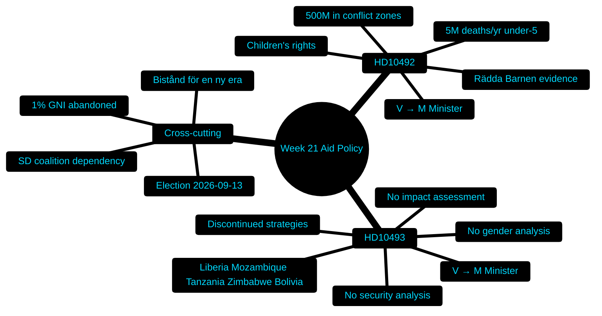

# Classification Results — Week 21, 2026

## Document Classification Table

| dok_id | Type | Subtype | Party | Committee | Policy Domain | Priority | Tier |
|--------|------|---------|-------|-----------|--------------|---------|------|
| HD10492 | ip (interpellation) | Interpellationsdebatt | V | UU (Utrikesutskottet) | Development Aid / Children's Rights | P0 | L1 |
| HD10493 | ip (interpellation) | Interpellationsdebatt | V | UU (Utrikesutskottet) | Development Aid / Strategy | P0 | L1 |

## Classification Notes

**HD10492**: Classified P0/L1 — highest priority. Children's rights + development aid accountability in election year. GDPR Art. 9 not triggered (policy debate, no personal data on vulnerable individuals beyond aggregate statistics). Offentlighetsprincipen applies: all parliamentary documents are public.

**HD10493**: Classified P0/L1 — highest priority. Governance accountability in contested policy domain. The explicit claim of absence of impact assessment is a political-process integrity issue.

## Political Classification

| Dimension | HD10492 | HD10493 |
|-----------|---------|---------|
| Left-Right axis | Left opposition (V) vs. Centre-right government (M) | Left opposition (V) vs. Centre-right government (M) |
| Constructive/Blocking | Accountability challenge | Accountability challenge |
| Electoral salience | Very High (election 121 days) | Very High (election 121 days) |
| Government vulnerability | High — admitted no impact assessment | High — admitted no impact assessment |
| Coalition alignment | Tidö (M+KD+L+SD) unified on cuts | Tidö (M+KD+L+SD) unified on cuts |

## Policy Domain Mapping

- **Primary domain**: International development / biståndsbidraget
- **Secondary domains**: Children's rights (barnrätt), Gender equality (jämställdhet), Human security (human security in conflict zones), Agenda 2030, Foreign policy accountability
- **Electoral framing**: "Values vs. cuts" — opposition narrative targeting Tidöregeringen's alignment between stated values and actual policy

## Evidence Anchors

| Claim | Evidence | Retrieved |
|-------|----------|-----------|
| HD10492 type: ip | dok_id HD10492, typ: ip | 2026-05-15 |
| HD10493 type: ip | dok_id HD10493, typ: ip | 2026-05-15 |
| Both addressed to Minister Dousa (M) | HD10492 + HD10493 full text header | 2026-05-15 |
| Party V confirmed | HD10492 parti: V; HD10493 parti: V | 2026-05-15 |
| Committee UU (Utrikesutskottet) | ip type → UU routing, riksdagen.se | 2026-05-15 |
