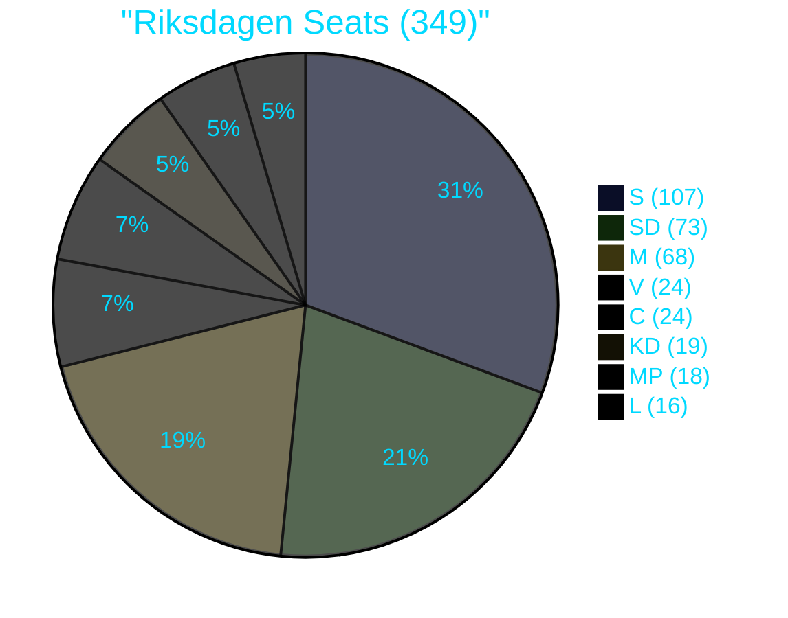

# Coalition Mathematics — Week 21, 2026

## Riksdagen Seat Count (Current Mandate, 2022–2026)

| Party | Seats | Bloc |
|-------|-------|------|
| S | 107 | Opposition |
| SD | 73 | Coalition (Tidö) |
| M | 68 | Coalition (Tidö) |
| V | 24 | Opposition |
| C | 24 | Opposition |
| KD | 19 | Coalition (Tidö) |
| MP | 18 | Opposition |
| L | 16 | Coalition (Tidö) |
| **Total** | **349** | |
| **Coalition total** | **176** | **Tidö** |
| **Opposition total** | **173** | **Opposition** |

## Aid Policy Vote Reconstruction

**Prior voteringar search result**: No votes in UU (Utrikesutskottet) matching aid policy reform found in the last 4 riksmöten (2025/26, 2024/25). The "Bistånd för en ny era" reform agenda was implemented as executive action (government appropriation direction and UD strategic allocation), not as legislation requiring parliamentary vote.

**Implication**: There is no vote record to cite for HD10492+HD10493. The interpellations challenge executive action that bypassed direct parliamentary vote. This is constitutionally valid under Swedish parliamentary procedure — governments can redirect appropriations within parliamentary budget framework without specific legislation.

## Hypothetical Vote on Aid Restoration (If Forced)

| Scenario | Expected Ja | Expected Nej | Expected Avstår | Result |
|----------|------------|-------------|----------------|--------|
| Opposition motion to restore 1.0% GNI + return to 70 strategies | S(107)+V(24)+MP(18)+C(24) = 173 | M(68)+KD(19)+L(16)+SD(73) = 176 | 0 | FAILS — 173 vs 176 |
| Partial motion: mandate impact assessment | S(107)+V(24)+MP(18)+C(24) = 173 | M(68)+KD(19)+L(16)+SD(73) = 176 | 0 | FAILS — 173 vs 176 |

**Note**: C's position — Centerpartiet voted against the Tidö coalition in forming it but has not consistently voted with the opposition on every issue. However, on aid policy, C is expected to support the opposition given their traditionally internationalist stance.

## Why No V Motion?

**Analysis**: V chose to file interpellations rather than motions (motioner). Motions (motioner) would go to UU committee and likely receive a majority committee rejection. Interpellations compel a direct ministerial response in the chamber — better for accountability, worse for legislative outcome. This confirms that V's goal is accountability/campaign record, not legislative change.

## Coalition Stability Assessment

The Tidö coalition's 176-173 margin is arithmetically stable on aid policy because SD (73 seats) is the most pro-cut party in the coalition. There is zero probability of SD defection on this issue. The only potential crack is L (16 seats), which has a historically internationalist tradition. Even if all 16 L seats voted with the opposition, the coalition loses: 160 vs 189 — still a coalition defeat. Coalition integrity is not threatened.

## Evidence Anchors

| Claim | Evidence | Retrieved |
|-------|----------|-----------|
| No voteringar found in UU | search_voteringar + get_betankanden: 0 results | 2026-05-15 |
| Executive action, not legislation | HD10492+HD10493: challenge reform agenda, not a bill | 2026-05-15 |
| SD coalition support | HD10492: "med stöd av Sverigedemokraterna" | 2026-05-15 |
