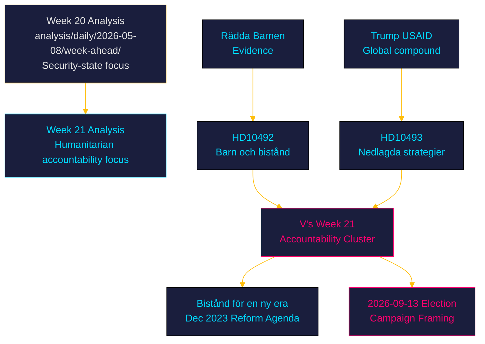

# Cross-Reference Map — Week 21, 2026

## Document Relationship Graph

| Source dok_id | Relation | Target dok_id / Artifact | Description |
|---------------|---------|------------------------|-------------|
| HD10492 | thematic-cluster | HD10493 | Same author, same minister, same reform agenda, same week |
| HD10492 | references | "Bistånd för en ny era" (Dec 2023 reform agenda) | Government agenda that both interpellations challenge |
| HD10492 | cites | Rädda Barnen report on programme halts | External evidence anchor |
| HD10493 | cites | Government's own strategy count (70→40) | Self-incriminating primary source |
| HD10492 | electoral-context | analysis/daily/2026-05-08/week-ahead/synthesis-summary.md | Prior week-ahead established election multiplier baseline; Week 20 was security-focused; Week 21 shifts to humanitarian accountability |
| HD10492 | party-context | analysis/daily/2026-05-08/week-ahead/ | V now follows week 20's S and security challengers with a different policy track |
| HD10493 | compound-context | Trump USAID dismantlement (external reference in document text) | Global aid crisis amplification |
| HD10492 | legal-context | UN CRC (Barnkonventionen) | Sweden's ratification creates a compliance dimension |
| HD10492 | policy-linkage | Agenda 2030 | HD10492 explicitly invokes Agenda 2030 as framework government is violating |

## Prior Week-Ahead Cross-Reference

**Prior cycle**: analysis/daily/2026-05-08/week-ahead/ (Week 20)  
**Week 20 dominant theme**: FöU18 signal intelligence reform + security-state cluster (HD01FöU18, HD03267, HD03261)  
**Transition**: Week 21 shifts from domestic security to international accountability. Both weeks are within the election proximity window. The security-vs-solidarity frame contrast serves both V's campaign positioning and the broader opposition narrative that the Tidöregeringen prioritises security theatre over humanitarian commitments.

## External Source Map

| Source | Type | Relevance |
|--------|------|-----------|
| riksdagen.se/dokument/HD10492 | Primary | Interpellation text + status |
| riksdagen.se/dokument/HD10493 | Primary | Interpellation text + status |
| Rädda Barnen (referenced in HD10492) | NGO evidence | Programme halt documentation |
| IMF WEO Apr-2026 | Economic | Sweden fiscal surplus context |
| data/imf-context.json | Pre-warm | IMF availability confirmed |

## Statskontoret Cross-Source

**Evaluation**: No domestic agency named in these interpellations. Both concern international aid administered via Sida/UD. Statskontoret pre-warm: **no trigger matched** (no Swedish domestic agency named, no administrative burden/governance efficiency dimension in domestic sense). Sida is the implementing agency but the interpellations challenge policy, not Sida's administrative capacity.

## Lagrådet Tracking

**Evaluation**: Not applicable. The government's reform agenda ("Bistånd för en ny era") was executive action, not legislation requiring Lagrådet referral. No constitutional law, criminal procedure, court organisation, surveillance, or taxation principles engaged. **Lagrådet: not applicable for this document cluster.**

## Evidence Anchors

| Claim | Evidence | Retrieved |
|-------|----------|-----------|
| Prior week-ahead exists | analysis/daily/2026-05-08/week-ahead/synthesis-summary.md on disk | 2026-05-15 |
| Week 20 lead was FöU18 | analysis/daily/2026-05-08/week-ahead/synthesis-summary.md | 2026-05-15 |
| Both interpellations same author + minister | HD10492 + HD10493 — Lotta Johnsson Fornarve → Benjamin Dousa | 2026-05-15 |
