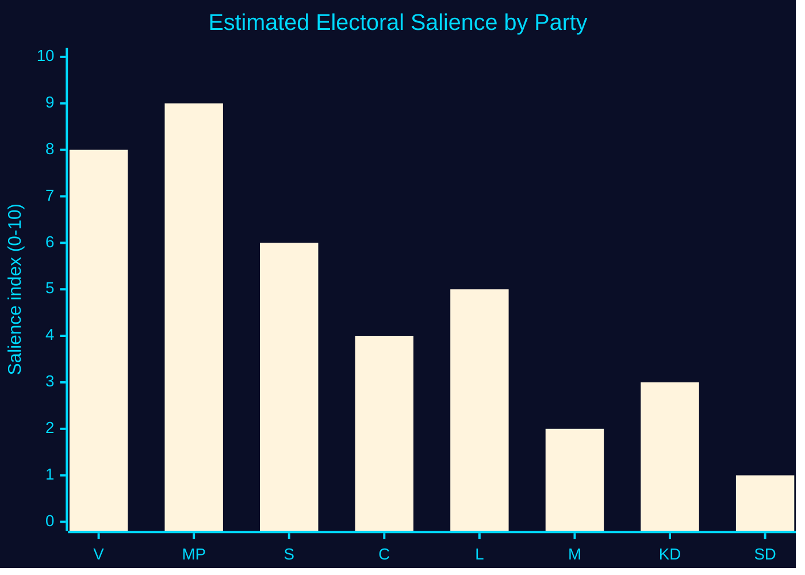

# Election 2026 Analysis — Aid Accountability, Week 21

## Election Context

**Election date**: 2026-09-13  
**Days remaining**: 121 days  
**Proximity band**: T+90 to T+120 (campaign sprint begins; party platforms being finalised)  
**DIW multiplier**: 1.5× applies to all items with opposition or electoral dimension  
**WEP language band for this horizon**: "likely" (55-69% probability ranges)

## How Aid Policy Fits the 2026 Campaign Structure

### Party Positioning on Aid

| Party | Current position | Electoral incentive |
|-------|---------------|-------------------|
| V (Vänsterpartiet) | Strongly pro-aid restoration; challenger | High — core identity issue, mobilises base |
| MP (Miljöpartiet) | Pro-aid restoration; challenger | High — aligns with climate/global-justice positioning |
| S (Socialdemokraterna) | Pro-aid, but in coalition-building mode | Medium — balanced against security/economy positioning |
| M (Moderaterna) | "Bistånd för en ny era" efficiency framing | Defend — limited base activation on this issue |
| KD (Kristdemokraterna) | Split: humanitarian instinct vs. budget discipline | Ambivalent — potential soft target |
| L (Liberalerna) | Silent — aid is traditionally a Liberal issue | High internal tension — L donors historically pro-aid |
| C (Centerpartiet) | Pro-aid in principle; outside Tidö coalition | Medium — can join opposition without coalition costs |
| SD (Sverigedemokraterna) | Actively anti-aid restoration | High — base rewards this |

### Bloc Arithmetic — 2022 Result Baseline (Riksdagen mandate seats)

| Bloc | Parties | Seats (2022) | 2022 vote share |
|------|---------|-------------|----------------|
| Tidö coalition | M+KD+L+SD | 176 | ~49.8% |
| Opposition | S+V+MP+C | 173 | ~48.7% |

**Note**: 176-173 is an extremely narrow margin. Any small vote shift is material.

### Aid Issue Electoral Impact Estimate

**Who cares most**: V+MP+S voters already aligned. The marginal question is whether soft-C voters and soft-L voters are moved by the humanitarian framing.  
**Soft-C**: Centerpartiet is outside the Tidö coalition; C voters who are pro-aid but voted C in 2022 could be recruited by V/MP's specific campaign on this.  
**Soft-L**: L is in the Tidö coalition but L has a historical identity as the "humanitarian liberal" party. HD10492+HD10493 create internal L tension — especially given KD's evangelical/charitable tradition.  
**V poll trend**: V has been polling 5–8% in 2026; aid accountability is a classic V base-mobilisation issue but does not strongly convert beyond their current base.

## Seat Sensitivity Analysis

**Riksmandatsspärren**: 4% threshold to enter parliament.  
**MP risk**: MP is currently polling around 3.5–5.5% in different polls. If the aid accountability narrative helps MP mobilise their base, it may be critical to their Riksdag entry.  
**V movement**: V is above threshold; benefit is mobilisation depth, not threshold risk.  
**Net election relevance**: HIGH for MP threshold risk; MEDIUM-HIGH for V mobilisation; LOW for vote conversion across bloc lines.

## Key Intelligence Finding

The HD10492+HD10493 interpellations are most electorally significant not as vote-conversion tools but as **MP survival tools**. If the aid accountability narrative helps MP clear the 4% threshold, it directly changes the Riksdag composition and potentially the post-election coalition arithmetic. This makes the V interpellations instrumentally more important than their primary accountability function.

## Evidence Anchors

| Claim | Evidence | Retrieved |
|-------|----------|-----------|
| Election date 2026-09-13 | analysis/daily/2026-05-08/week-ahead/election-2026-analysis.md | 2026-05-15 |
| DIW 1.5× multiplier | significance-scoring.md this run | 2026-05-15 |
| V challenger position | HD10492 + HD10493 author: Lotta Johnsson Fornarve (V) | 2026-05-15 |
