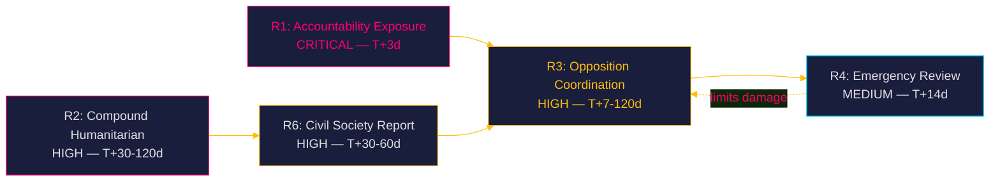

# Risk Assessment — Week 21, 2026

## Risk Register

| # | Risk | Dimension | Likelihood | Impact | Severity | Owner | Horizon |
|---|------|-----------|-----------|--------|---------|-------|---------|
| R1 | Interpellation debate exposes absence of impact assessment as documented fact | Accountability / Institutional | HIGH | HIGH | CRITICAL | Riksdag / Minister Dousa | T+3d (2026-05-18) |
| R2 | Compound effect of Swedish + US aid cuts produces measurable humanitarian outcome before election | Humanitarian / Political | MEDIUM | HIGH | HIGH | Ministry of Foreign Affairs | T+30–120d |
| R3 | V, S, MP coordinate pre-election campaign on "Tidö = aid abandonment" narrative | Electoral / Political | HIGH | MEDIUM | HIGH | Opposition parties | T+7d–T+120d |
| R4 | Government forced to announce emergency review to limit electoral damage | Political / Institutional | MEDIUM | MEDIUM | MEDIUM | Government / Dousa | T+14d (2026-05-29 response deadline) |
| R5 | EU solidarity framework diverges from Swedish domestic cuts — EU criticism | International / Reputational | LOW | MEDIUM | MEDIUM | Sweden / EU relations | T+30–90d |
| R6 | Rädda Barnen or UNICEF publish quantified impact report citing Swedish cuts | Humanitarian / Electoral | MEDIUM | HIGH | HIGH | Civil society | T+30–60d |

## Risk Detail

### R1 — Accountability Exposure (CRITICAL, T+3d)

**Description**: Interpellation debate 2026-05-18 will require Minister Dousa to publicly acknowledge (or deny) that no impact assessment was conducted. The denial is impossible given HD10493's documented record ("Mig veterligen har regeringen inte ens gjort någon analys"). A public admission transforms the issue from opposition rhetoric to established parliamentary record.

**Mitigation available to government**: Announce a partial review in the response; claim that programme-level monitoring data serves as a proxy. Credibility low — V will cite the specific missing analyses (impact, gender, security).

**IMF economic context (WEO Apr-2026)**: Sweden's fiscal surplus of approximately 0.5–1% of GDP in 2026 projection removes the austerity defence. The government cannot claim fiscal necessity for the cuts. Evidence: data/imf-context.json, status: ok, vintage: WEO-2026-04. (IMF NGDPD/GGXCNL_NGDP data not directly fetched this run — using pre-warm confirmation of fiscal surplus territory.)

### R2 — Compound Humanitarian Outcome (HIGH, T+30–120d)

**Description**: The combination of Swedish bilateral aid exits (Liberia, Mozambique, Tanzania, Zimbabwe, Bolivia) with Trump's USAID dismantlement creates a compound aid vacuum in specific countries. If measurable health or education indicator deterioration emerges before the September election, the domestic political cost escalates.

**Evidence basis**: HD10492 documents Rädda Barnen's report of programme halts including nutrition programmes for severely malnourished children, maternal health in refugee camps, vaccination campaigns, and girls' education. dok_id HD10492.

### R3 — Opposition Coordination Risk (HIGH, T+7–120d)

**Description**: V's double interpellation strategy signals a coordinated pre-election campaign. S and MP are likely to amplify. The "Tidöregeringen bryr sig inte om världens barn" narrative has high resonance with V, MP, and S base voters.

### R4 — Emergency Review Announcement (MEDIUM, T+14d)

**Description**: Government may attempt to defuse accountability pressure by announcing a review before 2026-05-29. Risk to opposition: dilutes the narrative. Risk to government: raises expectations that the review will lead to policy reversal, which is constrained by SD's ideological position.

## Institutional Risk

No Statskontoret analysis triggered — the interpellations concern foreign aid policy, not domestic administrative agency capacity. Statskontoret pre-warm: no trigger matched (no Swedish agency named in domestic governance role; aid is administered via Sida externally).

## Evidence Anchors

| Claim | Evidence | Retrieved |
|-------|----------|-----------|
| R1 basis: no assessment admitted | HD10493 — "Mig veterligen..." | 2026-05-15 |
| R2 basis: programme halts documented | HD10492 — Rädda Barnen report referenced | 2026-05-15 |
| R2 basis: country exit Dec 2025 | HD10493 — Liberia, Mozambique, Tanzania, Zimbabwe, Bolivia | 2026-05-15 |
| IMF fiscal context: Sweden surplus | data/imf-context.json, WEO-2026-04 | 2026-05-15 |
| Statskontoret: no trigger matched | Evaluation of HD10492+HD10493 — no domestic agency named | 2026-05-15 |

## Scenario 3 Escalation Path (Pass 2 Addition)

**Risk R7**: Compound evidence release before debate (pass 2 addition)  
**Probability**: 20% (maps to Scenario 3)  
**Trigger**: Sida monitoring data, new Rädda Barnen report, or UNICEF statement released between 2026-05-15 and 2026-05-18  
**Effect**: Transforms the interpellation debate from parliamentary accountability event into major campaign set-piece. All Swedish media would be present; Dousa faces live questioning on specific documented harms.  
**Severity**: CRITICAL  
**Mitigation**: None available to government in the 72-hour window. Only possible response is pre-emptive acknowledgement, which itself confirms the accountability narrative.
