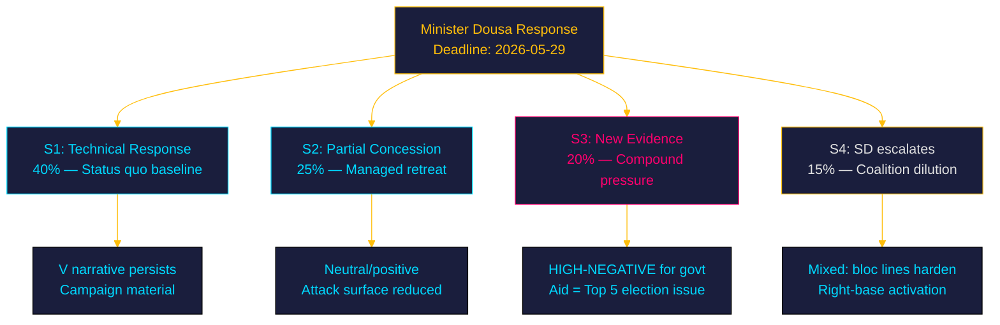

# Scenario Analysis — Week 21, 2026

## Scenario Framework

**Horizon**: T+30d (to 2026-06-15) through T+90d (election proximity)  
**Trigger event**: Minister Dousa's response to HD10492+HD10493 (deadline 2026-05-29)  
**Central question**: Will the government's response defuse, sustain, or amplify the accountability narrative?

## Scenario 1: Minimal Acknowledgement — STATUS QUO BASELINE (WEP: 40%)

**Label**: "Technical response — reform continues"  
**Probability**: 40% (most likely)  
**Description**: Minister Dousa provides a procedural response: cites government mandate, emphasises aid quality over quantity, rejects impact assessment demand as retrospective. References Sida's "new geographic focus" as evidence of strategic intent.  
**Election impact**: Moderate-negative. The humanitarian accountability narrative persists in V/MP/S campaign material but is not amplified. Government continues to face criticism without major escalation.  
**Key indicators**: Response text avoids the word "konsekvenser" (consequences); cites government budgetary decisions as final authority.

## Scenario 2: Partial Concession — MANAGED RETREAT (WEP: 25%)

**Label**: "Government announces a review"  
**Probability**: 25%  
**Description**: Under sustained pressure from civil society and ahead of campaign season, the government announces a limited review of aid programme transitions. Not a reversal — framed as "quality assurance" — but provides some accountability signal.  
**Election impact**: Neutral to slightly positive for government. Reduces V's attack surface but concedes that the opposition's accountability framing was legitimate.  
**Key indicators**: Government press release from UD between 2026-05-15 and 2026-05-29; word "utvärdering" appears.

## Scenario 3: Escalation — COMPOUND PRESSURE (WEP: 20%)

**Label**: "New evidence enters campaign"  
**Probability**: 20%  
**Description**: Before or during the debate (2026-05-18), a new Sida report or NGO evidence emerges that significantly expands the documented harm. Multiple opposition parties pile on; the interpellation debate becomes a major campaign event with broad media coverage.  
**Election impact**: High-negative for government. Aid accountability becomes a Top 5 election issue for V/MP/S voter mobilisation. Dousa becomes a named accountability target.  
**Key indicators**: Rädda Barnen, UNICEF, or Sida data release before 2026-05-18; S spokesperson references the debate.

## Scenario 4: Issue Absorption — COALITION DILUTION (WEP: 15%)

**Label**: "SD complicates the narrative"  
**Probability**: 15%  
**Description**: SD actively enters the public narrative by defending the cuts on nationalist-first grounds ("Swedish taxpayers shouldn't fund foreign governments"). This shifts the parliamentary arithmetic into clearer bloc lines but may actually help the government by making the debate ideological rather than accountability-based.  
**Election impact**: Mixed. Solidifies V/S/MP opposition alignment; but also activates right-bloc voter enthusiasm. Net: slight positive for government's base mobilisation.  
**Key indicators**: SD spokesperson statements on aid cuts before 2026-05-18.

## Wildcard: International Amplification (WEP: not included in above)

**Label**: "EU or UN public statement on Swedish cuts"  
If UNICEF, UNHCR, or an EU institution makes a public statement referencing Swedish aid cuts in the same week as the debate, compound international reputational pressure could shift this from a parliamentary accountability item to a foreign-policy crisis. Low probability but high impact.

## Evidence Anchors

| Claim | Evidence | Retrieved |
|-------|----------|-----------|
| Debate date 2026-05-18 | HD10492 anmälningsdatum: 2026-05-13; debate announced | 2026-05-15 |
| Response deadline 2026-05-29 | HD10492 svarsdatum: 2026-05-29 | 2026-05-15 |
| Rädda Barnen documented halts | HD10492: "livsviktiga program har stoppats" | 2026-05-15 |
