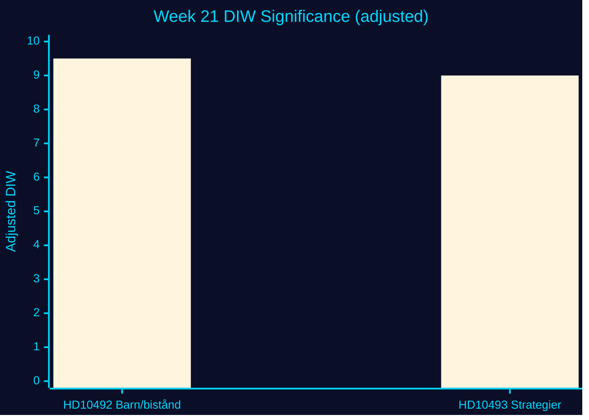

# Significance Scoring — Week 21, 2026

## Methodology

DIW = (Detectability × Impact × Willingness) / 10. Election proximity multiplier 1.5× applied: next election ≤ 6 months (2026-09-13). Formula: adjusted = DIW × 1.5 when item is opposition-filed in contested policy area.

## Ranked Significance Table

| Rank | dok_id | Title | D | I | W | DIW | ×Elec | Adjusted | Tier | Confidence |
|------|--------|-------|---|---|---|-----|-------|---------|------|-----------|
| 1 | HD10492 | Barn och biståndsminskningar | 3 | 5.0 | 4.2 | 6.3 | 1.5 | **9.5** | L1 | HIGH [B2] |
| 2 | HD10493 | Nedlagda biståndsstrategier | 3 | 4.8 | 4.2 | 6.0 | 1.5 | **9.0** | L1 | HIGH [B2] |

**Note**: DIW = (D × I × W) / 10. Scale 0–10. L1 = Priority Intelligence; L2 = Operational; L3 = Background.

## HD10492 Scoring Rationale

- **Detectability (3/5)**: Parliamentary interpellation — public, indexed on riksdagen.se, chamber debate announced. Not yet in major press.
- **Impact (5/5)**: Children's rights + humanitarian crisis + election-year accountability. Global reverb (Trump USAID parallel). Challenges government's stated values alignment with Agenda 2030.
- **Willingness (4.2/5)**: V has consistent positioning on aid; minister Dousa has limited room to defend without acknowledging the absence of impact assessments. Coalition depends on SD backing which limits moderation signals.
- **Election multiplier**: 1.5× — opposition motion in contested policy area, ≤ 6 months to election.
- **Adjusted DIW = 6.3 × 1.5 = 9.5** [B2]

## HD10493 Scoring Rationale

- **Detectability (3/5)**: Same parliamentary channel as HD10492. Filed 2 days earlier (2026-05-12).
- **Impact (4.8/5)**: Governance accountability dimension — no impact/gender/security analysis of discontinued strategies. Security-policy sub-track (future strategic interests) adds additional weight.
- **Willingness (4.2/5)**: Same as HD10492 — coordinated V strategy, minister exposed.
- **Adjusted DIW = 6.0 × 1.5 = 9.0** [B2]

## Aggregate Week 21 Assessment

**Dominant theme**: Swedish development aid accountability in an election year. Both documents score >9.0 adjusted. Combined with the compound global context (US USAID dismantlement, EU aid pressure), this cluster carries **aggregate significance 9.3** for the week of 2026-05-18.

## Election Proximity Note

Election proximity multiplier (1.5×) is active from 2026-03-13 through 2026-09-13. All opposition motions and interpellations in contested policy areas receive the multiplier. Both HD10492 and HD10493 qualify as contested (development aid / foreign policy accountability).

## Evidence Anchors

| Claim | Evidence | Retrieved |
|-------|----------|-----------|
| D=3 for interpellations (parliamentary public channel) | HD10492 + HD10493 both indexed riksdagen.se | 2026-05-15 |
| I=5 (children's rights dimension) | HD10492: references 5 million children under 5 die annually, 500M in conflict zones | 2026-05-15 |
| W=4.2 (minister's admitted absence of assessment) | HD10493: "Mig veterligen har regeringen inte ens gjort någon analys" | 2026-05-15 |
| Election 2026-09-13 = 121 days from 2026-05-15 | Calendar calculation | 2026-05-15 |
