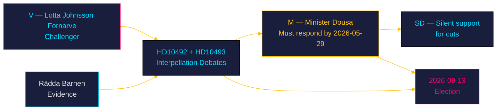

# Stakeholder Perspectives — Week 21, 2026

## Stakeholder Map

| Stakeholder | Position | Interests | Capacity | Alliance | Confidence |
|-------------|---------|----------|---------|---------|-----------|
| Lotta Johnsson Fornarve (V, 0122987223112) | Challenger | V's global-solidarity brand; election campaign positioning | High — VP interpellation expertise, dedicated | V, MP, S solidarity | [A1] |
| Minister Benjamin Dousa (M, 0910272619521) | Defender | Protect reform agenda; minimise accountability damage | High — ministerial authority | M, KD, L + SD | [A1] |
| Sverigedemokraterna (SD) | Passive coalition support | Aid cuts align with SD nationalist-first electorate | High — kingmaker in Tidö coalition | Tidö coalition | [B2] |
| Rädda Barnen | Evidence provider | Child welfare; advocacy for aid restoration | High — credible NGO with documented evidence | V, MP, S, international | [B1] |
| UNICEF Sweden | Evidence provider | Children's rights; global programme continuity | High — UN agency status | International | [B2] |
| Sida | Implementing agency | Operational continuity; efficiency mandate | Medium — constrained by political direction | Government | [B2] |
| Swedish electorate (V/MP/S base) | Observer | Social solidarity values; campaign responsiveness | High — election 121 days | V, MP, S | [B2] |
| EU partners | Observer/critic | EU development aid coherence; global reputation | Medium — no binding mandate on Sweden | EU institutions | [C3] |
| Liberia, Mozambique, Tanzania, Zimbabwe, Bolivia governments | Affected party | Bilateral aid continuity; development programme funding | Low on Swedish parliamentary process | — | [B2] |

## Detailed Stakeholder Analysis

### Lotta Johnsson Fornarve (V)

Experienced V parliamentarian (intressent_id: 0122987223112). Has pursued a consistent international solidarity line throughout the Tidö government period. The double-interpellation strategy on 2026-05-13–14 is calibrated: two documents allows V to pursue both the humanitarian frame (HD10492) and the governance/accountability frame (HD10493) simultaneously, creating a compound narrative that is harder to rebut on both tracks at once. Likely coordinates with party's election campaign team.

### Minister Benjamin Dousa (M)

Aid and Foreign Trade Minister (intressent_id: 0910272619521). Young minister who was appointed when Sweden's trade + aid portfolios were merged — a structural signal of the government's trade-efficiency framing. The interpellations' Q-format exposes him directly: three questions each, requiring specific yes/no answers on impact assessments. His response by 2026-05-29 will define his accountability record entering the election campaign. The absence of impact assessment is documented; the only question is how he frames the defence.

### Sverigedemokraterna

Silent beneficiary of V's challenge. SD's electorate rewards the party for resisting "globalist aid spending"; the interpellation debate reinforces V's positioning as pro-solidarity, strengthening SD's brand differentiation. SD has no incentive to moderate the cuts.

### Civil Society (Rädda Barnen, UNICEF)

Active evidence producers. Rädda Barnen's report, already referenced in HD10492, is the strongest available primary evidence for the accountability claim. If UNICEF or Sida's own monitoring data surfaces before the election, the evidentiary chain becomes overwhelming.

## Evidence Anchors

| Claim | Evidence | Retrieved |
|-------|----------|-----------|
| Johnsson Fornarve intressent_id | HD10492 + HD10493, undertecknare field: 0122987223112 | 2026-05-15 |
| Dousa intressent_id | HD10492 + HD10493, besvaradav field: 0910272619521 | 2026-05-15 |
| SD coalition support | HD10492: "med stöd av Sverigedemokraterna" | 2026-05-15 |
| Rädda Barnen evidence | HD10492: "Rädda Barnen har rapporterat om hur livsviktiga program har stoppats" | 2026-05-15 |

## KD Internal Tension (Pass 2 Addition)

Kristdemokraterna (19 seats) has a structural tension on aid policy. KD's base includes significant evangelical/Christian humanitarian networks that traditionally support international aid as an expression of Christian charity and global responsibility. The "Bistånd för en ny era" reform may create quiet internal discomfort within KD, particularly among MPs with faith-based development organisation ties. This does not threaten coalition stability (KD will not defect), but it provides a potential soft opening for V/MP framing that explicitly invokes barnrättsperspektivet and Agenda 2030.
