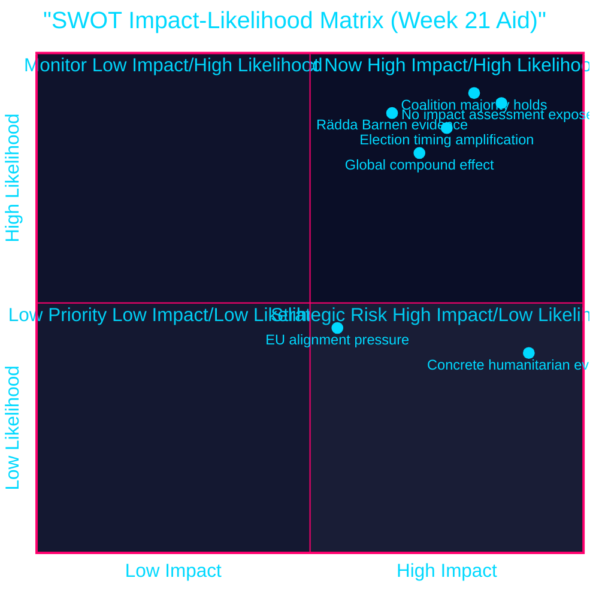

# SWOT Analysis — Swedish Aid Accountability, Week 21

## Aggregate SWOT Matrix

### Strengths (Government position)

- **Numerical majority**: Tidö coalition (M+KD+L+SD) has Riksdag majority; no risk of reversal vote on aid budget. Evidence: HD10492 + HD10493 — V challenge is accountability-based, not a no-confidence vote.
- **Reform narrative coherence**: "Bistånd för en ny era" framing (efficiency, ownership, sustainable growth) provides a defensible rhetorical posture. Evidence: HD10492 references "ägarskaps- och rättighetsperspektiv" as government's stated framework.
- **SD alignment**: Coalition's parliamentary arithmetic holds; SD's nationalist-first electorate actively supports aid cuts, providing an internal reward for the policy. Evidence: HD10492 full text: "med stöd av Sverigedemokraterna".

### Weaknesses (Government position)

- **Admitted absence of impact assessment**: Minister Dousa's government has made no analysis of the consequences of discontinued country strategies — an admission embedded in the interpellation text itself. Evidence: HD10493: "Mig veterligen har regeringen inte ens gjort någon analys av vad de indragna strategierna får för konsekvenser". [B1]
- **No children's rights analysis**: HD10492 asks directly whether any analysis of child impacts has been done — the question implies the answer is no. Evidence: HD10492 Q1. [B2]
- **No gender or security analysis**: HD10493 asks for gender analysis and security-strategic analysis — neither conducted. Evidence: HD10493 Q2, Q3. [B2]
- **Fiscal surplus context**: Sweden's strong fiscal position (IMF WEO Apr-2026, SWE fiscal balance positive) means cuts are a political choice, not economic necessity — weakens "austerity required" defence.

### Opportunities (Opposition — V, S, MP)

- **Election timing**: 121 days to election; media attention on values-based campaigning amplifies V's narrative. Evidence: calendar; September 13, 2026. [B2]
- **Global compound effect**: Trump/USAID dismantlement has created a global humanitarian credibility vacuum that Swedish cuts deepen — provides V with global headlines to attach to domestic policy critique. Evidence: HD10492: "Trumps slakt av amerikanskt bistånd" (HD10493 text). [B2]
- **Rädda Barnen evidence**: V has ready-made third-party evidence from Rädda Barnen documenting specific programme halts. Evidence: HD10492: "Rädda Barnen har rapporterat om hur livsviktiga program har stoppats". [B1]
- **Women and children double-track**: HD10493 explicitly names women and children as hardest hit — enables intersectional rights-based campaign messaging. Evidence: HD10493. [B2]

### Threats (to Government / System)

- **Concrete humanitarian evidence before election**: If evidence of preventable child deaths or worsened nutrition indicators emerges from the exited country strategies before September 2026, government faces acute accountability moment. Evidence: HD10492 — 5 million children under 5 die annually, many from malnutrition; programme halts documented. [B2]
- **EU alignment pressure**: EU aid reform debates may diverge from Swedish domestic cuts, exposing the Tidöregeringen as the outlier in European solidarity framework. Evidence: HD10492 references EU dimension implicitly. [B3]
- **Lagrådet / procedural legitimacy**: No Lagrådet referral for the reform agenda (executive action, not legislation) — but parliamentary accountability mechanisms (interpellations) expose the gap. Evidence: interpellation format confirms no legislative hook. [B3]

## Evidence Anchors

| Claim | Evidence | Retrieved | Confidence |
|-------|----------|-----------|-----------|
| No impact assessment | HD10493 full text — "Mig veterligen..." | 2026-05-15 | [B1] |
| SD support for cuts | HD10492 full text — "med stöd av Sverigedemokraterna" | 2026-05-15 | [A1] |
| Rädda Barnen programme halts | HD10492 full text — "Rädda Barnen har rapporterat..." | 2026-05-15 | [B1] |
| Trump USAID compound | HD10493 full text — "Trumps slakt av amerikanskt bistånd" | 2026-05-15 | [A2] |
| Strategies cut from 70 to 40 | HD10493 full text — government's own figure | 2026-05-15 | [A1] |
| Exit: Liberia, Mozambique, Tanzania, Zimbabwe, Bolivia | HD10493 full text, Dec 2025 | 2026-05-15 | [A1] |
