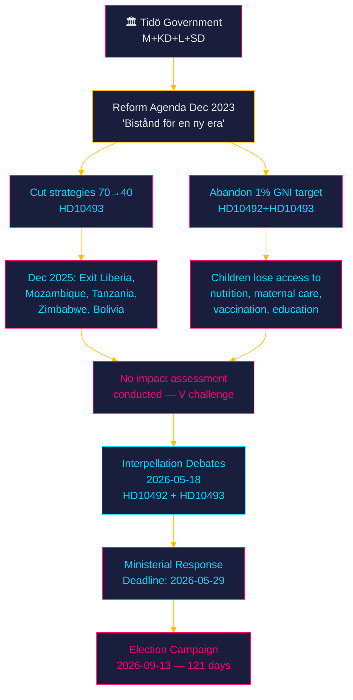

# Synthesis Summary — Week 21, 2026

## Lead Story Decision

**The week of 2026-05-18 opens with two interpellation debates challenging the Tidö government's dismantling of Swedish development aid** — HD10492 (consequences for children) and HD10493 (consequences of discontinued country strategies). Submitted by Lotta Johnsson Fornarve (V) and addressed to Minister Benjamin Dousa (M), these interpellations expose a structural accountability gap: the government has eliminated ~30 aid strategies and abandoned the 1% of GNI target without conducting any impact assessment. With the September 2026 election 121 days away and Sweden's cuts compounding Trump's USAID dismantlement, this becomes the defining foreign-policy-meets-domestic-accountability moment of the pre-election period.

## DIW-Weighted Significance Ranking

| Rank | dok_id | Title | D | I | W | DIW | Election ×1.5 | Adjusted | Confidence |
|------|--------|-------|---|---|---|-----|--------------|---------|-----------|
| 1 | HD10492 | Konsekvenserna för barn när biståndet minskar | 3 | 5 | 4 | 5.5 | ×1.5 | **8.3** | [B2] |
| 2 | HD10493 | Konsekvenserna av nedlagda biståndsstrategier | 3 | 4.8 | 4 | 5.3 | ×1.5 | **7.9** | [B2] |

*Election proximity multiplier (1.5×) applied: next election ≤ 6 months (2026-09-13, 121 days from 2026-05-15).*

## Integrated Intelligence Picture

### Cross-Document Pattern 1: Compound Accountability Gap

Both interpellations target the same minister (Dousa/M) on the same reform agenda ("Bistånd för en ny era", Dec 2023), but from different analytical angles — HD10492 focuses on the humanitarian impact on children, HD10493 on the absence of impact assessment for discontinued country strategies. Together they construct a narrative of systematic non-accountability: the government chose to restructure Swedish aid without measuring consequences.

**Intelligence significance**: The pattern indicates a coordinated V opposition strategy — file two interpellations on the same policy cluster to force a double-debate that creates compounded media coverage and makes ministerial defensiveness on both tracks visible simultaneously.

### Cross-Document Pattern 2: Structural vs. Budgetary Critique

HD10492 challenges the *values* dimension (children's rights, Agenda 2030), while HD10493 challenges the *process* dimension (no impact assessment, no gender analysis, no security analysis). The dual-track critique is designed to close off all government escape routes: the minister cannot defend the cuts as "efficient" (HD10493 closes that), and cannot claim progressive values alignment (HD10492 closes that).

### Aggregate SWOT Intersection

- **Strength (Government)**: Coalition numerical majority survived budget vote; SD and coalition partners aligned.
- **Weakness (Government)**: Explicit admission in interpellation text that no impact assessment was conducted — leaves minister exposed in debate.
- **Opportunity (Opposition — V)**: Election cycle creates maximum attention for accountability narratives; global aid crisis amplifies domestic cuts story.
- **Threat (System)**: Compound effect of Swedish + US aid cuts on specific populations (nutritionally vulnerable children, women in conflict zones, maternal health) may produce concrete humanitarian evidence that re-enters domestic debate before the election.

### Riksmöte Calendar Context

Week 21 (2026-05-18–22) agenda:
- Interpellations HD10492 + HD10493 announced for 2026-05-18
- Parliamentary session approaching end-of-year recess (typically late June)
- Budget follow-up hearings ongoing in FiU
- Defence budget (Försvarsberedningen final report integration) expected before recess

### Election Proximity Assessment

Sweden's 2026 general election on **2026-09-13** is 121 days away. All opposition motions and interpellations now enter election-campaign territory. V's double interpellation on aid is explicitly timed for the pre-election crescendo, consistent with V's historical positioning as the party most likely to gain from a "care vs. cuts" campaign frame.

## Forward Intelligence

The ministerial response by 2026-05-29 is the key tripwire. If Dousa announces no impact assessment: V, S, and MP will escalate the election narrative. If he announces a partial review, pressure shifts to demanding a binding reversal timeline.

**PIR-WA-01**: Will the government conduct any impact assessment of discontinued aid strategies before the September election?  
**PIR-WA-02**: How will the Tidöregeringens aid reform play in specific electoral swing districts where voters have historical ties to global solidarity movements (Gothenburg left, Stockholm south)?

## Evidence Anchors

| Claim | Evidence | Retrieved |
|-------|----------|-----------|
| HD10492 filed by Lotta Johnsson Fornarve (V) | dok_id HD10492, parti: V | 2026-05-15 |
| HD10493 filed by Lotta Johnsson Fornarve (V) | dok_id HD10493, parti: V | 2026-05-15 |
| No impact assessment conducted | HD10493 full text: "Mig veterligen har regeringen inte ens gjort någon analys" | 2026-05-15 |
| Country strategies cut: Liberia, Mozambique, Tanzania, Zimbabwe, Bolivia | HD10493 full text | 2026-05-15 |
| 1% GNI target abandoned with SD support | HD10492 full text, HD10493 full text | 2026-05-15 |
| Debates announced 2026-05-18 | HD10492 ANM status 2026-05-18; HD10493 ANM 2026-05-18 | 2026-05-15 |
| Rädda Barnen reported vital programme halts | HD10492 full text: "Rädda Barnen har rapporterat..." | 2026-05-15 |
