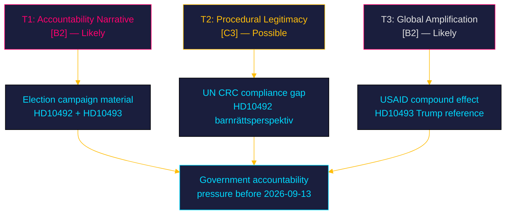

# Threat Analysis — Week 21, 2026

## STRIDE Threat Mapping

| Threat Type | Description | Actor | Target | Likelihood | Impact |
|-------------|-------------|-------|--------|-----------|--------|
| Spoofing | Opposition misattributes harm causation to government without full evidence chain | V/MP/S | Government narrative | LOW | MEDIUM |
| Tampering | Government announces partial review to dilute the accountability record before response deadline | Government (M) | Parliamentary accountability | MEDIUM | HIGH |
| Repudiation | Minister Dousa denies knowledge of programme halts despite Rädda Barnen's public report | Government | Parliamentary record | LOW | HIGH |
| Information Disclosure | Sida internal monitoring data on programme halts leaked before election | Unknown | Government | LOW | HIGH |
| Denial of Service | Coalition uses procedural tools to defer debate or limit time | Coalition whips | Parliamentary process | LOW | MEDIUM |
| Elevation of Privilege | V leverages interpellations to gain disproportionate campaign media coverage vs. seat share | V | Electoral proportionality | MEDIUM | LOW |

## Threat Narratives

### T1 — Accountability Narrative Weaponisation

**Threat actor**: Opposition parties V, S, MP  
**Vector**: Interpellation debates → media amplification → election campaign material  
**Narrative**: "The Tidöregeringen has abandoned the world's most vulnerable children without even analysing the consequences."  
**Evidence basis**: The narrative has solid parliamentary evidence: no impact assessment (HD10493), Rädda Barnen's programme halt documentation (HD10492).  
**Counter-narrative available to government**: "We are reforming for efficiency and long-term sustainability; more targeted aid." Credibility limited by absence of evidence for improved outcomes.  
**Admiralty**: [B2] — likely, from confirmed opposition strategy.

### T2 — Procedural-Legitimacy Attack

**Threat actor**: Parliamentary observers, civil society, EU partners  
**Vector**: Absence of impact assessment = procedural breach of Agenda 2030 commitment + barnrättskonventionen (UN CRC, ratified by Sweden)  
**Evidence**: Sweden ratified the UN Convention on the Rights of the Child; HD10492 invokes this. The government's failure to conduct a children's rights analysis may constitute a compliance gap.  
**Admiralty**: [C3] — possible, needs legal analysis to confirm CRC implications.

### T3 — Global Context Amplification

**Threat actor**: International media, UNICEF, Rädda Barnen, UN agencies  
**Vector**: Swedish cuts are cited in global reports alongside Trump/USAID, creating compounded reputational damage.  
**Evidence**: HD10493 full text explicitly references Trump's USAID cuts as compound factor.  
**Admiralty**: [B2] — likely given existing media pattern.

## Procedural Integrity Assessment

**Lagrådet**: Not applicable — the interpellations challenge executive action (the reform agenda), not pending legislation. No Lagrådet referral track.

**Parliamentary accountability mechanism**: The interpellation process is functioning as designed. The two-interpellation strategy is a standard parliamentary accountability tool. No procedural threat to the integrity of the debates.

## Evidence Anchors

| Claim | Evidence | Retrieved |
|-------|----------|-----------|
| T1 narrative basis: no assessment | HD10493 — "Mig veterligen..." | 2026-05-15 |
| T1 basis: Rädda Barnen documentation | HD10492 — "Rädda Barnen har rapporterat..." | 2026-05-15 |
| T2 basis: CRC reference | HD10492 — "Barnrättsperspektivet måste vara genomgående" | 2026-05-15 |
| T3 basis: Trump USAID compound | HD10493 — "Trumps slakt av amerikanskt bistånd" | 2026-05-15 |
