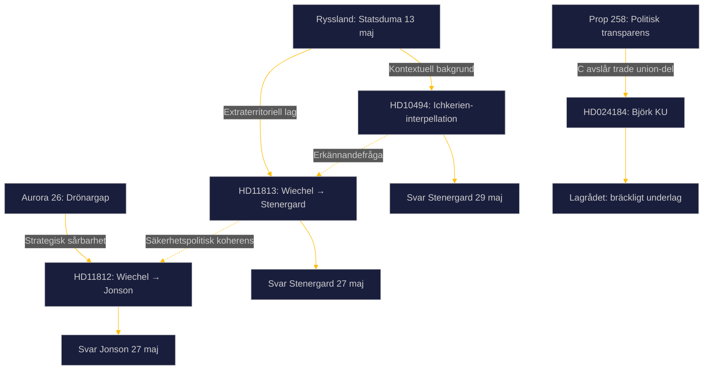

# Synthesis Summary — Realtime Pulse 2026-05-16

<!-- analysis-type: synthesis-summary -->
<!-- article-date: 2026-05-16 -->
<!-- subfolder: realtime-pulse -->
<!-- docs: HD024184, HD10494, HD11812, HD11813 -->
<!-- imf-vintage: WEO-2026-04 | status: ok -->
<!-- election-proximity: ≤6mo → 1.5× DIW multiplier active -->
<!-- analysis-pass: 2 (final) -->

**Author**: James Pether Sörling  
**Date**: 2026-05-16 | **Riksmöte**: 2025/26  
**Confidence**: HIGH [B2]  
**Horizon**: [horizon:72h] [horizon:week] [horizon:month] [horizon:90d]

---

## Lead-Story Decision

Rysslands statsduma antog den **13 maj 2026** en lag som ger Putin ensidiga befogenheter att insätta ryska väpnade styrkor utomlands för att "skydda" ryska medborgare från utländska domstolar — en direkt ICC-respons med explicita konsekvenser för stater som samarbetar med internationellt straffansvar och de som deltar i Östersjöns skuggflottaövervakning. SD:s Markus Wiechel kombinerar tre parlamentariska instrument (interpellation + 2 skriftliga frågor) med en motion om politisk transparens (av en annan SD-advokat: Centerpartiet) till ett enhetligt säkerhetspolitiskt narrativ.

**Bedömning [B2]**: Den ryska lagen är ledstory — den institutionaliserar ett eskalationsmönster som direkt berör svenska operationer i Östersjön och ICC-åtaganden. Drönargapet (HD11812) är nästledande med hög 72h-vikt. Prop. 258-debatten (HD024184) är tredje prioritet — Lagrådets "bräckliga" underlag gör den parlamentariskt intressant.

---

## DIW-Viktad Rangordning

| Rank | dok_id | Titel | DIW-score | Justerad (×1.5) | Prioritet |
|------|--------|-------|-----------|-----------------|-----------|
| 1 | HD11813 | Ny rysk lag om angrepp på andra länder | 8.5/10 | 10 | L1 Critical |
| 2 | HD11812 | Drönarkrig (Aurora 26) | 7.5/10 | 10 | L2 Strategic |
| 3 | HD10494 | Erkännande av Itjkerien | 7.0/10 | 10 | L2 Strategic |
| 4 | HD024184 | C motion mot prop 258 (trade union) | 5.5/10 | 8.25 | L3 Intelligence |

---

## Integrerad Underrättelsebild

### Kluster 1: Rysk militärrättslig eskalation (HD11813 + HD10494)

Den 13 maj 2026 antog Rysslands statsduma en lag som institutionaliserar extraterritoriell militär deployment under förevändningen av "medborgarskydd". Lagen har tre avgörande dimensioner för Sverige:

**Dimension 1: ICC-eskadering**  
Lagen täcker explicit stater som samarbetar med internationella organ (ICC) i rättsliga processer mot ryska medborgare. Sverige är förpliktat att verkställa ICC-arresteringsordern mot Putin (utfärdad mars 2023). Om Putin besöker ett ICC-land och arresteringsordern verkställs, ger lagen Kremlin ett "legitimt" ramverk att eskalera mot det landet.

**Dimension 2: Östersjöoperationernas sårbarhet**  
Sverige, FRA, Kustbevakningen och Marinen deltar aktivt i skuggflottaövervakning. Ryska medborgare och rysk egendom har berörts. Den nya lagen skapar en diffus "skyddspretext" som kan tillämpas på dessa operationer.

**Dimension 3: Signalvärde inför val**  
Timing — tre månader före svenska riksdagsvalet — är inte slumpmässig. Kremlin vill höja det säkerhetspolitiska trycket under perioden när kandidaternas positioner fastställs.

**SD:s Ichkerien-interpellation** (HD10494) kopplar direkt till denna eskalation: om Sverige erkände Ichkerien som ockuperat territorium, sänder det en tydligare signal till Moskva att Sverige ser igenom den ryska "skyddsnarrativen". Risken är att det provocerar direkt eskalation.

---

### Kluster 2: Försvarsdimensionen (HD11812)

Aurora 26 avslöjade att **ukrainska drönareoperatörer fullständigt överväldigade svenska styrkor** under en del av övningen. Detta är en strategisk sårbarhet som kräver tre åtgärder:
1. Offensiv UAV-doktrin (analogt med ukrainsk FPV-krigsföring)
2. Defensiv counter-drone förmåga (radar, jamming, kinetiska system)
3. Samarbete med Ukraina för erfarenhetsöverföring

Wiechels fråga tvingar Jonson att svara konkret senast 27 maj — ett svar som omedelbart bedöms av försvarsanalytiker och media inför valrörelsen. **Aurora 26 är den bästa reklamen SD kunnat få för att positionera sig som försvarspartiet.**

---

### Kluster 3: Demokratitransparens (HD024184)

Centerpartiet stödjer 2/3 av prop. 258 men avslår den del som kräver att fackorgan redovisar partipolitiska bidrag. Lagrådets omdöme ("bräckligt underlag") är ovanligt starkt och ger C legitimt stöd. Den politiska konflikten speglar en djupare cleavage:

- **SD:s ursprungliga agenda**: Öka transparens kring LO:s bidrag till S
- **C:s föreningsfrihetsprofil**: Koalitionsfriheten väger tyngre
- **S:s intressen**: Undvika exponering av LO:s politiska roll

Troligt utfall: KU-utskottet tillstyrker hela prop. 258 med Tidö-majoritet. C:s yrkande avslås. Men Lagrådets yttrande skapar ett parlamentariskt protokoll som kommer att användas i valrörelsen.

---

## Cross-Document Mönster

---

## Nyckelaktörer och Förväntade Rörelser

| Aktör | Dokument | Förväntat | Tidpunkt |
|-------|----------|-----------|---------|
| Maria Malmer Stenergard (M) | HD11813 | Bekräfta att lagen bevakas; troligen vagt | 27 maj |
| Pål Jonson (M) | HD11812 | Bekräfta dronetillägg, vag tidsplan | 27 maj |
| Maria Malmer Stenergard (M) | HD10494 | Avvisa Ichkerien-erkännande | 29 maj |
| KU-utskottet | HD024184 | Tillstyrka hela prop. 258 | Juni 2026 |
| LO | HD024184 (bakgrund) | Välkomna C:s yrkande, kritisera lag | Löpande |

---

## Statskontoret: Negativt fynd

Ingen av de fyra dokumenten refererar till en pågående eller avslutad granskning av Statskontoret. **Negativt fynd bekräftat.**

## Lagrådet: Aktivt fynd

Centerpartiets motion (HD024184) citerar Lagrådets yttrande av **24 mars 2026** som bekräftar att underlaget för trade union-lagen är "bräckligt". Lagrådet är aktiv faktor i KU-beredningen.
