# Cross-Reference Map — Weekly Review 2026-05-16

**Tier-C cross-type synthesis**: Maps this week's documents against sibling analyses from 2026-05-09 to 2026-05-15

---

## Intra-Week Cross-References

| This doc | Sibling doc/analysis | Relationship | Strength |
|----------|---------------------|-------------|----------|
| HD11813 (Russian law) | 2026-05-15/evening-analysis: "geopolitisk säkerhetseskalation" lead | Direct: same event, both document Russian Duma law | STRONG |
| HD11812 (drone warfare) | 2026-05-14/propositions: defence budget discussions | Contextual: Aurora 26 exercise context | MEDIUM |
| HD024184 (C motion, transparency) | 2026-05-15/committeeReports: KU34 package | Contextual: same committee (KU), same week | MEDIUM |
| HD10494 (Chechnya interpellation) | 2026-05-15/evening-analysis: "SD:s krav på Tjeckiens Itjkerien-erkännande" | Direct: same document cited | STRONG |
| HD024184 | 2026-05-15/evening-analysis: "Prop. 2025/26:258 om politisk finansiering" | Direct: same proposition referenced | STRONG |

## Cross-Type Pattern Map

```mermaid
%%{init: {'theme': 'dark', 'themeVariables': {'primaryColor': '#1a1e3d'}}}%%
graph LR
    A["HD11813\nRussian law\n(SD, 2026-05-15)"]
    B["2026-05-15\nevening-analysis\nDIW 8.75"]
    C["HD11812\nDrone warfare\n(SD, 2026-05-15)"]
    D["2026-05-14\npropositions\nDefence context"]
    E["HD024184\nTransparency motion\n(C, 2026-05-15)"]
    F["2026-05-14/15\ncommitteeReports\nKU34 package"]
    G["HD10494\nChechnya\n(SD, 2026-05-15)"]
    H["V interpellations\nHD10492/10493\n(2026-05-15)"]

    A --> B
    C --> D
    E --> F
    G --> B
    H --> B

    style A fill:#4d1a0a,stroke:#ff4400
    style B fill:#1a1e3d,stroke:#00d9ff
    style E fill:#2d2d00,stroke:#ffbe0b
    style F fill:#1a3d1a,stroke:#00ff88
```

## 7-Day PIR Continuity Map

| PIR | First appearance | This week | Continuity |
|-----|-----------------|-----------|-----------|
| Russian escalation | 2026-05-14 (evening-analysis) | HD11813 — law codified 2026-05-13 | ESCALATED |
| Constitutional reform | 2026-05-14 (committeeReports KU34) | HD024184 — new opposition challenge | EXTENDED |
| Defence modernization | 2026-05-11 (month-ahead) | HD11812 — drone capability question | SUSTAINED |
| Aid accountability | 2026-05-14 (interpellations) | V interpellations HD10492/10493 | SUSTAINED |
| Electoral positioning | ALL prior analyses | SD + C + V all in audit mode | PEAK |

## Sibling Analysis Quality Assessment

| Sibling folder | synthesis-summary exists | intelligence-assessment exists | Cross-citation weight |
|---------------|------------------------|------------------------------|----------------------|
| 2026-05-15/evening-analysis | ✅ | ✅ | HIGH |
| 2026-05-15/week-ahead | ✅ | N/A | MEDIUM |
| 2026-05-15/propositions | ✅ | N/A | LOW |
| 2026-05-15/committeeReports | ✅ | N/A | MEDIUM |
| 2026-05-14/committeeReports | ✅ | N/A | MEDIUM |
| 2026-05-14/interpellations | ✅ | N/A | MEDIUM |
