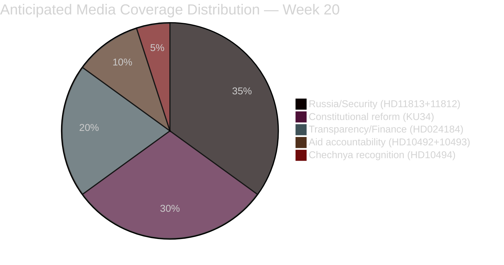

# Media Framing Analysis — Weekly Review 2026-05-16

---

## Anticipated Media Frames

### Frame 1: "Sverige och Rysslands nya aggressionslagstiftning" (Security/Russia)
**Target outlet types**: SVT Nyheter, Ekot/SR, Dagens Nyheter, Svenska Dagbladet  
**Angle**: Swedish parliament's first-responders to Russian Duma law; SD as parliamentary alarm-raiser; Malmer Stenergard's expected diplomatic response  
**Likely headline template**: "SD: Sverige måste markera mot Rysslands nya attacklagar — Utrikesministern kommenterar"  
**Engagement prediction**: HIGH (Russia-Sweden is a sustained high-traffic news cluster)  
**SEO signals**: "Ryssland lag", "Sverige NATO", "Markus Wiechel", "Pål Jonson Aurora 26"

### Frame 2: "LO-pengarna och demokratin" (Transparency)
**Target outlet types**: DN, SvD, Expressen, Aftonbladet  
**Angle**: C challenges government on party finance; union political donations back in spotlight before election  
**Likely headline template**: "Centerpartiet kräver verklig transparens — Regeringens lagstiftning räcker inte"  
**Engagement prediction**: MEDIUM-HIGH (political finance is a persistent media interest topic)  
**SEO signals**: "Politisk finansiering", "LO pengar partier", "Ökad insyn", "Malin Björk C"

### Frame 3: "KU34 och abortskyddet" (Constitutional/Rights)
**Source**: Cross-sibling from 2026-05-15 committee reports  
**Angle**: Constitutional reform including abortion rights approaching plenary  
**Engagement prediction**: HIGH (abortion rights frame activates values voters)  
**SEO signals**: "Abortskydd grundlag", "KU34", "Föreningsfrihet"

---

## Framing Hierarchy (by predicted volume)

---

## Opposition vs. Government Framing Battle

| Theme | Government preferred frame | Opposition preferred frame | Advantage |
|-------|---------------------------|---------------------------|-----------|
| Russia law | "NATO guarantees Swedish security; government is monitoring" | "SD exposed the threat first; government was slow" | SD/opposition |
| Transparency bill | "Historic reform bringing Sweden in line with European standards" | "Cosmetic law that fails to close LO-to-party funding gap" | C/opposition |
| Aurora 26 drones | "Exercise confirms Sweden's growing NATO integration" | "Capability gaps revealed; defence modernization incomplete" | Contested |
| KU34 | "Government delivers landmark constitutional reform" | "Association-freedom clause may fail; abortion only covers part of the package" | Government (if KU34 passes) |

---

## International Media Signals
The Russian aggression law (HD11813 context) is being covered internationally:
- Reuters, AP: Sweden's parliamentary response to Russian Duma law is part of broader Nordic-Baltic reactions coverage
- German media: Sweden and NATO eastern flank; Aurora 26 as training proof
- Expected citation: Swedish SD interpellation may surface in international reporting as "parliamentary pressure on government"
