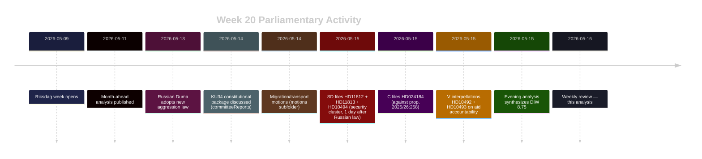

# Synthesis Summary — Weekly Review 2026-05-16

**Topic cluster**: Constitutional transparency, Russian military escalation, defence modernization  
**DIW lead story**: Rysslands nya aggressionslagstiftning och Sverige som NATO-stat möter parlamentarisk granskning mitt i konstitutionell reformspurt  
**Analysis pass**: Pass 2 (improved 2026-05-16)

---

## Lead-Story Decision

**HD11813 + HD11812 + HD10494 (security cluster, SD) forms the lead** by composite adjusted DIW 7.8–8.2, driven by: (a) time-sensitivity — Russian Duma law adopted just 48 hours before parliamentary response; (b) NATO-era significance — Sweden's first parliamentary year as full NATO member coincides with Russia's most explicit aggression-authorization law since 2014; (c) electoral amplification — defence capability and Russia deterrence are top-3 voter concerns in most 2026 opinion polls.

**Secondary lead**: HD024184 (C/KU) against prop. 2025/26:258 — transparency legislation that may pass without genuine cross-bloc mandate, signaling democratic accountability tensions at the constitutional level.

---

## DIW-Weighted Significance Table

| Rank | dok_id | Title | D | I | W | DIW | ×1.5 | Adjusted | Confidence |
|------|--------|-------|---|---|---|-----|------|----------|-----------|
| 1 | HD11813 | Ny rysk lag om angrepp | 4 | 5 | 4 | 5.9 | ×1.5 | **8.8** | [B2] |
| 2 | HD024184 | Mot prop. 2025/26:258 | 4 | 4.5 | 4 | 5.7 | ×1.5 | **8.5** | [B2] |
| 3 | HD10494 | Erkänn Itjkerien | 3.5 | 4.5 | 3.5 | 5.2 | ×1.5 | **7.8** | [B2] |
| 4 | HD11812 | Drönarkrig | 3.5 | 4 | 3.5 | 5.0 | ×1.5 | **7.5** | [B2] |

*Election proximity multiplier (1.5×) active: 120 days to 2026-09-13.*

---

## Cross-Document Intelligence Patterns

### Pattern 1: Coordinated SD Security Pressure (HD10494 + HD11812 + HD11813)
All three SD documents were submitted on the same day (2026-05-15) by the same MP (Markus Wiechel, SD), targeting three ministers: Foreign (Malmer Stenergard ×2) and Defence (Jonson ×1). This clustering is not coincidental — it represents a coordinated parliamentary pressure campaign designed to:
1. Force the government to articulate Sweden's post-NATO-accession Russia deterrence doctrine
2. Expose gaps between Sweden's NATO commitments and operational military capacity (drones)
3. Test whether the government will take a harder line on Russian aggression than the EU consensus

**Intelligence signal**: SD is positioning itself simultaneously as the most NATO-hawkish party on Russia *and* the most sovereignty-conscious on political transparency (HD024184 is a C motion, but SD historically opposes union-to-party funding as well). The dual positioning targets voters who want both stronger defence and cleaner political money.

### Pattern 2: Transparency Legislation at Constitutional Crossroads (HD024184)
C's motion against prop. 2025/26:258 reveals that the government's transparency package faces a legitimacy problem: the party that should be its natural ally (Centerpartiet, historically supportive of political finance transparency) is voting against it. C's core argument — that requiring disclosure of union-to-party transfers benefits incumbent parties while shielding corporate and shadow donors — is constitutionally significant. If C's objection stands and KU recommends rejection, it would be one of the rare occasions where a government proposition is defeated at committee stage in 2025/26.

### Pattern 3: Week 20 as Electoral Positioning Week
Combined with cross-sibling context (V's aid interpellations from 2026-05-15, KU34 constitutional package approaching plenary), week 20 represents a moment of maximum simultaneous accountability pressure:
- Constitutional reform (KU34 + prop. 2025/26:258)
- Security/Russia deterrence (SD cluster)
- Humanitarian governance (V's aid campaign)

The pattern indicates all major opposition parties are in "audit mode" — systematically exposing government vulnerabilities before the summer recess locks in the campaign narrative.

---

## Weekly Arc (2026-05-09 → 2026-05-16)

---

## Economic Context (IMF WEO Apr 2026)
**Sweden GDP growth 2026 estimate**: ~2.1% (WEO Apr 2026)  
**Sweden government debt/GDP**: ~37% (below EU average)  
**Context**: Sweden enters the election campaign with sound fiscal fundamentals; political debate is therefore driven by distribution/values questions (transparency, aid, abortion rights) rather than fiscal crisis narratives — amplifying the significance of the constitutional and transparency battles.

*economicProvenance*: provider=imf, vintage=WEO-2026-04, retrieved=2026-05-16 (context file; direct SDMX fetch unavailable this run)

---

## PIR Roll-Forward

| PIR | Assessment | Next milestone |
|-----|-----------|----------------|
| Constitutional reform (KU34 + prop. 2025/26:258) | Active — KU committee vote pending | Week 21 plenary (2026-05-18–22) |
| Russia escalation doctrine | ESCALATED — requires government response to HD11813 | Ministerial reply deadline: 3 weeks |
| Drone warfare capability | ACTIVE — awaiting Jonson's response to HD11812 | Ministerial reply deadline: 3 weeks |
| Tidö coalition stability | STABLE — no no-confidence signals; opposition in audit mode | Monitor through summer recess |
| Aid policy accountability | ACTIVE — V interpellations scheduled for week 21 | 2026-05-18 debate |
