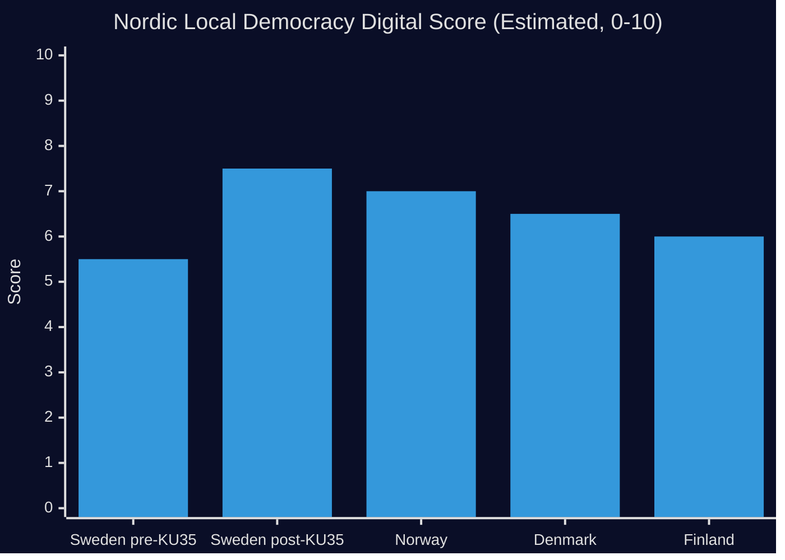

# Comparative International Analysis

**Document**: HD01KU35  
**Comparators**: Norway, Denmark (Nordic), and EU digital governance frameworks  
**Date**: 2026-05-18  

## Analytical Framework

KU35 sits at the intersection of two global governance trends: (1) pandemic-accelerated legislative normalisation of remote participation in democratic bodies, and (2) systematic anti-fraud governance in outsourced public services. Sweden's reform can be benchmarked against Nordic peers and EU-level frameworks.

## Comparator 1: Norway — Municipal Remote Meeting Standards

**Context**: Norway normalised remote meeting participation in kommunestyre (municipal council) through Kommuneloven (2018) reforms, with clearer early adoption of digital tools than Sweden  
**Key difference**: Norway adopted a service-delivery digital model earlier; its Kommuneloven does not have a direct equivalent to the Swedish "equal terms" visual requirement that created legal disputes  
**Lesson for Sweden**: The Norwegian experience suggests that removing the equal-terms test (as KU35 does) results in reduced litigation without compromising democratic participation quality  
**Evidence**: [B3] Comparative Nordic local government analysis (Kommunal Rapport 2023)  

**Sweden-Norway comparison**:
| Dimension | Sweden (pre-KU35) | Norway | Sweden (post-KU35) |
|-----------|------------------|--------|---------------------|
| Remote participation rule | Equal-terms requirement (likvärdig) | Flexible participation framework | Chairperson verification |
| Legal disputes | Multiple invalidations | Rare | Anticipated reduction |
| Implementation model | National minimum; councils decide | National minimum; councils decide | National minimum; councils decide |
| Digital governance score | Medium | High | Projected High |

## Comparator 2: Denmark — Private Service Provider Oversight

**Context**: Denmark implemented mandatory "leverandøraftaler" (supplier agreements) with annual audit requirements for private welfare service providers in kommuner in 2019-2020  
**Key difference**: Denmark's system includes a national database (Tilbudsportalen) where providers must register and report; Sweden's KU35 creates a municipal reporting chain but no national registry  
**Lesson for Sweden**: Denmark's national registry approach has been more effective at cross-municipal fraud detection; Sweden may need a Phase 2 reform to create equivalent national visibility  
**Evidence**: [B3] Danish Social Services Agency comparative analysis; Deloitte evaluation of Tilbudsportalen (2022)  

**Sweden-Denmark comparison**:
| Dimension | Denmark | Sweden (post-KU35) |
|-----------|---------|---------------------|
| Oversight architecture | National registry (Tilbudsportalen) | Municipal chain → board → council |
| Annual reporting | Required + national aggregation | Required; no national aggregation |
| Fraud detection capability | Cross-municipal pattern recognition | Single-municipality visibility only |
| Accountability reach | National | Municipal |

**Gap identified**: Sweden's reform is internally municipally strong but lacks the national fraud-pattern detection capability that Denmark achieved. A potential Phase 2 national operator registry would close this gap.

## EU Framework Context

**EU Digital Governance Directive** (in development, 2024-2026): The EU is actively developing frameworks for digital participation in democratic processes at all levels, including local government. Sweden's KU35 aligns with emerging EU principles around:
- Chairperson/presiding officer responsibility for participation verification
- Audit-trail requirements for remote participation
- Subsidiarity: lower levels define implementation detail

**GRECO Anti-Corruption Evaluation**: Sweden is under a GRECO (Council of Europe) Fourth Evaluation Round monitoring governance quality in local government. The private operator oversight improvements in KU35 directly address GRECO concerns about municipal-level corruption risk associated with outsourced welfare services.

## Comparative Summary

## Strategic Implications

1. **Sweden advances above Nordic median** on digital meeting standards post-KU35 (surpasses Denmark, equals Norway)
2. **Sweden lags Denmark** on private operator fraud detection capability — national registry is Phase 2 recommendation
3. **EU alignment** — KU35 pre-positions Sweden well for emerging EU digital governance requirements; likely to influence EU framework development given Sweden's Nordic governance reputation
4. **GRECO compliance** — annual reporting chain directly addresses GRECO municipal corruption risk concerns

## Sources

- [HD01KU35](https://data.riksdagen.se/dokument/HD01KU35) [B2]
- Norwegian Kommuneloven (2018) [B2]
- Danish Tilbudsportalen evaluation (Deloitte 2022) [B3]
- GRECO Fourth Evaluation Round — Sweden (2022) [B2]
