# Sweden Tightens Municipal Governance: Digital Meetings Clarified, Welfare Fraud Oversight Strengthened

**Author**: James Pether Sörling  
**Date**: 2026-05-18  
**Classification**: 🟢 Public  
**Confidence**: HIGH [B2]  

## BLUF

The Swedish Riksdag's Committee on the Constitution (KU) has unanimously recommended approving Proposition 2025/26:164, which amends Kommunallagen to eliminate the legal grey zone around remote participation in municipal meetings and strengthens oversight of private welfare-service operators. Effective 1 July 2026, all 290 municipalities and 21 regions gain clearer rules for digital governance while the board must annually report to the full council on private operator compliance — a direct legislative strike against welfare fraud. The reform is technically non-controversial but administratively significant.

## Decisions This Brief Supports

1. **Municipal compliance officers**: Prepare updated meeting procedures; identify presidium members who currently attend remotely — prohibited post-July 2026; draft new standing orders for council-mandated remote attendance rules.
2. **Private welfare-service operators**: Expect heightened scrutiny from municipal oversight chains; the reporting obligation creates a documented compliance record accessible to full councils and ultimately the public.
3. **Opposition parties (all 8 parties)**: This consensus bill requires no parliamentary strategy beyond plenary confirmation; monitor implementation quality at municipal level for accountability audit fodder.

## 60-Second Intelligence

- **KU35** unanimously approved by all 8 parties — Riksdag plenary vote expected week of 2026-05-18
- Remote meeting rule change: chairperson now explicitly responsible for attendance verification; equal-terms visual requirement removed
- Presidium ban from remote attendance: protects deliberative integrity of the highest municipal democratic body
- Annual private operator oversight report: creates first systematic national governance standard for outsourced welfare services
- **Underlying driver**: Court invalidations of municipal decisions where remote participation was disputed ([SOU 2024:43](https://www.riksdagen.se) case law analysis); welfare fraud scandal context for the private operator track
- Effective 1 July 2026 — tight implementation timeline for 290 municipalities

## Top Forward Trigger

**T+72h**: Riksdag plenary vote on KU35 — watch for any party registering a reservation (unlikely but possible) or requesting debate time.

## Confidence Assessment

**Overall confidence**: HIGH  
All evidence sourced from official Riksdag documents. Unanimous committee approval reduces political uncertainty to near-zero. Implementation risk is the primary residual uncertainty.

```mermaid
%%{init: {'theme': 'dark', 'themeVariables': {'primaryColor': '#00d9ff', 'primaryTextColor': '#e0e0e0', 'primaryBorderColor': '#ff006e', 'lineColor': '#ffbe0b', 'background': '#0a0e27'}}}%%
flowchart TD
    A["Proposition 2025/26:164\n(Government Bill)"] --> B["KU35 — All-Party\nUnanimous Approval\n[B2] 2026-05-13"]
    B --> C["Plenary Vote\nExpected 2026-05-18–22"]
    C --> D1["Track 1: Digital Meetings\nChairperson Role + Presidium Ban"]
    C --> D2["Track 2: Private Operators\nAnnual Oversight Reporting"]
    D1 --> E["Effective 1 July 2026\nAll 290 Municipalities + 21 Regions"]
    D2 --> E
    style A fill:#1a1e3d,stroke:#ff006e
    style B fill:#1a1e3d,stroke:#00d9ff
    style C fill:#1a1e3d,stroke:#ffbe0b
    style D1 fill:#0a0e27,stroke:#00d9ff
    style D2 fill:#0a0e27,stroke:#ff006e
    style E fill:#0a0e27,stroke:#ffbe0b
```

