<!-- dir: rtl -->
# السويد تشدّد الحوكمة البلدية: توضيح الاجتماعات الرقمية وتعزيز الرقابة على الغش في الرعاية الاجتماعية

**المؤلف**: James Pether Sörling  
**التاريخ**: 2026-05-18  
**التصنيف**: 🟢 عام  
**مستوى الثقة**: مرتفع [B2]  

## الخلاصة التنفيذية

أوصت لجنة الدستور (KU) في الريكسداغ بالإجماع بالموافقة على الاقتراح 2025/26:164، الذي يعدّل قانون البلديات للقضاء على المنطقة الرمادية القانونية المتعلقة بالمشاركة عن بُعد في الاجتماعات البلدية، ويعزز الرقابة على مقدمي الخدمات الاجتماعية الخاصة. اعتباراً من 1 يوليو 2026، ستحصل جميع البلديات الـ 290 والمناطق الـ 21 على قواعد أوضح للحوكمة الرقمية، فيما يتعين على المجلس الإدارسي الإبلاغ سنوياً للمجلس الكامل عن امتثال المشغلين الخاصين — وهو إجراء تشريعي مباشر ضد الغش في الرعاية الاجتماعية. الإصلاح غير مثير للجدل من الناحية التقنية لكنه ذو أهمية إدارية بالغة.

## القرارات التي يدعمها هذا التقرير

1. **مسؤولو الامتثال في البلديات**: أعدّوا إجراءات اجتماعات محدّثة؛ حددوا أعضاء الرئاسة الذين يشاركون حالياً عن بُعد — محظور بعد يوليو 2026؛ أعدّوا لوائح داخلية جديدة لقواعد الحضور عن بُعد التي يحددها المجلس.
2. **مشغلو الخدمات الاجتماعية الخاصون**: توقعوا رقابة مشددة من سلاسل الإشراف البلدية؛ تُنشئ التزامات الإبلاغ سجلاً موثقاً للامتثال يمكن الاطلاع عليه من المجالس الكاملة وفي نهاية المطاف من العامة.
3. **أحزاب المعارضة (جميع الأحزاب الثمانية)**: لا تستلزم هذه المبادرة التوافقية أي استراتيجية برلمانية سوى تأكيد الجلسة العامة؛ راقبوا جودة التنفيذ على المستوى البلدي لاستخدامها في عمليات تدقيق المساءلة.

## النبذة الاستخباراتية في 60 ثانية

- **KU35** معتمد بالإجماع من جميع الأحزاب الثمانية — يُتوقع التصويت العام في الريكسداغ في أسبوع 2026-05-18
- تغيير قواعد الاجتماعات عن بُعد: أصبح الرئيس الآن مسؤولاً صراحةً عن التحقق من الحضور؛ تمت إزالة اشتراط التوازن في إمكانية الوصول البصري
- حظر مشاركة الرئاسة عن بُعد: يحمي سلامة المداولات في أعلى هيئة ديمقراطية بلدية
- التقرير السنوي لرقابة المشغلين الخاصين: يُنشئ أول معيار وطني منهجي للحوكمة للخدمات الاجتماعية المُستعان بمصادر خارجية
- **الدافع الكامن**: إلغاء قضائي لقرارات بلدية حيث كانت المشاركة عن بُعد موضع خلاف ([SOU 2024:43](https://www.riksdagen.se) تحليل السوابق القضائية)؛ سياق فضيحة الغش في الرعاية الاجتماعية لمسار المشغلين الخاصين
- السريان في 1 يوليو 2026 — جدول زمني للتنفيذ ضيق لـ 290 بلدية

## أبرز محفز مستقبلي

**T+72h**: التصويت العام في الريكسداغ على KU35 — راقب ما إذا كان أي حزب يسجل تحفظاً (غير مرجح لكنه ممكن) أو يطلب وقتاً للنقاش.

## تقييم الثقة

**الثقة الإجمالية**: مرتفعة  
جميع الأدلة مصدرها وثائق الريكسداغ الرسمية. الموافقة الإجماعية للجنة تُخفض الغموض السياسي إلى ما يقارب الصفر. مخاطر التنفيذ هي عامل عدم اليقين المتبقي الرئيسي.

```mermaid
%%{init: {'theme': 'dark', 'themeVariables': {'primaryColor': '#00d9ff', 'primaryTextColor': '#e0e0e0', 'primaryBorderColor': '#ff006e', 'lineColor': '#ffbe0b', 'background': '#0a0e27'}}}%%
flowchart TD
    A["Proposition 2025/26:164\n(Government Bill)"] --> B["KU35 — All-Party\nUnanimous Approval\n[B2] 2026-05-13"]
    B --> C["Plenary Vote\nExpected 2026-05-18–22"]
    C --> D1["Track 1: Digital Meetings\nChairperson Role + Presidium Ban"]
    C --> D2["Track 2: Private Operators\nAnnual Oversight Reporting"]
    D1 --> E["Effective 1 July 2026\nAll 290 Municipalities + 21 Regions"]
    D2 --> E
    style A fill:#1a1e3d,stroke:#ff006e
    style B fill:#1a1e3d,stroke:#00d9ff
    style C fill:#1a1e3d,stroke:#ffbe0b
    style D1 fill:#0a0e27,stroke:#00d9ff
    style D2 fill:#0a0e27,stroke:#ff006e
    style E fill:#0a0e27,stroke:#ffbe0b
```

<!-- source-sha: 2a627024c45928811009ef55bfb580c869435df9 -->
