# Sverige stramper kommunal styring: Digitale møder præciseret, tilsyn med velfærdssvindel styrket

**Forfatter**: James Pether Sörling  
**Dato**: 2026-05-18  
**Klassifikation**: 🟢 Offentlig  
**Konfidensgrad**: HØJ [B2]  

## KORT SAMMENFATNING

Riksdagens Konstitutionsudvalg (KU) har enstemmigt anbefalet at godkende Proposition 2025/26:164, der ændrer Kommunalloven for at eliminere den juridiske gråzone omkring deltagelse på afstand i kommunale møder og styrker tilsynet med private velfærdsoperatører. Fra den 1. juli 2026 får alle 290 kommuner og 21 regioner klarere regler for digital styring, mens bestyrelsen årligt skal rapportere til det fulde råd om private operatørers regeloverholdelse — et direkte lovgivningstiltag mod velfærdssvindel. Reformen er teknisk ukontroversiell men administrativt betydningsfuld.

## Beslutninger dette notat understøtter

1. **Kommunale compliance-ansvarlige**: Forbered opdaterede mødeprocedurer; identificer præsidiemedlemmer, der i øjeblikket deltager på afstand — forbudt efter juli 2026; udarbejd nye forretningsordener for rådsvedtagne regler om fjerndeltagelse.
2. **Private velfærdsoperatører**: Forvent skærpet kontrol fra kommunale tilsynskæder; rapporteringsforpligtelsen skaber et dokumenteret regeloverholdelsesregister tilgængeligt for fulde råd og i sidste ende offentligheden.
3. **Oppositionspartier (alle 8 partier)**: Dette konsensusforslag kræver ingen parlamentarisk strategi ud over plenarbekræftelse; overvåg implementeringskvaliteten på kommunalt niveau som grundlag for ansvarsrevision.

## 60-sekunders efterretning

- **KU35** enstemmigt godkendt af alle 8 partier — Riksdag-plenarvotering forventet i ugen 2026-05-18
- Ændring af regler for fjernmøder: formanden nu udtrykkeligt ansvarlig for nærværskontrol; kravet om ligeværdig visuel tilgængelighed fjernet
- Forbud mod fjerndeltagelse for præsidiet: beskytter det højeste kommunale demokratiske organs drøftelsesintegritet
- Årsrapport om tilsyn med private operatører: skaber den første systematiske nationale styringsstandard for udliciterede velfærdstjenester
- **Bagvedliggende drivkraft**: Domstoles underkendelse af kommunale beslutninger, hvor fjerndeltagelse var omstridt ([SOU 2024:43](https://www.riksdagen.se) retspraksis-analyse); kontekst om velfærdssvindelskandale for sporet med private operatører
- Ikrafttrædelse 1. juli 2026 — stram implementeringstidslinje for 290 kommuner

## Vigtigste fremtidige udløser

**T+72h**: Riksdag-plenarvotering om KU35 — hold øje med, om et parti registrerer et forbehold (usandsynligt men muligt) eller anmoder om debatstid.

## Konfidensvurdering

**Samlet konfidensgrad**: HØJ  
Al dokumentation hentet fra officielle Riksdag-dokumenter. Enstemmig udvalsgodkendelse reducerer politisk usikkerhed til næsten nul. Implementeringsrisikoen er den primære resterende usikkerhedsfaktor.

```mermaid
%%{init: {'theme': 'dark', 'themeVariables': {'primaryColor': '#00d9ff', 'primaryTextColor': '#e0e0e0', 'primaryBorderColor': '#ff006e', 'lineColor': '#ffbe0b', 'background': '#0a0e27'}}}%%
flowchart TD
    A["Proposition 2025/26:164\n(Government Bill)"] --> B["KU35 — All-Party\nUnanimous Approval\n[B2] 2026-05-13"]
    B --> C["Plenary Vote\nExpected 2026-05-18–22"]
    C --> D1["Track 1: Digital Meetings\nChairperson Role + Presidium Ban"]
    C --> D2["Track 2: Private Operators\nAnnual Oversight Reporting"]
    D1 --> E["Effective 1 July 2026\nAll 290 Municipalities + 21 Regions"]
    D2 --> E
    style A fill:#1a1e3d,stroke:#ff006e
    style B fill:#1a1e3d,stroke:#00d9ff
    style C fill:#1a1e3d,stroke:#ffbe0b
    style D1 fill:#0a0e27,stroke:#00d9ff
    style D2 fill:#0a0e27,stroke:#ff006e
    style E fill:#0a0e27,stroke:#ffbe0b
```

<!-- source-sha: 2a627024c45928811009ef55bfb580c869435df9 -->
