# Schweden verschärft kommunale Verwaltung: Digitale Sitzungen geklärt, Aufsicht über Sozialbetrug gestärkt

**Autor**: James Pether Sörling  
**Datum**: 2026-05-18  
**Klassifizierung**: 🟢 Öffentlich  
**Vertraulichkeit**: HOCH [B2]  

## KERNAUSSAGE

Der Verfassungsausschuss (KU) des Riksdag hat einstimmig empfohlen, Proposition 2025/26:164 zu verabschieden, die das Kommunalgesetz ändert, um die rechtliche Grauzone bei der Fernbeteiligung an kommunalen Sitzungen zu beseitigen und die Aufsicht über private Wohlfahrtsdienstleister zu stärken. Ab dem 1. Juli 2026 erhalten alle 290 Kommunen und 21 Regionen klarere Regeln für digitale Verwaltung, während der Vorstand jährlich dem Gemeinderat über die Compliance privater Betreiber Bericht erstatten muss — ein direkter gesetzgeberischer Schlag gegen Sozialbetrug. Die Reform ist technisch unumstritten, aber administrativ bedeutsam.

## Entscheidungen, die dieses Briefing unterstützt

1. **Kommunale Compliance-Beauftragte**: Bereiten Sie aktualisierte Sitzungsverfahren vor; identifizieren Sie Präsidiumsmitglieder, die derzeit per Fernzugang teilnehmen — nach Juli 2026 verboten; erarbeiten Sie neue Geschäftsordnungen für vom Gemeinderat festgelegte Fernbeteiligungsregeln.
2. **Private Wohlfahrtsdienstleister**: Rechnen Sie mit verschärfter Kontrolle durch kommunale Aufsichtsketten; die Berichtspflicht schafft ein dokumentiertes Compliance-Register, das für die Gemeinderäte und letztlich die Öffentlichkeit zugänglich ist.
3. **Oppositionsparteien (alle 8 Parteien)**: Dieser Konsensgesetzentwurf erfordert keine parlamentarische Strategie über die Plenarbestätigung hinaus; überwachen Sie die Umsetzungsqualität auf kommunaler Ebene als Material für Rechenschaftsprüfungen.

## 60-Sekunden-Nachricht

- **KU35** von allen 8 Parteien einstimmig genehmigt — Riksdag-Plenarvoating in der Woche 2026-05-18 erwartet
- Änderung der Regeln für Fernbesprechungen: Der Vorsitzende ist jetzt ausdrücklich für die Anwesenheitsprüfung verantwortlich; Anforderung an gleichwertige visuelle Zugänglichkeit entfernt
- Verbot der Fernbeteiligung für das Präsidium: schützt die beratende Integrität des höchsten kommunalen demokratischen Organs
- Jahresbericht zur Aufsicht über private Betreiber: schafft den ersten systematischen nationalen Verwaltungsstandard für ausgelagerte Wohlfahrtsdienste
- **Zugrunde liegender Antrieb**: Gerichtliche Nichtigerklärungen kommunaler Beschlüsse, bei denen die Fernbeteiligung angefochten wurde ([SOU 2024:43](https://www.riksdagen.se) Rechtsprechungsanalyse); Kontext des Sozialbetrugs-Skandals für den Strang privater Betreiber
- Inkrafttreten am 1. Juli 2026 — enger Umsetzungsplan für 290 Kommunen

## Wichtigster zukünftiger Auslöser

**T+72h**: Riksdag-Plenarvoating über KU35 — beobachten Sie, ob eine Partei einen Vorbehalt anmeldet (unwahrscheinlich, aber möglich) oder Redezeit beantragt.

## Vertrauensbewertung

**Gesamtvertrauen**: HOCH  
Alle Belege stammen aus offiziellen Riksdag-Dokumenten. Die einstimmige Ausschussgenehmigung reduziert politische Unsicherheit auf nahezu null. Das Umsetzungsrisiko ist der primäre verbleibende Unsicherheitsfaktor.

```mermaid
%%{init: {'theme': 'dark', 'themeVariables': {'primaryColor': '#00d9ff', 'primaryTextColor': '#e0e0e0', 'primaryBorderColor': '#ff006e', 'lineColor': '#ffbe0b', 'background': '#0a0e27'}}}%%
flowchart TD
    A["Proposition 2025/26:164\n(Government Bill)"] --> B["KU35 — All-Party\nUnanimous Approval\n[B2] 2026-05-13"]
    B --> C["Plenary Vote\nExpected 2026-05-18–22"]
    C --> D1["Track 1: Digital Meetings\nChairperson Role + Presidium Ban"]
    C --> D2["Track 2: Private Operators\nAnnual Oversight Reporting"]
    D1 --> E["Effective 1 July 2026\nAll 290 Municipalities + 21 Regions"]
    D2 --> E
    style A fill:#1a1e3d,stroke:#ff006e
    style B fill:#1a1e3d,stroke:#00d9ff
    style C fill:#1a1e3d,stroke:#ffbe0b
    style D1 fill:#0a0e27,stroke:#00d9ff
    style D2 fill:#0a0e27,stroke:#ff006e
    style E fill:#0a0e27,stroke:#ffbe0b
```

<!-- source-sha: 2a627024c45928811009ef55bfb580c869435df9 -->
