# Suecia refuerza la gobernanza municipal: reuniones digitales aclaradas, supervisión del fraude en bienestar reforzada

**Autor**: James Pether Sörling  
**Fecha**: 2026-05-18  
**Clasificación**: 🟢 Pública  
**Nivel de confianza**: ALTO [B2]  

## RESUMEN EJECUTIVO

El Comité de la Constitución (KU) del Riksdag ha recomendado por unanimidad aprobar la Proposición 2025/26:164, que modifica la Ley Municipal para eliminar la zona gris jurídica en torno a la participación remota en las reuniones municipales y refuerza la supervisión de los operadores privados de servicios sociales. A partir del 1 de julio de 2026, los 290 municipios y 21 regiones contarán con normas más claras para la gobernanza digital, mientras que la junta deberá informar anualmente al pleno sobre el cumplimiento de los operadores privados — una medida legislativa directa contra el fraude en bienestar. La reforma es técnicamente no controvertida pero administrativamente significativa.

## Decisiones que apoya este informe

1. **Responsables de cumplimiento municipal**: Prepare procedimientos de reunión actualizados; identifique a los miembros del presidio que actualmente participan de forma remota — prohibido después de julio de 2026; elabore nuevos reglamentos internos para las normas de asistencia remota aprobadas por el consejo.
2. **Operadores privados de servicios sociales**: Espere una mayor supervisión por parte de las cadenas de control municipal; la obligación de informar crea un registro de cumplimiento documentado accesible para los plenos del consejo y, en última instancia, para el público.
3. **Partidos de oposición (los 8 partidos)**: Este proyecto de ley de consenso no requiere ninguna estrategia parlamentaria más allá de la confirmación plenaria; supervise la calidad de la implementación a nivel municipal para obtener material de auditoría de responsabilidad.

## Nota de inteligencia de 60 segundos

- **KU35** aprobado por unanimidad por los 8 partidos — votación plenaria del Riksdag esperada para la semana del 2026-05-18
- Cambio en las reglas de reuniones a distancia: el presidente ahora es expresamente responsable de la verificación de la asistencia; se elimina el requisito de acceso visual equivalente
- Prohibición del presidio de asistir de forma remota: protege la integridad deliberativa del órgano democrático municipal de mayor rango
- Informe anual sobre la supervisión de operadores privados: crea la primera norma nacional sistemática de gobernanza para los servicios sociales externalizados
- **Impulso subyacente**: Invalidaciones judiciales de decisiones municipales en las que se impugnó la participación remota ([SOU 2024:43](https://www.riksdagen.se) análisis jurisprudencial); contexto del escándalo de fraude en bienestar para el eje de operadores privados
- Entrada en vigor el 1 de julio de 2026 — plazo de implementación ajustado para 290 municipios

## Principal desencadenante futuro

**T+72h**: Votación plenaria del Riksdag sobre KU35 — vigilar si algún partido registra una reserva (poco probable pero posible) o solicita tiempo de debate.

## Evaluación de confianza

**Confianza general**: ALTA  
Todas las pruebas proceden de documentos oficiales del Riksdag. La aprobación unánime del comité reduce la incertidumbre política a casi cero. El riesgo de implementación es el principal factor de incertidumbre residual.

```mermaid
%%{init: {'theme': 'dark', 'themeVariables': {'primaryColor': '#00d9ff', 'primaryTextColor': '#e0e0e0', 'primaryBorderColor': '#ff006e', 'lineColor': '#ffbe0b', 'background': '#0a0e27'}}}%%
flowchart TD
    A["Proposition 2025/26:164\n(Government Bill)"] --> B["KU35 — All-Party\nUnanimous Approval\n[B2] 2026-05-13"]
    B --> C["Plenary Vote\nExpected 2026-05-18–22"]
    C --> D1["Track 1: Digital Meetings\nChairperson Role + Presidium Ban"]
    C --> D2["Track 2: Private Operators\nAnnual Oversight Reporting"]
    D1 --> E["Effective 1 July 2026\nAll 290 Municipalities + 21 Regions"]
    D2 --> E
    style A fill:#1a1e3d,stroke:#ff006e
    style B fill:#1a1e3d,stroke:#00d9ff
    style C fill:#1a1e3d,stroke:#ffbe0b
    style D1 fill:#0a0e27,stroke:#00d9ff
    style D2 fill:#0a0e27,stroke:#ff006e
    style E fill:#0a0e27,stroke:#ffbe0b
```

<!-- source-sha: 2a627024c45928811009ef55bfb580c869435df9 -->
