# Ruotsi tiukentaa kunnallista hallintoa: Digitaaliset kokoukset selvennetty, hyvinvointipetosten valvonta vahvistunut

**Tekijä**: James Pether Sörling  
**Päivämäärä**: 2026-05-18  
**Luokitus**: 🟢 Julkinen  
**Luottamustaso**: KORKEA [B2]  

## LYHYT YHTEENVETO

Riksdagenin perustuslakivaliokunta (KU) on yksimielisesti suositellut hyväksyttäväksi hallituksen esityksen 2025/26:164, joka muuttaa kunnallislakia poistamaan etäosallistumiseen liittyvän oikeudellisen harmaan alueen kunnallisvaalien kokouksissa sekä vahvistamaan yksityisten hyvinvointipalvelujen tarjoajien valvontaa. 1. heinäkuuta 2026 alkaen kaikki 290 kuntaa ja 21 aluetta saavat selkeämmät säännöt digitaaliseen hallintoon, kun taas hallituksen on vuosittain raportoitava koko valtuustolle yksityisten toimijoiden vaatimustenmukaisuudesta — suora lainsäädäntötoimenpide hyvinvointipetoksia vastaan. Uudistus on teknisesti kiistaton mutta hallinnollisesti merkittävä.

## Päätökset, joita tämä tiedustelu tukee

1. **Kunnalliset vaatimustenmukaisuusvastaavat**: Valmistele päivitetyt kokouskäytännöt; tunnista puheenjohtajiston jäsenet, jotka osallistuvat tällä hetkellä etänä — kielletty heinäkuun 2026 jälkeen; laadi uudet pysyväismääräykset valtuuston etäosallistumissääntöjä varten.
2. **Yksityiset hyvinvointipalvelujen tarjoajat**: Odota tiukentuneita tarkastuksia kunnallisista valvontaketjuista; raportointivelvollisuus luo dokumentoidun vaatimustenmukaisuusrekisterin, joka on koko valtuuston ja viime kädessä yleisön saatavilla.
3. **Oppositiopuolueet (kaikki 8 puoluetta)**: Tämä konsensusesitys ei vaadi mitään parlamentaarista strategiaa täysistuntovahvistuksen lisäksi; seuraa toteutuksen laatua kuntatasolla vastuuarvioinnin pohjaksi.

## 60 sekunnin tiedustelu

- **KU35** hyväksytty yksimielisesti kaikissa 8 puolueessa — Riksdagenin täysistuntoäänestys odotetaan viikolla 2026-05-18
- Etäkokousten sääntömuutos: puheenjohtaja nyt nimenomaisesti vastuussa läsnäolon tarkistamisesta; tasavertaisen visuaalisen saatavuuden vaatimus poistettu
- Kielto puheenjohtajistolle etäosallistumisesta: suojaa korkeimman kunnallisen demokraattisen elimen harkintaprosessin eheyttä
- Vuosikertomus yksityisten toimijoiden valvonnasta: luo ensimmäisen systemaattisen kansallisen hallintostandardin ulkoistetuille hyvinvointipalveluille
- **Taustalla vaikuttava tekijä**: Tuomioistuinten mitätöinnit kunnallispäätöksistä, joissa etäosallistuminen oli riitautettu ([SOU 2024:43](https://www.riksdagen.se) oikeuskäytäntöanalyysi); hyvinvointipetosskandalin konteksti yksityisten toimijoiden raiteelle
- Voimaantulo 1. heinäkuuta 2026 — tiukka toteutusaikataulu 290 kunnalle

## Tärkein tuleva laukaisin

**T+72h**: Riksdagenin täysistuntoäänestys KU35:stä — seuraa, rekisteröikö jokin puolue varauksen (epätodennäköistä mutta mahdollista) tai pyytääkö se debattiaikaa.

## Luottamusarviointi

**Kokonaisluottamustaso**: KORKEA  
Kaikki todisteet peräisin virallisista Riksdagen-asiakirjoista. Yksimielinen valiokuntahyväksyntä vähentää poliittisen epävarmuuden lähes nollaan. Toteutusriski on ensisijainen jäljellä oleva epävarmuustekijä.

```mermaid
%%{init: {'theme': 'dark', 'themeVariables': {'primaryColor': '#00d9ff', 'primaryTextColor': '#e0e0e0', 'primaryBorderColor': '#ff006e', 'lineColor': '#ffbe0b', 'background': '#0a0e27'}}}%%
flowchart TD
    A["Proposition 2025/26:164\n(Government Bill)"] --> B["KU35 — All-Party\nUnanimous Approval\n[B2] 2026-05-13"]
    B --> C["Plenary Vote\nExpected 2026-05-18–22"]
    C --> D1["Track 1: Digital Meetings\nChairperson Role + Presidium Ban"]
    C --> D2["Track 2: Private Operators\nAnnual Oversight Reporting"]
    D1 --> E["Effective 1 July 2026\nAll 290 Municipalities + 21 Regions"]
    D2 --> E
    style A fill:#1a1e3d,stroke:#ff006e
    style B fill:#1a1e3d,stroke:#00d9ff
    style C fill:#1a1e3d,stroke:#ffbe0b
    style D1 fill:#0a0e27,stroke:#00d9ff
    style D2 fill:#0a0e27,stroke:#ff006e
    style E fill:#0a0e27,stroke:#ffbe0b
```

<!-- source-sha: 2a627024c45928811009ef55bfb580c869435df9 -->
