# La Suède renforce la gouvernance municipale : réunions numériques clarifiées, surveillance des fraudes sociales renforcée

**Auteur** : James Pether Sörling  
**Date** : 2026-05-18  
**Classification** : 🟢 Publique  
**Niveau de confiance** : ÉLEVÉ [B2]  

## SYNTHÈSE

Le Comité constitutionnel (KU) du Riksdag a recommandé à l'unanimité l'adoption de la Proposition 2025/26:164, qui modifie la loi communale afin d'éliminer la zone grise juridique entourant la participation à distance aux réunions municipales et de renforcer la supervision des prestataires privés de services sociaux. À compter du 1er juillet 2026, les 290 communes et 21 régions bénéficieront de règles plus claires pour la gouvernance numérique, tandis que le conseil devra présenter chaque année un rapport au conseil plénier sur la conformité des opérateurs privés — une mesure législative directe contre la fraude sociale. La réforme est techniquement non-controversée mais administrativement significative.

## Décisions soutenues par ce rapport

1. **Responsables de la conformité municipale** : Préparez des procédures de réunion actualisées ; identifiez les membres du bureau qui participent actuellement à distance — interdit après juillet 2026 ; rédigez de nouveaux règlements intérieurs pour les règles de participation à distance adoptées par le conseil.
2. **Opérateurs privés de services sociaux** : Attendez-vous à un contrôle accru de la part des chaînes de supervision municipales ; l'obligation de rapport crée un registre de conformité documenté accessible aux conseils pléniers et, in fine, au public.
3. **Partis d'opposition (les 8 partis)** : Ce projet de loi consensuel ne requiert aucune stratégie parlementaire au-delà de la confirmation en séance plénière ; surveillez la qualité de la mise en œuvre au niveau municipal pour alimenter les audits de responsabilité.

## Note de renseignement en 60 secondes

- **KU35** approuvé à l'unanimité par les 8 partis — vote en séance plénière du Riksdag attendu pour la semaine du 2026-05-18
- Modification des règles de réunion à distance : le président est désormais expressément responsable de la vérification des présences ; l'exigence d'accessibilité visuelle équivalente supprimée
- Interdiction pour le bureau de participer à distance : protège l'intégrité délibérative de l'organe démocratique municipal le plus élevé
- Rapport annuel sur la supervision des opérateurs privés : crée la première norme nationale systématique de gouvernance pour les services sociaux externalisés
- **Moteur sous-jacent** : Annulations judiciaires de décisions municipales où la participation à distance était contestée ([SOU 2024:43](https://www.riksdagen.se) analyse jurisprudentielle) ; contexte du scandale de fraude sociale pour le volet opérateurs privés
- Entrée en vigueur le 1er juillet 2026 — calendrier de mise en œuvre serré pour 290 communes

## Principal déclencheur futur

**T+72h** : Vote en séance plénière du Riksdag sur KU35 — surveiller si un parti enregistre une réserve (peu probable mais possible) ou demande du temps de débat.

## Évaluation de confiance

**Confiance globale** : ÉLEVÉE  
Toutes les preuves issues de documents officiels du Riksdag. L'approbation unanime du comité réduit l'incertitude politique à quasi-zéro. Le risque de mise en œuvre est le principal facteur d'incertitude résiduel.

```mermaid
%%{init: {'theme': 'dark', 'themeVariables': {'primaryColor': '#00d9ff', 'primaryTextColor': '#e0e0e0', 'primaryBorderColor': '#ff006e', 'lineColor': '#ffbe0b', 'background': '#0a0e27'}}}%%
flowchart TD
    A["Proposition 2025/26:164\n(Government Bill)"] --> B["KU35 — All-Party\nUnanimous Approval\n[B2] 2026-05-13"]
    B --> C["Plenary Vote\nExpected 2026-05-18–22"]
    C --> D1["Track 1: Digital Meetings\nChairperson Role + Presidium Ban"]
    C --> D2["Track 2: Private Operators\nAnnual Oversight Reporting"]
    D1 --> E["Effective 1 July 2026\nAll 290 Municipalities + 21 Regions"]
    D2 --> E
    style A fill:#1a1e3d,stroke:#ff006e
    style B fill:#1a1e3d,stroke:#00d9ff
    style C fill:#1a1e3d,stroke:#ffbe0b
    style D1 fill:#0a0e27,stroke:#00d9ff
    style D2 fill:#0a0e27,stroke:#ff006e
    style E fill:#0a0e27,stroke:#ffbe0b
```

<!-- source-sha: 2a627024c45928811009ef55bfb580c869435df9 -->
