<!-- dir: rtl -->
# שוודיה מחמירה את הממשל העירוני: פגישות דיגיטליות הובהרו, פיקוח על הונאות רווחה הוגבר

**מחבר**: James Pether Sörling  
**תאריך**: 2026-05-18  
**סיווג**: 🟢 ציבורי  
**רמת ביטחון**: גבוהה [B2]  

## תמצית מנהלים

ועדת החוקה (KU) של הריקסדאג המליצה פה אחד לאשר את הצעת החוק 2025/26:164, המתקנת את חוק הרשויות המקומיות כדי לחסל את האזור האפור המשפטי סביב השתתפות מרחוק בישיבות עירוניות ומחזקת את הפיקוח על ספקי שירותי הרווחה הפרטיים. החל מ-1 ביולי 2026, כל 290 הרשויות המקומיות ו-21 האזורים יקבלו כללים ברורים יותר לממשל דיגיטלי, בעוד שהמועצה תידרש לדווח מדי שנה למועצה המלאה על ציות המפעילים הפרטיים — מהלך חקיקתי ישיר נגד הונאות רווחה. הרפורמה אינה שנויה במחלוקת מבחינה טכנית אך משמעותית מבחינה מנהלית.

## החלטות שדוח זה תומך בהן

1. **קציני ציות עירוניים**: הכינו נהלי ישיבות מעודכנים; זהו חברי הנשיאות המשתתפים כרגע מרחוק — אסור לאחר יולי 2026; נסחו תקנונים חדשים לכללי השתתפות מרחוק שנקבעו על ידי המועצה.
2. **מפעילי שירותי רווחה פרטיים**: צפו לפיקוח מוגבר מצד שרשראות הפיקוח העירוניות; חובת הדיווח יוצרת רשומת ציות מתועדת נגישה למועצות המלאות ובסופו של דבר לציבור.
3. **מפלגות האופוזיציה (כל 8 המפלגות)**: הצעת חוק הסכמה זו אינה דורשת אסטרטגיה פרלמנטרית מעבר לאישור ההליך המליאה; עקבו אחר איכות היישום ברמה העירונית לאיסוף חומר לביקורות אחריות.

## מודיעין של 60 שניות

- **KU35** אושר פה אחד על ידי כל 8 המפלגות — הצבעה מליאה של הריקסדאג צפויה בשבוע 2026-05-18
- שינוי כללי ישיבות מרחוק: היו"ר אחראי כעת במפורש לאימות נוכחות; דרישת נגישות חזותית שווה הוסרה
- איסור נשיאות מהשתתפות מרחוק: מגן על יושרת ההתדיינות של הגוף הדמוקרטי העירוני הגבוה ביותר
- דוח שנתי על פיקוח מפעילים פרטיים: יוצר את התקן הלאומי השיטתי הראשון לממשל עבור שירותי רווחה במיקור חוץ
- **המניע הבסיסי**: ביטולים שיפוטיים של החלטות עירוניות שבהן הושמעו ספקות לגבי השתתפות מרחוק ([SOU 2024:43](https://www.riksdagen.se) ניתוח פסיקה); הקשר שערוריית הונאת הרווחה עבור מסלול המפעילים הפרטיים
- כניסה לתוקף ב-1 ביולי 2026 — לוח זמנים לביצוע הדוק ל-290 רשויות מקומיות

## הגורם המפעיל המרכזי העתידי

**T+72h**: הצבעת מליאה של הריקסדאג על KU35 — עקוב אם מפלגה כלשהי רושמת הסתייגות (לא סביר אך אפשרי) או מבקשת זמן דיון.

## הערכת ביטחון

**ביטחון כולל**: גבוה  
כל הראיות מקורן במסמכים רשמיים של הריקסדאג. אישור הוועדה פה אחד מצמצם את אי-הוודאות הפוליטית לאפס כמעט. סיכון היישום הוא גורם אי-הוודאות העיקרי הנותר.

```mermaid
%%{init: {'theme': 'dark', 'themeVariables': {'primaryColor': '#00d9ff', 'primaryTextColor': '#e0e0e0', 'primaryBorderColor': '#ff006e', 'lineColor': '#ffbe0b', 'background': '#0a0e27'}}}%%
flowchart TD
    A["Proposition 2025/26:164\n(Government Bill)"] --> B["KU35 — All-Party\nUnanimous Approval\n[B2] 2026-05-13"]
    B --> C["Plenary Vote\nExpected 2026-05-18–22"]
    C --> D1["Track 1: Digital Meetings\nChairperson Role + Presidium Ban"]
    C --> D2["Track 2: Private Operators\nAnnual Oversight Reporting"]
    D1 --> E["Effective 1 July 2026\nAll 290 Municipalities + 21 Regions"]
    D2 --> E
    style A fill:#1a1e3d,stroke:#ff006e
    style B fill:#1a1e3d,stroke:#00d9ff
    style C fill:#1a1e3d,stroke:#ffbe0b
    style D1 fill:#0a0e27,stroke:#00d9ff
    style D2 fill:#0a0e27,stroke:#ff006e
    style E fill:#0a0e27,stroke:#ffbe0b
```

<!-- source-sha: 2a627024c45928811009ef55bfb580c869435df9 -->
