# スウェーデン、自治体ガバナンスを強化：デジタル会議を明確化し、福祉不正への監視を強化

**著者**: James Pether Sörling  
**日付**: 2026-05-18  
**分類**: 🟢 公開  
**信頼度**: 高 [B2]  

## 要約

リクスダーゲン（Riksdag）の憲法委員会（KU）は、自治体法（Kommunallagen）を改正する議案2025/26:164を全会一致で可決するよう勧告しました。この改正は、自治体会議への遠隔参加に関する法的グレーゾーンを解消し、民間福祉サービス事業者への監視を強化するものです。2026年7月1日から、290すべての自治体と21の地域は、デジタルガバナンスに関するより明確なルールを得る一方、理事会は民間事業者の法令遵守について毎年議会全体に報告する義務を負います——これは福祉不正に対する直接的な立法措置です。この改革は技術的には非論争的ですが、行政的に重要な意味を持ちます。

## この報告書が支援する意思決定

1. **自治体のコンプライアンス担当者**: 更新された会議手順を準備する；現在遠隔参加している議長団メンバーを特定する——2026年7月以降は禁止；遠隔参加規則に関する議会承認の新しい運営規程を作成する。
2. **民間福祉サービス事業者**: 自治体の監視チェーンからの監督強化を予期する；報告義務により、議会全体および最終的には一般市民がアクセスできる文書化されたコンプライアンス記録が作成される。
3. **野党（8政党すべて）**: このコンセンサス法案は本会議での確認以外に議会戦略を必要としない；責任監査の素材として自治体レベルでの実施品質を監視する。

## 60秒のインテリジェンス

- **KU35**は8政党すべてにより全会一致で承認——リクスダーゲン本会議採決は2026年5月18日週に予定
- 遠隔会議ルールの変更：議長は出席確認に明示的に責任を持つようになった；同等のビジュアルアクセス要件を削除
- 議長団の遠隔参加禁止：最高の自治体民主的機関の審議の完全性を保護
- 民間事業者監視の年次報告：外部委託された福祉サービスに対する最初の体系的な全国ガバナンス基準を確立
- **根本的な背景**: 遠隔参加が争われた自治体決定の司法無効化（[SOU 2024:43](https://www.riksdagen.se)の判例分析）；民間事業者部門の背景にある福祉不正スキャンダル
- 2026年7月1日施行——290自治体に対する厳しい実施タイムライン

## 最重要の将来トリガー

**T+72h**: KU35に関するリクスダーゲン本会議採決——いずれかの政党が留保を登録する（可能性は低いが可能）か、討論時間を要求するかどうかを注視する。

## 信頼度評価

**全体的な信頼度**: 高  
すべての証拠は公式のリクスダーゲン文書から取得。委員会の全会一致承認により政治的不確実性はほぼゼロに低下。実施リスクが主要な残存不確実性要因です。

```mermaid
%%{init: {'theme': 'dark', 'themeVariables': {'primaryColor': '#00d9ff', 'primaryTextColor': '#e0e0e0', 'primaryBorderColor': '#ff006e', 'lineColor': '#ffbe0b', 'background': '#0a0e27'}}}%%
flowchart TD
    A["Proposition 2025/26:164\n(Government Bill)"] --> B["KU35 — All-Party\nUnanimous Approval\n[B2] 2026-05-13"]
    B --> C["Plenary Vote\nExpected 2026-05-18–22"]
    C --> D1["Track 1: Digital Meetings\nChairperson Role + Presidium Ban"]
    C --> D2["Track 2: Private Operators\nAnnual Oversight Reporting"]
    D1 --> E["Effective 1 July 2026\nAll 290 Municipalities + 21 Regions"]
    D2 --> E
    style A fill:#1a1e3d,stroke:#ff006e
    style B fill:#1a1e3d,stroke:#00d9ff
    style C fill:#1a1e3d,stroke:#ffbe0b
    style D1 fill:#0a0e27,stroke:#00d9ff
    style D2 fill:#0a0e27,stroke:#ff006e
    style E fill:#0a0e27,stroke:#ffbe0b
```

<!-- source-sha: 2a627024c45928811009ef55bfb580c869435df9 -->
