# 스웨덴, 지방 자치 거버넌스 강화: 디지털 회의 명확화, 복지 부정 감독 강화

**저자**: James Pether Sörling  
**날짜**: 2026-05-18  
**분류**: 🟢 공개  
**신뢰도**: 높음 [B2]  

## 핵심 요약

스웨덴 의회(Riksdag) 헌법위원회(KU)는 지방자치법(Kommunallagen)을 개정하여 지방의회 회의의 원격 참석을 둘러싼 법적 회색 지대를 해소하고 민간 복지 서비스 제공업체에 대한 감독을 강화하는 의안 2025/26:164를 만장일치로 가결 권고했습니다. 2026년 7월 1일부터 290개 기초자치단체와 21개 광역단체는 디지털 거버넌스에 관한 더 명확한 규정을 갖게 되며, 이사회는 민간 사업자의 법령 준수 여부를 매년 전체 의회에 보고해야 합니다 — 복지 부정에 대한 직접적인 입법 조치입니다. 이 개혁은 기술적으로는 비논쟁적이지만 행정적으로 중요한 의미를 갖습니다.

## 이 보고서가 지원하는 결정

1. **지방자치단체 컴플라이언스 담당자**: 업데이트된 회의 절차를 준비하고, 현재 원격으로 참석하는 의장단 구성원을 파악하십시오 — 2026년 7월 이후 금지됩니다; 의회 승인 원격 참석 규정에 관한 새 운영 규정을 마련하십시오.
2. **민간 복지 서비스 사업자**: 지방 감독 체계의 강화된 감시를 예상하십시오; 보고 의무는 전체 의회와 궁극적으로 일반 대중이 접근할 수 있는 문서화된 컴플라이언스 기록을 생성합니다.
3. **야당(8개 정당 모두)**: 이 합의 법안은 본회의 확인 이외에 의회 전략이 필요하지 않습니다; 책임 감사 자료로 지방 자치 수준에서의 실행 품질을 모니터링하십시오.

## 60초 정보 요약

- **KU35** 8개 정당 모두의 만장일치로 승인 — 스웨덴 의회 본회의 표결은 2026-05-18 주에 예정
- 원격 회의 규칙 변경: 의장이 이제 출석 확인에 명시적으로 책임; 동등한 시각적 접근성 요건 제거
- 의장단의 원격 참석 금지: 최고 지방 민주 기관의 심의 무결성 보호
- 민간 사업자 감독 연간 보고서: 아웃소싱된 복지 서비스에 대한 최초의 체계적인 전국 거버넌스 기준 수립
- **근본적 배경**: 원격 참석이 분쟁 대상이었던 지방 의회 결정의 사법 무효화([SOU 2024:43](https://www.riksdagen.se) 판례 분석); 민간 사업자 분야에 대한 복지 부정 스캔들 맥락
- 2026년 7월 1일 발효 — 290개 지자체에 대한 빡빡한 시행 일정

## 가장 중요한 미래 트리거

**T+72h**: KU35에 대한 스웨덴 의회 본회의 표결 — 어떤 정당이 유보를 등록하는지(가능성이 낮지만 가능함) 또는 토론 시간을 요청하는지 주시하십시오.

## 신뢰도 평가

**전체 신뢰도**: 높음  
모든 증거는 공식 스웨덴 의회 문서에서 가져왔습니다. 위원회의 만장일치 승인으로 정치적 불확실성이 거의 제로 수준으로 감소했습니다. 시행 리스크가 주요 잔여 불확실성 요인입니다.

```mermaid
%%{init: {'theme': 'dark', 'themeVariables': {'primaryColor': '#00d9ff', 'primaryTextColor': '#e0e0e0', 'primaryBorderColor': '#ff006e', 'lineColor': '#ffbe0b', 'background': '#0a0e27'}}}%%
flowchart TD
    A["Proposition 2025/26:164\n(Government Bill)"] --> B["KU35 — All-Party\nUnanimous Approval\n[B2] 2026-05-13"]
    B --> C["Plenary Vote\nExpected 2026-05-18–22"]
    C --> D1["Track 1: Digital Meetings\nChairperson Role + Presidium Ban"]
    C --> D2["Track 2: Private Operators\nAnnual Oversight Reporting"]
    D1 --> E["Effective 1 July 2026\nAll 290 Municipalities + 21 Regions"]
    D2 --> E
    style A fill:#1a1e3d,stroke:#ff006e
    style B fill:#1a1e3d,stroke:#00d9ff
    style C fill:#1a1e3d,stroke:#ffbe0b
    style D1 fill:#0a0e27,stroke:#00d9ff
    style D2 fill:#0a0e27,stroke:#ff006e
    style E fill:#0a0e27,stroke:#ffbe0b
```

<!-- source-sha: 2a627024c45928811009ef55bfb580c869435df9 -->
