# Zweden versterkt gemeentelijk bestuur: digitale vergaderingen verduidelijkt, toezicht op welzijnsfraude versterkt

**Auteur**: James Pether Sörling  
**Datum**: 2026-05-18  
**Classificatie**: 🟢 Openbaar  
**Betrouwbaarheidsniveau**: HOOG [B2]  

## KERNBOODSCHAP

De Grondwetscommissie (KU) van de Riksdag heeft unaniem aanbevolen Propositie 2025/26:164 goed te keuren, die de Gemeentewet wijzigt om de juridische grijze zone rondom deelname op afstand aan gemeentelijke vergaderingen te elimineren en het toezicht op private welzijnsaanbieders te versterken. Met ingang van 1 juli 2026 krijgen alle 290 gemeenten en 21 regio's duidelijkere regels voor digitaal bestuur, terwijl het bestuur jaarlijks aan de voltallige raad moet rapporteren over de naleving door private exploitanten — een directe wetgevingsaanpak tegen welzijnsfraude. De hervorming is technisch niet-controversieel maar bestuurlijk significant.

## Beslissingen die dit rapport ondersteunt

1. **Gemeentelijke compliance-functionarissen**: Bereid bijgewerkte vergaderprocedures voor; identificeer presidiumleden die momenteel op afstand deelnemen — verboden na juli 2026; stel nieuwe huishoudelijke reglementen op voor door de raad vastgestelde regels voor deelname op afstand.
2. **Private welzijnsexploitanten**: Verwacht verscherpt toezicht van gemeentelijke controleketens; de rapportageplicht schept een gedocumenteerd nalevingsregister dat toegankelijk is voor de voltallige raden en uiteindelijk het publiek.
3. **Oppositiepartijen (alle 8 partijen)**: Dit consensuswetsvoorstel vereist geen parlementaire strategie buiten plenaire bevestiging; monitor de implementatiekwaliteit op gemeentelijk niveau als materiaal voor verantwoordingsaudits.

## 60-seconden inlichtingen

- **KU35** unaniem goedgekeurd door alle 8 partijen — plenaire stemming in de Riksdag verwacht in de week van 2026-05-18
- Wijziging van regels voor vergaderingen op afstand: voorzitter nu uitdrukkelijk verantwoordelijk voor aanwezigheidscontrole; vereiste van gelijkwaardige visuele toegankelijkheid verwijderd
- Verbod voor het presidium op deelname op afstand: beschermt de beraadslagingsintegriteit van het hoogste gemeentelijke democratische orgaan
- Jaarverslag over toezicht op private exploitanten: creëert de eerste systematische nationale bestuursnorm voor uitbestede welzijnsdiensten
- **Onderliggende drijfveer**: Rechterlijke nietigverklaringen van gemeentelijke besluiten waarbij deelname op afstand werd betwist ([SOU 2024:43](https://www.riksdagen.se) jurisprudentieanalyse); context van welzijnsfraude-schandaal voor het spoor van private exploitanten
- Inwerkingtreding 1 juli 2026 — krap implementatieschema voor 290 gemeenten

## Belangrijkste toekomstige aanleiding

**T+72h**: Plenaire stemming in de Riksdag over KU35 — let op of een partij een voorbehoud registreert (onwaarschijnlijk maar mogelijk) of debattijd aanvraagt.

## Betrouwbaarheidsbeoordeling

**Algeheel vertrouwen**: HOOG  
Alle bewijsmateriaal afkomstig uit officiële Riksdag-documenten. Unaniem commissiebesluit reduceert politieke onzekerheid tot vrijwel nul. Implementatierisico is de primaire resterende onzekerheidsfactor.

```mermaid
%%{init: {'theme': 'dark', 'themeVariables': {'primaryColor': '#00d9ff', 'primaryTextColor': '#e0e0e0', 'primaryBorderColor': '#ff006e', 'lineColor': '#ffbe0b', 'background': '#0a0e27'}}}%%
flowchart TD
    A["Proposition 2025/26:164\n(Government Bill)"] --> B["KU35 — All-Party\nUnanimous Approval\n[B2] 2026-05-13"]
    B --> C["Plenary Vote\nExpected 2026-05-18–22"]
    C --> D1["Track 1: Digital Meetings\nChairperson Role + Presidium Ban"]
    C --> D2["Track 2: Private Operators\nAnnual Oversight Reporting"]
    D1 --> E["Effective 1 July 2026\nAll 290 Municipalities + 21 Regions"]
    D2 --> E
    style A fill:#1a1e3d,stroke:#ff006e
    style B fill:#1a1e3d,stroke:#00d9ff
    style C fill:#1a1e3d,stroke:#ffbe0b
    style D1 fill:#0a0e27,stroke:#00d9ff
    style D2 fill:#0a0e27,stroke:#ff006e
    style E fill:#0a0e27,stroke:#ffbe0b
```

<!-- source-sha: 2a627024c45928811009ef55bfb580c869435df9 -->
