# Sverige strammer kommunal styring: Digitale møter avklart, tilsyn med velferdssvindel styrket

**Forfatter**: James Pether Sörling  
**Dato**: 2026-05-18  
**Klassifisering**: 🟢 Offentlig  
**Konfidensnivå**: HØY [B2]  

## KORTFATTET OPPSUMMERING

Riksdagens Konstitusjonskomité (KU) har enstemmig anbefalt å godkjenne Proposisjon 2025/26:164, som endrer Kommunalloven for å eliminere den juridiske gråsonen rundt fjerndeltagelse i kommunale møter og styrker tilsynet med private velfærdsoperatører. Fra 1. juli 2026 får alle 290 kommuner og 21 regioner klarere regler for digital styring, mens styret årlig må rapportere til fullstyret om private operatørers regeletterlevelse — et direkte lovgivningsgrep mot velferdssvindel. Reformen er teknisk ukontroversielt men administrativt betydningsfull.

## Beslutninger dette notatet støtter

1. **Kommunale etterlevelsesansvarlige**: Forbered oppdaterte møteprosedyrer; identifiser presidiemedlemmer som for øyeblikket deltar på avstand — forbudt etter juli 2026; utarbeid nye forretningsordener for kommunestyrevedtatte regler om fjerndeltagelse.
2. **Private velfærdsoperatører**: Forvent skjerpet kontroll fra kommunale tilsynskjeder; rapporteringsplikten skaper et dokumentert etterlevelsesregister tilgjengelig for fullstyret og i siste instans offentligheten.
3. **Opposisjonspartier (alle 8 partier)**: Dette konsensusforslaget krever ingen parlamentarisk strategi utover plenarstadfestelse; overvåk implementeringskvaliteten på kommunalt nivå som grunnlag for ansvarsrevisjon.

## 60-sekunders etterretning

- **KU35** enstemmig godkjent av alle 8 partier — Riksdag-plenarvotering forventet i uken 2026-05-18
- Endring av regler for fjernmøter: ordfører nå uttrykkelig ansvarlig for nærværskontroll; kravet om likeverdig visuell tilgjengelighet fjernet
- Forbud mot fjerndeltagelse for presidiet: beskytter det høyeste kommunale demokratiske organets deliberative integritet
- Årsrapport om tilsyn med private operatører: skaper den første systematiske nasjonale styringsstandarden for utkontrakterte velferdstjenester
- **Bakenforliggende drivkraft**: Domstolenes overkjøring av kommunale vedtak der fjerndeltagelse var omstridt ([SOU 2024:43](https://www.riksdagen.se) rettspraksis-analyse); kontekst om velferdssvindelskandale for sporet med private operatører
- Ikrafttreden 1. juli 2026 — stram implementeringstidslinje for 290 kommuner

## Viktigste fremtidige utløser

**T+72h**: Riksdag-plenarvotering om KU35 — følg med på om et parti registrerer et forbehold (usannsynlig men mulig) eller ber om debattpunkt.

## Konfidensvurdering

**Samlet konfidensnivå**: HØY  
All dokumentasjon hentet fra offisielle Riksdag-dokumenter. Enstemmig komitégodkjenning reduserer politisk usikkerhet til nær null. Implementeringsrisikoen er den primære gjenværende usikkerhetsfaktoren.

```mermaid
%%{init: {'theme': 'dark', 'themeVariables': {'primaryColor': '#00d9ff', 'primaryTextColor': '#e0e0e0', 'primaryBorderColor': '#ff006e', 'lineColor': '#ffbe0b', 'background': '#0a0e27'}}}%%
flowchart TD
    A["Proposition 2025/26:164\n(Government Bill)"] --> B["KU35 — All-Party\nUnanimous Approval\n[B2] 2026-05-13"]
    B --> C["Plenary Vote\nExpected 2026-05-18–22"]
    C --> D1["Track 1: Digital Meetings\nChairperson Role + Presidium Ban"]
    C --> D2["Track 2: Private Operators\nAnnual Oversight Reporting"]
    D1 --> E["Effective 1 July 2026\nAll 290 Municipalities + 21 Regions"]
    D2 --> E
    style A fill:#1a1e3d,stroke:#ff006e
    style B fill:#1a1e3d,stroke:#00d9ff
    style C fill:#1a1e3d,stroke:#ffbe0b
    style D1 fill:#0a0e27,stroke:#00d9ff
    style D2 fill:#0a0e27,stroke:#ff006e
    style E fill:#0a0e27,stroke:#ffbe0b
```

<!-- source-sha: 2a627024c45928811009ef55bfb580c869435df9 -->
