# Sverige skärper kommunal styrning: Digitala möten förtydligade, tillsyn av välfärdsfusk stärkt

**Författare**: James Pether Sörling  
**Datum**: 2026-05-18  
**Klassificering**: 🟢 Offentlig  
**Konfidensgrad**: HÖG [B2]  

## KORTFATTAD SAMMANFATTNING

Riksdagens konstitutionsutskott (KU) har enhälligt rekommenderat bifall till proposition 2025/26:164, som ändrar kommunallagen för att eliminera den rättsliga gråzonen kring distansdeltagande vid kommunala sammanträden och stärker tillsynen av privata välfärdsoperatörer. Från och med 1 juli 2026 får samtliga 290 kommuner och 21 regioner tydligare regler för digital styrning, medan nämnden årligen måste rapportera till fullmäktige om privata operatörers regelefterlevnad — ett direkt lagstiftningsgrepp mot välfärdsfusk. Reformen är tekniskt okontroversiell men administrativt betydelsefull.

## Beslut som detta underlag stödjer

1. **Kommunala tjänstemän med ansvar för regelefterlevnad**: Förbered uppdaterade mötesordningar; identifiera presidieledamöter som för närvarande deltar på distans — detta förbjuds efter juli 2026; ta fram nya arbetsordningar för fullmäktiges regler om distansdeltagande.
2. **Privata välfärdsoperatörer**: Räkna med skärpt granskning från kommunala tillsynskedjor; rapporteringsskyldigheten skapar ett dokumenterat regelefterlevnadsregister tillgängligt för fullmäktige och i förlängningen allmänheten.
3. **Oppositionspartier (alla 8 partier)**: Detta konsensusförslag kräver ingen parlamentarisk strategi utöver bekräftelse i kammaren; bevaka implementeringskvaliteten på kommunal nivå som underlag för ansvarsgranskning.

## 60-sekunders underrättelse

- **KU35** enhälligt godkänt av alla 8 partier — kammarvotering förväntas veckan 2026-05-18
- Ändring av reglerna för distansmöten: ordföranden är nu uttryckligen ansvarig för närvaro­kontroll; kravet på likvärdig visuell tillgång avlägsnas
- Förbud för presidiet mot distansdeltagande: skyddar det högsta kommunala demokratiska organets överläggningsintegritet
- Årsrapport om privata operatörers tillsyn: skapar den första systematiska nationella styrningsstandarden för utlagda välfärdstjänster
- **Bakomliggande drivkraft**: Domstolars ogiltigförklaringar av kommunala beslut där distansdeltagande ifrågasatts ([SOU 2024:43](https://www.riksdagen.se) rättsfallsanalys); välfärdsfuskskandaler som bakgrund till spåret med privata operatörer
- Ikraftträdande 1 juli 2026 — snäv genomförandetid för 290 kommuner

## Viktigaste framtida utlösare

**T+72h**: Kammarvotering om KU35 — bevaka om något parti registrerar en reservation (osannolikt men möjligt) eller begär debattpunkt.

## Konfidensanalys

**Övergripande konfidensgrad**: HÖG  
Allt underlag hämtat från officiella riksdagsdokument. Enhälligt utskottsgodkännande reducerar den politiska osäkerheten till nära noll. Implementeringsrisken är den primära resterande osäkerhetsfaktorn.

```mermaid
%%{init: {'theme': 'dark', 'themeVariables': {'primaryColor': '#00d9ff', 'primaryTextColor': '#e0e0e0', 'primaryBorderColor': '#ff006e', 'lineColor': '#ffbe0b', 'background': '#0a0e27'}}}%%
flowchart TD
    A["Proposition 2025/26:164\n(Government Bill)"] --> B["KU35 — All-Party\nUnanimous Approval\n[B2] 2026-05-13"]
    B --> C["Plenary Vote\nExpected 2026-05-18–22"]
    C --> D1["Track 1: Digital Meetings\nChairperson Role + Presidium Ban"]
    C --> D2["Track 2: Private Operators\nAnnual Oversight Reporting"]
    D1 --> E["Effective 1 July 2026\nAll 290 Municipalities + 21 Regions"]
    D2 --> E
    style A fill:#1a1e3d,stroke:#ff006e
    style B fill:#1a1e3d,stroke:#00d9ff
    style C fill:#1a1e3d,stroke:#ffbe0b
    style D1 fill:#0a0e27,stroke:#00d9ff
    style D2 fill:#0a0e27,stroke:#ff006e
    style E fill:#0a0e27,stroke:#ffbe0b
```

<!-- source-sha: 2a627024c45928811009ef55bfb580c869435df9 -->
