# 瑞典强化市政治理：数字会议规则明确化，福利欺诈监督力度加强

**作者**：James Pether Sörling  
**日期**：2026-05-18  
**分类**：🟢 公开  
**置信度**：高 [B2]  

## 执行摘要

瑞典议会（Riksdag）宪法委员会（KU）一致建议通过第2025/26:164号议案，该议案修订了《市政法》（Kommunallagen），旨在消除市政会议远程参与的法律灰色地带，并加强对私人福利服务提供商的监督。自2026年7月1日起，全国290个市镇和21个地区将获得更明确的数字治理规则，同时董事会须每年就私人运营商的合规情况向全体议会报告——这是直接打击福利欺诈的立法举措。该改革在技术上无争议，但在行政上意义重大。

## 本简报支持的决策

1. **市政合规官员**：准备更新的会议程序；识别目前远程参与的主席团成员——2026年7月后将予以禁止；为议会批准的远程参与规则起草新的议事规则。
2. **私人福利服务运营商**：预计将受到市政监督链的更严格审查；报告义务将创建可供全体议会以及最终公众查阅的有文件记录的合规档案。
3. **反对党（所有8个政党）**：这项共识法案除全体会议确认外无需任何议会策略；在市级层面监测实施质量，作为问责审计材料。

## 60秒情报简报

- **KU35** 获全部8个政党一致通过——瑞典议会全体会议表决预计在2026年5月18日当周举行
- 远程会议规则变更：主席现在明确负责出席核查；等效视觉可访问性要求已取消
- 禁止主席团远程参与：保护最高市政民主机构的审议完整性
- 私人运营商监督年度报告：为外包福利服务建立首个系统性全国治理标准
- **深层驱动因素**：法院宣告远程参与存在争议的市政决定无效（[SOU 2024:43](https://www.riksdagen.se) 判例分析）；私人运营商领域背景下的福利欺诈丑闻
- 2026年7月1日生效——290个市镇面临紧张的实施时间表

## 最重要的未来触发因素

**T+72h**：瑞典议会就KU35进行全体投票——观察是否有政党登记保留意见（不太可能但存在可能）或请求辩论时间。

## 置信度评估

**总体置信度**：高  
所有证据均来源于瑞典议会官方文件。委员会一致通过将政治不确定性降低至近乎零。实施风险是主要的残余不确定性因素。

```mermaid
%%{init: {'theme': 'dark', 'themeVariables': {'primaryColor': '#00d9ff', 'primaryTextColor': '#e0e0e0', 'primaryBorderColor': '#ff006e', 'lineColor': '#ffbe0b', 'background': '#0a0e27'}}}%%
flowchart TD
    A["Proposition 2025/26:164\n(Government Bill)"] --> B["KU35 — All-Party\nUnanimous Approval\n[B2] 2026-05-13"]
    B --> C["Plenary Vote\nExpected 2026-05-18–22"]
    C --> D1["Track 1: Digital Meetings\nChairperson Role + Presidium Ban"]
    C --> D2["Track 2: Private Operators\nAnnual Oversight Reporting"]
    D1 --> E["Effective 1 July 2026\nAll 290 Municipalities + 21 Regions"]
    D2 --> E
    style A fill:#1a1e3d,stroke:#ff006e
    style B fill:#1a1e3d,stroke:#00d9ff
    style C fill:#1a1e3d,stroke:#ffbe0b
    style D1 fill:#0a0e27,stroke:#00d9ff
    style D2 fill:#0a0e27,stroke:#ff006e
    style E fill:#0a0e27,stroke:#ffbe0b
```

<!-- source-sha: 2a627024c45928811009ef55bfb580c869435df9 -->
