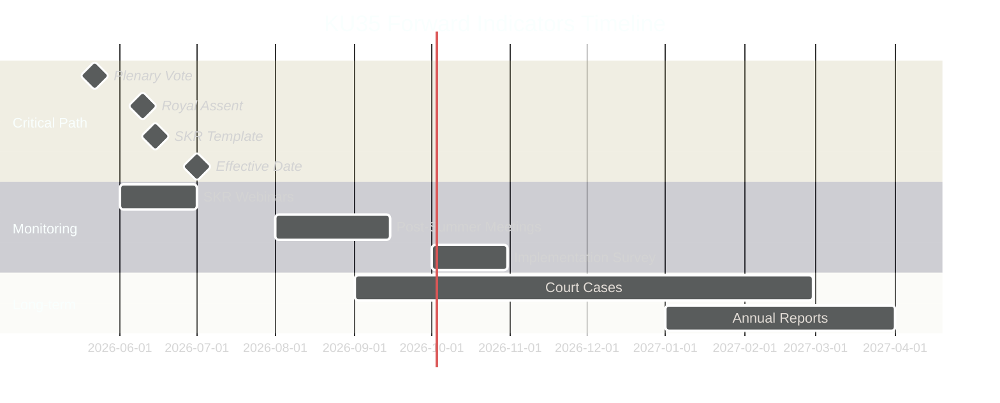

# Forward Indicators — KU35 Monitoring Registry

**Document**: HD01KU35  
**Date**: 2026-05-18  
**Horizon**: T+72h to T+365d+  
**Total Indicators**: 12 (≥10 required)  

## Indicator Registry

| # | Indicator | Date/Window | Source | Action Trigger | Priority |
|---|-----------|------------|--------|----------------|---------|
| FI-01 | Riksdag plenary vote confirms KU35 | 2026-05-18 to 2026-05-22 | riksdagen.se voteringsdatabas | Any party registers reservation → escalate | HIGH |
| FI-02 | Royal assent (kungörelse) published in SFS | 2026-05-23 to 2026-06-10 | riksdagen.se / Lagrummet.se | Delay > 1 week → flag | MEDIUM |
| FI-03 | SKR publishes model standing order template | By 2026-06-15 | skr.se press releases | No template by 1 July → escalate implementation risk | HIGH |
| FI-04 | SKR webinar attendance for municipal secretaries | June 2026 | SKR training portal | < 30% attendance → low implementation confidence | MEDIUM |
| FI-05 | KU35 effective date — municipal procedures operative | 2026-07-01 | Municipal standing order registers | Any municipality operating under old rules → legal risk | HIGH |
| FI-06 | First municipal council meeting under new rules | 2026-08-01 to 2026-09-15 (post-summer) | Municipal fullmäktige minutes | Any procedural challenge → track | MEDIUM |
| FI-07 | First administrative court case citing new KL standard | 2026-09-01 to 2027-03-01 | Förvaltningsrätterna.se | Any ruling → analyze for precedent impact | HIGH |
| FI-08 | Count of municipalities updating standing orders | 2026-10-01 (three months post-effective) | SKR survey / media | < 50% compliance → government review; < 70% → escalate | HIGH |
| FI-09 | First party interpellation (interpellation) on KU35 implementation | 2026-09-01 to 2027-01-01 | riksdagen.se interpellationsdatabas | Any interpellation → topic elevated; prepare briefing | MEDIUM |
| FI-10 | SKR aggregate first annual private operator oversight reports | 2027-Q1 | SKR.se / municipal minutes | >10% municipalities non-compliant or significant fraud findings → major brief | HIGH |
| FI-11 | HFD (Supreme Administrative Court) takes KU35-standard case | 2027-Q1 to 2028-Q2 | HFD.se | HFD acceptance → landmark ruling; track closely | MEDIUM |
| FI-12 | Election 2026 party platforms reference KU35 | June-September 2026 | Party manifesto releases | Inclusion → issue amplified; omission → confirms low salience | LOW |

## Indicator Dashboard

## Collection Priority

**Weekly monitoring** (through July 2026): FI-01, FI-02, FI-03, FI-05  
**Monthly monitoring** (August-December 2026): FI-04, FI-06, FI-07, FI-08, FI-12  
**Quarterly monitoring** (2027+): FI-09, FI-10, FI-11  

## Sources

- [HD01KU35](https://data.riksdagen.se/dokument/HD01KU35) [B2]
- Forward Indicators methodology: [analysis/methodologies/ai-driven-analysis-guide.md]
