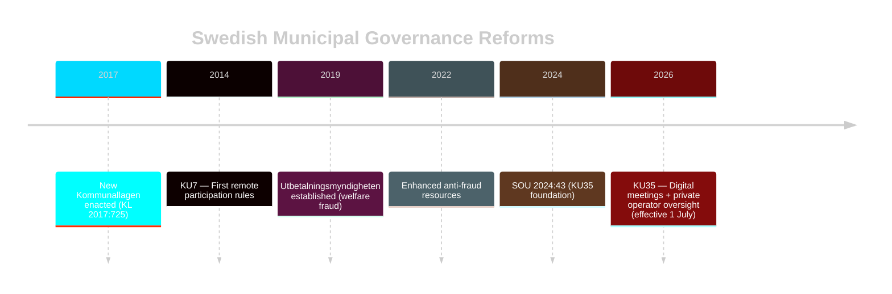

# Historical Parallels Analysis

**Document**: HD01KU35  
**Date**: 2026-05-18  

## Primary Historical Parallel: KU7 (2013/14) — First Remote Meeting Reform

**Betänkande**: 2013/14:KU7  
**Title**: Vidare och bredare distansdeltagande i kommunala sammanträden  
**Context**: First parliamentary authorization of remote participation in Swedish municipal council meetings  
**Outcome**: Passed with cross-party support; effective 2014  
**Implementation**: Variable adoption; some municipalities embraced immediately; legal disputes emerged within 2 years  

**Comparison with KU35**:

| Dimension | KU7 (2013) | KU35 (2026) |
|-----------|-----------|------------|
| Scope | Introduced remote participation | Refines and clarifies remote participation |
| Driver | Digital modernisation opportunity | Legal dispute resolution |
| Implementation problem | No verification standard → disputes | Verification standard introduced |
| Cross-party support | Strong | Unanimous |
| Timeline | Open implementation | 1 July 2026 hard deadline |
| Outcome (KU7) | Partial adoption; legal grey zone created | N/A — future assessment |

**Lesson**: KU7's success in enabling remote participation was undermined by the lack of clear verification standards. KU35 explicitly corrects this — the historical parallel validates the reform approach.

## Secondary Parallel: Welfare Fraud Legislation Trajectory

**Context**: Sweden has enacted multiple welfare fraud response measures since 2019:
- 2019: Utbetalningsmyndigheten (Payment Authority) established
- 2022: Riksdag voted SEK 1.5 billion additional anti-fraud resources
- 2024: Enhanced prosecutor capacity for welfare fraud (VN-PROP 2024/25:47)
- 2026: KU35 adds municipal oversight layer

**Pattern**: Each legislative cycle adds a governance layer rather than replacing the previous one — cumulative governance architecture building.

**KU35 fits the trajectory**: The municipal reporting chain is the local governance layer in an evolving national anti-fraud architecture. The missing link was always local accountability — KU35 closes it.

## Tertiary Parallel: Danish Welfare Governance Reform (2019-2020)

**Context**: Denmark's 2019 Tilbudsportalen expansion (see comparative-international.md for detail)  
**Parallel**: Denmark faced similar welfare operator compliance challenges; mandatory national registry solved the national visibility gap  
**Lesson**: Sweden's current reform replicates Denmark's 2019 starting point; a Phase 2 national registry replication would bring Sweden to Denmark's 2026 standard  

## Timeline of Swedish Municipal Democracy Reforms

## Sources

- [HD01KU35](https://data.riksdagen.se/dokument/HD01KU35) [B2]
- 2013/14:KU7 — Historical Riksdag archive [B1]
- SOU 2024:43 [B2]
- Danish Tilbudsportalen [B3]
