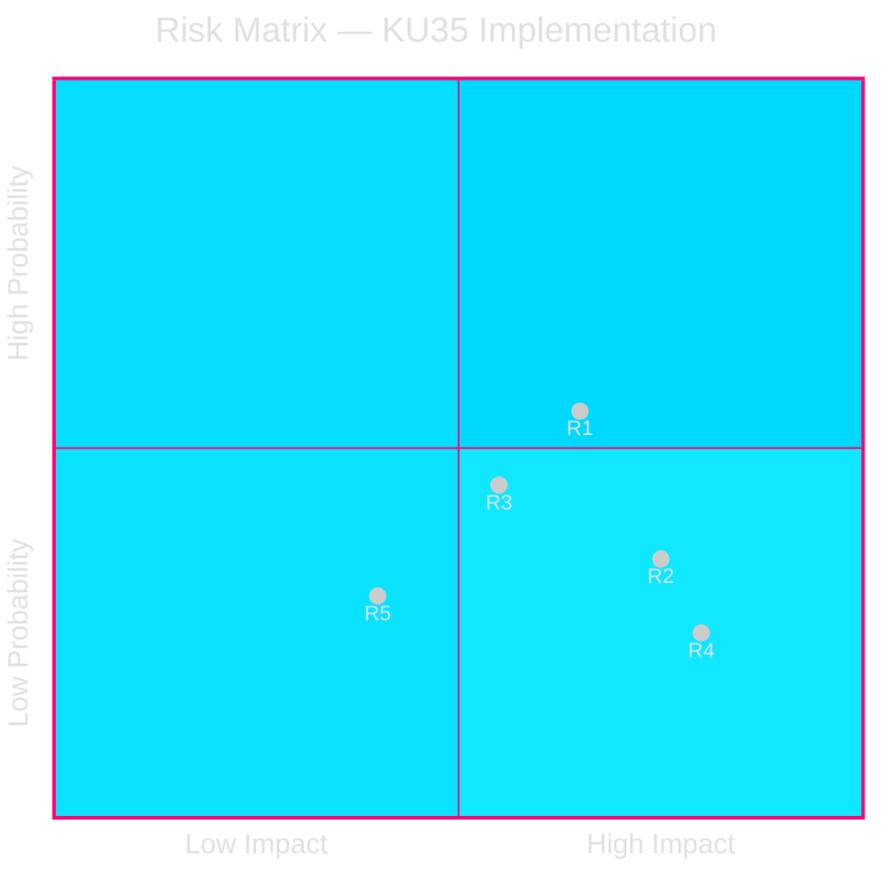

# Risk Assessment — KU35 Municipal Governance Reform

**Document**: HD01KU35  
**Framework**: 5-Dimension Risk Register (ICA/ISMS aligned)  
**Date**: 2026-05-18  
**Risk Owner**: Implementation monitoring — municipalities + SKR  

## Risk Register

| # | Risk | Probability | Impact | Severity | Dimension | Mitigation |
|---|------|-------------|--------|----------|-----------|-----------|
| R1 | Implementation shortfall — municipalities fail to update standing orders by 1 July 2026 | 0.35 | 6/10 | MEDIUM | Implementation | SKR template library by August; phased enforcement guidance from government |
| R2 | Court challenge to new digital verification standard | 0.20 | 7/10 | MEDIUM | Legal | Legal guidance circular from SALAR/Förvaltningsrätten; chairperson certification training |
| R3 | Annual reporting obligation goes unfulfilled in smaller municipalities | 0.25 | 5/10 | LOW-MEDIUM | Compliance | Standard report template; national data collection via SKR |
| R4 | Welfare fraud detection through new reporting exposes systemic failures and creates political crisis | 0.15 | 8/10 | MEDIUM | Reputational/Political | Graduated escalation pathway; national support structure for municipalities |
| R5 | Presidium remote attendance ban violated inadvertently | 0.15 | 4/10 | LOW | Procedural | Clear standing order template language; formal legal opinion distributed |

## 5-Dimension Analysis

### 1. Political Risk
**Level**: VERY LOW  
All 8 parties approved KU35. No party has filed a reservation. The risk of parliamentary opposition has been eliminated by the committee stage. Post-July 2026, political risk shifts to implementation: if welfare fraud reports reveal systemic failures, parties may compete to characterise the problem as their opponents' governance failure.

### 2. Legal Risk
**Level**: LOW-MEDIUM  
The SOU 2024:43 case law analysis was specifically designed to pre-empt the legal challenges that invalidated past municipal decisions. However, the new chairperson verification standard creates new jurisprudence territory. Municipal decisions taken under the new rules will face test cases. Projected: 3-5 court challenges in first year, but high probability they sustain the legislation.

### 3. Implementation Risk
**Level**: MEDIUM  
- 290 municipalities; varying administrative capacity
- 1 July 2026 deadline is aggressive (~6 weeks from royal assent)
- The private operator reporting chain requires new inter-committee coordination mechanisms
- **Highest risk group**: Rural municipalities with < 5,000 residents and limited legal/admin staff

### 4. Social Risk
**Level**: LOW  
No significant civil society opposition identified. SKR (municipalities association) participated in the SOU process. Private welfare operators face higher compliance burden, but legitimate operators benefit from the credibility signal that tougher oversight provides.

### 5. Fiscal Risk
**Level**: LOW  
No new unfunded mandates — the reporting obligation uses existing administrative infrastructure. Digital meeting cost savings (reduced travel for remote municipalities) may offset implementation costs over time.

## Threat Landscape Summary

## Monitoring Triggers

| Trigger | Action |
|---------|--------|
| Court invalidates a municipal decision under new rules | Escalate to legal review; update implementation guidance |
| > 20% of municipalities miss July 2026 deadline | SKR emergency template distribution; grace period consideration |
| Annual welfare fraud reports show > 5% operators non-compliant | Riksdag interpellation expected; probe preparation advisable |

## Sources

- [HD01KU35](https://data.riksdagen.se/dokument/HD01KU35) [B2]
- SOU 2024:43 [B2]
