# Scenario Analysis — KU35 Forward Projections

**Document**: HD01KU35  
**Horizon**: T+72h to T+365d  
**Method**: Scenario tree with probability weighting  
**Date**: 2026-05-18  

## Baseline Assessment

KU35 will pass the Riksdag plenary with near-certainty (>99% probability). The analytical challenge shifts to implementation quality and political consequences of the new private operator reporting system. Scenarios branch from the implementation phase.

## Scenario Tree

```mermaid
%%{init: {'theme': 'dark', 'themeVariables': {'primaryColor': '#00d9ff', 'primaryTextColor': '#e0e0e0', 'primaryBorderColor': '#ff006e', 'lineColor': '#ffbe0b', 'background': '#0a0e27'}}}%%
flowchart TD
    A["KU35 Passes Plenary\n[99%+ probability]"] --> B1["Track 1: Digital Meetings"]
    A --> B2["Track 2: Private Operators"]
    
    B1 --> C1["Smooth Implementation\nMunicipalities update standing orders\n[60%]"]
    B1 --> C2["Patchy Implementation\nSmaller municipalities lag\n[35%]"]
    B1 --> C3["Court Challenge\nNew verification standard tested\n[5% — triggers legal review]"]
    
    B2 --> D1["Reports Show Manageable Problems\nGradual improvement visible\n[50%]"]
    B2 --> D2["Reports Reveal Systemic Fraud\nPolitical amplification\n[30%]"]
    B2 --> D3["Reporting Compliance Low\nMunicipalities don't submit\n[20%]"]
    
    D2 --> E1["Election 2026 Issue\nParties compete on welfare fraud accountability\n[High probability if D2]"]
    
    style A fill:#1a1e3d,stroke:#ffbe0b
    style C1 fill:#0a0e27,stroke:#00d9ff
    style C2 fill:#0a0e27,stroke:#ffbe0b
    style C3 fill:#0a0e27,stroke:#ff006e
    style D1 fill:#0a0e27,stroke:#00d9ff
    style D2 fill:#0a0e27,stroke:#ff006e
    style D3 fill:#0a0e27,stroke:#ffbe0b
```

## Scenario Narratives

### Scenario 1 — Smooth Governance Upgrade (Base Case, 55% probability)
**T+72h**: Riksdag plenary passes KU35 without debate  
**T+30d**: SKR publishes model standing orders  
**T+90d (1 July 2026)**: Majority of municipalities (>70%) update procedures  
**T+180d**: First annual oversight reports filed; some problems identified but proportionate  
**T+365d**: New standard established as baseline; digital meeting disputes essentially eliminated

*Political consequence*: Quiet governance success; government takes credit but low public salience

### Scenario 2 — Welfare Fraud Amplification (High-Salience, 25% probability)
**T+72h**: KU35 passes  
**T+180d**: First annual reports reveal multiple municipalities where private operators have systematically over-billed or failed to deliver services  
**T+200d**: Media investigation following audit trail created by the new reports  
**T+300d (pre-election)**: Election 2026 campaign features welfare fraud accountability as major issue  
**T+365d**: Government and opposition compete on who would do more to crack down on fraud

*Political consequence*: Highly salient pre-election controversy; SD benefits (welfare nationalism narrative); S government must defend its welfare state management

### Scenario 3 — Implementation Failure (Downside, 20% probability)
**T+72h**: KU35 passes  
**T+60d**: SKR surveys show >30% of municipalities struggling with 1 July deadline  
**T+90d**: Government issues extension guidance or clarification  
**T+180d**: Audit shows only 60% compliance with new standing order requirements  
**T+365d**: Reform seen as administratively challenging rather than substantively effective

*Political consequence*: Moderate embarrassment for government; opposition questions implementation capacity

## Wildcards

| Wildcard | Probability | Impact | Direction |
|----------|-------------|--------|-----------|
| Major welfare fraud scandal (unrelated) before July 2026 | 0.10 | HIGH | Accelerates implementation urgency |
| HFD (Supreme Administrative Court) expedited case on new digital standard | 0.05 | MEDIUM | Clarifies standard faster, reduces uncertainty |
| Summer 2026 election date moved (rare constitutional scenario) | 0.02 | LOW | Accelerates political competition on reform credit |

## Recommended Forward Indicators

Monitor:
1. SKR implementation webinar attendance (June 2026)
2. Number of municipalities filing updated standing orders by August 2026
3. First annual oversight report aggregate (January 2027)
4. Administrative court cases citing new KL standards (Q3 2026+)

## Sources

- [HD01KU35](https://data.riksdagen.se/dokument/HD01KU35) [B2]
- Comparative scenario methodology: [analysis/methodologies/ai-driven-analysis-guide.md]
