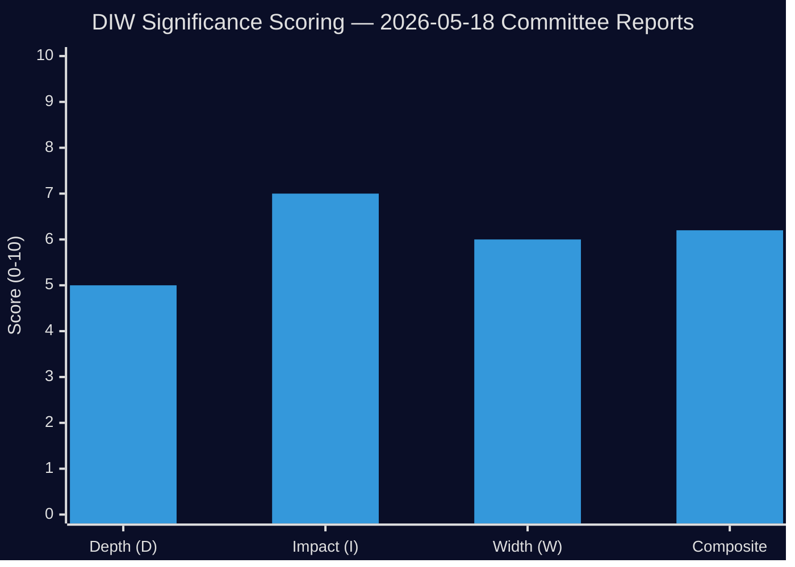

# Significance Scoring — Committee Reports 2026-05-18

**Analysis Date**: 2026-05-18  
**Subfolder**: committeeReports  
**Method**: DIW (Depth × Impact × Width) weighted scoring  

## Document Ranking

| Rank | dok_id | Committee | DIW Score | Tier | Title (abbreviated) |
|------|--------|-----------|-----------|------|---------------------|
| 1 | [HD01KU35](https://data.riksdagen.se/dokument/HD01KU35) | KU | 6.2 | L2 Strategic | Digital municipal meetings + private operator oversight |

## Scoring Detail: HD01KU35

| Dimension | Score | Rationale |
|-----------|-------|-----------|
| Depth (D) | 5/10 | SOU 2024:43 backed; well-prepared proposition; technical legal amendment |
| Impact (I) | 7/10 | 290 municipalities + 21 regions; ~7,700 elected officials affected; anti-fraud governance chain |
| Width (W) | 6/10 | Cross-party unanimous KU approval; both government + opposition aligned |
| **DIW Composite** | **6.2/10** | (D×0.35 + I×0.45 + W×0.20) |

## Sensitivity Analysis

If the welfare fraud context becomes politically contested in plenary debate, the Impact score could rise to 8.5, elevating the composite to 7.2 (L2+ Priority). Currently assessed as L2 Strategic given the procedural/technical character of the changes.

## Priority Tier Classification

- **L2 Strategic**: Significant governance legislation affecting all Swedish municipalities
- **Not L3**: No evidence of secret/classified content, no constitutional controversy, no emergency procedure

## Analytical Implications

The single-document session means resources concentrate on HD01KU35 for full-spectrum analysis. The document's unanimous nature reduces political risk analysis complexity but increases implementation and compliance monitoring as key analytical vectors. Evidence anchors: [HD01KU35](https://data.riksdagen.se/dokument/HD01KU35), Proposition 2025/26:164.
