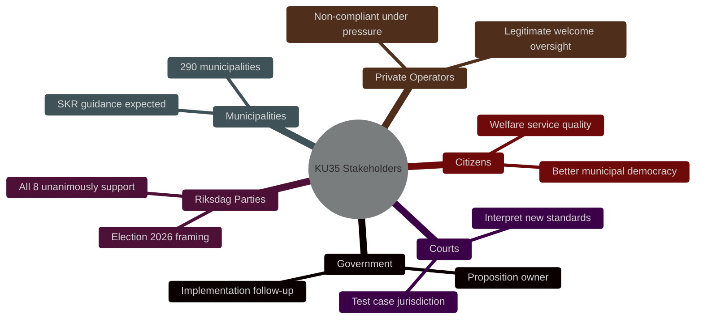

# Stakeholder Perspectives — 6-Lens Analysis

**Document**: HD01KU35  
**Method**: 6-stakeholder lens matrix  
**Date**: 2026-05-18  

## Stakeholder Map

## Lens 1: Government (Proposition Owner)

**Position**: Advocate  
**Interest**: Successful reform delivers on government programme commitments to digital modernisation and anti-fraud governance  
**Influence**: High (authored the proposition)  
**Key concern**: Implementation speed — wants visible compliance before September 2026 election  
**Likely action**: Request SKR to develop standard templates; issue implementation circular to municipalities by June 2026  

## Lens 2: Riksdag Parties (All 8)

**Position**: Unified Support  
**Interest**: Shared credit for improving municipal democracy and fighting welfare fraud  
**Divergence points**: 
- S and V emphasise welfare state protection angle (private operator accountability)
- M and L emphasise digital efficiency and subsidiarity angle
- SD emphasises welfare fraud (aligns with their welfare nationalism narrative)
- C emphasises rural inclusion and subsidiarity
- KD emphasises family service quality in private care
- MP emphasises digital inclusion and participation

**Key concern**: Post-July 2026 — who gets blamed if implementation fails?

## Lens 3: Municipalities and SKR

**Position**: Implementer  
**Interest**: Clear, practical implementation guidance; realistic enforcement timeline  
**Influence**: High (must execute the reform)  
**Key concern**: 6-week timeline to 1 July 2026 is tight; smaller municipalities lack capacity  
**Likely action**: SKR will develop model standing orders and convene webinars for municipal secretaries by June 2026  
**Divergence**: Large municipalities (Stockholm, Gothenburg, Malmö) can implement quickly; rural municipalities need extended support  

## Lens 4: Private Welfare Service Operators

**Position**: Split  
**Interest (legitimate operators)**: Welcome the reform — annual reporting creates transparency that advantages quality operators over fraudulent ones; creates competitive differentiation  
**Interest (non-compliant/fraudulent operators)**: Reform increases detection risk and imposes compliance costs  
**Influence**: Low (no legislative standing)  
**Key concern**: Annual reporting templates and thresholds — what constitutes "adequate" oversight?  
**Likely action**: Sector associations will engage SKR on implementation standards to shape reporting format  

## Lens 5: Citizens / Voters

**Position**: Indirect beneficiary  
**Interest**: Better municipal democracy (can vote for councillors who can actually participate remotely); better welfare service quality through accountability  
**Influence**: Electoral (September 2026)  
**Key concern**: Awareness — most citizens unaware of municipal governance rules; impact felt through service quality  
**Opportunity**: Welfare fraud revelations via annual reports could become election issue — parties that champion accountability benefit  

## Lens 6: Administrative Courts

**Position**: Neutral arbiter  
**Interest**: Clear statutory standards to apply  
**Influence**: Legal — will interpret the new chairperson verification standard  
**Key concern**: The removal of the "equal terms" test creates interpretive vacuum; courts will need to define what constitutes adequate chairperson verification  
**Likely action**: Förvaltningsrätterna will receive test cases within 12-18 months; HFD (Högsta förvaltningsdomstolen) may need to rule on the new standard within 3-5 years  

## Stakeholder Power-Interest Grid

| Actor | Power | Interest | Quadrant | Strategy |
|-------|-------|----------|----------|----------|
| Government | HIGH | HIGH | Manage closely | Implementation monitoring |
| Riksdag parties | HIGH | HIGH | Engage | Post-July communication plan |
| SKR | HIGH | HIGH | Manage closely | Template development partnership |
| Large municipalities | MEDIUM | HIGH | Keep satisfied | Early adopter showcase |
| Small municipalities | LOW | HIGH | Keep informed | Capacity support programme |
| Private operators (legitimate) | MEDIUM | MEDIUM | Keep informed | Standards consultation |
| Private operators (fraudulent) | LOW | HIGH | Monitor | Enforcement escalation |
| Administrative courts | MEDIUM | LOW | Keep informed | Legal guidance circular |
| Citizens/voters | LOW | MEDIUM | Monitor | Election 2026 narrative |

## Sources

- [HD01KU35](https://data.riksdagen.se/dokument/HD01KU35) [B2]
- SOU 2024:43 consultation section [B2]
