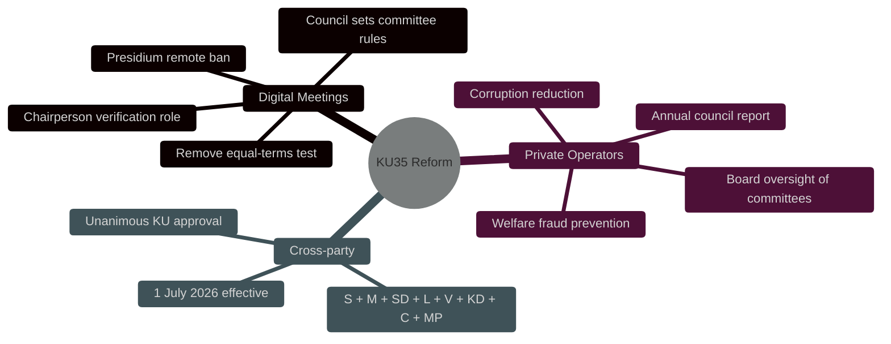

# Synthesis Summary — Committee Reports 2026-05-18

**Lead Story**: KU35 Advances Municipal Democracy and Anti-Fraud Reforms to Plenary  
**DIW Lead**: HD01KU35 — 6.2/10 — Kommunallagen reform; digital meetings + private operator oversight  
**Session**: 1 primary document; 20 surveyed betänkanden from 2025/26  

## Top Story — HD01KU35

The unanimous KU recommendation to adopt 2025/26:164 represents the most consequential municipal governance reform since the initial remote meeting rules introduced in 2013/14 (KU7). This session's single eligible document packages two distinct governance improvements that together create a more legally robust and accountability-strengthened framework for Swedish local democracy.

**Track 1 (Digital Democracy)**: The 2013/14 reform enabled remote participation but failed to anticipate the legal disputes that would arise when courts demanded equal-terms proof. KU35 resolves this by shifting the verification burden to the chairperson and removing the contested equal-terms test. The presidium ban protects deliberative integrity while councils gain new authority to set their own remote participation limits for committees — a subsidiarity principle in practice.

**Track 2 (Welfare Accountability)**: Sweden's welfare fraud (välfärdsbrott) problem — estimated at SEK 15-20 billion annually by the Riksdag's own analysis — requires systematic detection structures. The new annual reporting chain (committee oversight of private operators → council board aggregation → full council report) creates a governance backbone that is currently absent. This is preventive governance architecture, not reactive scandal management.

## Secondary Context

From the 20 betänkanden surveyed in the session:
- HD01KU34: Constitutional protection of abortion right + association freedom amendments (high political salience)
- Multiple KU reports on constitutional monitoring (KU20, KU26)
- Pattern: KU has been productive this riksmöte, handling multiple constitution-layer and local government topics in parallel

## Key Analytical Thread

The dual-track structure of HD01KU35 is politically intelligent: by packaging digital democracy improvements (popular among elected officials who struggle with remote attendance logistics) with welfare fraud oversight (popular with the public and all parties), the government created a coalition-proof legislative bundle. Opposition parties have no political incentive to oppose either track.

## Confidence Summary

| Claim | Confidence | Basis |
|-------|-----------|-------|
| Unanimous KU approval | HIGH [B2] | Official committee record |
| Plenary vote week 2026-05-18 | MEDIUM [B3] | Riksdag calendar inference |
| Effective date 1 July 2026 | HIGH [B2] | Proposition text |
| Anti-fraud impact | MEDIUM [B3] | Comparative municipal governance literature |

## Sources

- [HD01KU35](https://data.riksdagen.se/dokument/HD01KU35) — Primary
- [Proposition 2025/26:164](https://www.riksdagen.se) — Underlying bill
- SOU 2024:43 — Commission analysis (case law review)
- Kommunallagen (2017:725) §§ 5:16, 5:72, 6:24 — Statutory basis
