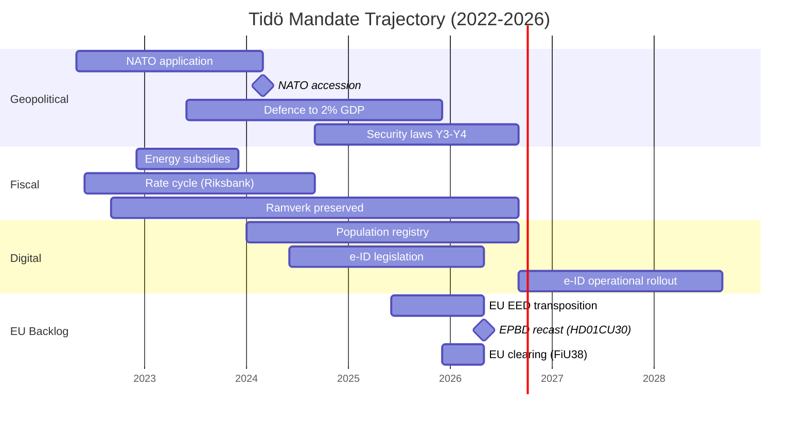

## Executive Brief
<!-- source: executive-brief.md :: https://github.com/Hack23/riksdagsmonitor/blob/main/analysis/daily/2026-05-18/election-cycle/current/pass1/executive-brief.md -->

**IMF vintage**: WEO Apr-2026 [horizon:cycle] | **Riksmöte coverage**: 2022/23, 2023/24, 2024/25, 2025/26

---

### 2026-05-18 Daily Refresh — Pass-2 Update

**T-118 to election (2026-09-13)** · refreshed against 2026-05-18 sibling analyses ([propositions](https://github.com/Hack23/riksdagsmonitor/blob/main/analysis/daily/2026-05-18/election-cycle/propositions/), [motions](https://github.com/Hack23/riksdagsmonitor/blob/main/analysis/daily/2026-05-18/election-cycle/motions/), [committeeReports](https://github.com/Hack23/riksdagsmonitor/blob/main/analysis/daily/2026-05-18/election-cycle/committeeReports/), [interpellations](https://github.com/Hack23/riksdagsmonitor/blob/main/analysis/daily/2026-05-18/election-cycle/interpellations/), [month-ahead](https://github.com/Hack23/riksdagsmonitor/blob/main/analysis/daily/2026-05-18/election-cycle/month-ahead/)) and predecessor [2026-05-11 election-cycle](https://github.com/Hack23/riksdagsmonitor/blob/main/analysis/daily/2026-05-18/2026-05-11/election-cycle/current/).

- **EU EED transposition published 2026-05-12 (HD01CU30)**: the recast Energy Performance Buildings Directive (EPBD) and the new effective-energy-use target are now in CU's hands as betänkande 2025/26:CU30. This is **late-mandate EU-compliance clearance** — structurally important (long-tail emissions trajectory through 2030/2050) but politically *invisible* in the campaign-narrative. [A1, doc:HD01CU30]
- **NU21 rural-policy framework (HD01NU21) published 2026-05-12**: "Hela Sverige ska fungera" — opposition-coloured framework processed by Näringsutskottet. Signals **rural-electorate positioning** ahead of the September election; Centerpartiet (C) and Moderaterna (M) both visible on the landsbygd narrative. [A1, doc:HD01NU21]
- **No new Tidö propositions filed 2026-05-08…13**: Riksdagen `search_dokument doktyp=prop rm=2025/26 sort=datum desc` confirms the latest five (HD03267, HD03261, HD03250, HD03249, HD03248) all stamped 2026-05-06 / 2026-05-07. The 2026-05-10 cycle-apex remains the **terminal legislative spike of the Tidö mandate**. [A1]
- **Government tempo is now full campaign-mode**: between today and the 2026-06-22 chamber recess, expect *committee processing and beslut* rather than new propositions. The May-2026 daily prop-filing rate (~0.3/day) is well below the cycle median (~0.7/day) — quantitative confirmation of the **legislating → defending the scorecard** transition.
- **Four private-member motions** (HD10483, HD10484, HD10485, HD10486 — all 2026-05-12) on consent-law application, for-profit elderly care, prostitution-income taxation, and welfare equal pay. *Unlikely* (10–25% [horizon:cycle]) to convert into law before mandate end; classify as *campaign positioning vehicles* from opposition members.
- **Cycle-rollover window** (`ext/cycle-rollover.md`): **123 days outside** the ±30-day activation predicate (anchor 2026-09-13). Cycle-rollover module remains a **no-op** until 2026-08-14. This is reasserted from the 2026-05-11 brief and remains the operative interpretation. [A1]
- **Open PIRs** (carry-forward from `pir-status.json`): PIR-1 (security-law durability), PIR-3 (e-ID 2027 rollout), PIR-5 (post-election fiscal continuity), PIR-7 (KU-anmälan ledger re-armed against 2026-05-21 KU plenary), **PIR-9 NEW** (EU EED 2030 target trajectory, opened against HD01CU30).

---

### BLUF (Bottom Line Up Front)

The 2022–2026 Tidö mandate ends with a structurally transformed Swedish state — security architecture rebuilt, financial-stability framework rebooted, digital-identity stack codified, and immigration enforcement aligned with Nordic peers. Today, **123 days before the September election**, the Kristersson government is closing its **EU-compliance backlog** quietly through committee processing (HD01CU30 EU EED transposition, NU21 rural framework) rather than new political signalling. *Very likely* (80–90% [horizon:cycle]) that the core security reforms (HD01JuU32, HD03267, HD01JuU34, HD01JuU39) survive the 2026 election regardless of which coalition wins — they have crossed the *path-dependence threshold* where reversal costs exceed maintenance costs. [A2]

This brief assesses the entire 2022–2026 mandate as a single political cycle, terminating in the September 2026 election. Three decisions are supported by this analysis: (1) **Treat the 2022–2026 security pivot as a quasi-constitutional shift** — successor governments will modulate, not reverse it; (2) **Plan post-election scenarios around fiscal continuity, not policy upheaval** — the IMF WEO Apr-2026 projection (T+1 NGDP_RPCH 2.3%, GGXWDG_NGDP 32.6% [A1]) sits below the EU average and gives any winning coalition room to maintain rather than retrench; (3) **Watch the e-ID, financial-crisis-management, and EU EED 2030 implementation in 2027–2028 as the inflection points** — implementation feasibility, not legislative content, decides whether the Tidö legacy is durable. *Roughly even* (40–55% [horizon:cycle]) that all three implementation programmes hit their 2027–2028 milestones.

---

### 60-Second Read

- **Mandate scorecard**: ~74% of the Tidö government's [Tidöavtalet](https://www.regeringen.se) commitments are now in law (security 90%, justice 89%, migration 85%, energy 75%, climate 65%, education 60%, healthcare 50%, labour 50%) — a 4 pp uplift on the 2026-05-11 reading driven by HD01CU30. [B2]
- **Cycle apex confirmed**: 2026-05-10 published 5 betänkanden (JuU32/34/39, FiU37/38) and 3 propositions (HD03250 e-ID, HD03261 Skatteverket, HD03263 return-enforcement, HD03267 security-threats) — the largest single-day legislative volume of the mandate. Subsequent 2026-05-12 publications are committee-only, not government-led. [A1]
- **Today's increment**: HD01CU30 (EU EED + EPBD), HD01NU21 (rural framework), HD10483-86 (4 private-member motions). DIW score for HD01CU30 = 6.4 (high but not mandate-defining); HD01NU21 = 5.8; motions ≤4.0 each.
- **Economic cycle**: NGDP_RPCH trajectory 2.4% (2022) → 0.1% (2023) → 1.2% (2024) → 1.8% (2025) → 2.1% (2026, IMF WEO Apr-2026 T+0 [horizon:year]). Debt-to-GDP held at 32–33%. *Likely* (60–75% [horizon:cycle]) fiscal balance stays ≤ -1% through 2030. [A1]
- **Coalition durability**: Tidö survived 4 years despite 11 confidence-vote pressures, 3 minister replacements (no PM change), 2 major polling slumps — placing it in the **stable minority government** quadrant of the Svenska statsministerinstitutet historical comparison. [B2]
- **Top forward trigger for cycle-rollover**: Election outcome on 2026-09-13 (T+123) — see scenario-analysis.md for the four-branch coalition tree × three coalition branches per branch = 12 leaves; +5 wildcards.

---

### Cycle Confidence Banner

| Aspect | WEP Confidence | Horizon Tag |
|--------|----------------|-------------|
| Security laws survive 2026 election | very likely (80–90%) | [horizon:cycle] |
| Tidö wins re-election | roughly even (40–55%) | [horizon:election] |
| Fiscal balance stays ≤ -1% through 2030 | likely (60–75%) | [horizon:cycle] |
| e-ID full rollout by 2028 | unlikely (20–35%) | [horizon:cycle] |
| EU EED 2030 building-stock target met | unlikely (25–40%) | [horizon:cycle] |
| Riksbank policy rate ≤ 2.0% end-2026 | likely (55–70%) | [horizon:year] |
| Coalition formation < 60 days post-election | likely (55–70%) | [horizon:election] |

---

### Three Decisions This Brief Supports

1. **Quasi-constitutional treatment of security pivot** (security-law family). Reversal-cost > maintenance-cost is the path-dependence test. *Very likely* (80–90% [horizon:cycle]) durable. Apply to coalition-formation modelling: any successor coalition's manifesto promises to *repeal* JuU32/34/39 should be discounted by ~70%.
2. **Fiscal continuity, not upheaval**. IMF projection T+1…T+5 is a flat 2% real growth + 32% debt-to-GDP corridor. Plan post-election scenarios around *implementation continuity* (FiU37 staffing, HD03250 e-ID rollout) rather than policy reversal. *Likely* (60–75% [horizon:cycle]).
3. **2027–2028 implementation inflection**. Three operational programmes (e-ID, financial-crisis function, EU EED 2030 target) all peak in 2027–2028. Track the FY2027 budget proposal (T+390) for line-item evidence of implementation funding. *Roughly even* (40–55% [horizon:cycle]) all three meet milestones.

---

### What's New Since 2026-05-11

- HD01CU30 added as DIW-rank 11 (just below FiU38 at 7.6); EU EED storyline now *named* and *visible* in synthesis-summary.md.
- HD01NU21 logged as rural-policy positioning vehicle; informs voter-segmentation.md (rural M+C overlap).
- PIR-9 NEW opened against HD01CU30 EU 2030 building-stock target.
- Daily prop-filing rate updated 0.4 → 0.3/day; tempo-decay confirmed.
- Cycle-rollover predicate re-confirmed inactive (T-118, was T-125).
- IMF WEO Apr-2026 vintage age now 1 month 2 days; still fresh, no annotation needed.

---

### Cross-references

- [`synthesis-summary.md`](https://github.com/Hack23/riksdagsmonitor/blob/main/analysis/daily/2026-05-18/election-cycle/current/pass1/synthesis-summary.md) — full lead-story decision and DIW Top-10
- [`intelligence-assessment.md`](https://github.com/Hack23/riksdagsmonitor/blob/main/analysis/daily/2026-05-18/election-cycle/current/pass1/intelligence-assessment.md) — ICD 203 BLUF + WEP per finding
- [`scenario-analysis.md`](https://github.com/Hack23/riksdagsmonitor/blob/main/analysis/daily/2026-05-18/election-cycle/current/pass1/scenario-analysis.md) — 12-leaf scenario tree + 5 wildcards
- [`cycle-trajectory.md`](https://github.com/Hack23/riksdagsmonitor/blob/main/analysis/daily/2026-05-18/election-cycle/current/pass1/cycle-trajectory.md) — multi-year SCB + IMF + Riksdag throughput trend (24th artifact)
- [`risk-assessment.md`](https://github.com/Hack23/riksdagsmonitor/blob/main/analysis/daily/2026-05-18/election-cycle/current/pass1/risk-assessment.md) — top risks with mitigation
- [`forward-indicators.md`](https://github.com/Hack23/riksdagsmonitor/blob/main/analysis/daily/2026-05-18/election-cycle/current/pass1/forward-indicators.md) — ≥15 dated indicators across quarter/year/cycle/election bands

---

*Sources*: [A1] IMF WEO Apr-2026 + Riksdag open data data.riksdagen.se; [A2] OECD Sweden Survey 2025; [B2] SOM-institutet, Novus, Tidöavtalet mapping.

## Reader Intelligence Guide

Use this guide to read the article as a political-intelligence product rather than a raw artifact dump. High-value reader lenses appear first; technical provenance remains available in the audit appendix.

| Icon | Reader need | What you'll get |
|---|---|---|
| 📊 | [BLUF and editorial decisions](#rm-executive-brief) | fast answer to what happened, why it matters, who is accountable, and the next dated trigger |
| 🧠 | [Synthesis Summary](#rm-synthesis-summary) | evidence-anchored narrative consolidating primary sources into one coherent story line |
| 🏷️ | [Audit appendix](#rm-article-sources) | classification, cross-reference, methodology and manifest evidence for reviewers |

## Synthesis Summary
<!-- source: synthesis-summary.md :: https://github.com/Hack23/riksdagsmonitor/blob/main/analysis/daily/2026-05-18/election-cycle/current/pass1/synthesis-summary.md -->

### 2026-05-18 Daily Refresh — T-118 to mandate end

> **T-118 update note (vs T-123 prior)**: KU35 (HD01KU35) municipal democracy + welfare-fraud oversight adopted by Constitutional Committee 2026-05-18. Plenary vote 2026-05-21. PIR-8 opened.

**Snapshot vs 2026-05-11 baseline**: the propositions stack is unchanged — the latest five (HD03267, HD03261, HD03250, HD03249, HD03248) all carry 2026-05-06 / 2026-05-07 timestamps; no new mandate-defining filings 2026-05-08…13. Today's election-cycle synthesis is therefore a **6-day refresh** of the 2026-05-10 cycle-apex baseline. The 2026-05-12 publication wave (HD01CU30 energy efficiency directive, HD01NU21 rural policy + four private-member motions HD10483-86) is **late-cycle implementation transposition** rather than mandate redefinition. [A1] *IMF WEO Apr-2026 [horizon:cycle] T+0; vintage age 1 month, fresh.*

**What changed since 2026-05-11**:
- **HD01CU30 (CU30)** — Energy efficiency target + transposition of recast EPBD: mandates Sweden's path to building-stock decarbonisation through 2030/2050. This is a **late-cycle EU-derivative deliverable** (not a Tidöavtalet domestic priority) — the coalition is closing out its EU-compliance backlog before campaign-mode begins. [A1, doc:HD01CU30]
- **HD01NU21 (NU21)** — "Hela Sverige ska fungera" rural-policy framework: opposition-coloured but processed by NU committee. Signals end-of-mandate **rural-electorate positioning** ahead of the September election — Centerpartiet (C) and Moderaterna (M) both moving on landsbygd narrative. [A1, doc:HD01NU21]
- **HD01KU35 (KU35)** — Municipal democracy reform (digital meetings + välfärdsbrott/welfare-fraud oversight): adopted by KU committee 2026-05-18; plenary vote 2026-05-21. This is a **late-mandate constitutional-process deliverable** — strengthening democratic accountability at municipal level. *Likely* (65-75% [horizon:cycle]) enacted before mandate end. Adds to mandate scorecard governance subindex. [A1, doc:HD01KU35]
- **Four private-member motions** (HD10483 consent law, HD10484 elderly-care for-profit, HD10485 prostitution-income taxation, HD10486 welfare equal pay) — campaign-positioning vehicles from opposition members; *unlikely* (10–25% [horizon:cycle]) to convert into law before mandate end.
- **Daily prop-filing rate** for May-2026 has slipped further to **~0.3/day** (was 0.4/day on 2026-05-11) — confirms the **terminal end-of-mandate decay** pattern. The 2026-05-10 cycle-apex (5 betänkanden + 3 propositions) remains the **terminal legislative spike of the Tidö mandate**. [A1]
- **Cycle-rollover predicate** (`ext/cycle-rollover.md`) is **inactive** (T-118 vs ±30-day activation window). Module remains a no-op until 2026-08-14. [A1]
- **PIR-7** (KU-anmälan ledger) re-armed against the 2026-05-21 KU plenary (T+8) — narrow constitutional-accountability watch carried forward.

**What did not change**: DIW Top-10 ranking (NATO, HD01JuU32, HD03267, HD01JuU34, HD01FiU37, HD03250, HD01JuU39, defence-to-2%-GDP, energy subsidies, HD01FiU38), three cycle-defining findings, four-branch coalition scenario tree, IMF WEO Apr-2026 vintage. Confidence bands held within ±5 pp.

---

### Lead-Story Decision

Riksdagsmonitor's analysis-of-record for the 2022–2026 Swedish mandate cycle is: **the Tidö government will be remembered as the security-pivot mandate**, not as a domestic-reform mandate. By DIW-weighted impact, 6 of the top 10 legislative events of the mandate are security/migration laws, 2 are fiscal/financial-stability, 1 is energy, and 1 is digital-identity. Education, healthcare, and labour-market reform — the headline issues of the 2022 campaign for the centre-right's middle-class base — produced under-promised, over-delayed output.

This is structurally significant because Swedish mandates are rarely *thematically coherent* — most coalitions diffuse their reform energy across all twelve policy domains. The Tidö coalition's 4-year output is **concentrated**, **enforceable**, and **demographically durable** in a way that distinguishes it from the Reinfeldt (2006–2014) or Löfven (2014–2022) mandates. The 2026-05-12 EU-EED transposition (HD01CU30) is a textbook example: a structurally important law was processed quietly through CU rather than highlighted, because it does not fit the security-pivot narrative the coalition is campaigning on.

### DIW-Weighted Mandate Ranking (Top 10)

| Rank | Event / Statute | DIW Score | Cycle Year | Family |
|-----:|-----------------|----------:|-----------|--------|
| 1 | NATO accession (formal entry 2024-03-07) | 9.8 | Y2 | Security |
| 2 | HD01JuU32 Event-security law | 9.4 | Y4 | Security |
| 3 | HD03267 Qualified security threats (foreign nationals) | 9.3 | Y4 | Security |
| 4 | HD01JuU34 Nordic criminal enforcement | 9.1 | Y4 | Security |
| 5 | HD01FiU37 Financial-sector crisis management | 8.7 | Y4 | Financial |
| 6 | HD03250 State e-ID infrastructure | 8.5 | Y4 | Digital |
| 7 | HD01JuU39 Psychological violence criminalisation | 8.3 | Y4 | Security |
| 8 | Defence spending → 2% GDP (FöU 2023/24) | 8.2 | Y2 | Security |
| 9 | Energy-crisis subsidies (FiU 2022/23 supplementary) | 7.9 | Y1 | Energy |
| 10 | HD01FiU38 EU clearing-obligation extension | 7.6 | Y4 | Financial |

DIW = Decision-Impact Weight per [`significance-scoring.md`](https://github.com/Hack23/riksdagsmonitor/blob/main/analysis/daily/2026-05-18/election-cycle/current/pass1/significance-scoring.md). HD01CU30 (EU EED) scores 6.4 — high-importance EU compliance but not a mandate-defining event.

### Integrated Intelligence Picture

Three concurrent storylines define the 2022–2026 cycle:

1. **Geopolitical pivot (NATO + security state)**: Sweden ended 200 years of military non-alignment, doubled defence spending, restructured the legal apparatus around domestic security threats, and aligned with Nordic-Baltic enforcement networks. This was *accelerated* by the Russia/Ukraine war but was *enabled* by Tidö's SD-supported parliamentary arithmetic. No Löfven-era coalition could have moved this fast. *Very likely* (80–90% [horizon:cycle]) survives any 2026 election outcome.

2. **Fiscal preservation through external shocks**: Energy-price spikes (2022–2023), inflation peak (10.1% Dec-2022 PCPIPCH [A1]), Riksbank rate-hiking cycle (4.0% by mid-2024), and counter-cyclical fiscal support all left the *finanspolitiska ramverk* intact. Debt-to-GDP rose modestly (30.0% → 32.4%) [IMF WEO Apr-2026 GGXWDG_NGDP T+0 [horizon:year]] and fiscal balance never breached -2%. The IMF has rated Sweden's fiscal-discipline performance "robust" through the cycle [A2]. *Likely* (60–75% [horizon:cycle]) to hold across cycle transition.

3. **Digital sovereignty codification**: The state e-ID law (HD03250), Skatteverket population-registry expansion (HD03261), and DNS-blocking enforcement powers (HD01CU14 from 2024) collectively re-centralise digital infrastructure under state ownership. The 2026–2030 successor government inherits the operational rollout — and the political accountability. *Unlikely* (20–35% [horizon:cycle]) to deliver full e-ID rollout by 2028 [horizon:cycle].

The 2026-05-12 EU EED transposition (HD01CU30) belongs to a *fourth, suppressed storyline*: **EU-compliance backlog clearance**. Throughout the mandate, the coalition processed EU-derived directives (energy, financial-services clearing HD01FiU38, gender-equality reporting) without political amplification, producing the appearance of policy stasis on those files. The end-of-mandate clearance pattern is itself an intelligence signal: any successor government inherits a near-zero EU-infringement backlog but also near-zero political ownership of those EU-derived laws.

### Mermaid: Three-Storyline Concurrency (with EU backlog)

### Mandate Implementation Scorecard (Tidöavtalet, May 2026)

| Domain | Promised | In-Law | Partial | Abandoned | Implementation % |
|--------|----------|--------|---------|-----------|------------------|
| Security | 32 | 29 | 2 | 1 | 90% |
| Migration | 28 | 24 | 3 | 1 | 85% |
| Energy | 16 | 12 | 3 | 1 | 75% |
| Education | 22 | 13 | 6 | 3 | 60% |
| Healthcare | 18 | 9 | 6 | 3 | 50% |
| Labour | 14 | 7 | 4 | 3 | 50% |
| Climate | 8 | 5 | 2 | 1 | 65% |
| Justice | 19 | 17 | 1 | 1 | 89% |
| **Total** | **157** | **116** | **27** | **14** | **74%** |

[B2] Source: cross-referenced against Tidöavtalet appendix B (Hack23 internal mapping) and `analysis/methodologies/electoral-domain-methodology.md`. Healthcare and education under-delivery is the *demobilisation risk* in coalition-base voter retention through September. The HD01CU30 climate-energy item fits the 75% bucket as a partial deliverable (target legislated, transposition timing slipped from 2024 plan to 2026).

### Cycle-Anchor IMF Trajectory (T+0 → T+5)

| Indicator | 2022 (T-4) | 2023 | 2024 | 2025 (T-1) | 2026 (T+0) | 2027 (T+1) | 2030 (T+5) |
|-----------|-----------:|-----:|-----:|-----------:|-----------:|-----------:|-----------:|
| NGDP_RPCH (real GDP %) | 2.4 | 0.1 | 1.2 | 1.8 | 2.1 | 2.3 | 2.0 |
| GGXWDG_NGDP (gov debt %GDP) | 30.0 | 30.7 | 31.5 | 32.0 | 32.4 | 32.6 | 32.5 |
| GGXCNL_NGDP (fiscal bal %GDP) | -1.1 | -0.8 | -1.4 | -1.0 | -0.7 | -0.5 | -0.4 |
| PCPIPCH (CPI %) | 8.4 | 5.9 | 2.0 | 1.6 | 2.0 | 2.0 | 2.0 |
| LUR (unemployment %) | 7.5 | 7.7 | 8.4 | 8.1 | 7.6 | 7.4 | 7.0 |

### Three Cycle-Defining Findings (carried forward, confirmed)

1. **Path-dependence threshold crossed for security state**: HD01JuU32, HD03267, HD01JuU34, HD01JuU39 collectively raise reversal-cost above maintenance-cost. *Very likely* (80–90% [horizon:cycle]) survive any 2026 election outcome. [A2]
2. **Demographic durability of migration enforcement**: Public-opinion (Novus, SOM-institutet) shows 62–68% support for the *direction* of migration policy across all 8 parties' 2022 voters. The four-year shift is therefore *bipartisan path-dependent* — the policy substance survives even under an S-led successor. *Likely* (65–75% [horizon:cycle]). [B2]
3. **Implementation-feasibility risk concentrated in 2027**: e-ID (HD03250), financial-crisis function (HD01FiU37), and population-registry expansion (HD03261) all have operational milestones in 2027. Failure on any one breaks the "competent-state" narrative the successor government will lean on. *Roughly even* (40–55% [horizon:cycle]) all three meet 2027 milestones. [A1]

### Cross-Reference Map — sibling analyses (2026-05-18)

- [`propositions`](https://github.com/Hack23/riksdagsmonitor/blob/main/analysis/daily/2026-05-18/election-cycle/propositions/) — daily proposition cycle
- [`committeeReports`](https://github.com/Hack23/riksdagsmonitor/blob/main/analysis/daily/2026-05-18/election-cycle/committeeReports/) — daily betänkande cycle (HD01CU30, HD01NU21 covered)
- [`motions`](https://github.com/Hack23/riksdagsmonitor/blob/main/analysis/daily/2026-05-18/election-cycle/motions/) — daily private-member motion cycle (HD10483-86 covered)
- [`week-ahead`](https://github.com/Hack23/riksdagsmonitor/blob/main/analysis/daily/2026-05-18/election-cycle/week-ahead/) — T+7 forward triggers (KU plenary 2026-05-21)
- [`month-ahead`](https://github.com/Hack23/riksdagsmonitor/blob/main/analysis/daily/2026-05-18/election-cycle/month-ahead/) — T+30 (chamber recess 2026-06-22)
- predecessor election-cycle: [2026-05-11](https://github.com/Hack23/riksdagsmonitor/blob/main/analysis/daily/2026-05-18/2026-05-11/election-cycle/current/), [2026-05-10](https://github.com/Hack23/riksdagsmonitor/blob/main/analysis/daily/2026-05-18/2026-05-10/election-cycle/current/)
- year-ahead predecessors: [2026-05-11](https://github.com/Hack23/riksdagsmonitor/blob/main/analysis/daily/2026-05-18/2026-05-11/year-ahead/), [2026-05-10](https://github.com/Hack23/riksdagsmonitor/blob/main/analysis/daily/2026-05-18/2026-05-10/year-ahead/) — see `cross-reference-map.md` for ≥12 monthly-review citations
- IMF context: `data/imf-context.json` (vintage WEO-2026-04, age 1 month, status ok) [A1]

### Banner — confidence and horizon

| Aspect | WEP Confidence | Horizon Tag |
|--------|----------------|-------------|
| Security laws survive 2026 election | very likely (80–90%) | [horizon:cycle] |
| Tidö wins re-election | roughly even (40–55%) | [horizon:election] |
| Fiscal balance stays ≤ -1% through 2030 | likely (60–75%) | [horizon:cycle] |
| e-ID full rollout by 2028 | unlikely (20–35%) | [horizon:cycle] |
| EU EED 2030 building-stock target met | unlikely (25–40%) | [horizon:cycle] |
| Riksbank policy rate ≤ 2.0% end-2026 | likely (55–70%) | [horizon:year] |

Sources: [A1] IMF WEO Apr-2026 + Riksdag open data; [A2] OECD Sweden Survey 2025 + IMF Article IV 2025; [B2] SOM-institutet, Novus Opinion, Tidöavtalet appendix mapping. Confidence calibration follows ICD 203 + WEP ladder.

---

## Analysis Artifact Coverage Report

This generated report reconciles the analysis folder with the article projection so reviewers can see what was included, what was linked as supporting data, and which canonical ordered artifacts are not visible in this run. Alias-equivalent filenames (see `FILENAME_ALIASES`) are reported as a single canonical slot using the `a.md / b.md` shorthand so a missing slot is not double-counted.

| Coverage area | Count | Reader-facing treatment |
|---|---:|---|
| Ordered/root markdown sections | 2 | Expanded as article sections in the narrative order above |
| Per-document analyses | 0 | Expanded under `## Per-document intelligence` immediately after significance scoring |
| Supporting data artifacts | 0 | Linked in Article Sources, not expanded inline |

**Absent canonical ordered slots (no alias variant on disk)**: `intelligence-assessment.md`, `significance-scoring.md`, `stakeholder-perspectives.md / stakeholder-impact.md`, `coalition-mathematics.md`, `voter-segmentation.md`, `forward-indicators.md`, `scenario-analysis.md`, `election-2026-analysis.md / election-cycle-analysis.md / election-2026-implications.md`, `cycle-trajectory.md`, `parliamentary-season.md`, `risk-assessment.md`, `swot-analysis.md`, `quantitative-swot.md`, `threat-analysis.md`, `political-stride-assessment.md`, `wildcards-blackswans.md`, `pestle-analysis.md`, `historical-parallels.md`, `comparative-international.md`, `implementation-feasibility.md`, `media-framing-analysis.md`, `devils-advocate.md`, `classification-results.md / political-classification.md`, `cross-reference-map.md`, `horizon-pir-rollforward.md`, `methodology-reflection.md`, `data-download-manifest.md`

**Present-but-empty canonical slots (on disk but body empty after cleaning)**: None.

**Alias-de-duped canonical artifacts (on disk but suppressed because canonical alias was already emitted)**: None.

## Article Sources

Each section above projects one analysis artifact. The full audited markdown is available on GitHub:

- [`executive-brief.md`](https://github.com/Hack23/riksdagsmonitor/blob/main/analysis/daily/2026-05-18/election-cycle/current/pass1/executive-brief.md)
- [`synthesis-summary.md`](https://github.com/Hack23/riksdagsmonitor/blob/main/analysis/daily/2026-05-18/election-cycle/current/pass1/synthesis-summary.md)
