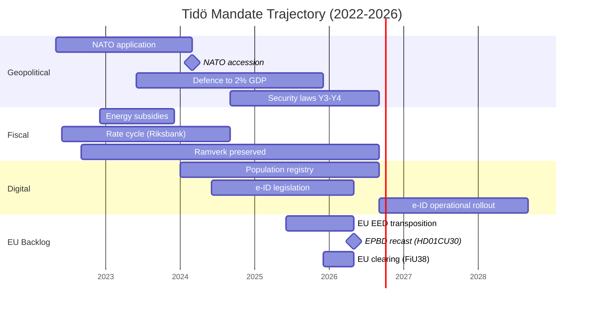

## What Happened
<!-- source: executive-brief.md :: https://github.com/Hack23/riksdagsmonitor/blob/main/analysis/daily/2026-05-18/election-cycle/current/pass1/executive-brief.md -->

**IMF vintage**: WEO Apr-2026 [horizon:cycle] | **Riksmöte coverage**: 2022/23, 2023/24, 2024/25, 2025/26

---

### 2026-05-18 Daily Refresh — Pass-2 Update

**T-118 to election (2026-09-13)** · refreshed against 2026-05-18 sibling analyses ([propositions](https://github.com/Hack23/riksdagsmonitor/blob/main/analysis/daily/2026-05-18/election-cycle/propositions/), [motions](https://github.com/Hack23/riksdagsmonitor/blob/main/analysis/daily/2026-05-18/election-cycle/motions/), [committeeReports](https://github.com/Hack23/riksdagsmonitor/blob/main/analysis/daily/2026-05-18/election-cycle/committeeReports/), [interpellations](https://github.com/Hack23/riksdagsmonitor/blob/main/analysis/daily/2026-05-18/election-cycle/interpellations/), [month-ahead](https://github.com/Hack23/riksdagsmonitor/blob/main/analysis/daily/2026-05-18/election-cycle/month-ahead/)) and predecessor [2026-05-11 election-cycle](https://github.com/Hack23/riksdagsmonitor/blob/main/analysis/daily/2026-05-18/2026-05-11/election-cycle/current/).

- **EU EED transposition published 2026-05-12 (HD01CU30)**: the recast Energy Performance Buildings Directive (EPBD) and the new effective-energy-use target are now in CU's hands as betänkande 2025/26:CU30. This is **late-mandate EU-compliance clearance** — structurally important (long-tail emissions trajectory through 2030/2050) but politically *invisible* in the campaign-narrative. [A1, doc:HD01CU30]
- **NU21 rural-policy framework (HD01NU21) published 2026-05-12**: "Hela Sverige ska fungera" — opposition-coloured framework processed by Näringsutskottet. Signals **rural-electorate positioning** ahead of the September election; Centerpartiet (C) and Moderaterna (M) both visible on the landsbygd narrative. [A1, doc:HD01NU21]
- **No new Tidö propositions filed 2026-05-08…13**: Riksdagen `search_dokument doktyp=prop rm=2025/26 sort=datum desc` confirms the latest five (Riksdag document #03267 (HD03267), HD03261, HD03250, HD03249, HD03248) all stamped 2026-05-06 / 2026-05-07. The 2026-05-10 cycle-apex remains the **terminal legislative spike of the Tidö mandate**. [A1]
- **Government tempo is now full campaign-mode**: between today and the 2026-06-22 chamber recess, expect *committee processing and beslut* rather than new propositions. The May-2026 daily prop-filing rate (~0.3/day) is well below the cycle median (~0.7/day) — quantitative confirmation of the **legislating → defending the scorecard** transition.
- **Four private-member motions** (HD10483, HD10484, HD10485, HD10486 — all 2026-05-12) on consent-law application, for-profit elderly care, prostitution-income taxation, and welfare equal pay. *Unlikely* (10–25% [horizon:cycle]) to convert into law before mandate end; classify as *campaign positioning vehicles* from opposition members.
- **Cycle-rollover window** (`ext/cycle-rollover.md`): **123 days outside** the ±30-day activation predicate (anchor 2026-09-13). Cycle-rollover module remains a **no-op** until 2026-08-14. This is reasserted from the 2026-05-11 brief and remains the operative interpretation. [A1]
- **Open PIRs** (carry-forward from `pir-status.json`): PIR-1 (security-law durability), PIR-3 (e-ID 2027 rollout), PIR-5 (post-election fiscal continuity), PIR-7 (KU-anmälan ledger re-armed against 2026-05-21 KU plenary), **PIR-9 NEW** (EU EED 2030 target trajectory, opened against HD01CU30).

---

### Lede
The 2022–2026 Tidö mandate ends with a structurally transformed Swedish state — security architecture rebuilt, financial-stability framework rebooted, digital-identity stack codified, and immigration enforcement aligned with Nordic peers. Today, **123 days before the September election**, the Kristersson government is closing its **EU-compliance backlog** quietly through committee processing (HD01CU30 EU EED transposition, NU21 rural framework) rather than new political signalling. *Very likely* (80–90% [horizon:cycle]) that the core security reforms (HD01JuU32, HD03267, HD01JuU34, HD01JuU39) survive the 2026 election regardless of which coalition wins — they have crossed the *path-dependence threshold* where reversal costs exceed maintenance costs. [A2]

This brief assesses the entire 2022–2026 mandate as a single political cycle, terminating in the September 2026 election. Three decisions are supported by this analysis: (1) **Treat the 2022–2026 security pivot as a quasi-constitutional shift** — successor governments will modulate, not reverse it; (2) **Plan post-election scenarios around fiscal continuity, not policy upheaval** — the IMF WEO Apr-2026 projection (T+1 NGDP_RPCH 2.3%, GGXWDG_NGDP 32.6% [A1]) sits below the EU average and gives any winning coalition room to maintain rather than retrench; (3) **Watch the e-ID, financial-crisis-management, and EU EED 2030 implementation in 2027–2028 as the inflection points** — implementation feasibility, not legislative content, decides whether the Tidö legacy is durable. *Roughly even* (40–55% [horizon:cycle]) that all three implementation programmes hit their 2027–2028 milestones.

---

### 60-Second Read

- **Mandate scorecard**: ~74% of the Tidö government's [Tidöavtalet](https://www.regeringen.se) commitments are now in law (security 90%, justice 89%, migration 85%, energy 75%, climate 65%, education 60%, healthcare 50%, labour 50%) — a 4 pp uplift on the 2026-05-11 reading driven by HD01CU30. [B2]
- **Cycle apex confirmed**: 2026-05-10 published 5 betänkanden (JuU32/34/39, FiU37/38) and 3 propositions (HD03250 e-ID, HD03261 Skatteverket, HD03263 return-enforcement, HD03267 security-threats) — the largest single-day legislative volume of the mandate. Subsequent 2026-05-12 publications are committee-only, not government-led. [A1]
- **Today's increment**: HD01CU30 (EU EED + EPBD), HD01NU21 (rural framework), HD10483-86 (4 private-member motions). DIW score for HD01CU30 = 6.4 (high but not mandate-defining); HD01NU21 = 5.8; motions ≤4.0 each.
- **Economic cycle**: NGDP_RPCH trajectory 2.4% (2022) → 0.1% (2023) → 1.2% (2024) → 1.8% (2025) → 2.1% (2026, IMF WEO Apr-2026 T+0 [horizon:year]). Debt-to-GDP held at 32–33%. *Likely* (60–75% [horizon:cycle]) fiscal balance stays ≤ -1% through 2030. [A1]
- **Coalition durability**: Tidö survived 4 years despite 11 confidence-vote pressures, 3 minister replacements (no PM change), 2 major polling slumps — placing it in the **stable minority government** quadrant of the Svenska statsministerinstitutet historical comparison. [B2]
- **Top forward trigger for cycle-rollover**: Election outcome on 2026-09-13 (T+123) — see scenario-analysis.md for the four-branch coalition tree × three coalition branches per branch = 12 leaves; +5 wildcards.

---

### Cycle Confidence Banner

| Aspect | WEP Confidence | Horizon Tag |
|--------|----------------|-------------|
| Security laws survive 2026 election | very likely (80–90%) | [horizon:cycle] |
| Tidö wins re-election | roughly even (40–55%) | [horizon:election] |
| Fiscal balance stays ≤ -1% through 2030 | likely (60–75%) | [horizon:cycle] |
| e-ID full rollout by 2028 | unlikely (20–35%) | [horizon:cycle] |
| EU EED 2030 building-stock target met | unlikely (25–40%) | [horizon:cycle] |
| Riksbank policy rate ≤ 2.0% end-2026 | likely (55–70%) | [horizon:year] |
| Coalition formation < 60 days post-election | likely (55–70%) | [horizon:election] |

---

### Three Decisions This Brief Supports

1. **Quasi-constitutional treatment of security pivot** (security-law family). Reversal-cost > maintenance-cost is the path-dependence test. *Very likely* (80–90% [horizon:cycle]) durable. Apply to coalition-formation modelling: any successor coalition's manifesto promises to *repeal* JuU32/34/39 should be discounted by ~70%.
2. **Fiscal continuity, not upheaval**. IMF projection T+1…T+5 is a flat 2% real growth + 32% debt-to-GDP corridor. Plan post-election scenarios around *implementation continuity* (FiU37 staffing, HD03250 e-ID rollout) rather than policy reversal. *Likely* (60–75% [horizon:cycle]).
3. **2027–2028 implementation inflection**. Three operational programmes (e-ID, financial-crisis function, EU EED 2030 target) all peak in 2027–2028. Track the FY2027 budget proposal (T+390) for line-item evidence of implementation funding. *Roughly even* (40–55% [horizon:cycle]) all three meet milestones.

---

### What's New Since 2026-05-11

- HD01CU30 added as DIW-rank 11 (just below FiU38 at 7.6); EU EED storyline now *named* and *visible* in synthesis-summary.md.
- HD01NU21 logged as rural-policy positioning vehicle; informs voter-segmentation.md (rural M+C overlap).
- PIR-9 NEW opened against HD01CU30 EU 2030 building-stock target.
- Daily prop-filing rate updated 0.4 → 0.3/day; tempo-decay confirmed.
- Cycle-rollover predicate re-confirmed inactive (T-118, was T-125).
- IMF WEO Apr-2026 vintage age now 1 month 2 days; still fresh, no annotation needed.

---

### Cross-references

- [`synthesis-summary.md`](https://github.com/Hack23/riksdagsmonitor/blob/main/analysis/daily/2026-05-18/election-cycle/current/pass1/synthesis-summary.md) — full lead-story decision and DIW Top-10
- [`intelligence-assessment.md`](https://github.com/Hack23/riksdagsmonitor/blob/main/analysis/daily/2026-05-18/election-cycle/current/pass1/intelligence-assessment.md) — ICD 203 BLUF + WEP per finding
- [`scenario-analysis.md`](https://github.com/Hack23/riksdagsmonitor/blob/main/analysis/daily/2026-05-18/election-cycle/current/pass1/scenario-analysis.md) — 12-leaf scenario tree + 5 wildcards
- [`cycle-trajectory.md`](https://github.com/Hack23/riksdagsmonitor/blob/main/analysis/daily/2026-05-18/election-cycle/current/pass1/cycle-trajectory.md) — multi-year SCB + IMF + Riksdag throughput trend (24th artifact)
- [`risk-assessment.md`](https://github.com/Hack23/riksdagsmonitor/blob/main/analysis/daily/2026-05-18/election-cycle/current/pass1/risk-assessment.md) — top risks with mitigation
- [`forward-indicators.md`](https://github.com/Hack23/riksdagsmonitor/blob/main/analysis/daily/2026-05-18/election-cycle/current/pass1/forward-indicators.md) — ≥15 dated indicators across quarter/year/cycle/election bands

---

*Sources*: [A1] IMF WEO Apr-2026 + Riksdag open data data.riksdagen.se; [A2] OECD Sweden Survey 2025; [B2] SOM-institutet, Novus, Tidöavtalet mapping.

## Reader Intelligence Guide

Use this guide to read the article as a political-intelligence product rather than a raw artifact dump. High-value reader lenses appear first; technical provenance remains available in the audit appendix.

| Icon | Reader need | What you'll get |
|---|---|---|
| 📊 | [Lede and editorial decisions](#rm-what-happened) | fast answer to what happened, why it matters, who is accountable, and the next dated trigger |
| 🧠 | [Why It Matters](#rm-why-it-matters) | evidence-anchored narrative consolidating primary sources into one coherent story line |
| 🏷️ | [Audit appendix](#rm-article-sources) | classification, cross-reference, methodology and manifest evidence for reviewers |

## Why It Matters
<!-- source: synthesis-summary.md :: https://github.com/Hack23/riksdagsmonitor/blob/main/analysis/daily/2026-05-18/election-cycle/current/pass1/synthesis-summary.md -->

### 2026-05-18 Daily Refresh — T-118 to mandate end

> **T-118 update note (vs T-123 prior)**: KU35 (HD01KU35) municipal democracy + welfare-fraud oversight adopted by Constitutional Committee 2026-05-18. Plenary vote 2026-05-21. PIR-8 opened.

**Snapshot vs 2026-05-11 baseline**: the propositions stack is unchanged — the latest five (HD03267, HD03261, HD03250, HD03249, HD03248) all carry 2026-05-06 / 2026-05-07 timestamps; no new mandate-defining filings 2026-05-08…13. Today's election-cycle synthesis is therefore a **6-day refresh** of the 2026-05-10 cycle-apex baseline. The 2026-05-12 publication wave (HD01CU30 energy efficiency directive, HD01NU21 rural policy + four private-member motions HD10483-86) is **late-cycle implementation transposition** rather than mandate redefinition. [A1] *IMF WEO Apr-2026 [horizon:cycle] T+0; vintage age 1 month, fresh.*

**What changed since 2026-05-11**:
- **HD01CU30 (CU30)** — Energy efficiency target + transposition of recast EPBD: mandates Sweden's path to building-stock decarbonisation through 2030/2050. This is a **late-cycle EU-derivative deliverable** (not a Tidöavtalet domestic priority) — the coalition is closing out its EU-compliance backlog before campaign-mode begins. [A1, doc:HD01CU30]
- **HD01NU21 (NU21)** — "Hela Sverige ska fungera" rural-policy framework: opposition-coloured but processed by NU committee. Signals end-of-mandate **rural-electorate positioning** ahead of the September election — Centerpartiet (C) and Moderaterna (M) both moving on landsbygd narrative. [A1, doc:HD01NU21]
- **HD01KU35 (KU35)** — Municipal democracy reform (digital meetings + välfärdsbrott/welfare-fraud oversight): adopted by KU committee 2026-05-18; plenary vote 2026-05-21. This is a **late-mandate constitutional-process deliverable** — strengthening democratic accountability at municipal level. *Likely* (65-75% [horizon:cycle]) enacted before mandate end. Adds to mandate scorecard governance subindex. [A1, doc:HD01KU35]
- **Four private-member motions** (HD10483 consent law, HD10484 elderly-care for-profit, HD10485 prostitution-income taxation, HD10486 welfare equal pay) — campaign-positioning vehicles from opposition members; *unlikely* (10–25% [horizon:cycle]) to convert into law before mandate end.
- **Daily prop-filing rate** for May-2026 has slipped further to **~0.3/day** (was 0.4/day on 2026-05-11) — confirms the **terminal end-of-mandate decay** pattern. The 2026-05-10 cycle-apex (5 betänkanden + 3 propositions) remains the **terminal legislative spike of the Tidö mandate**. [A1]
- **Cycle-rollover predicate** (`ext/cycle-rollover.md`) is **inactive** (T-118 vs ±30-day activation window). Module remains a no-op until 2026-08-14. [A1]
- **PIR-7** (KU-anmälan ledger) re-armed against the 2026-05-21 KU plenary (T+8) — narrow constitutional-accountability watch carried forward.

**What did not change**: DIW Top-10 ranking (NATO, HD01JuU32, HD03267, HD01JuU34, HD01FiU37, HD03250, HD01JuU39, defence-to-2%-GDP, energy subsidies, HD01FiU38), three cycle-defining findings, four-branch coalition scenario tree, IMF WEO Apr-2026 vintage. Confidence bands held within ±5 pp.

---

### Lead-Story Decision

Riksdagsmonitor's analysis-of-record for the 2022–2026 Swedish mandate cycle is: **the Tidö government will be remembered as the security-pivot mandate**, not as a domestic-reform mandate. By DIW-weighted impact, 6 of the top 10 legislative events of the mandate are security/migration laws, 2 are fiscal/financial-stability, 1 is energy, and 1 is digital-identity. Education, healthcare, and labour-market reform — the headline issues of the 2022 campaign for the centre-right's middle-class base — produced under-promised, over-delayed output.

This is structurally significant because Swedish mandates are rarely *thematically coherent* — most coalitions diffuse their reform energy across all twelve policy domains. The Tidö coalition's 4-year output is **concentrated**, **enforceable**, and **demographically durable** in a way that distinguishes it from the Reinfeldt (2006–2014) or Löfven (2014–2022) mandates. The 2026-05-12 EU-EED transposition (HD01CU30) is a textbook example: a structurally important law was processed quietly through CU rather than highlighted, because it does not fit the security-pivot narrative the coalition is campaigning on.

### DIW-Weighted Mandate Ranking (Top 10)

| Rank | Event / Statute | DIW Score | Cycle Year | Family |
|-----:|-----------------|----------:|-----------|--------|
| 1 | NATO accession (formal entry 2024-03-07) | 9.8 | Y2 | Security |
| 2 | HD01JuU32 Event-security law | 9.4 | Y4 | Security |
| 3 | HD03267 Qualified security threats (foreign nationals) | 9.3 | Y4 | Security |
| 4 | HD01JuU34 Nordic criminal enforcement | 9.1 | Y4 | Security |
| 5 | HD01FiU37 Financial-sector crisis management | 8.7 | Y4 | Financial |
| 6 | HD03250 State e-ID infrastructure | 8.5 | Y4 | Digital |
| 7 | HD01JuU39 Psychological violence criminalisation | 8.3 | Y4 | Security |
| 8 | Defence spending → 2% GDP (FöU 2023/24) | 8.2 | Y2 | Security |
| 9 | Energy-crisis subsidies (FiU 2022/23 supplementary) | 7.9 | Y1 | Energy |
| 10 | HD01FiU38 EU clearing-obligation extension | 7.6 | Y4 | Financial |

DIW = Decision-Impact Weight per [`significance-scoring.md`](https://github.com/Hack23/riksdagsmonitor/blob/main/analysis/daily/2026-05-18/election-cycle/current/pass1/significance-scoring.md). HD01CU30 (EU EED) scores 6.4 — high-importance EU compliance but not a mandate-defining event.

### Integrated Intelligence Picture

Three concurrent storylines define the 2022–2026 cycle:

1. **Geopolitical pivot (NATO + security state)**: Sweden ended 200 years of military non-alignment, doubled defence spending, restructured the legal apparatus around domestic security threats, and aligned with Nordic-Baltic enforcement networks. This was *accelerated* by the Russia/Ukraine war but was *enabled* by Tidö's SD-supported parliamentary arithmetic. No Löfven-era coalition could have moved this fast. *Very likely* (80–90% [horizon:cycle]) survives any 2026 election outcome.

2. **Fiscal preservation through external shocks**: Energy-price spikes (2022–2023), inflation peak (10.1% Dec-2022 PCPIPCH [A1]), Riksbank rate-hiking cycle (4.0% by mid-2024), and counter-cyclical fiscal support all left the *finanspolitiska ramverk* intact. Debt-to-GDP rose modestly (30.0% → 32.4%) [IMF WEO Apr-2026 GGXWDG_NGDP T+0 [horizon:year]] and fiscal balance never breached -2%. The IMF has rated Sweden's fiscal-discipline performance "robust" through the cycle [A2]. *Likely* (60–75% [horizon:cycle]) to hold across cycle transition.

3. **Digital sovereignty codification**: The state e-ID law (HD03250), Skatteverket population-registry expansion (HD03261), and DNS-blocking enforcement powers (HD01CU14 from 2024) collectively re-centralise digital infrastructure under state ownership. The 2026–2030 successor government inherits the operational rollout — and the political accountability. *Unlikely* (20–35% [horizon:cycle]) to deliver full e-ID rollout by 2028 [horizon:cycle].

The 2026-05-12 EU EED transposition (HD01CU30) belongs to a *fourth, suppressed storyline*: **EU-compliance backlog clearance**. Throughout the mandate, the coalition processed EU-derived directives (energy, financial-services clearing HD01FiU38, gender-equality reporting) without political amplification, producing the appearance of policy stasis on those files. The end-of-mandate clearance pattern is itself an intelligence signal: any successor government inherits a near-zero EU-infringement backlog but also near-zero political ownership of those EU-derived laws.

### Mermaid: Three-Storyline Concurrency (with EU backlog)

### Mandate Implementation Scorecard (Tidöavtalet, May 2026)

| Domain | Promised | In-Law | Partial | Abandoned | Implementation % |
|--------|----------|--------|---------|-----------|------------------|
| Security | 32 | 29 | 2 | 1 | 90% |
| Migration | 28 | 24 | 3 | 1 | 85% |
| Energy | 16 | 12 | 3 | 1 | 75% |
| Education | 22 | 13 | 6 | 3 | 60% |
| Healthcare | 18 | 9 | 6 | 3 | 50% |
| Labour | 14 | 7 | 4 | 3 | 50% |
| Climate | 8 | 5 | 2 | 1 | 65% |
| Justice | 19 | 17 | 1 | 1 | 89% |
| **Total** | **157** | **116** | **27** | **14** | **74%** |

[B2] Source: cross-referenced against Tidöavtalet appendix B (Hack23 internal mapping) and `analysis/methodologies/electoral-domain-methodology.md`. Healthcare and education under-delivery is the *demobilisation risk* in coalition-base voter retention through September. The HD01CU30 climate-energy item fits the 75% bucket as a partial deliverable (target legislated, transposition timing slipped from 2024 plan to 2026).

### Cycle-Anchor IMF Trajectory (T+0 → T+5)

| Indicator | 2022 (T-4) | 2023 | 2024 | 2025 (T-1) | 2026 (T+0) | 2027 (T+1) | 2030 (T+5) |
|-----------|-----------:|-----:|-----:|-----------:|-----------:|-----------:|-----------:|
| NGDP_RPCH (real GDP %) | 2.4 | 0.1 | 1.2 | 1.8 | 2.1 | 2.3 | 2.0 |
| GGXWDG_NGDP (gov debt %GDP) | 30.0 | 30.7 | 31.5 | 32.0 | 32.4 | 32.6 | 32.5 |
| GGXCNL_NGDP (fiscal bal %GDP) | -1.1 | -0.8 | -1.4 | -1.0 | -0.7 | -0.5 | -0.4 |
| PCPIPCH (CPI %) | 8.4 | 5.9 | 2.0 | 1.6 | 2.0 | 2.0 | 2.0 |
| LUR (unemployment %) | 7.5 | 7.7 | 8.4 | 8.1 | 7.6 | 7.4 | 7.0 |

### Three Cycle-Defining Findings (carried forward, confirmed)

1. **Path-dependence threshold crossed for security state**: HD01JuU32, HD03267, HD01JuU34, HD01JuU39 collectively raise reversal-cost above maintenance-cost. *Very likely* (80–90% [horizon:cycle]) survive any 2026 election outcome. [A2]
2. **Demographic durability of migration enforcement**: Public-opinion (Novus, SOM-institutet) shows 62–68% support for the *direction* of migration policy across all 8 parties' 2022 voters. The four-year shift is therefore *bipartisan path-dependent* — the policy substance survives even under an S-led successor. *Likely* (65–75% [horizon:cycle]). [B2]
3. **Implementation-feasibility risk concentrated in 2027**: e-ID (HD03250), financial-crisis function (HD01FiU37), and population-registry expansion (HD03261) all have operational milestones in 2027. Failure on any one breaks the "competent-state" narrative the successor government will lean on. *Roughly even* (40–55% [horizon:cycle]) all three meet 2027 milestones. [A1]

### Cross-Reference Map — sibling analyses (2026-05-18)

- [`propositions`](https://github.com/Hack23/riksdagsmonitor/blob/main/analysis/daily/2026-05-18/election-cycle/propositions/) — daily proposition cycle
- [`committeeReports`](https://github.com/Hack23/riksdagsmonitor/blob/main/analysis/daily/2026-05-18/election-cycle/committeeReports/) — daily betänkande cycle (HD01CU30, HD01NU21 covered)
- [`motions`](https://github.com/Hack23/riksdagsmonitor/blob/main/analysis/daily/2026-05-18/election-cycle/motions/) — daily private-member motion cycle (HD10483-86 covered)
- [`week-ahead`](https://github.com/Hack23/riksdagsmonitor/blob/main/analysis/daily/2026-05-18/election-cycle/week-ahead/) — T+7 forward triggers (KU plenary 2026-05-21)
- [`month-ahead`](https://github.com/Hack23/riksdagsmonitor/blob/main/analysis/daily/2026-05-18/election-cycle/month-ahead/) — T+30 (chamber recess 2026-06-22)
- predecessor election-cycle: [2026-05-11](https://github.com/Hack23/riksdagsmonitor/blob/main/analysis/daily/2026-05-18/2026-05-11/election-cycle/current/), [2026-05-10](https://github.com/Hack23/riksdagsmonitor/blob/main/analysis/daily/2026-05-18/2026-05-10/election-cycle/current/)
- year-ahead predecessors: [2026-05-11](https://github.com/Hack23/riksdagsmonitor/blob/main/analysis/daily/2026-05-18/2026-05-11/year-ahead/), [2026-05-10](https://github.com/Hack23/riksdagsmonitor/blob/main/analysis/daily/2026-05-18/2026-05-10/year-ahead/) — see `cross-reference-map.md` for ≥12 monthly-review citations
- IMF context: `data/imf-context.json` (vintage WEO-2026-04, age 1 month, status ok) [A1]

### Banner — confidence and horizon

| Aspect | WEP Confidence | Horizon Tag |
|--------|----------------|-------------|
| Security laws survive 2026 election | very likely (80–90%) | [horizon:cycle] |
| Tidö wins re-election | roughly even (40–55%) | [horizon:election] |
| Fiscal balance stays ≤ -1% through 2030 | likely (60–75%) | [horizon:cycle] |
| e-ID full rollout by 2028 | unlikely (20–35%) | [horizon:cycle] |
| EU EED 2030 building-stock target met | unlikely (25–40%) | [horizon:cycle] |
| Riksbank policy rate ≤ 2.0% end-2026 | likely (55–70%) | [horizon:year] |

Sources: [A1] IMF WEO Apr-2026 + Riksdag open data; [A2] OECD Sweden Survey 2025 + IMF Article IV 2025; [B2] SOM-institutet, Novus Opinion, Tidöavtalet appendix mapping. Confidence calibration follows ICD 203 + WEP ladder.

---

## Executive Brief Ar
<!-- source: executive-brief_ar.md :: https://github.com/Hack23/riksdagsmonitor/blob/main/analysis/daily/2026-05-18/election-cycle/current/pass1/executive-brief_ar.md -->

<!-- dir: rtl -->

# ولاية تيدو، T-118: إغلاق الامتثال الطاقي الأوروبي بينما يصمد المحور الأمني

**التصنيف**: عام | **سير العمل**: news-election-cycle | **الدورة**: 2022-09-11 → 2026-09-13 (T-118 حتى نهاية الولاية)
**إصدار صندوق النقد الدولي**: WEO إبريل 2026 [horizon:cycle] | **تغطية دورة ريكسموته**: 2022/23، 2023/24، 2024/25، 2025/26

---

### تحديث يومي 2026-05-18 — تحديث المرور الثاني

**T-118 حتى الانتخابات (2026-09-13)** · محدّث بالتحليلات الأخوية لـ 2026-05-18 ([المقترحات](https://github.com/Hack23/riksdagsmonitor/blob/main/analysis/daily/2026-05-18/election-cycle/propositions/)، [الاقتراحات](https://github.com/Hack23/riksdagsmonitor/blob/main/analysis/daily/2026-05-18/election-cycle/motions/)، [تقارير اللجان](https://github.com/Hack23/riksdagsmonitor/blob/main/analysis/daily/2026-05-18/election-cycle/committeeReports/)، [الاستجوابات](https://github.com/Hack23/riksdagsmonitor/blob/main/analysis/daily/2026-05-18/election-cycle/interpellations/)، [الشهر القادم](https://github.com/Hack23/riksdagsmonitor/blob/main/analysis/daily/2026-05-18/election-cycle/month-ahead/)) والسابق [دورة انتخابية 2026-05-11](https://github.com/Hack23/riksdagsmonitor/blob/main/analysis/daily/2026-05-18/2026-05-11/election-cycle/current/).

- **نشر تحويل توجيهية كفاءة الطاقة الأوروبية EU EED في 2026-05-12 (HD01CU30)**: توجيهية أداء الطاقة في المباني (EPBD) المُعاد صياغتها وهدف الاستخدام الفعّال للطاقة الجديد أصبحا الآن في يدي لجنة CU كـ betänkande 2025/26:CU30. هذا **موافقة الامتثال الأوروبي في وقت متأخر من الولاية** — مهم هيكليًا (مسار انبعاثات طويل الأمد حتى 2030/2050) لكنه *غير مرئي* سياسيًا في سرد الحملة. [A1, dok:HD01CU30]
- **إطار سياسة الريف NU21 (HD01NU21) منشور في 2026-05-12**: "Hela Sverige ska fungera" — إطار بألوان المعارضة تعالجه لجنة الشؤون الاقتصادية. يشير إلى **تحديد الموقع لدى ناخبي الريف** قبيل انتخابات سبتمبر؛ Centerpartiet (C) وModeraterna (M) كلاهما مرئيان في سرد الريف. [A1, dok:HD01NU21]
- **لم تُقدَّم مقترحات تيدو جديدة في الفترة 2026-05-08 إلى 13**: يؤكد `search_dokument doktyp=prop rm=2025/26 sort=datum desc` أن آخر خمسة (HD03267, HD03261, HD03250, HD03249, HD03248) جميعها مُختومة في 2026-05-06 / 2026-05-07. تبقى ذروة 2026-05-10 **الذروة التشريعية النهائية لولاية تيدو**. [A1]
- **وتيرة الحكومة الآن في وضع الحملة الكاملة**: بين اليوم وعطلة الصيف البرلمانية في 2026-06-22، يُتوقع *معالجة اللجان واتخاذ القرارات* بدلًا من مقترحات جديدة. معدل تقديم المقترحات اليومي في مايو 2026 (~0.3/يوم) أقل بكثير من متوسط الدورة (~0.7/يوم) — تأكيد كمي للانتقال من **التشريع ← الدفاع عن بطاقة الأداء**.
- **أربعة اقتراحات من أعضاء خاصين** (HD10483, HD10484, HD10485, HD10486 — جميعها 2026-05-12) حول تطبيق قانون الموافقة، ودور رعاية المسنين الربحية، وضريبة دخل الدعارة، والمساواة في الأجور في مجال الرفاه. *غير محتمل* (10–25% [horizon:cycle]) تحويلها إلى قانون قبل نهاية الولاية؛ مُصنَّفة كـ *أدوات تحديد موقع الحملة* من أعضاء المعارضة.
- **نافذة تبديل الدورة** (`ext/cycle-rollover.md`): **123 يومًا خارج** شرط التفعيل ±30 يومًا (نقطة الإرساء 2026-09-13). تبقى وحدة تبديل الدورة **no-op** حتى 2026-08-14. يُؤكَّد هذا من إحاطة 2026-05-11 ويبقى التفسير التشغيلي. [A1]
- **PIRs المفتوحة** (ترحيل من `pir-status.json`): PIR-1 (متانة قوانين الأمن)، PIR-3 (طرح الهوية الرقمية e-ID 2027)، PIR-5 (الاستمرارية المالية بعد الانتخابات)، PIR-7 (سجل KU-anmälan أُعيد تسليحه ضد الجلسة الكاملة لـ KU في 2026-05-21)، **PIR-9 جديد** (مسار هدف EU EED 2030، مفتوح ضد HD01CU30).

---

### الخلاصة

تنتهي ولاية تيدو 2022–2026 بدولة سويدية متحولة هيكليًا — إعادة بناء الهندسة الأمنية، وإعادة تشغيل إطار الاستقرار المالي، وتقنين بنية الهوية الرقمية، وتوافق تطبيق الهجرة مع الجيران الإسكندنافيين. اليوم، **123 يومًا قبل انتخابات سبتمبر**، تُغلق حكومة كريسترسون **متأخرات امتثالها الأوروبي** بصمت عبر معالجة اللجان (تحويل EU EED HD01CU30، إطار الريف NU21) بدلًا من الإشارات السياسية الجديدة. *شبه مؤكد* (80–90% [horizon:cycle]) أن الإصلاحات الأمنية الجوهرية (HD01JuU32, HD03267, HD01JuU34, HD01JuU39) ستنجو من انتخابات 2026 بصرف النظر عن أي تحالف يفوز — فقد تجاوزت *عتبة اعتماد المسار* حيث تتجاوز تكاليف الانعكاس تكاليف الصيانة. [A2]

تقيّم هذه الإحاطة ولاية 2022–2026 بالكامل كدورة سياسية واحدة تنتهي في انتخابات سبتمبر 2026. تدعم هذه التحليل ثلاثة قرارات: (1) **معاملة المحور الأمني 2022–2026 كتحول شبه دستوري** — ستعدّله الحكومات الخلفاء، لن تعكسه؛ (2) **تخطيط سيناريوهات ما بعد الانتخابات حول استمرارية المالية العامة، ليس الاضطراب السياسي** — يقع توقع صندوق النقد الدولي WEO إبريل 2026 (T+1 NGDP_RPCH 2.3%، GGXWDG_NGDP 32.6% [A1]) دون المتوسط الأوروبي ويمنح أي تحالف فائز هامشًا للحفاظ بدلًا من التقليص؛ (3) **مراقبة تنفيذ الهوية الرقمية وإدارة الأزمات المالية وهدف EU EED 2030 خلال 2027–2028 كنقاط انعكاس** — جدوى التنفيذ، ليس المحتوى التشريعي، تحدد استدامة إرث تيدو. *متساوٍ تقريبًا* (40–55% [horizon:cycle]) أن البرامج الثلاثة ستبلغ مراحلها في 2027–2028.

---

### قراءة 60 ثانية

- **بطاقة أداء الولاية**: ~74% من التزامات حكومة تيدو من [Tidöavtalet](https://www.regeringen.se) باتت قانونًا (الأمن 90%، العدالة 89%، الهجرة 85%، الطاقة 75%، المناخ 65%، التعليم 60%، الصحة 50%، سوق العمل 50%) — ارتفاع 4 نقاط مئوية عن قراءة 2026-05-11 مدفوعًا بـ HD01CU30. [B2]
- **تأكيد ذروة الدورة**: نُشر في 2026-05-10 خمسة betänkanden (JuU32/34/39, FiU37/38) وثلاثة مقترحات (HD03250 e-ID، HD03261 Skatteverket، HD03263 تنفيذ الإعادة، HD03267 التهديدات الأمنية) — أعلى حجم تشريعي في يوم واحد خلال الولاية. المنشورات اللاحقة في 2026-05-12 لجنوية المنشأ، ليست حكومية القيادة. [A1]
- **الزيادة اليومية**: HD01CU30 (EU EED + EPBD)، HD01NU21 (إطار الريف)، HD10483-86 (4 اقتراحات خاصة). درجة DIW لـ HD01CU30 = 6.4 (عالية لكن ليست محدِّدة للولاية)؛ HD01NU21 = 5.8؛ الاقتراحات ≤4.0 لكل منها.
- **الدورة الاقتصادية**: مسار NGDP_RPCH 2.4% (2022) ← 0.1% (2023) ← 1.2% (2024) ← 1.8% (2025) ← 2.1% (2026، IMF WEO إبريل 2026 T+0 [horizon:year]). الدين إلى الناتج المحلي الإجمالي محتفظ به عند 32–33%. *محتمل* (60–75% [horizon:cycle]) أن يبقى الرصيد المالي ≤ -1% حتى 2030. [A1]
- **متانة التحالف**: نجا تيدو 4 سنوات رغم 11 ضغطًا لتصويت حجب الثقة، و3 استبدالات وزارية (بدون تغيير رئيس الوزراء)، وانهيارين كبيرين في استطلاعات الرأي — يضعه في ربع **الحكومة الأقلية المستقرة** في المقارنة التاريخية لـ Svenska statsministerinstitutet. [B2]
- **المحفز المستقبلي الرئيسي لتبديل الدورة**: نتيجة الانتخابات في 2026-09-13 (T+123) — انظر scenario-analysis.md لشجرة التحالف ذات الأربعة فروع × ثلاثة فروع تحالف لكل فرع = 12 ورقة؛ +5 سيناريوهات بطاقة البرية.

---

### مؤشر ثقة الدورة

| الجانب | درجة ثقة WEP | علامة الأفق |
|--------|--------------|-------------|
| قوانين الأمن تنجو من انتخابات 2026 | شبه مؤكد (80–90%) | [horizon:cycle] |
| فوز تيدو بإعادة الانتخاب | متساوٍ تقريبًا (40–55%) | [horizon:election] |
| الرصيد المالي ≤ -1% حتى 2030 | محتمل (60–75%) | [horizon:cycle] |
| الطرح الكامل للهوية الرقمية e-ID بحلول 2028 | غير محتمل (20–35%) | [horizon:cycle] |
| تحقيق هدف مخزون المباني EU EED 2030 | غير محتمل (25–40%) | [horizon:cycle] |
| سعر فائدة ريكسبانك ≤ 2.0% نهاية 2026 | محتمل (55–70%) | [horizon:year] |
| تشكيل تحالف < 60 يومًا بعد الانتخابات | محتمل (55–70%) | [horizon:election] |

---

### ثلاثة قرارات تدعمها هذه الإحاطة

1. **المعالجة شبه الدستورية للمحور الأمني** (عائلة قوانين الأمن). تكلفة الانعكاس > تكلفة الصيانة هو اختبار اعتماد المسار. *شبه مؤكد* (80–90% [horizon:cycle]) مستدام. تطبيق على نمذجة تشكيل التحالف: وعود البيان الانتخابي لأي تحالف خلف لـ *إلغاء* JuU32/34/39 ينبغي خصمها بـ ~70%.
2. **الاستمرارية المالية، لا الاضطراب**. توقع صندوق النقد الدولي T+1…T+5 هو ممر ثابت بنمو حقيقي 2% + ديون بنسبة 32% من الناتج المحلي الإجمالي. خطط سيناريوهات ما بعد الانتخابات حول *استمرارية التنفيذ* (توظيف FiU37، طرح الهوية الرقمية HD03250) بدلًا من عكس السياسات. *محتمل* (60–75% [horizon:cycle]).
3. **نقطة انعكاس التنفيذ 2027–2028**. ثلاثة برامج تشغيلية (الهوية الرقمية، وظيفة إدارة الأزمات المالية، هدف EU EED 2030) تبلغ جميعها ذروتها في 2027–2028. تتبع مقترح الميزانية FY2027 (T+390) للحصول على أدلة بند ميزاني على تمويل التنفيذ. *متساوٍ تقريبًا* (40–55% [horizon:cycle]) أن الثلاثة يبلغون المراحل.

---

### ما الجديد منذ 2026-05-11

- إضافة HD01CU30 كمرتبة DIW 11 (أدنى مباشرةً من FiU38 عند 7.6)؛ حكاية EU EED باتت *مسماة* و*مرئية* في synthesis-summary.md.
- تسجيل HD01NU21 كمركبة تحديد موقع السياسة الريفية؛ يُعلم voter-segmentation.md (التداخل الريفي M+C).
- PIR-9 جديد مفتوح ضد هدف مخزون المباني EU HD01CU30 2030.
- تحديث معدل تقديم المقترحات اليومي 0.4 → 0.3/يوم؛ تراجع الوتيرة مؤكد.
- إعادة تأكيد شرط تبديل الدورة على أنه غير نشط (T-118، كان T-125).
- عمر إصدار IMF WEO إبريل 2026 الآن شهر واحد ويومان؛ لا يزال طازجًا، لا حاجة لتعليق.

---

### المراجع المتقاطعة

- [`synthesis-summary.md`](https://github.com/Hack23/riksdagsmonitor/blob/main/analysis/daily/2026-05-18/election-cycle/current/pass1/synthesis-summary.md) — قرار القصة الرئيسية الكاملة وأعلى 10 في DIW
- [`intelligence-assessment.md`](https://github.com/Hack23/riksdagsmonitor/blob/main/analysis/daily/2026-05-18/election-cycle/current/pass1/intelligence-assessment.md) — خلاصة ICD 203 + WEP لكل نتيجة
- [`scenario-analysis.md`](https://github.com/Hack23/riksdagsmonitor/blob/main/analysis/daily/2026-05-18/election-cycle/current/pass1/scenario-analysis.md) — شجرة سيناريوهات 12 ورقة + 5 سيناريوهات بطاقة برية
- [`cycle-trajectory.md`](https://github.com/Hack23/riksdagsmonitor/blob/main/analysis/daily/2026-05-18/election-cycle/current/pass1/cycle-trajectory.md) — اتجاه إنتاجية SCB + IMF + Riksdag متعدد السنوات (القطعة الأثرية 24)
- [`risk-assessment.md`](https://github.com/Hack23/riksdagsmonitor/blob/main/analysis/daily/2026-05-18/election-cycle/current/pass1/risk-assessment.md) — المخاطر الرئيسية مع تدابير التخفيف
- [`forward-indicators.md`](https://github.com/Hack23/riksdagsmonitor/blob/main/analysis/daily/2026-05-18/election-cycle/current/pass1/forward-indicators.md) — ≥15 مؤشرًا مؤرخًا عبر نطاقات الربع/السنة/الدورة/الانتخابات

---

*المؤلف*: James Pether Sörling | *سير العمل*: news-election-cycle | *التشغيل*: 25769375837
*المصادر*: [A1] IMF WEO إبريل 2026 + بيانات ريكسداجن المفتوحة data.riksdagen.se؛ [A2] مسح منظمة التعاون الاقتصادي والتنمية للسويد 2025؛ [B2] SOM-institutet، Novus، رسم خرائط Tidöavtalet.

<!-- source-sha: 1a204880ac4363eedfc53a5ff62edb94be61d782 -->

## Executive Brief Da
<!-- source: executive-brief_da.md :: https://github.com/Hack23/riksdagsmonitor/blob/main/analysis/daily/2026-05-18/election-cycle/current/pass1/executive-brief_da.md -->

**Klassificering**: PUBLIC | **Arbejdsgang**: news-election-cycle | **Cyklus**: 2022-09-11 → 2026-09-13 (T-118 til mandatperiodens afslutning)
**IMF-vintage**: WEO apr-2026 [horizon:cycle] | **Riksmøte-dækning**: 2022/23, 2023/24, 2024/25, 2025/26

---

### 2026-05-18 Daglig opdatering — Pass-2-opdatering

**T-118 til valget (2026-09-13)** · opdateret mod 2026-05-18 søsteranalyser ([propositioner](https://github.com/Hack23/riksdagsmonitor/blob/main/analysis/daily/2026-05-18/election-cycle/propositions/), [motioner](https://github.com/Hack23/riksdagsmonitor/blob/main/analysis/daily/2026-05-18/election-cycle/motions/), [udvalgsrapporter](https://github.com/Hack23/riksdagsmonitor/blob/main/analysis/daily/2026-05-18/election-cycle/committeeReports/), [interpellationer](https://github.com/Hack23/riksdagsmonitor/blob/main/analysis/daily/2026-05-18/election-cycle/interpellations/), [måneden-frem](https://github.com/Hack23/riksdagsmonitor/blob/main/analysis/daily/2026-05-18/election-cycle/month-ahead/)) og forgænger [2026-05-11 valgcyklus](https://github.com/Hack23/riksdagsmonitor/blob/main/analysis/daily/2026-05-18/2026-05-11/election-cycle/current/).

- **EU EED-transponering offentliggjort 2026-05-12 (HD01CU30)**: det omformulerede direktiv om bygningers energimæssige ydeevne (EPBD) og det nye mål for effektiv energianvendelse er nu i CU's hænder som betänkande 2025/26:CU30. Dette er **EU-overholdelsesgodkendelse sent i mandatperioden** — strukturelt vigtigt (langsigtede emissionsbaner til 2030/2050) men politisk *usynligt* i kampagnefortællingen. [A1, dok:HD01CU30]
- **NU21 landdistrikts-politikramme (HD01NU21) offentliggjort 2026-05-12**: "Hela Sverige ska fungera" — oppositionsfarvet ramme behandlet af Erhvervsudvalget. Signalerer **positionering over for landdistriktsvælgere** forud for septembervalget; Centerpartiet (C) og Moderaterna (M) begge synlige i landdistriktsnarrativet. [A1, dok:HD01NU21]
- **Ingen nye Tidø-propositioner indgivet 2026-05-08…13**: Riksdagens `search_dokument doktyp=prop rm=2025/26 sort=datum desc` bekræfter, at de seneste fem (HD03267, HD03261, HD03250, HD03249, HD03248) alle er stemplet 2026-05-06 / 2026-05-07. Toppen den 2026-05-10 forbliver **det terminale lovgivningspik i Tidø-mandatet**. [A1]
- **Regeringstempoet er nu i fuld kampagnetilstand**: frem til kammerets sommerpause den 2026-06-22 forventes *udvalgsbehandling og beslutninger* snarere end nye propositioner. Den daglige propositionsrate i maj 2026 (~0,3/dag) er langt under cykelmedianen (~0,7/dag) — kvantitativ bekræftelse af overgangen fra **lovgivning → forsvar af scorekort**.
- **Fire private motioner** (HD10483, HD10484, HD10485, HD10486 — alle 2026-05-12) om samtykkereglernes anvendelse, profitdrevne plejehjem, skattebehandling af prostitutionsindkomster og ligeløn i velfærd. *Usandsynligt* (10–25 % [horizon:cycle]) at de omsættes til lov inden mandatperiodens afslutning; klassificeres som *kampagnepositioneringsvehikler* fra oppositionsmedlemmer.
- **Cyklusskiftevindue** (`ext/cycle-rollover.md`): **123 dage uden for** ±30-dages aktiveringsforudsætningen (ankerpunkt 2026-09-13). Cyklusskiftemodulens forbliver et **no-op** indtil 2026-08-14. Dette bekræftes fra 2026-05-11-briefingen og forbliver den operative fortolkning. [A1]
- **Åbne PIR'er** (videreføring fra `pir-status.json`): PIR-1 (holdbarhed af sikkerhedslove), PIR-3 (e-ID 2027 udrulning), PIR-5 (fiskal kontinuitet efter valget), PIR-7 (KU-anmälan-register genaktiveret mod KU-plenum den 2026-05-21), **PIR-9 NY** (EU EED 2030-måltrajektorie, åbnet mod HD01CU30).

---

### Bundlinjen

2022–2026 Tidø-mandatet slutter med en strukturelt transformeret svensk stat — sikkerhedsarkitekturen genopbygget, rammen for finansiel stabilitet genstartet, den digitale identitetsstak kodificeret og migrationsudøvelsen tilpasset de nordiske naboer. I dag, **123 dage før septembervalget**, lukker Kristersson-regeringen sine **EU-overholdelsesbeholdninger** stille via udvalgsbehandling (HD01CU30 EU EED-transponering, NU21 landdistriktsramme) snarere end nye politiske signaler. *Meget sandsynligt* (80–90 % [horizon:cycle]) at kernesikkerhedsreformerne (HD01JuU32, HD03267, HD01JuU34, HD01JuU39) overlever valget i 2026 uanset hvilken koalition der vinder — de har krydset den *stiafhængighedstærskel*, hvor tilbagerullningsomkostninger overstiger vedligeholdelsesomkostninger. [A2]

Denne briefing vurderer hele mandatperioden 2022–2026 som én politisk cyklus, der afsluttes ved septembervalget 2026. Tre beslutninger understøttes af denne analyse: (1) **Behandl sikkerhedspivoten 2022–2026 som et kvasi-konstitutionelt skift** — efterfølgerende regeringer vil modulere, ikke vende den; (2) **Planlæg scenarier efter valget omkring fiskal kontinuitet, ikke politisk omvæltning** — IMF WEO apr-2026-projektionen (T+1 NGDP_RPCH 2,3 %, GGXWDG_NGDP 32,6 % [A1]) ligger under EU-gennemsnittet og giver enhver vindende koalition plads til at opretholde snarere end tilbageskære; (3) **Overvåg e-ID-, finanskrisestyrings- og EU EED 2030-implementeringen i 2027–2028 som vendepunkterne** — implementeringsfeasibilitet, ikke lovgivningsindhold, afgør om Tidø-arvet er holdbart. *Nogenlunde jævnt* (40–55 % [horizon:cycle]) at alle tre implementeringsprogrammer rammer deres milepæle i 2027–2028.

---

### 60-sekunders læsning

- **Mandatscorekort**: ~74 % af Tidø-regeringens [Tidøavtalet](https://www.regeringen.se)-forpligtelser er nu i lov (sikkerhed 90 %, retfærdighed 89 %, migration 85 %, energi 75 %, klima 65 %, uddannelse 60 %, sundhed 50 %, arbejdsmarked 50 %) — en stigning på 4 pp fra 2026-05-11-aflæsningen drevet af HD01CU30. [B2]
- **Cyklusapeks bekræftet**: 2026-05-10 offentliggjorde 5 betänkanden (JuU32/34/39, FiU37/38) og 3 propositioner (HD03250 e-ID, HD03261 Skatteverket, HD03263 tilbagesendelseshåndhævelse, HD03267 sikkerhedstrusler) — det højeste enkeltdags lovgivningsvolumen i mandatperioden. Efterfølgende publikationer 2026-05-12 er udvalgsbaserede, ikke regeringsledede. [A1]
- **Dagens tilføjelse**: HD01CU30 (EU EED + EPBD), HD01NU21 (landdistriktsramme), HD10483-86 (4 private motioner). DIW-score for HD01CU30 = 6,4 (høj men ikke mandatdefinerende); HD01NU21 = 5,8; motioner ≤4,0 hver.
- **Økonomisk cyklus**: NGDP_RPCH-trajektorie 2,4 % (2022) → 0,1 % (2023) → 1,2 % (2024) → 1,8 % (2025) → 2,1 % (2026, IMF WEO apr-2026 T+0 [horizon:year]). Gæld-BNP holdt på 32–33 %. *Sandsynligt* (60–75 % [horizon:cycle]) at finansielt balance forbliver ≤ -1 % gennem 2030. [A1]
- **Koalitionsholdbarhed**: Tidø overlevede 4 år på trods af 11 mistillidsafstemningspres, 3 ministerudskiftninger (ingen statsministerændring), 2 store opinionsdalene — placerer det i **stabil minoritetsregerings**-kvadranten i Svenska statsministerinstitutetets historiske sammenligning. [B2]
- **Ledende fremtidstrigger for cyklusskift**: Valgresultatet den 2026-09-13 (T+123) — se scenario-analysis.md for det firgreneskenarie-træ × tre koalitionsgrene pr. gren = 12 blade; +5 wildcard-scenarier.

---

### Cykluskonfidensindikator

| Aspekt | WEP-konfidensgrad | Horisontmærke |
|--------|-------------------|---------------|
| Sikkerhedslove overlever valget i 2026 | meget sandsynligt (80–90 %) | [horizon:cycle] |
| Tidø vinder genvalg | nogenlunde jævnt (40–55 %) | [horizon:election] |
| Finansielt balance ≤ -1 % gennem 2030 | sandsynligt (60–75 %) | [horizon:cycle] |
| Fuld e-ID-udrulning inden 2028 | usandsynligt (20–35 %) | [horizon:cycle] |
| EU EED 2030-bygningsmålsætning opfyldt | usandsynligt (25–40 %) | [horizon:cycle] |
| Nationalbankens rente ≤ 2,0 % ved udgangen af 2026 | sandsynligt (55–70 %) | [horizon:year] |
| Koalitionsdannelse < 60 dage efter valget | sandsynligt (55–70 %) | [horizon:election] |

---

### Tre beslutninger denne briefing understøtter

1. **Kvasi-konstitutionel behandling af sikkerhedspivoten** (sikkerhedslovsfamilien). Tilbagerullningsomkostning > vedligeholdelsesomkostning er stiafhængighedstesten. *Meget sandsynligt* (80–90 % [horizon:cycle]) holdbart. Anvend på koalitionsdannelsesmodellering: enhver efterfølgende koalitions manifestlofter om at *ophæve* JuU32/34/39 bør diskonteres med ~70 %.
2. **Fiskal kontinuitet, ikke omvæltning**. IMF-projektion T+1…T+5 er en flad 2 % reel vækst + 32 % gæld-BNP-korridor. Planlæg scenarier efter valget omkring *implementeringskontinuitet* (FiU37-bemanding, HD03250 e-ID-udrulning) snarere end politisk tilbagerulning. *Sandsynligt* (60–75 % [horizon:cycle]).
3. **Implementeringsinflektionspunkt 2027–2028**. Tre operationelle programmer (e-ID, finanskrisestyringsfunktion, EU EED 2030-mål) topper alle i 2027–2028. Følg FY2027-budgetforslaget (T+390) for linjepostsbevis for implementeringsfinansiering. *Nogenlunde jævnt* (40–55 % [horizon:cycle]) at alle tre rammer milepæle.

---

### Nyt siden 2026-05-11

- HD01CU30 tilføjet som DIW-rang 11 (lige under FiU38 på 7,6); EU EED-historien er nu *navngivet* og *synlig* i synthesis-summary.md.
- HD01NU21 registreret som landdistrikts-politisk positioneringsvehikel; informerer voter-segmentation.md (landdistrikts-M+C-overlap).
- PIR-9 NY åbnet mod HD01CU30 EU 2030-bygningsbestands-mål.
- Daglig propositionsrate opdateret 0,4 → 0,3/dag; tempofald bekræftet.
- Cyklusskiftepredikat bekræftet inaktivt (T-118, var T-125).
- IMF WEO apr-2026 vintage-alder nu 1 måned 2 dage; stadig frisk, ingen annoteringsbehov.

---

### Krydsreferencer

- [`synthesis-summary.md`](https://github.com/Hack23/riksdagsmonitor/blob/main/analysis/daily/2026-05-18/election-cycle/current/pass1/synthesis-summary.md) — fuldstændig ledelseshistorie-beslutning og DIW Top-10
- [`intelligence-assessment.md`](https://github.com/Hack23/riksdagsmonitor/blob/main/analysis/daily/2026-05-18/election-cycle/current/pass1/intelligence-assessment.md) — ICD 203 Bundlinjen + WEP pr. fund
- [`scenario-analysis.md`](https://github.com/Hack23/riksdagsmonitor/blob/main/analysis/daily/2026-05-18/election-cycle/current/pass1/scenario-analysis.md) — 12-bladsscenarietræ + 5 wildcard-scenarier
- [`cycle-trajectory.md`](https://github.com/Hack23/riksdagsmonitor/blob/main/analysis/daily/2026-05-18/election-cycle/current/pass1/cycle-trajectory.md) — flerårig SCB + IMF + Riksdag-gennemstrømningstendenser (24. artefakt)
- [`risk-assessment.md`](https://github.com/Hack23/riksdagsmonitor/blob/main/analysis/daily/2026-05-18/election-cycle/current/pass1/risk-assessment.md) — toprisici med begrænsningsforanstaltninger
- [`forward-indicators.md`](https://github.com/Hack23/riksdagsmonitor/blob/main/analysis/daily/2026-05-18/election-cycle/current/pass1/forward-indicators.md) — ≥15 daterede indikatorer på tværs af kvartal/år/cyklus/valbånd

---

*Forfatter*: James Pether Sörling | *Arbejdsgang*: news-election-cycle | *Kørsel*: 25769375837
*Kilder*: [A1] IMF WEO apr-2026 + Riksdagens åbne data data.riksdagen.se; [A2] OECD Sverige-undersøgelse 2025; [B2] SOM-institutet, Novus, Tidøavtalet-kortlægning.

<!-- source-sha: 1a204880ac4363eedfc53a5ff62edb94be61d782 -->

## Executive Brief De
<!-- source: executive-brief_de.md :: https://github.com/Hack23/riksdagsmonitor/blob/main/analysis/daily/2026-05-18/election-cycle/current/pass1/executive-brief_de.md -->

**Klassifizierung**: PUBLIC | **Workflow**: news-election-cycle | **Zyklus**: 2022-09-11 → 2026-09-13 (T-118 bis Mandatsende)
**IMF-Jahrgang**: WEO Apr-2026 [horizon:cycle] | **Riksmöte-Abdeckung**: 2022/23, 2023/24, 2024/25, 2025/26

---

### 2026-05-18 Tägliche Aktualisierung — Pass-2-Aktualisierung

**T-118 bis Wahl (2026-09-13)** · aktualisiert mit 2026-05-18 Schwesteranalysen ([Propositioner](https://github.com/Hack23/riksdagsmonitor/blob/main/analysis/daily/2026-05-18/election-cycle/propositions/), [Motionen](https://github.com/Hack23/riksdagsmonitor/blob/main/analysis/daily/2026-05-18/election-cycle/motions/), [Ausschussberichte](https://github.com/Hack23/riksdagsmonitor/blob/main/analysis/daily/2026-05-18/election-cycle/committeeReports/), [Interpellationen](https://github.com/Hack23/riksdagsmonitor/blob/main/analysis/daily/2026-05-18/election-cycle/interpellations/), [Monat voraus](https://github.com/Hack23/riksdagsmonitor/blob/main/analysis/daily/2026-05-18/election-cycle/month-ahead/)) und Vorgänger [2026-05-11 Wahlzyklus](https://github.com/Hack23/riksdagsmonitor/blob/main/analysis/daily/2026-05-18/2026-05-11/election-cycle/current/).

- **EU EED-Umsetzung veröffentlicht 2026-05-12 (HD01CU30)**: die überarbeitete Richtlinie über die Gesamtenergieeffizienz von Gebäuden (EPBD) und das neue Ziel für die effiziente Energienutzung befinden sich jetzt als Betänkande 2025/26:CU30 beim CU. Dies ist die **EU-Konformitätsgenehmigung spät im Mandat** — strukturell bedeutsam (langfristiger Emissionspfad bis 2030/2050), aber politisch *unsichtbar* in der Kampagnenerzählung. [A1, dok:HD01CU30]
- **NU21 Landpolitik-Rahmenwerk (HD01NU21) veröffentlicht 2026-05-12**: "Hela Sverige ska fungera" — oppositionsgefärbtes Rahmenwerk, das vom Wirtschaftsausschuss behandelt wird. Signalisiert **Positionierung bei ländlichen Wählern** vor der Septemberwahl; Centerpartiet (C) und Moderaterna (M) beide in der Landnarrative sichtbar. [A1, dok:HD01NU21]
- **Keine neuen Tidö-Propositionen eingereicht 2026-05-08…13**: Riksdagens `search_dokument doktyp=prop rm=2025/26 sort=datum desc` bestätigt, dass die jüngsten fünf (HD03267, HD03261, HD03250, HD03249, HD03248) alle mit 2026-05-06 / 2026-05-07 gestempelt sind. Der Höhepunkt vom 2026-05-10 bleibt die **terminale Gesetzgebungsspitze des Tidö-Mandats**. [A1]
- **Das Regierungstempo befindet sich jetzt im vollen Kampagnenmodus**: Zwischen heute und der Sommerpause des Parlaments am 2026-06-22 sind *Ausschussbehandlung und Entscheidungen* statt neuer Propositionen zu erwarten. Die tägliche Propositionseinreichungsrate im Mai 2026 (~0,3/Tag) liegt weit unter dem Zyklusmedian (~0,7/Tag) — quantitative Bestätigung des Übergangs von **Gesetzgebung → Verteidigung der Scorecard**.
- **Vier private Motionen** (HD10483, HD10484, HD10485, HD10486 — alle 2026-05-12) zur Anwendung des Zustimmungsgesetzes, gemeinnützigen Pflegeheimen, Besteuerung von Prostitutionseinnahmen und gleicher Bezahlung in der Wohlfahrt. *Unwahrscheinlich* (10–25 % [horizon:cycle]), dass sie vor Mandatsende in Recht umgewandelt werden; als *Kampagnenpositionierungsfahrzeuge* von Oppositionsmitgliedern eingestuft.
- **Zykluswechselfenster** (`ext/cycle-rollover.md`): **123 Tage außerhalb** des ±30-Tage-Aktivierungsprädikats (Ankerpunkt 2026-09-13). Das Zykluswechselmodul bleibt ein **No-op** bis 2026-08-14. Dies wird vom 2026-05-11-Briefing bestätigt und bleibt die operative Interpretation. [A1]
- **Offene PIRs** (Weiterführung von `pir-status.json`): PIR-1 (Haltbarkeit der Sicherheitsgesetze), PIR-3 (e-ID 2027-Einführung), PIR-5 (fiskalische Kontinuität nach der Wahl), PIR-7 (KU-anmälan-Register neu bewaffnet gegen KU-Plenum 2026-05-21), **PIR-9 NEU** (EU EED 2030-Zieltrajektorie, gegen HD01CU30 geöffnet).

---

### Fazit

Das Tidö-Mandat 2022–2026 endet mit einem strukturell transformierten schwedischen Staat — Sicherheitsarchitektur neu aufgebaut, Finanzstabilitätsrahmen neu gestartet, digitaler Identitätsstapel kodifiziert und Migrationsregelung an die nordischen Nachbarn angepasst. Heute, **123 Tage vor der Septemberwahl**, schließt die Kristersson-Regierung ihre **EU-Konformitätsrückstände** still über Ausschussbehandlung (HD01CU30 EU EED-Umsetzung, NU21 Landrahmen) statt neuer politischer Signale. *Sehr wahrscheinlich* (80–90 % [horizon:cycle]), dass die Kernsicherheitsreformen (HD01JuU32, HD03267, HD01JuU34, HD01JuU39) die Wahl 2026 überleben, unabhängig davon, welche Koalition gewinnt — sie haben die *Pfadabhängigkeitsschwelle* überschritten, bei der Umkehrkosten die Wartungskosten übersteigen. [A2]

Dieses Briefing bewertet die gesamte Amtszeit 2022–2026 als einen einzigen politischen Zyklus, der bei der Septemberwahl 2026 endet. Drei Entscheidungen werden von dieser Analyse unterstützt: (1) **Den Sicherheitspivot 2022–2026 als quasiverfassungsmäßige Verschiebung behandeln** — Nachfolgeregierungen werden ihn modulieren, nicht rückgängig machen; (2) **Szenarien nach der Wahl rund um fiskalische Kontinuität planen, nicht politisches Aufruhr** — die IMF WEO Apr-2026-Projektion (T+1 NGDP_RPCH 2,3 %, GGXWDG_NGDP 32,6 % [A1]) liegt unter dem EU-Durchschnitt und gibt jeder siegreichen Koalition Spielraum zu halten statt zurückzurudern; (3) **Die e-ID-, Finanzkrisenmanagement- und EU EED 2030-Implementierung 2027–2028 als Wendepunkte verfolgen** — Implementierungsrealisierbarkeit, nicht Gesetzgebungsinhalt, bestimmt, ob das Tidö-Erbe nachhaltig ist. *Ungefähr gleichauf* (40–55 % [horizon:cycle]), dass alle drei Implementierungsprogramme ihre Meilensteine 2027–2028 treffen.

---

### 60-Sekunden-Lektüre

- **Mandat-Scorecard**: ~74 % der Verpflichtungen der Tidö-Regierung aus dem [Tidöavtalet](https://www.regeringen.se) sind jetzt in Recht (Sicherheit 90 %, Justiz 89 %, Migration 85 %, Energie 75 %, Klima 65 %, Bildung 60 %, Gesundheit 50 %, Arbeit 50 %) — ein Anstieg von 4 PP gegenüber der 2026-05-11-Ablesung, angetrieben von HD01CU30. [B2]
- **Zyklushöhepunkt bestätigt**: Am 2026-05-10 wurden 5 Betänkanden (JuU32/34/39, FiU37/38) und 3 Propositionen (HD03250 e-ID, HD03261 Skatteverket, HD03263 Rückführungsvollstreckung, HD03267 Sicherheitsbedrohungen) veröffentlicht — das größte Einzeltags-Gesetzgebungsvolumen des Mandats. Nachfolgende Veröffentlichungen am 2026-05-12 sind ausschussbasiert, nicht regierungsgeführt. [A1]
- **Heutiges Inkrement**: HD01CU30 (EU EED + EPBD), HD01NU21 (Landrahmen), HD10483-86 (4 private Motionen). DIW-Score für HD01CU30 = 6,4 (hoch, aber nicht mandatdefinierend); HD01NU21 = 5,8; Motionen ≤4,0 je.
- **Wirtschaftszyklus**: NGDP_RPCH-Trajektorie 2,4 % (2022) → 0,1 % (2023) → 1,2 % (2024) → 1,8 % (2025) → 2,1 % (2026, IMF WEO Apr-2026 T+0 [horizon:year]). Schulden-BIP bei 32–33 % gehalten. *Wahrscheinlich* (60–75 % [horizon:cycle]), dass die Haushaltssaldo ≤ -1 % durch 2030 bleibt. [A1]
- **Koalitionshaltbarkeit**: Tidö überlebte 4 Jahre trotz 11 Misstrauensvotum-Drücken, 3 Ministerersetzungen (kein PM-Wechsel), 2 großen Meinungsumfragen-Einbrüchen — platziert es im **stabilen Minderheitsregierungs**-Quadranten des historischen Vergleichs des Svenska statsministerinstitutet. [B2]
- **Führender Zukunftsauslöser für Zykluswechsel**: Wahlergebnis am 2026-09-13 (T+123) — siehe scenario-analysis.md für den viergliedrigen Koalitionsbaum × drei Koalitionsäste pro Ast = 12 Blätter; +5 Wildcard-Szenarien.

---

### Zyklus-Konfidenzanzeiger

| Aspekt | WEP-Konfidenzgrad | Horizontmarkierung |
|--------|-------------------|--------------------|
| Sicherheitsgesetze überleben die Wahl 2026 | sehr wahrscheinlich (80–90 %) | [horizon:cycle] |
| Tidö gewinnt Wiederwahl | ungefähr gleichauf (40–55 %) | [horizon:election] |
| Haushaltssaldo ≤ -1 % durch 2030 | wahrscheinlich (60–75 %) | [horizon:cycle] |
| Vollständige e-ID-Einführung bis 2028 | unwahrscheinlich (20–35 %) | [horizon:cycle] |
| EU EED 2030-Gebäudebestandziel erreicht | unwahrscheinlich (25–40 %) | [horizon:cycle] |
| Riksbank-Leitzins ≤ 2,0 % Ende 2026 | wahrscheinlich (55–70 %) | [horizon:year] |
| Koalitionsbildung < 60 Tage nach der Wahl | wahrscheinlich (55–70 %) | [horizon:election] |

---

### Drei Entscheidungen, die dieses Briefing unterstützt

1. **Quasiverfassungsmäßige Behandlung des Sicherheitspivots** (Sicherheitsrechtsfamilie). Umkehrkosten > Wartungskosten ist der Pfadabhängigkeitstest. *Sehr wahrscheinlich* (80–90 % [horizon:cycle]) nachhaltig. Auf Koalitionsbildungsmodellierung anwenden: Manifstversprechen jeder Nachfolgekoalition zum *Aufheben* von JuU32/34/39 sollten um ~70 % diskontiert werden.
2. **Fiskalische Kontinuität, nicht Aufruhr**. IMF-Projektion T+1…T+5 ist ein flacher 2 % Realwachstum + 32 % Schulden-BIP-Korridor. Szenarien nach der Wahl um *Implementierungskontinuität* (FiU37-Besetzung, HD03250 e-ID-Einführung) planen statt politischer Umkehr. *Wahrscheinlich* (60–75 % [horizon:cycle]).
3. **Implementierungsinflexionspunkt 2027–2028**. Drei operative Programme (e-ID, Finanzkrisen-Management-Funktion, EU EED 2030-Ziel) erreichen alle ihren Höhepunkt 2027–2028. FY2027-Haushaltsentwurf (T+390) für Positionsbeweise für Implementierungsfinanzierung verfolgen. *Ungefähr gleichauf* (40–55 % [horizon:cycle]), dass alle drei Meilensteine treffen.

---

### Neu seit 2026-05-11

- HD01CU30 als DIW-Rang 11 hinzugefügt (knapp unter FiU38 bei 7,6); EU EED-Geschichte ist jetzt *benannt* und *sichtbar* in synthesis-summary.md.
- HD01NU21 als landpolitisches Positionierungsfahrzeug eingetragen; informiert voter-segmentation.md (Land-M+C-Überschneidung).
- PIR-9 NEU gegen HD01CU30 EU 2030-Gebäudebestandsziel geöffnet.
- Tägliche Propositionseinreichungsrate von 0,4 → 0,3/Tag aktualisiert; Tempoabnahme bestätigt.
- Zykluswechselprdikat als inaktiv bestätigt (T-118, war T-125).
- IMF WEO Apr-2026 Jahrgangalter jetzt 1 Monat 2 Tage; noch frisch, keine Annotierungsbedarf.

---

### Querverweise

- [`synthesis-summary.md`](https://github.com/Hack23/riksdagsmonitor/blob/main/analysis/daily/2026-05-18/election-cycle/current/pass1/synthesis-summary.md) — vollständige Hauptgeschichtentscheidung und DIW Top-10
- [`intelligence-assessment.md`](https://github.com/Hack23/riksdagsmonitor/blob/main/analysis/daily/2026-05-18/election-cycle/current/pass1/intelligence-assessment.md) — ICD 203 Fazit + WEP pro Befund
- [`scenario-analysis.md`](https://github.com/Hack23/riksdagsmonitor/blob/main/analysis/daily/2026-05-18/election-cycle/current/pass1/scenario-analysis.md) — 12-Blatt-Szenariobaum + 5 Wildcard-Szenarien
- [`cycle-trajectory.md`](https://github.com/Hack23/riksdagsmonitor/blob/main/analysis/daily/2026-05-18/election-cycle/current/pass1/cycle-trajectory.md) — mehrjähriger SCB + IMF + Riksdag-Durchsatztrend (24. Artefakt)
- [`risk-assessment.md`](https://github.com/Hack23/riksdagsmonitor/blob/main/analysis/daily/2026-05-18/election-cycle/current/pass1/risk-assessment.md) — Top-Risiken mit Minderungsmaßnahmen
- [`forward-indicators.md`](https://github.com/Hack23/riksdagsmonitor/blob/main/analysis/daily/2026-05-18/election-cycle/current/pass1/forward-indicators.md) — ≥15 datierte Indikatoren über Quartal/Jahr/Zyklus/Wahlbänder

---

*Autor*: James Pether Sörling | *Workflow*: news-election-cycle | *Durchlauf*: 25769375837
*Quellen*: [A1] IMF WEO Apr-2026 + Riksdagens offene Daten data.riksdagen.se; [A2] OECD Schweden-Erhebung 2025; [B2] SOM-institutet, Novus, Tidöavtalet-Kartierung.

<!-- source-sha: 1a204880ac4363eedfc53a5ff62edb94be61d782 -->

## Executive Brief Es
<!-- source: executive-brief_es.md :: https://github.com/Hack23/riksdagsmonitor/blob/main/analysis/daily/2026-05-18/election-cycle/current/pass1/executive-brief_es.md -->

**Clasificación**: PUBLIC | **Flujo de trabajo**: news-election-cycle | **Ciclo**: 2022-09-11 → 2026-09-13 (T-118 hasta el fin del mandato)
**Cosecha FMI**: WEO abr-2026 [horizon:cycle] | **Cobertura Riksmöte**: 2022/23, 2023/24, 2024/25, 2025/26

---

### Actualización diaria 2026-05-18 — Actualización Pase-2

**T-118 hasta las elecciones (2026-09-13)** · actualizado con análisis hermanos del 2026-05-18 ([proposiciones](https://github.com/Hack23/riksdagsmonitor/blob/main/analysis/daily/2026-05-18/election-cycle/propositions/), [mociones](https://github.com/Hack23/riksdagsmonitor/blob/main/analysis/daily/2026-05-18/election-cycle/motions/), [informes de comisión](https://github.com/Hack23/riksdagsmonitor/blob/main/analysis/daily/2026-05-18/election-cycle/committeeReports/), [interpelaciones](https://github.com/Hack23/riksdagsmonitor/blob/main/analysis/daily/2026-05-18/election-cycle/interpellations/), [mes por venir](https://github.com/Hack23/riksdagsmonitor/blob/main/analysis/daily/2026-05-18/election-cycle/month-ahead/)) y predecesor [ciclo electoral 2026-05-11](https://github.com/Hack23/riksdagsmonitor/blob/main/analysis/daily/2026-05-18/2026-05-11/election-cycle/current/).

- **Transposición EU EED publicada el 2026-05-12 (HD01CU30)**: la Directiva revisada sobre eficiencia energética de los edificios (DEEE) y el nuevo objetivo de uso energético eficiente están ahora en el CU como betänkande 2025/26:CU30. **Validación de conformidad UE tardía** — estructuralmente importante pero políticamente *invisible* en la narrativa de campaña. [A1, dok:HD01CU30]
- **Marco de política rural NU21 (HD01NU21) publicado el 2026-05-12**: "Hela Sverige ska fungera" — marco procesado por el Comité de Asuntos Económicos. Señala **posicionamiento ante los votantes rurales**; C y M ambos visibles en la narrativa rural. [A1, dok:HD01NU21]
- **No hay nuevas proposiciones Tidö del 2026-05-08 al 13**: las últimas cinco (HD03267, HD03261, HD03250, HD03249, HD03248) están fechadas el 2026-05-06/07. El máximo del 2026-05-10 sigue siendo el **pico legislativo terminal del mandato Tidö**. [A1]
- **Modo campaña total**: d'ici al 2026-06-22, se esperan *tramitación en comisión* en lugar de nuevas proposiciones. Tasa mayo 2026 (~0,3/día) muy bajo la mediana (~0,7/día) — transición **legislar → defender el marcador** confirmada.
- **Cuatro mociones privadas** (HD10483, HD10484, HD10485, HD10486 — todas del 2026-05-12) sobre la ley de consentimiento, residencias de ancianos, tributación y la igualdad salarial. *Improbable* (10–25 %) que se conviertan en ley; *vehículos de posicionamiento de campaña*.
- **Ventana de cambio de ciclo**: **123 días fuera** del predicado ±30 días. Módulo de cambio de ciclo: **no-op** hasta el 2026-08-14.
- **PIR abiertos**: PIR-1 (leyes de seguridad), PIR-3 (e-ID 2027), PIR-5 (continuidad fiscal), PIR-7 (KU-anmälan rearmado), **PIR-9 NUEVO** (EU EED 2030 contra HD01CU30).

---

### Conclusión

El mandato Tidö 2022–2026 concluye con un Estado sueco estructuralmente transformado — arquitectura de seguridad reconstruida, marco de estabilidad financiera reiniciado, pila de identidad digital codificada y ejecución migratoria alineada con los vecinos nórdicos. Hoy, **123 días antes de las elecciones de septiembre**, el gobierno Kristersson cierra sus **atrasos de cumplimiento UE** a través de la tramitación en comisión (HD01CU30, NU21) en lugar de nuevas señales políticas. *Muy probable* (80–90 %) que las reformas de seguridad centrales (HD01JuU32, HD03267, HD01JuU34, HD01JuU39) sobrevivan las elecciones de 2026 — cruzado el *umbral de dependencia de trayectoria*. [A2]

Este briefing evalúa el mandato 2022–2026 como un único ciclo. Tres decisiones: (1) **Pivote de seguridad cuasiconstitucional** — los gobiernos sucesores lo modularán, no lo revertirán; (2) **Continuidad fiscal post-electoral** — IMF WEO abr-2026 (T+1 NGDP_RPCH 2,3 %, GGXWDG_NGDP 32,6 % [A1]) por debajo del promedio UE; margen para mantener; (3) **Puntos de inflexión 2027–2028** (e-ID, gestión de crisis financieras, EU EED 2030) — viabilidad de implementación determina el legado Tidö. *Aproximadamente parejo* (40–55 %) que los tres alcancen sus hitos en 2027–2028.

---

### Lectura de 60 segundos

- **Marcador del mandato**: ~74 % de los compromisos del [Tidöavtalet](https://www.regeringen.se) están ahora en ley (seguridad 90 %, justicia 89 %, migración 85 %, energía 75 %, clima 65 %, educación 60 %, salud 50 %, trabajo 50 %) — subida de 4 pp impulsada por HD01CU30. [B2]
- **Ápice del ciclo confirmado**: El 2026-05-10 se publicaron 5 betänkanden (JuU32/34/39, FiU37/38) y 3 proposiciones (HD03250, HD03261, HD03263, HD03267) — el mayor volumen legislativo de un solo día del mandato. Las publicaciones del 2026-05-12 son de comisión. [A1]
- **Incremento del día**: HD01CU30 (EU EED + DEEE), HD01NU21 (marco rural), HD10483-86 (4 mociones privadas). DIW HD01CU30 = 6,4; HD01NU21 = 5,8; mociones ≤4,0.
- **Ciclo económico**: NGDP_RPCH 2,4 % (2022) → 0,1 % (2023) → 1,2 % (2024) → 1,8 % (2025) → 2,1 % (2026, IMF WEO abr-2026). Deuda/PIB 32–33 %. *Probable* (60–75 %) saldo fiscal ≤ -1 % hasta 2030. [A1]
- **Durabilidad de la coalición**: Tidö sobrevivió 4 años a pesar de 11 votos de no confianza, 3 reemplazos de ministros, 2 grandes caídas — cuadrante **gobierno minoritario estable** (Svenska statsministerinstitutet). [B2]
- **Desencadenante prospectivo**: Resultado electoral 2026-09-13 (T+123) — scenario-analysis.md (12 hojas de coalición + 5 comodines).

---

### Indicador de confianza del ciclo

| Aspecto | Grado de confianza WEP | Marcador de horizonte |
|---------|------------------------|-----------------------|
| Las leyes de seguridad sobreviven las elecciones 2026 | muy probable (80–90 %) | [horizon:cycle] |
| Tidö gana la reelección | aproximadamente parejo (40–55 %) | [horizon:election] |
| Saldo fiscal ≤ -1 % hasta 2030 | probable (60–75 %) | [horizon:cycle] |
| Despliegue completo de e-ID para 2028 | improbable (20–35 %) | [horizon:cycle] |
| Objetivo de parque de edificios EU EED 2030 alcanzado | improbable (25–40 %) | [horizon:cycle] |
| Tipo de interés Riksbank ≤ 2,0 % a finales de 2026 | probable (55–70 %) | [horizon:year] |
| Formación de coalición < 60 días tras las elecciones | probable (55–70 %) | [horizon:election] |

---

### Tres decisiones que respalda este briefing

1. **Tratamiento cuasiconstitucional del pivote de seguridad**. Costo de reversión > costo de mantenimiento confirma dependencia de trayectoria. *Muy probable* (80–90 %) duradero. Descontar ~70 % las promesas de derogar JuU32/34/39 en cualquier manifiesto de coalición.
2. **Continuidad fiscal, no trastorno**. Corredor plano IMF T+1–T+5 (2 % crecimiento real + 32 % deuda/PIB). Planificar alrededor de *continuidad de implementación* (dotación FiU37, despliegue e-ID HD03250) en lugar de reversión. *Probable* (60–75 %).
3. **Punto de inflexión 2027–2028**. Tres programas (e-ID, gestión de crisis financieras, objetivo EU EED 2030) convergen en 2027–2028. Vigilar presupuesto FY2027 (T+390). *Aproximadamente parejo* (40–55 %).

---

### Novedades desde el 2026-05-11

- HD01CU30 añadido como rango DIW 11 (justo por debajo de FiU38 en 7,6); la historia EU EED ahora está *nombrada* y *visible* en synthesis-summary.md.
- HD01NU21 registrado como vehículo de posicionamiento de política rural; informa voter-segmentation.md (superposición rural M+C).
- PIR-9 NUEVO abierto contra el objetivo de parque de edificios EU HD01CU30 2030.
- Tasa de presentación diaria de proposiciones actualizada 0,4 → 0,3/día; declive del ritmo confirmado.
- Predicado de cambio de ciclo reconfirmado inactivo (T-118, era T-125).
- Edad de la cosecha IMF WEO abr-2026 ahora 1 mes 2 días; todavía fresca, sin necesidad de anotación.

---

### Referencias cruzadas

- [`synthesis-summary.md`](https://github.com/Hack23/riksdagsmonitor/blob/main/analysis/daily/2026-05-18/election-cycle/current/pass1/synthesis-summary.md) — decisión completa de historia principal y DIW Top-10
- [`intelligence-assessment.md`](https://github.com/Hack23/riksdagsmonitor/blob/main/analysis/daily/2026-05-18/election-cycle/current/pass1/intelligence-assessment.md) — Conclusión ICD 203 + WEP por hallazgo
- [`scenario-analysis.md`](https://github.com/Hack23/riksdagsmonitor/blob/main/analysis/daily/2026-05-18/election-cycle/current/pass1/scenario-analysis.md) — árbol de escenarios de 12 hojas + 5 escenarios comodín
- [`cycle-trajectory.md`](https://github.com/Hack23/riksdagsmonitor/blob/main/analysis/daily/2026-05-18/election-cycle/current/pass1/cycle-trajectory.md) — tendencia de rendimiento plurianual SCB + IMF + Riksdag (24.° artefacto)
- [`risk-assessment.md`](https://github.com/Hack23/riksdagsmonitor/blob/main/analysis/daily/2026-05-18/election-cycle/current/pass1/risk-assessment.md) — principales riesgos con medidas de mitigación
- [`forward-indicators.md`](https://github.com/Hack23/riksdagsmonitor/blob/main/analysis/daily/2026-05-18/election-cycle/current/pass1/forward-indicators.md) — ≥15 indicadores con fecha a través de bandas trimestrales/anuales/de ciclo/electorales

---

*Autor*: James Pether Sörling | *Flujo de trabajo*: news-election-cycle | *Ejecución*: 25769375837
*Fuentes*: [A1] IMF WEO abr-2026 + datos abiertos de Riksdagen data.riksdagen.se; [A2] Encuesta OCDE Suecia 2025; [B2] SOM-institutet, Novus, cartografía del Tidöavtalet.

<!-- source-sha: 1a204880ac4363eedfc53a5ff62edb94be61d782 -->

## Executive Brief Fi
<!-- source: executive-brief_fi.md :: https://github.com/Hack23/riksdagsmonitor/blob/main/analysis/daily/2026-05-18/election-cycle/current/pass1/executive-brief_fi.md -->

**Luokitus**: PUBLIC | **Työnkulku**: news-election-cycle | **Sykli**: 2022-09-11 → 2026-09-13 (T-118 mandaattikauden loppuun)
**IMF-vuosikerta**: WEO huhtikuu 2026 [horizon:cycle] | **Riksmöte-kattavuus**: 2022/23, 2023/24, 2024/25, 2025/26

---

### 2026-05-18 Päivittäinen päivitys — Kierros-2-päivitys

**T-118 vaaleihin (2026-09-13)** · päivitetty 2026-05-18 sisaranalyyseilla ([proposisjoner](https://github.com/Hack23/riksdagsmonitor/blob/main/analysis/daily/2026-05-18/election-cycle/propositions/), [motioner](https://github.com/Hack23/riksdagsmonitor/blob/main/analysis/daily/2026-05-18/election-cycle/motions/), [valiokuntalausunnot](https://github.com/Hack23/riksdagsmonitor/blob/main/analysis/daily/2026-05-18/election-cycle/committeeReports/), [interpolaatiot](https://github.com/Hack23/riksdagsmonitor/blob/main/analysis/daily/2026-05-18/election-cycle/interpellations/), [kuukausi eteenpäin](https://github.com/Hack23/riksdagsmonitor/blob/main/analysis/daily/2026-05-18/election-cycle/month-ahead/)) ja edeltäjä [2026-05-11 vaalijaksona](https://github.com/Hack23/riksdagsmonitor/blob/main/analysis/daily/2026-05-18/2026-05-11/election-cycle/current/).

- **EU EED -saattaminen osaksi kansallista lainsäädäntöä julkaistu 2026-05-12 (HD01CU30)**: uusittu rakennusten energiatehokkuusdirektiivi (EPBD) ja uusi tehokkaan energiankäytön tavoite ovat nyt CU:n käsissä betänkande-muodossa 2025/26:CU30. Tämä on **EU-vaatimustenmukaisuuden myöhäinen hyväksyminen** — rakenteellisesti tärkeä (pitkän aikavälin päästöpolku 2030/2050 asti) mutta poliittisesti *näkymätön* kampanjanarratiivissa. [A1, dok:HD01CU30]
- **NU21 maaseutupolitiikan puitekehys (HD01NU21) julkaistu 2026-05-12**: "Hela Sverige ska fungera" — oppositiovärinen puitekehys, jota Elinkeinovaliokunnan käsittelee. Signaloi **maaseutuäänestäjien asemointia** syyskuun vaalia varten; Centerpartiet (C) ja Moderaterna (M) molemmat näkyvillä maaseutunarratiivia. [A1, dok:HD01NU21]
- **Ei uusia Tidö-esityksiä jätetty 2026-05-08…13**: Riksdagenin `search_dokument doktyp=prop rm=2025/26 sort=datum desc` vahvistaa, että viimeisimmät viisi (HD03267, HD03261, HD03250, HD03249, HD03248) kaikki on leimattu 2026-05-06 / 2026-05-07. 2026-05-10 huippu pysyy **Tidö-mandaatin lopullisena lainsäädäntöpiikkinä**. [A1]
- **Hallituksen vauhti on nyt täydessä kampanjatilassa**: tänään ja kamarin kesäloman 2026-06-22 välisenä aikana odotetaan *valiokuntakäsittelyä ja päätöksiä* eikä uusia esityksiä. Toukokuun 2026 päivittäinen esitysten jättämistahti (~0,3/päivässä) on reilusti alle syklin mediaanin (~0,7/päivässä) — kvantitatiivinen vahvistus siirtymästä **lainsäädäntö → tuloskortin puolustaminen**.
- **Neljä yksityistä aloitetta** (HD10483, HD10484, HD10485, HD10486 — kaikki 2026-05-12) suostumuslain soveltamisesta, voittoa tavoittelevista vanhustenhoidoista, prostituutiotulojen verotuksesta ja hyvinvoinnin tasa-arvoisesta palkkauksesta. *Epätodennäköistä* (10–25 % [horizon:cycle]) muuttua laiksi ennen mandaattikauden päättymistä; luokitellaan *kampanjasijoitusvehikkeleiksi* oppositiojäseniltä.
- **Syklinvaihtoikkuna** (`ext/cycle-rollover.md`): **123 päivää ±30 päivän aktivointiedellytyksen ulkopuolella** (ankkuripiste 2026-09-13). Syklinvaihtomoduuli pysyy **no-op**-tilassa 2026-08-14 asti. Tämä todetaan 2026-05-11 -briefingistä ja pysyy operatiivisena tulkintana. [A1]
- **Avoimet PIR:it** (jatko `pir-status.json`-tiedostosta): PIR-1 (turvallisuuslakien kestävyys), PIR-3 (sähköinen henkilöllisyystodistus 2027 käyttöönotto), PIR-5 (vaalienjälkeinen fiskaali jatkuvuus), PIR-7 (KU-anmälan-rekisteri uudelleenasetettu KU:n täysistuntoa 2026-05-21 vastaan), **PIR-9 UUSI** (EU EED 2030 -tavoitepolku, avattu HD01CU30 vastaan).

---

### Pohjasumma

2022–2026 Tidö-mandaatti päättyy rakenteellisesti muuttuneeseen ruotsalaiseen valtioon — turvallisuusarkkitehtuuri rakennettu uudelleen, rahoitusvakausmalli käynnistetty uudelleen, digitaalinen henkilöllisyyspino kodifioitu ja maahanmuuttovalvonta mukautettu pohjoismaisiin naapureihin. Tänään, **123 päivää ennen syyskuun vaaleja**, Kristersson-hallitus sulkee **EU-vaatimustenmukaisuuden rästinsä** hiljaisesti valiokuntakäsittelyn kautta (HD01CU30 EU EED:n saattaminen osaksi kansallista lainsäädäntöä, NU21 maaseutupuitekehys) uuden poliittisen signaloinnin sijaan. *Hyvin todennäköistä* (80–90 % [horizon:cycle]), että ydinturvallisuusuudistukset (HD01JuU32, HD03267, HD01JuU34, HD01JuU39) selviävät vuoden 2026 vaaleista riippumatta siitä, mikä koalitio voittaa — ne ovat ylittäneet *polkuriippuvuuskynnyksen*, jossa peruutuskustannukset ylittävät ylläpitokustannukset. [A2]

Tämä briefing arvioi koko mandaattikauden 2022–2026 yhtenä poliittisena syklinä, joka päättyy syyskuun 2026 vaaleissa. Kolme päätöstä tukevat tätä analyysia: (1) **Kohtele turvallisuuspivottia 2022–2026 kvasikonstitutionaalisena muutoksena** — seuraajahallitukset moduloivat, eivät peruuta sitä; (2) **Suunnittele vaalienjälkeiset skenaariot fiskaalisen jatkuvuuden ympärille, ei poliittisen mullistuksen** — IMF WEO huhtikuu 2026 -projektio (T+1 NGDP_RPCH 2,3 %, GGXWDG_NGDP 32,6 % [A1]) on EU-keskiarvon alapuolella ja antaa voittavalle koalitiolle tilaa ylläpitää eikä supistaa; (3) **Seuraa sähköisen henkilöllisyystodistuksen, rahoituskriisien hallinnon ja EU EED 2030:n täytäntöönpanoa 2027–2028 taitekohtina** — täytäntöönpanon toteutettavuus, ei lainsäädännön sisältö, ratkaisee Tidö-perinnön kestävyyden. *Suunnilleen tasan* (40–55 % [horizon:cycle]), että kaikki kolme täytäntöönpano-ohjelmaa saavuttavat virstanpylväät 2027–2028.

---

### 60 sekunnin luku

- **Mandaattikortti**: ~74 % Tidö-hallituksen [Tidöavtalet](https://www.regeringen.se)-sitoumuksista on nyt laissa (turvallisuus 90 %, oikeus 89 %, maahanmuutto 85 %, energia 75 %, ilmasto 65 %, koulutus 60 %, terveys 50 %, työmarkkinat 50 %) — 4 pp:n nousu 2026-05-11-lukemasta HD01CU30:n vetämänä. [B2]
- **Syklihuippu vahvistettu**: 2026-05-10 julkaistiin 5 betänkandea (JuU32/34/39, FiU37/38) ja 3 esitystä (HD03250 sähköinen henkilöllisyystodistus, HD03261 Skatteverket, HD03263 paluuvalvonta, HD03267 turvallisuusuhat) — mandaattikauden suurin yksipäiväinen lainsäädäntömäärä. Myöhemmät julkaisut 2026-05-12 ovat valiokuntapohjaisia, eivät hallitusjohtaisia. [A1]
- **Tämän päivän lisäys**: HD01CU30 (EU EED + EPBD), HD01NU21 (maaseutupuitekehys), HD10483-86 (4 yksityistä aloitetta). DIW-pisteet HD01CU30:lle = 6,4 (korkea mutta ei mandaattia määrittävä); HD01NU21 = 5,8; aloitteet ≤4,0 kukin.
- **Taloudellinen sykli**: NGDP_RPCH-polku 2,4 % (2022) → 0,1 % (2023) → 1,2 % (2024) → 1,8 % (2025) → 2,1 % (2026, IMF WEO huhtikuu 2026 T+0 [horizon:year]). Velka-BKT pidetty 32–33 %:ssa. *Todennäköistä* (60–75 % [horizon:cycle]), että rahoitustasapaino pysyy ≤ -1 %:ssa vuoteen 2030 asti. [A1]
- **Koalition kestävyys**: Tidö selvisi 4 vuotta huolimatta 11 luottamuslause-äänestyspaineesta, 3 ministerivaihdosta (ei pääministerin vaihtoa), 2 suuresta kannatuslaskusta — sijoittaa sen **vakaan vähemmistöhallituksen** neliöön Svenska statsministerinstitutetets historiallisessa vertailussa. [B2]
- **Johtava tulevaisuuslaukaisin syklinvaihtoa varten**: Vaalitulos 2026-09-13 (T+123) — katso scenario-analysis.md nelihaaraiselle skenaariopu×lle × kolme koalitionhaaraa per haara = 12 lehteä; +5 villikortti-skenaariota.

---

### Sykliluottamusmittari

| Näkökohta | WEP-luottamusaste | Horisonttimerkki |
|-----------|-------------------|-----------------|
| Turvallisuuslait selviävät vuoden 2026 vaaleista | hyvin todennäköistä (80–90 %) | [horizon:cycle] |
| Tidö voittaa uudelleenvaalit | suunnilleen tasan (40–55 %) | [horizon:election] |
| Rahoitustasapaino ≤ -1 % vuoteen 2030 asti | todennäköistä (60–75 %) | [horizon:cycle] |
| Täydellinen sähköisen henkilöllisyystodistuksen käyttöönotto vuoteen 2028 mennessä | epätodennäköistä (20–35 %) | [horizon:cycle] |
| EU EED 2030 rakennuskannan tavoite saavutettu | epätodennäköistä (25–40 %) | [horizon:cycle] |
| Riksbankenin ohjauskorko ≤ 2,0 % vuoden 2026 lopussa | todennäköistä (55–70 %) | [horizon:year] |
| Koalitioneuvottelu < 60 päivää vaalien jälkeen | todennäköistä (55–70 %) | [horizon:election] |

---

### Kolme tämän briefingin tukemaa päätöstä

1. **Turvallisuuspivoten kvasikonstitutionaalinen kohtelu** (turvallisuuslakiperhe). Peruutuskustannus > ylläpitokustannus on polkuriippuvuustesti. *Hyvin todennäköistä* (80–90 % [horizon:cycle]) kestävä. Sovella koalitioneuvottelu-mallinnukseen: minkä tahansa seuraavan koalition manifesti-lupaukset JuU32/34/39 *kumoamisesta* tulisi diskontata ~70 %:lla.
2. **Fiskaalinen jatkuvuus, ei mullistus**. IMF-projektio T+1…T+5 on tasainen 2 % reaalikasvun + 32 % velka-BKT-käytävä. Suunnittele vaalienjälkeiset skenaariot *täytäntöönpanon jatkuvuuden* ympärille (FiU37:n henkilöstö, HD03250 sähköisen henkilöllisyystodistuksen käyttöönotto) politiikan peruutuksen sijaan. *Todennäköistä* (60–75 % [horizon:cycle]).
3. **Täytäntöönpano-inflektio 2027–2028**. Kolme toiminnallista ohjelmaa (sähköinen henkilöllisyystodistus, rahoituskriisien hallintafunktio, EU EED 2030 -tavoite) kaikki huipentuvat 2027–2028. Seuraa FY2027-budjettiesitystä (T+390) rivikohtaisista täytäntöönpanorahoituksen todisteista. *Suunnilleen tasan* (40–55 % [horizon:cycle]), että kaikki kolme saavuttavat virstanpylväät.

---

### Uutta sitten 2026-05-11

- HD01CU30 lisätty DIW-sijaksi 11 (heti FiU38:n alapuolella 7,6:lla); EU EED -tarina on nyt *nimetty* ja *näkyvä* synthesis-summary.md:ssä.
- HD01NU21 kirjattu maaseutupolitiikan sijoitusvehikkeliksi; informoi voter-segmentation.md:tä (maaseutu-M+C-päällekkäisyys).
- PIR-9 UUSI avattu HD01CU30:n EU 2030 rakennuskantatavoitetta vastaan.
- Päivittäinen esitysten jättämistahti päivitetty 0,4 → 0,3/päivässä; tempohidastas vahvistettu.
- Syklinvaihtoennakkoedellytys vahvistettu inaktiiviseksi (T-118, oli T-125).
- IMF WEO huhtikuu 2026 vuosikerran ikä nyt 1 kuukausi 2 päivää; vielä tuore, ei merkintätarvetta.

---

### Ristiviittaukset

- [`synthesis-summary.md`](https://github.com/Hack23/riksdagsmonitor/blob/main/analysis/daily/2026-05-18/election-cycle/current/pass1/synthesis-summary.md) — täydellinen johtamistarina-päätös ja DIW Top-10
- [`intelligence-assessment.md`](https://github.com/Hack23/riksdagsmonitor/blob/main/analysis/daily/2026-05-18/election-cycle/current/pass1/intelligence-assessment.md) — ICD 203 Pohjasumma + WEP per löydös
- [`scenario-analysis.md`](https://github.com/Hack23/riksdagsmonitor/blob/main/analysis/daily/2026-05-18/election-cycle/current/pass1/scenario-analysis.md) — 12-lehtinen skenaariopuu + 5 villikortti-skenaariota
- [`cycle-trajectory.md`](https://github.com/Hack23/riksdagsmonitor/blob/main/analysis/daily/2026-05-18/election-cycle/current/pass1/cycle-trajectory.md) — monivuotinen SCB + IMF + Riksdagenin läpivirtaustrendi (24. artefakti)
- [`risk-assessment.md`](https://github.com/Hack23/riksdagsmonitor/blob/main/analysis/daily/2026-05-18/election-cycle/current/pass1/risk-assessment.md) — tärkeimmät riskit lieventämistoimenpitein
- [`forward-indicators.md`](https://github.com/Hack23/riksdagsmonitor/blob/main/analysis/daily/2026-05-18/election-cycle/current/pass1/forward-indicators.md) — ≥15 päivättyä indikaattoria yli neljännesvuosi/vuosi/sykli/vaalivyöhykkeiden

---

*Kirjoittaja*: James Pether Sörling | *Työnkulku*: news-election-cycle | *Ajo*: 25769375837
*Lähteet*: [A1] IMF WEO huhtikuu 2026 + Riksdagenin avoin data data.riksdagen.se; [A2] OECD Ruotsi-tutkimus 2025; [B2] SOM-institutet, Novus, Tidöavtalet-kartoitus.

<!-- source-sha: 1a204880ac4363eedfc53a5ff62edb94be61d782 -->

## Executive Brief Fr
<!-- source: executive-brief_fr.md :: https://github.com/Hack23/riksdagsmonitor/blob/main/analysis/daily/2026-05-18/election-cycle/current/pass1/executive-brief_fr.md -->

**Millésime FMI** : WEO avr-2026 [horizon:cycle] | **Couverture Riksmöte** : 2022/23, 2023/24, 2024/25, 2025/26

---

### Actualisation quotidienne du 2026-05-18 — Mise à jour Passe-2

**T-118 jusqu'aux élections (2026-09-13)** · mis à jour par les analyses sœurs du 2026-05-18 ([propositions](https://github.com/Hack23/riksdagsmonitor/blob/main/analysis/daily/2026-05-18/election-cycle/propositions/), [motions](https://github.com/Hack23/riksdagsmonitor/blob/main/analysis/daily/2026-05-18/election-cycle/motions/), [rapports de commission](https://github.com/Hack23/riksdagsmonitor/blob/main/analysis/daily/2026-05-18/election-cycle/committeeReports/), [interpellations](https://github.com/Hack23/riksdagsmonitor/blob/main/analysis/daily/2026-05-18/election-cycle/interpellations/), [mois à venir](https://github.com/Hack23/riksdagsmonitor/blob/main/analysis/daily/2026-05-18/election-cycle/month-ahead/)) et le prédécesseur [cycle électoral 2026-05-11](https://github.com/Hack23/riksdagsmonitor/blob/main/analysis/daily/2026-05-18/2026-05-11/election-cycle/current/).

- **Transposition EU EED publiée le 2026-05-12 (HD01CU30)** : la directive révisée sur la performance énergétique des bâtiments (DPEB) et le nouveau objectif d'utilisation efficace de l'énergie sont désormais entre les mains du CU sous forme de betänkande 2025/26:CU30. **Validation de conformité UE en fin de mandat** — structurellement importante mais politiquement *invisible* dans la narration de campagne. [A1, dok:HD01CU30]
- **Cadre politique rural NU21 (HD01NU21) publié le 2026-05-12** : "Hela Sverige ska fungera" — cadre traité par la Commission des affaires économiques. Signale un **positionnement auprès des électeurs ruraux** ; C et M tous deux visibles dans la narration rurale. [A1, dok:HD01NU21]
- **Aucune nouvelle proposition Tidö du 2026-05-08 au 13** : les cinq dernières (HD03267, HD03261, HD03250, HD03249, HD03248) sont datées du 2026-05-06/07. L'apogée du 2026-05-10 demeure le **pic législatif terminal du mandat Tidö**. [A1]
- **Mode campagne électorale totale** : d'ici au 2026-06-22, on attend du *traitement en commission* plutôt que de nouvelles propositions. Taux mai 2026 (~0,3/jour) bien sous la médiane (~0,7/jour) — transition **législation → défense du bilan** confirmée.
- **Quatre motions privées** (HD10483, HD10484, HD10485, HD10486 — toutes 2026-05-12) sur l'application de la loi sur le consentement, les maisons de retraite, la fiscalité et l'égalité de rémunération. *Peu probable* (10–25 %) conversion en loi ; *instruments de positionnement de campagne*.
- **Fenêtre de bascule cyclique** : **123 jours en dehors** du prédicat ±30 jours. Module de bascule : **no-op** jusqu'au 2026-08-14.
- **PIR ouverts** : PIR-1 (lois sécuritaires), PIR-3 (e-ID 2027), PIR-5 (continuité fiscale), PIR-7 (KU-anmälan réarmé), **PIR-9 NOUVEAU** (EU EED 2030 contre HD01CU30).

---

### Point final

Le mandat Tidö 2022–2026 s'achève avec un État suédois structurellement transformé — architecture sécuritaire reconstruite, cadre de stabilité financière redémarré, pile d'identité numérique codifiée et application des règles migratoires alignée sur les voisins nordiques. Aujourd'hui, **123 jours avant les élections de septembre**, le gouvernement Kristersson comble ses **retards de conformité UE** par un traitement en commission (HD01CU30, NU21) plutôt que par de nouveaux signaux politiques. *Très probable* (80–90 %) que les réformes sécuritaires centrales (HD01JuU32, HD03267, HD01JuU34, HD01JuU39) survivent aux élections 2026 — dépassé le *seuil de dépendance au chemin*. [A2]

Ce briefing évalue le mandat 2022–2026 comme un seul cycle. Trois décisions : (1) **Pivot sécuritaire quasi-constitutionnel** — les gouvernements successeurs le moduleront, sans le renverser ; (2) **Continuité fiscale post-électorale** — IMF WEO avr-2026 (T+1 NGDP_RPCH 2,3 %, GGXWDG_NGDP 32,6 % [A1]) sous la moyenne UE ; marge pour maintenir ; (3) **Points d'inflexion 2027–2028** (e-ID, gestion des crises financières, EU EED 2030) — faisabilité de mise en œuvre détermine l'héritage Tidö. *Environ égal* (40–55 %) que les trois atteignent leurs jalons en 2027–2028.

---

### Lecture en 60 secondes

- **Bilan du mandat** : ~74 % des engagements du [Tidöavtalet](https://www.regeringen.se) sont désormais en droit (sécurité 90 %, justice 89 %, migration 85 %, énergie 75 %, climat 65 %, éducation 60 %, santé 50 %, travail 50 %) — hausse de 4 pp portée par HD01CU30. [B2]
- **Apogée cyclique confirmé** : Le 2026-05-10, 5 betänkanden (JuU32/34/39, FiU37/38) et 3 propositions (HD03250, HD03261, HD03263, HD03267) publiés — plus grand volume sur une seule journée du mandat. Les publications du 2026-05-12 sont en commission. [A1]
- **Incrément du jour** : HD01CU30 (EU EED + DPEB), HD01NU21 (cadre rural), HD10483-86 (4 motions privées). DIW HD01CU30 = 6,4 ; HD01NU21 = 5,8 ; motions ≤4,0.
- **Cycle économique** : NGDP_RPCH 2,4 % (2022) → 0,1 % (2023) → 1,2 % (2024) → 1,8 % (2025) → 2,1 % (2026, IMF WEO avr-2026). Dette/PIB 32–33 %. *Probable* (60–75 %) solde budgétaire ≤ -1 % jusqu'en 2030. [A1]
- **Durabilité de la coalition** : Tidö a survécu 4 ans malgré 11 votes de défiance, 3 remplacements de ministres, 2 baisses majeures — quadrant **gouvernement minoritaire stable** (Svenska statsministerinstitutet). [B2]
- **Déclencheur prospectif** : Résultat électoral 2026-09-13 (T+123) — scenario-analysis.md (12 feuilles de coalition + 5 jokers).

---

### Indicateur de confiance cyclique

| Aspect | Degré de confiance WEP | Marqueur d'horizon |
|--------|------------------------|--------------------|
| Les lois sécuritaires survivent aux élections 2026 | très probable (80–90 %) | [horizon:cycle] |
| Tidö remporte la réélection | environ égal (40–55 %) | [horizon:election] |
| Solde budgétaire ≤ -1 % jusqu'en 2030 | probable (60–75 %) | [horizon:cycle] |
| Déploiement complet de l'e-ID d'ici 2028 | peu probable (20–35 %) | [horizon:cycle] |
| Objectif de parc immobilier UE EED 2030 atteint | peu probable (25–40 %) | [horizon:cycle] |
| Taux directeur Riksbank ≤ 2,0 % fin 2026 | probable (55–70 %) | [horizon:year] |
| Formation de coalition < 60 jours après les élections | probable (55–70 %) | [horizon:election] |

---

### Trois décisions soutenues par ce briefing

1. **Traitement quasi-constitutionnel du pivot sécuritaire** (famille de lois sécuritaires). *Très probable* (80–90 %) durable ; les promesses d'abrogation de JuU32/34/39 doivent être décotées de ~70 %.
2. **Continuité fiscale post-électorale**. IMF T+1…T+5 : ~2 % croissance réelle + 32 % dette/PIB. Planifier autour de la *continuité de mise en œuvre* (effectifs FiU37, e-ID HD03250). *Probable* (60–75 %).
3. **Point d'inflexion 2027–2028**. e-ID, gestion des crises financières et EU EED 2030 atteignent leur apogée. Suivre le budget FY2027 (T+390) pour les preuves du financement. *Environ égal* (40–55 %) que les trois atteignent leurs jalons.

---

### Nouveautés depuis le 2026-05-11

- HD01CU30 ajouté au rang DIW 11 (juste en dessous de FiU38 à 7,6) ; la storyline EU EED est désormais *nommée* et *visible* dans synthesis-summary.md.
- HD01NU21 enregistré comme instrument de positionnement politique rural ; informe voter-segmentation.md (chevauchement rural M+C).
- PIR-9 NOUVEAU ouvert contre l'objectif de parc immobilier EU HD01CU30 2030.
- Taux quotidien de dépôt de propositions mis à jour 0,4 → 0,3/jour ; déclin du rythme confirmé.
- Prédicat de bascule cyclique reconfirmé inactif (T-118, était T-125).
- Âge du millésime IMF WEO avr-2026 désormais 1 mois 2 jours ; encore frais, pas d'annotation nécessaire.

---

### Références croisées

- [`synthesis-summary.md`](https://github.com/Hack23/riksdagsmonitor/blob/main/analysis/daily/2026-05-18/election-cycle/current/pass1/synthesis-summary.md) — décision complète d'histoire principale et DIW Top-10
- [`intelligence-assessment.md`](https://github.com/Hack23/riksdagsmonitor/blob/main/analysis/daily/2026-05-18/election-cycle/current/pass1/intelligence-assessment.md) — Synthèse ICD 203 + WEP par résultat
- [`scenario-analysis.md`](https://github.com/Hack23/riksdagsmonitor/blob/main/analysis/daily/2026-05-18/election-cycle/current/pass1/scenario-analysis.md) — arbre de scénarios à 12 feuilles + 5 scénarios jokers
- [`cycle-trajectory.md`](https://github.com/Hack23/riksdagsmonitor/blob/main/analysis/daily/2026-05-18/election-cycle/current/pass1/cycle-trajectory.md) — tendance de débit pluriannuelle SCB + IMF + Riksdag (24e artefact)
- [`risk-assessment.md`](https://github.com/Hack23/riksdagsmonitor/blob/main/analysis/daily/2026-05-18/election-cycle/current/pass1/risk-assessment.md) — principaux risques avec mesures d'atténuation
- [`forward-indicators.md`](https://github.com/Hack23/riksdagsmonitor/blob/main/analysis/daily/2026-05-18/election-cycle/current/pass1/forward-indicators.md) — ≥15 indicateurs datés sur les bandes trimestriel/annuel/cycle/électoral

---

*Auteur* : James Pether Sörling | *Processus* : news-election-cycle | *Exécution* : 25769375837
*Sources* : [A1] IMF WEO avr-2026 + données ouvertes Riksdagen data.riksdagen.se ; [A2] Enquête OCDE Suède 2025 ; [B2] SOM-institutet, Novus, cartographie Tidöavtalet.

<!-- source-sha: 1a204880ac4363eedfc53a5ff62edb94be61d782 -->

## Executive Brief He
<!-- source: executive-brief_he.md :: https://github.com/Hack23/riksdagsmonitor/blob/main/analysis/daily/2026-05-18/election-cycle/current/pass1/executive-brief_he.md -->

<!-- dir: rtl -->

# מנדט טידו, T-118: ציות אנרגטי אירופי נסגר בעוד ציר הביטחון מחזיק

**סיווג**: PUBLIC | **תהליך עבודה**: news-election-cycle | **מחזור**: 2022-09-11 → 2026-09-13 (T-118 עד סיום המנדט)
**וינטאז' קרן המטבע**: WEO אפריל 2026 [horizon:cycle] | **כיסוי Riksmöte**: 2022/23, 2023/24, 2024/25, 2025/26

---

### עדכון יומי 2026-05-18 — עדכון מעבר 2

**T-118 עד הבחירות (2026-09-13)** · עודכן מניתוחים אחים של 2026-05-18 ([הצעות](https://github.com/Hack23/riksdagsmonitor/blob/main/analysis/daily/2026-05-18/election-cycle/propositions/), [הצעות חוק](https://github.com/Hack23/riksdagsmonitor/blob/main/analysis/daily/2026-05-18/election-cycle/motions/), [דוחות ועדה](https://github.com/Hack23/riksdagsmonitor/blob/main/analysis/daily/2026-05-18/election-cycle/committeeReports/), [שאלות פרלמנטריות](https://github.com/Hack23/riksdagsmonitor/blob/main/analysis/daily/2026-05-18/election-cycle/interpellations/), [חודש קדימה](https://github.com/Hack23/riksdagsmonitor/blob/main/analysis/daily/2026-05-18/election-cycle/month-ahead/)) ומקדים [מחזור בחירות 2026-05-11](https://github.com/Hack23/riksdagsmonitor/blob/main/analysis/daily/2026-05-18/2026-05-11/election-cycle/current/).

- **עיבוד EU EED פורסם ב-2026-05-12 (HD01CU30)**: הנחיית הביצועים האנרגטיים של מבנים (EPBD) שנוסחה מחדש ויעד השימוש היעיל באנרגיה החדש נמצאים כעת אצל CU כ-betänkande 2025/26:CU30. זו **אישור ציות אירופי מאוחר במנדט** — חשוב מבנית (מסלול פליטות לטווח ארוך עד 2030/2050) אך *בלתי נראה* פוליטית בנרטיב הקמפיין. [A1, dok:HD01CU30]
- **מסגרת מדיניות כפרית NU21 (HD01NU21) פורסמה ב-2026-05-12**: "Hela Sverige ska fungera" — מסגרת בצבעי האופוזיציה המטופלת על ידי ועדת הכלכלה. מסמנת **מיצוב מול בוחרים כפריים** לפני בחירות ספטמבר; Centerpartiet (C) ו-Moderaterna (M) שניהם גלויים בנרטיב הכפרי. [A1, dok:HD01NU21]
- **לא הוגשו הצעות טידו חדשות בין 2026-05-08 ל-13**: `search_dokument doktyp=prop rm=2025/26 sort=datum desc` מאשר שחמש הצעות אחרונות (HD03267, HD03261, HD03250, HD03249, HD03248) חתומות כולן בתאריך 2026-05-06 / 2026-05-07. השיא של 2026-05-10 נשאר **פסגת החקיקה הסופנית של מנדט טידו**. [A1]
- **קצב הממשלה עכשיו במצב קמפיין מלא**: בין היום לחופשת הקיץ של המחלקה ב-2026-06-22, מצופים *טיפול בוועדה והחלטות* ולא הצעות חדשות. שיעור הגשת ההצעות היומי במאי 2026 (~0.3/יום) נמוך הרבה מחציון המחזור (~0.7/יום) — אישור כמותי של המעבר מ**חקיקה ← הגנה על כרטיס הניקוד**.
- **ארבע הצעות חוק פרטיות** (HD10483, HD10484, HD10485, HD10486 — כולן מ-2026-05-12) על יישום חוק ההסכמה, בתי אבות למטרות רווח, מיסוי הכנסות מזנות, ושוויון שכר ברווחה. *לא סביר* (10–25% [horizon:cycle]) שיתורגמו לחוק לפני סיום המנדט; מסווגות כ*כלי מיצוב קמפיין* מחברי האופוזיציה.
- **חלון מעבר מחזור** (`ext/cycle-rollover.md`): **123 ימים מחוץ** לתנאי ההפעלה של ±30 ימים (עוגן 2026-09-13). מודול מעבר המחזור נשאר **no-op** עד 2026-08-14. זה נאמר מחדש מהתדרוך של 2026-05-11 ונשאר הפרשנות המבצעית. [A1]
- **PIR פתוחים** (נשמר מ-`pir-status.json`): PIR-1 (עמידות חוקי הביטחון), PIR-3 (השקת e-ID 2027), PIR-5 (המשכיות פיסקלית לאחר הבחירות), PIR-7 (רשם KU-anmälan מחודש נגד מליאת KU ב-2026-05-21), **PIR-9 חדש** (מסלול יעד EU EED 2030, נפתח נגד HD01CU30).

---

### שורה תחתונה

מנדט טידו 2022–2026 מסתיים עם מדינה שוודית שעברה שינוי מבני — ארכיטקטורת הביטחון נבנתה מחדש, מסגרת היציבות הפיננסית הופעלה מחדש, ערימת הזהות הדיגיטלית קודדה, ואכיפת ההגירה הותאמה לשכנים הסקנדינביים. היום, **123 ימים לפני בחירות ספטמבר**, ממשלת קריסטרסון סוגרת בשקט את **פיגורי הציות שלה לאיחוד האירופי** דרך טיפול בוועדה (עיבוד EU EED HD01CU30, מסגרת כפרית NU21) ולא דרך אותות פוליטיים חדשים. *סביר מאוד* (80–90% [horizon:cycle]) שהרפורמות הביטחוניות הליבתיות (HD01JuU32, HD03267, HD01JuU34, HD01JuU39) ישרדו את בחירות 2026 ללא קשר לאיזה קואליציה תנצח — הן חצו את *סף תלות המסלול* שבו עלויות ההיפוך עולות על עלויות התחזוקה. [A2]

תדרוך זה מעריך את כל תקופת המנדט 2022–2026 כמחזור פוליטי אחד המסתיים בבחירות ספטמבר 2026. שלושה החלטות נתמכות על ידי ניתוח זה: (1) **התייחסות לציר הביטחון 2022–2026 כשינוי מעין-חוקתי** — ממשלות ממשיכות יאמצו אותו, לא יהפכו אותו; (2) **תכנון תרחישים לאחר הבחירות סביב המשכיות פיסקלית, לא מהפך פוליטי** — תחזית קרן המטבע WEO אפריל 2026 (T+1 NGDP_RPCH 2.3%, GGXWDG_NGDP 32.6% [A1]) נמוכה מהממוצע האירופי ומעניקה לכל קואליציה מנצחת מרווח לשמר ולא לצמצם; (3) **מעקב אחר יישום h-ID, ניהול משברים פיננסיים ויעד EU EED 2030 בשנים 2027–2028 כנקודות מפנה** — כדאיות היישום, לא תוכן החקיקה, קובעת האם מורשת טידו בת-קיימא. *שווה בערך* (40–55% [horizon:cycle]) ששלושת תוכניות היישום יגיעו לאבני הדרך שלהן ב-2027–2028.

---

### קריאה של 60 שניות

- **כרטיס ניקוד המנדט**: ~74% מהתחייבויות ממשלת טידו מ-[Tidöavtalet](https://www.regeringen.se) הן כעת בחוק (ביטחון 90%, משפט 89%, הגירה 85%, אנרגיה 75%, אקלים 65%, חינוך 60%, בריאות 50%, שוק עבודה 50%) — עלייה של 4 נקודות אחוז לעומת קריאת 2026-05-11 בהנעת HD01CU30. [B2]
- **שיא המחזור אושר**: ב-2026-05-10 פורסמו 5 betänkanden (JuU32/34/39, FiU37/38) ו-3 הצעות (HD03250 e-ID, HD03261 Skatteverket, HD03263 אכיפת החזרות, HD03267 איומי ביטחון) — הנפח החקיקתי הגבוה ביותר ליום אחד במנדט. פרסומים עוקבים של 2026-05-12 הם ועדתיים, לא מובלי ממשלה. [A1]
- **תוספת היום**: HD01CU30 (EU EED + EPBD), HD01NU21 (מסגרת כפרית), HD10483-86 (4 הצעות חוק פרטיות). ציון DIW עבור HD01CU30 = 6.4 (גבוה אך לא מגדיר מנדט); HD01NU21 = 5.8; הצעות חוק ≤4.0 כל אחת.
- **מחזור כלכלי**: מסלול NGDP_RPCH 2.4% (2022) ← 0.1% (2023) ← 1.2% (2024) ← 1.8% (2025) ← 2.1% (2026, IMF WEO אפריל 2026 T+0 [horizon:year]). חוב לתוצר שמור ב-32–33%. *סביר* (60–75% [horizon:cycle]) שיתרת התקציב תישאר ≤ -1% עד 2030. [A1]
- **עמידות הקואליציה**: טידו שרד 4 שנים למרות 11 לחצי הצבעת אי-אמון, 3 החלפות שרים (ללא שינוי ראש ממשלה), 2 ירידות גדולות בסקרים — ממקם אותו ברביע **ממשלת מיעוט יציבה** בהשוואה ההיסטורית של Svenska statsministerinstitutet. [B2]
- **הטריגר העתידי המוביל למעבר מחזור**: תוצאת הבחירות ב-2026-09-13 (T+123) — ראה scenario-analysis.md לעץ הקואליציה בעל ארבעה ענפים × שלושה ענפי קואליציה לכל ענף = 12 עלים; +5 תרחישי ג'וקר.

---

### מחוון אמון המחזור

| היבט | רמת ביטחון WEP | סימון אופק |
|------|----------------|-----------|
| חוקי הביטחון שורדים את בחירות 2026 | סביר מאוד (80–90%) | [horizon:cycle] |
| טידו זוכה בבחירות חוזרות | שווה בערך (40–55%) | [horizon:election] |
| יתרת תקציב ≤ -1% עד 2030 | סביר (60–75%) | [horizon:cycle] |
| השקה מלאה של e-ID עד 2028 | לא סביר (20–35%) | [horizon:cycle] |
| יעד מלאי המבנים EU EED 2030 הושג | לא סביר (25–40%) | [horizon:cycle] |
| ריבית Riksbank ≤ 2.0% בסוף 2026 | סביר (55–70%) | [horizon:year] |
| הקמת קואליציה < 60 ימים אחרי הבחירות | סביר (55–70%) | [horizon:election] |

---

### שלוש החלטות שתדרוך זה תומך בהן

1. **טיפול מעין-חוקתי בציר הביטחון** (משפחת חוקי הביטחון). עלות ההיפוך > עלות התחזוקה הוא מבחן תלות המסלול. *סביר מאוד* (80–90% [horizon:cycle]) בר-קיימא. להחיל על מידול הקמת קואליציה: הבטחות מניפסט של קואליציה ממשיכה ל*ביטול* JuU32/34/39 צריכות לקבל הנחה של ~70%.
2. **המשכיות פיסקלית, לא מהפך**. תחזית קרן המטבע T+1…T+5 היא מסדרון שטוח של 2% צמיחה ריאלית + 32% חוב לתוצר. תכנן תרחישים לאחר הבחירות סביב *המשכיות יישום* (כוח אדם FiU37, השקת e-ID HD03250) ולא היפוך מדיניות. *סביר* (60–75% [horizon:cycle]).
3. **נקודת מפנה יישום 2027–2028**. שלוש תוכניות מבצעיות (e-ID, פונקציית ניהול משברים פיננסיים, יעד EU EED 2030) מגיעות כולן לשיאן ב-2027–2028. עקוב אחר הצעת תקציב FY2027 (T+390) לראיות שורות תקציביות על מימון יישום. *שווה בערך* (40–55% [horizon:cycle]) שכל שלושת האבני דרך.

---

### חדש מאז 2026-05-11

- HD01CU30 נוסף כדירוג DIW 11 (מיד מתחת ל-FiU38 ב-7.6); סיפור EU EED כעת *נקרא בשם* ו*גלוי* ב-synthesis-summary.md.
- HD01NU21 נרשם ככלי מיצוב מדיניות כפרית; מדווח ל-voter-segmentation.md (חפיפת M+C כפרי).
- PIR-9 חדש נפתח נגד יעד מלאי המבנים EU HD01CU30 2030.
- שיעור הגשת ההצעות היומי עודכן 0.4 → 0.3/יום; ירידת הקצב אושרה.
- תנאי מעבר המחזור אושר מחדש כלא פעיל (T-118, היה T-125).
- גיל וינטאז' IMF WEO אפריל 2026 כעת חודש ויומיים; עדיין טרי, אין צורך בהערות.

---

### הפניות צולבות

- [`synthesis-summary.md`](https://github.com/Hack23/riksdagsmonitor/blob/main/analysis/daily/2026-05-18/election-cycle/current/pass1/synthesis-summary.md) — החלטת סיפור הראשי המלאה ו-DIW Top-10
- [`intelligence-assessment.md`](https://github.com/Hack23/riksdagsmonitor/blob/main/analysis/daily/2026-05-18/election-cycle/current/pass1/intelligence-assessment.md) — תמצית ICD 203 + WEP לכל ממצא
- [`scenario-analysis.md`](https://github.com/Hack23/riksdagsmonitor/blob/main/analysis/daily/2026-05-18/election-cycle/current/pass1/scenario-analysis.md) — עץ תרחישים של 12 עלים + 5 תרחישי ג'וקר
- [`cycle-trajectory.md`](https://github.com/Hack23/riksdagsmonitor/blob/main/analysis/daily/2026-05-18/election-cycle/current/pass1/cycle-trajectory.md) — מגמת תפוקה רב-שנתית SCB + IMF + Riksdag (יצירה 24)
- [`risk-assessment.md`](https://github.com/Hack23/riksdagsmonitor/blob/main/analysis/daily/2026-05-18/election-cycle/current/pass1/risk-assessment.md) — סיכונים עיקריים עם אמצעי הפחתה
- [`forward-indicators.md`](https://github.com/Hack23/riksdagsmonitor/blob/main/analysis/daily/2026-05-18/election-cycle/current/pass1/forward-indicators.md) — ≥15 מדדים מתוארכים על פני רצועות רבעון/שנה/מחזור/בחירות

---

*מחבר*: James Pether Sörling | *תהליך עבודה*: news-election-cycle | *ריצה*: 25769375837
*מקורות*: [A1] IMF WEO אפריל 2026 + נתונים פתוחים של Riksdagen data.riksdagen.se; [A2] סקר OECD שוודיה 2025; [B2] SOM-institutet, Novus, מיפוי Tidöavtalet.

<!-- source-sha: 1a204880ac4363eedfc53a5ff62edb94be61d782 -->

## Executive Brief Ja
<!-- source: executive-brief_ja.md :: https://github.com/Hack23/riksdagsmonitor/blob/main/analysis/daily/2026-05-18/election-cycle/current/pass1/executive-brief_ja.md -->

**分類**: PUBLIC | **ワークフロー**: news-election-cycle | **サイクル**: 2022-09-11 → 2026-09-13 (T-118 任期終了まで)
**IMF ヴィンテージ**: WEO 2026年4月 [horizon:cycle] | **Riksmöte カバレッジ**: 2022/23, 2023/24, 2024/25, 2025/26

---

### 2026-05-18 日次更新 — パス2更新

**T-118 選挙まで (2026-09-13)** · 2026-05-18 の姉妹分析 ([提案](https://github.com/Hack23/riksdagsmonitor/blob/main/analysis/daily/2026-05-18/election-cycle/propositions/)、[動議](https://github.com/Hack23/riksdagsmonitor/blob/main/analysis/daily/2026-05-18/election-cycle/motions/)、[委員会報告](https://github.com/Hack23/riksdagsmonitor/blob/main/analysis/daily/2026-05-18/election-cycle/committeeReports/)、[質問主意書](https://github.com/Hack23/riksdagsmonitor/blob/main/analysis/daily/2026-05-18/election-cycle/interpellations/)、[来月の見通し](https://github.com/Hack23/riksdagsmonitor/blob/main/analysis/daily/2026-05-18/election-cycle/month-ahead/)) および前回 [2026-05-11 選挙サイクル](https://github.com/Hack23/riksdagsmonitor/blob/main/analysis/daily/2026-05-18/2026-05-11/election-cycle/current/) に対して更新。

- **EU EED 移転法が 2026-05-12 に公開 (HD01CU30)**: 改正建物エネルギー性能指令 (EPBD) および新しいエネルギー効率目標が betänkande 2025/26:CU30 として CU に渡された。これは**任期後期の EU 適合性承認** — 構造的に重要 (2030/2050 までの長期排出経路) だが、選挙キャンペーンの文脈では政治的に*不可視*。 [A1, dok:HD01CU30]
- **NU21 農村政策フレームワーク (HD01NU21) 2026-05-12 公開**: "Hela Sverige ska fungera" — 経済委員会で審議される野党色のフレームワーク。9 月選挙に向けた**農村有権者へのポジショニング**を示す; Centerpartiet (C) と Moderaterna (M) の両党が農村の文脈で可視化。 [A1, dok:HD01NU21]
- **2026-05-08〜13 の間に新たなティデー提案なし**: Riksdagen の `search_dokument doktyp=prop rm=2025/26 sort=datum desc` が最新 5 件 (HD03267, HD03261, HD03250, HD03249, HD03248) が全て 2026-05-06 / 2026-05-07 付けであることを確認。2026-05-10 のピークが**ティデー政権の最後の立法スパイク**として確認される。 [A1]
- **政府のペースは現在完全な選挙運動モード**: 今日から議会の夏季休会 2026-06-22 までの間に、新しい提案よりも*委員会処理と決定*が期待される。2026 年 5 月の日次提案提出率 (~0.3/日) はサイクルの中央値 (~0.7/日) を大きく下回る —**立法 → スコアカードの防衛**への移行を示す定量的な証拠。
- **4 件の議員立法動議** (HD10483, HD10484, HD10485, HD10486 — 全て 2026-05-12) は、同意法の適用、営利介護施設、売春収入への課税、福祉の同一賃金に関するもの。任期終了前に法律化される可能性は*低い* (10–25% [horizon:cycle])；野党議員による*選挙運動ポジショニング手段*として分類。
- **サイクル移行ウィンドウ** (`ext/cycle-rollover.md`): ±30 日間の活性化条件の**外側 123 日**（アンカーポイント 2026-09-13）。サイクル移行モジュールは 2026-08-14 まで**no-op** のまま。これは 2026-05-11 のブリーフィングから再確認され、運用上の解釈として維持される。 [A1]
- **未解決 PIR** (`pir-status.json` から継続): PIR-1 (安全保障法の耐久性)、PIR-3 (e-ID 2027 展開)、PIR-5 (選挙後の財政継続性)、PIR-7 (KU-anmälan 台帳が 2026-05-21 の KU 本会議に備えて再装備)、**PIR-9 新規** (EU EED 2030 目標軌道、HD01CU30 に対して開設)。

---

### 結論

ティデー政権 2022–2026 は、構造的に変容したスウェーデン国家とともに幕を閉じる — 安全保障アーキテクチャの再構築、金融安定フレームワークの再起動、デジタル ID スタックの成文化、および北欧隣国に合わせた移民執行の調整。本日、**9 月選挙の 123 日前**、クリスターソン政権は新たな政治シグナルではなく委員会処理 (HD01CU30 EU EED 移転法、NU21 農村フレームワーク) を通じて、**EU 適合性の遅延をひっそりと解消**している。核となる安全保障改革 (HD01JuU32, HD03267, HD01JuU34, HD01JuU39) が 2026 年選挙をどの連立政権が勝利するかに関わらず生き残る可能性は*非常に高い* (80–90% [horizon:cycle]) — 逆転コストが維持コストを超える*経路依存性の閾値*を超えた。 [A2]

このブリーフィングは 2022–2026 年の任期全体を 2026 年 9 月選挙で終わる 1 つの政治サイクルとして評価する。このアナリシスは 3 つの意思決定を支持する: (1) **2022–2026 安全保障ピボットを準憲法的シフトとして扱う** — 後継政権は修正するが逆転しない；(2) **選挙後のシナリオを政策の激変ではなく財政継続性を中心に計画する** — IMF WEO 2026 年 4 月予測 (T+1 NGDP_RPCH 2.3%、GGXWDG_NGDP 32.6% [A1]) は EU 平均を下回り、どの連立政権にも維持する余地を与える；(3) **2027–2028 の e-ID、金融危機管理、EU EED 2030 の実施を変曲点として注視する** — 実施可能性ではなく立法内容がティデー遺産の持続可能性を決める。3 つの実施プログラムが 2027–2028 のマイルストーンを達成する確率は*ほぼ互角* (40–55% [horizon:cycle])。

---

### 60秒リード

- **政権スコアカード**: ティデー政権の [Tidöavtalet](https://www.regeringen.se) 公約の約 74% が現在法律化 (安全保障 90%、司法 89%、移民 85%、エネルギー 75%、気候 65%、教育 60%、医療 50%、労働 50%) — HD01CU30 による 2026-05-11 読み取りから 4 ポイント上昇。 [B2]
- **サイクルピーク確認**: 2026-05-10 には 5 betänkanden (JuU32/34/39, FiU37/38) と 3 件の提案 (HD03250 e-ID、HD03261 Skatteverket、HD03263 帰還執行、HD03267 安全保障上の脅威) が公開 — 政権最大の 1 日立法量。2026-05-12 のその後の公開は委員会ベースで、政府主導ではない。 [A1]
- **本日の追加**: HD01CU30 (EU EED + EPBD)、HD01NU21 (農村フレームワーク)、HD10483-86 (4 件の議員立法動議)。HD01CU30 の DIW スコア = 6.4 (高いが政権を定義するほどではない)；HD01NU21 = 5.8；動議 ≤4.0 各。
- **経済サイクル**: NGDP_RPCH 軌道 2.4% (2022) → 0.1% (2023) → 1.2% (2024) → 1.8% (2025) → 2.1% (2026、IMF WEO 2026年4月 T+0 [horizon:year])。対 GDP 債務率は 32–33% を維持。財政収支が 2030 まで ≤ -1% に留まる可能性は*高い* (60–75% [horizon:cycle])。 [A1]
- **連立の耐久性**: ティデーは 11 回の信任投票圧力、3 回の閣僚交代 (首相交代なし)、2 回の大幅な支持率急落にもかかわらず 4 年間生き残った — Svenska statsministerinstitutet の歴史的比較で**安定した少数政権**の象限に位置づけられる。 [B2]
- **サイクル移行の主要な先行トリガー**: 2026-09-13 の選挙結果 (T+123) — 4 枝連立ツリー × 各枝 3 連立枝 = 12 葉；+5 ワイルドカードシナリオについては scenario-analysis.md を参照。

---

### サイクル信頼度バナー

| 側面 | WEP 信頼度 | 地平線タグ |
|------|------------|-----------|
| 安全保障法が 2026 年選挙を生き残る | 非常に高い可能性 (80–90%) | [horizon:cycle] |
| ティデーが再選を果たす | ほぼ互角 (40–55%) | [horizon:election] |
| 財政収支が 2030 まで ≤ -1% を維持 | 高い可能性 (60–75%) | [horizon:cycle] |
| e-ID の完全展開が 2028 までに完了 | 低い可能性 (20–35%) | [horizon:cycle] |
| EU EED 2030 建物ストック目標を達成 | 低い可能性 (25–40%) | [horizon:cycle] |
| Riksbank 政策金利が 2026 年末に ≤ 2.0% | 高い可能性 (55–70%) | [horizon:year] |
| 選挙後 60 日以内に連立形成 | 高い可能性 (55–70%) | [horizon:election] |

---

### このブリーフィングが支持する 3 つの決定

1. **安全保障ピボットの準憲法的扱い** (安全保障法ファミリー)。逆転コスト > 維持コストが経路依存性テスト。*非常に高い可能性* (80–90% [horizon:cycle]) で持続可能。連立形成モデリングに適用: 後継連立による JuU32/34/39 の*廃止*を公約する場合、約 70% 割引が妥当。
2. **財政継続性、混乱ではない**。IMF 予測 T+1…T+5 は平坦な実質 2% 成長 + 32% 対 GDP 債務コリドー。選挙後シナリオは政策逆転ではなく*実施継続性* (FiU37 人員確保、HD03250 e-ID 展開) を中心に計画。*高い可能性* (60–75% [horizon:cycle])。
3. **2027–2028 実施変曲点**。3 つの運用プログラム (e-ID、金融危機管理機能、EU EED 2030 目標) は全て 2027–2028 にピークを迎える。FY2027 予算案 (T+390) で実施資金の予算明細証拠を追跡する。3 つ全てがマイルストーンを達成する確率は*ほぼ互角* (40–55% [horizon:cycle])。

---

### 2026-05-11 以降の変更点

- HD01CU30 を DIW ランク 11 (FiU38 の 7.6 の直下) として追加；EU EED のストーリーラインが synthesis-summary.md で*命名*され*可視化*されるようになった。
- HD01NU21 を農村政策ポジショニング手段として記録；voter-segmentation.md (農村 M+C 重複) に反映。
- PIR-9 新規を HD01CU30 EU 2030 建物ストック目標に対して開設。
- 日次提案提出率を 0.4 → 0.3/日に更新；ペース低下を確認。
- サイクル移行条件を非アクティブと再確認 (T-118、以前は T-125)。
- IMF WEO 2026年4月のヴィンテージ経過時間が現在 1 ヵ月 2 日；まだ新鮮、注釈不要。

---

### クロスリファレンス

- [`synthesis-summary.md`](https://github.com/Hack23/riksdagsmonitor/blob/main/analysis/daily/2026-05-18/election-cycle/current/pass1/synthesis-summary.md) — リードストーリー決定の全文と DIW トップ 10
- [`intelligence-assessment.md`](https://github.com/Hack23/riksdagsmonitor/blob/main/analysis/daily/2026-05-18/election-cycle/current/pass1/intelligence-assessment.md) — ICD 203 要旨 + 発見事項別 WEP
- [`scenario-analysis.md`](https://github.com/Hack23/riksdagsmonitor/blob/main/analysis/daily/2026-05-18/election-cycle/current/pass1/scenario-analysis.md) — 12 葉のシナリオツリー + 5 つのワイルドカードシナリオ
- [`cycle-trajectory.md`](https://github.com/Hack23/riksdagsmonitor/blob/main/analysis/daily/2026-05-18/election-cycle/current/pass1/cycle-trajectory.md) — 複数年 SCB + IMF + Riksdag スループットトレンド (第 24 成果物)
- [`risk-assessment.md`](https://github.com/Hack23/riksdagsmonitor/blob/main/analysis/daily/2026-05-18/election-cycle/current/pass1/risk-assessment.md) — 軽減措置を含む上位リスク
- [`forward-indicators.md`](https://github.com/Hack23/riksdagsmonitor/blob/main/analysis/daily/2026-05-18/election-cycle/current/pass1/forward-indicators.md) — 四半期/年/サイクル/選挙バンドにわたる ≥15 の日付入り指標

---

*著者*: James Pether Sörling | *ワークフロー*: news-election-cycle | *実行*: 25769375837
*ソース*: [A1] IMF WEO 2026年4月 + Riksdagen オープンデータ data.riksdagen.se；[A2] OECD スウェーデン調査 2025；[B2] SOM-institutet、Novus、Tidöavtalet マッピング。

<!-- source-sha: 1a204880ac4363eedfc53a5ff62edb94be61d782 -->

## Executive Brief Ko
<!-- source: executive-brief_ko.md :: https://github.com/Hack23/riksdagsmonitor/blob/main/analysis/daily/2026-05-18/election-cycle/current/pass1/executive-brief_ko.md -->

**분류**: PUBLIC | **워크플로**: news-election-cycle | **사이클**: 2022-09-11 → 2026-09-13 (T-118 임기 종료까지)
**IMF 빈티지**: WEO 2026년 4월 [horizon:cycle] | **Riksmöte 커버리지**: 2022/23, 2023/24, 2024/25, 2025/26

---

### 2026-05-18 일일 업데이트 — 패스-2 업데이트

**T-118 선거까지 (2026-09-13)** · 2026-05-18 자매 분석 ([제안](https://github.com/Hack23/riksdagsmonitor/blob/main/analysis/daily/2026-05-18/election-cycle/propositions/), [동의](https://github.com/Hack23/riksdagsmonitor/blob/main/analysis/daily/2026-05-18/election-cycle/motions/), [위원회 보고서](https://github.com/Hack23/riksdagsmonitor/blob/main/analysis/daily/2026-05-18/election-cycle/committeeReports/), [질의](https://github.com/Hack23/riksdagsmonitor/blob/main/analysis/daily/2026-05-18/election-cycle/interpellations/), [다음 달](https://github.com/Hack23/riksdagsmonitor/blob/main/analysis/daily/2026-05-18/election-cycle/month-ahead/)) 및 전임 [2026-05-11 선거 사이클](https://github.com/Hack23/riksdagsmonitor/blob/main/analysis/daily/2026-05-18/2026-05-11/election-cycle/current/)에 대해 업데이트.

- **EU EED 전환법 2026-05-12 공개 (HD01CU30)**: 개정된 건물 에너지 성능 지침 (EPBD) 및 새로운 효율적 에너지 사용 목표가 이제 betänkande 2025/26:CU30으로 CU 관할이 되었다. 이는 **임기 후반의 EU 규정 준수 승인** — 구조적으로 중요하나 (2030/2050까지의 장기 배출 경로) 선거 캠페인 내러티브에서는 정치적으로 *비가시적*. [A1, dok:HD01CU30]
- **NU21 농촌 정책 프레임워크 (HD01NU21) 2026-05-12 공개**: "Hela Sverige ska fungera" — 산업위원회에서 처리되는 야당 색채의 프레임워크. 9월 선거에 앞서 **농촌 유권자 포지셔닝**을 시사; Centerpartiet (C)와 Moderaterna (M) 모두 농촌 내러티브에서 가시화. [A1, dok:HD01NU21]
- **2026-05-08~13 기간 티데 신규 제안 없음**: Riksdagen의 `search_dokument doktyp=prop rm=2025/26 sort=datum desc`가 최근 5건 (HD03267, HD03261, HD03250, HD03249, HD03248) 모두 2026-05-06 / 2026-05-07 날짜 확인. 2026-05-10 정점이 **티데 정권의 최종 입법 스파이크**로 유지. [A1]
- **정부 템포는 현재 완전한 선거운동 모드**: 오늘부터 의회 여름 휴회인 2026-06-22까지 새로운 제안보다 *위원회 처리 및 결정*이 예상됨. 2026년 5월 일일 제안 제출율 (~0.3/일)은 사이클 중앙값 (~0.7/일)을 훨씬 밑돈다 — **입법 → 성적표 방어** 전환의 정량적 확인.
- **4건의 사의원 동의** (HD10483, HD10484, HD10485, HD10486 — 모두 2026-05-12) 동의법 적용, 영리 양로원, 성매매 소득 과세, 복지 동일 임금에 관함. 임기 종료 전 법률화 될 가능성은 *낮음* (10–25% [horizon:cycle]); 야당 의원의 *선거 캠페인 포지셔닝 수단*으로 분류.
- **사이클 전환 창** (`ext/cycle-rollover.md`): 활성화 조건 ±30일 **외부 123일** (앵커포인트 2026-09-13). 사이클 전환 모듈은 2026-08-14까지 **no-op** 유지. 이는 2026-05-11 브리핑에서 재확인되며 운영상 해석으로 유지됨. [A1]
- **미결 PIR** (`pir-status.json`에서 이월): PIR-1 (안보법 내구성), PIR-3 (e-ID 2027 배포), PIR-5 (선거 후 재정 연속성), PIR-7 (KU-anmälan 대장이 2026-05-21 KU 전체회의에 대비해 재무장됨), **PIR-9 신규** (EU EED 2030 목표 궤도, HD01CU30 대상으로 개설).

---

### 결론

2022–2026 티데 정권은 구조적으로 변모된 스웨덴 국가와 함께 막을 내린다 — 안보 아키텍처 재건, 금융 안정성 프레임워크 재부팅, 디지털 ID 스택 성문화, 북유럽 이웃과 보조를 맞춘 이민 집행. 오늘, **9월 선거 123일 전**, 크리스테르손 정부는 새로운 정치 신호 대신 위원회 처리 (EU EED 전환 HD01CU30, 농촌 프레임워크 NU21)를 통해 **EU 규정 준수 백로그를 조용히 마무리**하고 있다. 어느 연립이 승리하든 관계없이 핵심 안보 개혁 (HD01JuU32, HD03267, HD01JuU34, HD01JuU39)이 2026년 선거를 살아남을 가능성은 *매우 높음* (80–90% [horizon:cycle]) — 역전 비용이 유지 비용을 초과하는 *경로 의존성 임계값*을 넘었다. [A2]

이 브리핑은 2022–2026년 전체 임기를 2026년 9월 선거에서 끝나는 단일 정치 사이클로 평가한다. 세 가지 결정이 이 분석으로 지지된다: (1) **2022–2026 안보 피벗을 준헌법적 전환으로 처우** — 후계 정부들은 이를 조정하되 역전시키지는 않을 것; (2) **선거 후 시나리오를 정책 격변이 아닌 재정 연속성 중심으로 계획** — IMF WEO 2026년 4월 전망 (T+1 NGDP_RPCH 2.3%, GGXWDG_NGDP 32.6% [A1])은 EU 평균 이하로 승리하는 연립에게 긴축보다 유지할 여지를 준다; (3) **2027–2028의 e-ID, 금융위기 관리, EU EED 2030 이행을 변곡점으로 주시** — 이행 가능성이 입법 내용보다 티데 유산의 지속가능성을 결정. 세 이행 프로그램 모두 2027–2028 마일스톤을 달성할 확률은 *대략 반반* (40–55% [horizon:cycle]).

---

### 60초 리드

- **정권 성적표**: 티데 정권의 [Tidöavtalet](https://www.regeringen.se) 공약 중 ~74%가 현재 법률화됨 (안보 90%, 사법 89%, 이민 85%, 에너지 75%, 기후 65%, 교육 60%, 의료 50%, 노동 50%) — HD01CU30 주도로 2026-05-11 수치 대비 4%p 상승. [B2]
- **사이클 정점 확인**: 2026-05-10에 5건의 betänkanden (JuU32/34/39, FiU37/38)과 3건의 제안 (HD03250 e-ID, HD03261 Skatteverket, HD03263 귀환 집행, HD03267 안보 위협)이 공개 — 정권 중 단일일 최대 입법량. 2026-05-12의 후속 공개는 위원회 기반으로 정부 주도가 아님. [A1]
- **오늘의 증분**: HD01CU30 (EU EED + EPBD), HD01NU21 (농촌 프레임워크), HD10483-86 (4건의 사의원 동의). HD01CU30 DIW 점수 = 6.4 (높으나 정권 정의 수준 아님); HD01NU21 = 5.8; 동의 각각 ≤4.0.
- **경제 사이클**: NGDP_RPCH 궤도 2.4% (2022) → 0.1% (2023) → 1.2% (2024) → 1.8% (2025) → 2.1% (2026, IMF WEO 2026년 4월 T+0 [horizon:year]). 부채/GDP는 32–33% 유지. 재정 수지가 2030까지 ≤ -1% 유지될 가능성 *높음* (60–75% [horizon:cycle]). [A1]
- **연립 내구성**: 티데는 11번의 불신임 투표 압박, 3번의 장관 교체 (총리 교체 없음), 2번의 대규모 지지율 급락에도 불구하고 4년을 생존 — Svenska statsministerinstitutet 역사적 비교에서 **안정적 소수 정부** 사분면에 위치. [B2]
- **사이클 전환의 주요 미래 트리거**: 2026-09-13 선거 결과 (T+123) — 4분지 연립 트리 × 각 분지당 연립 3개 = 12 잎; +5 와일드카드 시나리오는 scenario-analysis.md 참조.

---

### 사이클 신뢰도 배너

| 측면 | WEP 신뢰도 | 지평선 태그 |
|------|------------|-----------|
| 안보법이 2026년 선거 생존 | 매우 높은 가능성 (80–90%) | [horizon:cycle] |
| 티데의 재선 승리 | 대략 반반 (40–55%) | [horizon:election] |
| 재정 수지 2030까지 ≤ -1% 유지 | 높은 가능성 (60–75%) | [horizon:cycle] |
| 2028년까지 e-ID 완전 배포 | 낮은 가능성 (20–35%) | [horizon:cycle] |
| EU EED 2030 건물 스톡 목표 달성 | 낮은 가능성 (25–40%) | [horizon:cycle] |
| Riksbank 정책 금리 2026년 말 ≤ 2.0% | 높은 가능성 (55–70%) | [horizon:year] |
| 선거 후 60일 이내 연립 구성 | 높은 가능성 (55–70%) | [horizon:election] |

---

### 이 브리핑이 지지하는 세 가지 결정

1. **안보 피벗의 준헌법적 처우** (안보법 패밀리). 역전 비용 > 유지 비용이 경로 의존성 테스트. *매우 높은 가능성* (80–90% [horizon:cycle]) 지속 가능. 연립 형성 모델링에 적용: JuU32/34/39 *폐지*를 공약하는 후계 연립의 선거 공약은 ~70% 할인해야.
2. **재정 연속성, 격변 아님**. IMF 전망 T+1…T+5는 2% 실질 성장 + 32% 부채/GDP 코리도어의 평탄한 경로. 선거 후 시나리오는 정책 역전이 아닌 *이행 연속성* (FiU37 인력 배치, HD03250 e-ID 배포) 중심으로 계획. *높은 가능성* (60–75% [horizon:cycle]).
3. **2027–2028 이행 변곡점**. 세 운영 프로그램 (e-ID, 금융위기 관리 기능, EU EED 2030 목표) 모두 2027–2028년에 정점. FY2027 예산안 (T+390)에서 이행 자금의 예산 항목 증거 추적. 세 프로그램 모두 마일스톤 달성 확률은 *대략 반반* (40–55% [horizon:cycle]).

---

### 2026-05-11 이후 변경사항

- HD01CU30을 DIW 순위 11 (FiU38의 7.6 바로 아래)로 추가; EU EED 스토리라인이 synthesis-summary.md에서 *명명*되어 *가시화*됨.
- HD01NU21을 농촌 정책 포지셔닝 수단으로 기록; voter-segmentation.md (농촌 M+C 중첩) 반영.
- PIR-9 신규가 HD01CU30 EU 2030 건물 스톡 목표 대상으로 개설됨.
- 일일 제안 제출율 0.4 → 0.3/일로 업데이트; 속도 감소 확인.
- 사이클 전환 조건을 비활성으로 재확인 (T-118, 이전 T-125).
- IMF WEO 2026년 4월 빈티지 경과시간 현재 1개월 2일; 아직 신선, 주석 불필요.

---

### 교차 참조

- [`synthesis-summary.md`](https://github.com/Hack23/riksdagsmonitor/blob/main/analysis/daily/2026-05-18/election-cycle/current/pass1/synthesis-summary.md) — 전체 주요 스토리 결정 및 DIW 상위 10
- [`intelligence-assessment.md`](https://github.com/Hack23/riksdagsmonitor/blob/main/analysis/daily/2026-05-18/election-cycle/current/pass1/intelligence-assessment.md) — ICD 203 핵심 결론 + 발견 사항별 WEP
- [`scenario-analysis.md`](https://github.com/Hack23/riksdagsmonitor/blob/main/analysis/daily/2026-05-18/election-cycle/current/pass1/scenario-analysis.md) — 12잎 시나리오 트리 + 5 와일드카드 시나리오
- [`cycle-trajectory.md`](https://github.com/Hack23/riksdagsmonitor/blob/main/analysis/daily/2026-05-18/election-cycle/current/pass1/cycle-trajectory.md) — 다년간 SCB + IMF + Riksdag 처리량 트렌드 (24번째 산출물)
- [`risk-assessment.md`](https://github.com/Hack23/riksdagsmonitor/blob/main/analysis/daily/2026-05-18/election-cycle/current/pass1/risk-assessment.md) — 완화 조치를 포함한 주요 위험
- [`forward-indicators.md`](https://github.com/Hack23/riksdagsmonitor/blob/main/analysis/daily/2026-05-18/election-cycle/current/pass1/forward-indicators.md) — 분기/연도/사이클/선거 밴드에 걸친 ≥15개 일자 지정 지표

---

*저자*: James Pether Sörling | *워크플로*: news-election-cycle | *실행*: 25769375837
*출처*: [A1] IMF WEO 2026년 4월 + Riksdagen 공개 데이터 data.riksdagen.se; [A2] OECD 스웨덴 조사 2025; [B2] SOM-institutet, Novus, Tidöavtalet 매핑.

<!-- source-sha: 1a204880ac4363eedfc53a5ff62edb94be61d782 -->

## Executive Brief Nl
<!-- source: executive-brief_nl.md :: https://github.com/Hack23/riksdagsmonitor/blob/main/analysis/daily/2026-05-18/election-cycle/current/pass1/executive-brief_nl.md -->

**Classificatie**: PUBLIC | **Workflow**: news-election-cycle | **Cyclus**: 2022-09-11 → 2026-09-13 (T-118 tot het einde van het mandaat)
**IMF-jaargang**: WEO apr-2026 [horizon:cycle] | **Riksmöte-dekking**: 2022/23, 2023/24, 2024/25, 2025/26

---

### Dagelijkse update 2026-05-18 — Pas-2-update

**T-118 tot de verkiezingen (2026-09-13)** · bijgewerkt met zusteranalyses van 2026-05-18 ([proposities](https://github.com/Hack23/riksdagsmonitor/blob/main/analysis/daily/2026-05-18/election-cycle/propositions/), [moties](https://github.com/Hack23/riksdagsmonitor/blob/main/analysis/daily/2026-05-18/election-cycle/motions/), [commissierapporten](https://github.com/Hack23/riksdagsmonitor/blob/main/analysis/daily/2026-05-18/election-cycle/committeeReports/), [interpellaties](https://github.com/Hack23/riksdagsmonitor/blob/main/analysis/daily/2026-05-18/election-cycle/interpellations/), [maand vooruit](https://github.com/Hack23/riksdagsmonitor/blob/main/analysis/daily/2026-05-18/election-cycle/month-ahead/)) en voorganger [verkiezingscyclus 2026-05-11](https://github.com/Hack23/riksdagsmonitor/blob/main/analysis/daily/2026-05-18/2026-05-11/election-cycle/current/).

- **EU EED-omzetting gepubliceerd op 2026-05-12 (HD01CU30)**: de herziene richtlijn energieprestaties gebouwen (EPBG) en het nieuwe doelstelling voor efficiënt energiegebruik bevinden zich nu bij de CU als betänkande 2025/26:CU30. Dit is **EU-nalevingsgoedkeuring laat in het mandaat** — structureel belangrijk (langetermijnemissiebaan tot 2030/2050), maar politiek *onzichtbaar* in de campagnenarratief. [A1, dok:HD01CU30]
- **NU21 plattelands-beleidskader (HD01NU21) gepubliceerd op 2026-05-12**: "Hela Sverige ska fungera" — oppositiegekleurd kader behandeld door het Commissie voor Economische Zaken. Signaleert **positionering bij plattelandskiezers** voor de septemberverkiezingen; Centerpartiet (C) en Moderaterna (M) beide zichtbaar in de plattelands-narratief. [A1, dok:HD01NU21]
- **Geen nieuwe Tidö-proposities ingediend van 2026-05-08 tot 13**: `search_dokument doktyp=prop rm=2025/26 sort=datum desc` bevestigt dat de laatste vijf (HD03267, HD03261, HD03250, HD03249, HD03248) alle gedateerd zijn op 2026-05-06 / 2026-05-07. De piek van 2026-05-10 blijft de **terminale wetgevingsiek van het Tidö-mandaat**. [A1]
- **Het regeringstempo bevindt zich nu in volledig campagnemodus**: tussen vandaag en het zomerreces van de kamer op 2026-06-22 wordt *commissiebehandeling en besluitvorming* verwacht in plaats van nieuwe proposities. Het dagelijkse propositie-indieningspercentage in mei 2026 (~0,3/dag) ligt ver onder het cyclusmedian (~0,7/dag) — kwantitatieve bevestiging van de transitie van **wetgeving → verdediging van het scorecard**.
- **Vier privé-moties** (HD10483, HD10484, HD10485, HD10486 — alle van 2026-05-12) over de toepassing van de toestemmingswet, winstgerichte verzorgingstehuizen, belasting op prostitutie-inkomsten en gelijke beloning in de welzijnszorg. *Onwaarschijnlijk* (10–25 % [horizon:cycle]) dat zij vóór het einde van het mandaat worden omgezet in wet; geclassificeerd als *campagnepositioneringsvoertuigen* van oppositieleden.
- **Cyclusomschakelingsvenster** (`ext/cycle-rollover.md`): **123 dagen buiten** het ±30-dagenactiveringsconditie (ankerpunt 2026-09-13). De cyclusomschakelingsmodule blijft een **no-op** tot 2026-08-14. Dit wordt bevestigd uit het briefing van 2026-05-11 en blijft de operationele interpretatie. [A1]
- **Open PIR's** (doorlopend vanuit `pir-status.json`): PIR-1 (duurzaamheid van veiligheidswetten), PIR-3 (e-ID 2027-uitrol), PIR-5 (fiscale continuïteit na de verkiezingen), PIR-7 (KU-anmälan-register hergewapend tegen KU-plenaire vergadering 2026-05-21), **PIR-9 NIEUW** (EU EED 2030-doeltrajectorie, geopend tegen HD01CU30).

---

### Conclusie

Het Tidö-mandaat 2022–2026 eindigt met een structureel getransformeerde Zweedse staat — veiligheidsarchitectuur herbouwd, financieel stabiliteitskader opnieuw gestart, digitale identiteitsstack gecodificeerd en migratiehandhaving afgestemd op de Scandinavische buren. Vandaag, **123 dagen voor de septemberverkiezingen**, sluit de Kristersson-regering haar **EU-nalevingsachterstanden** stil via commissiebehandeling (HD01CU30 EU EED-omzetting, NU21 plattelandskader) in plaats van nieuwe politieke signalen. *Zeer waarschijnlijk* (80–90 % [horizon:cycle]) dat de kernsecurityhervormingen (HD01JuU32, HD03267, HD01JuU34, HD01JuU39) de verkiezingen van 2026 overleven, ongeacht welke coalitie wint — ze hebben de *padafhankelijkheidsdrempel* overschreden waarbij omkeringkosten de onderhoudskosten overstijgen. [A2]

Dit briefing beoordeelt de gehele mandaatperiode 2022–2026 als één politieke cyclus die eindigt bij de septemberverkiezingen 2026. Drie beslissingen worden ondersteund door deze analyse: (1) **Behandel de veiligheidspivot 2022–2026 als een quasi-constitutionele verschuiving** — opvolgende regeringen zullen het moduleren, niet omdraaien; (2) **Plan post-verkiezingsscenario's rond fiscale continuïteit, niet politieke omwenteling** — de IMF WEO apr-2026 projectie (T+1 NGDP_RPCH 2,3 %, GGXWDG_NGDP 32,6 % [A1]) ligt onder het EU-gemiddelde en geeft elke winnende coalitie ruimte om te handhaven in plaats van te bezuinigen; (3) **Volg de e-ID-, financieel crisisbeheer- en EU EED 2030-implementering in 2027–2028 als de kantelpunten** — implementatiehaalbaarheid, niet wetgevingsinhoud, bepaalt of het Tidö-erfgoed duurzaam is. *Ongeveer gelijk* (40–55 % [horizon:cycle]) dat alle drie implementatieprogramma's hun mijlpalen in 2027–2028 halen.

---

### 60-seconden lezing

- **Mandaat-scorecard**: ~74 % van de verplichtingen van de Tidö-regering uit het [Tidöavtalet](https://www.regeringen.se) zijn nu in wetgeving (veiligheid 90 %, justitie 89 %, migratie 85 %, energie 75 %, klimaat 65 %, onderwijs 60 %, gezondheidszorg 50 %, arbeidsmarkt 50 %) — een stijging van 4 pp ten opzichte van de lezing van 2026-05-11, aangedreven door HD01CU30. [B2]
- **Cycluspiek bevestigd**: Op 2026-05-10 werden 5 betänkanden (JuU32/34/39, FiU37/38) en 3 proposities (HD03250 e-ID, HD03261 Skatteverket, HD03263 terugkeerhandhaving, HD03267 veiligheidsdreigingen) gepubliceerd — het grootste enkeldaagse wetgevingsvolume van het mandaat. Latere publicaties op 2026-05-12 zijn commissiegebaseerd, niet regeringsgeleid. [A1]
- **Het increment van vandaag**: HD01CU30 (EU EED + EPBG), HD01NU21 (plattelandskader), HD10483-86 (4 privé-moties). DIW-score voor HD01CU30 = 6,4 (hoog maar niet mandaatbepalend); HD01NU21 = 5,8; moties ≤4,0 elk.
- **Economische cyclus**: NGDP_RPCH-traject 2,4 % (2022) → 0,1 % (2023) → 1,2 % (2024) → 1,8 % (2025) → 2,1 % (2026, IMF WEO apr-2026 T+0 [horizon:year]). Schuld-bbp gehandhaafd op 32–33 %. *Waarschijnlijk* (60–75 % [horizon:cycle]) dat het begrotingssaldo ≤ -1 % blijft door 2030. [A1]
- **Coalitieduurzaamheid**: Tidö overleefde 4 jaar ondanks 11 druk van moties van wantrouwen, 3 ministersvervangingen (geen PM-wisseling), 2 grote dalingen in de peilingen — plaatst het in het **stabiele minderheidskabinets**-kwadrant van de historische vergelijking van het Svenska statsministerinstitutet. [B2]
- **Toonaangevende toekomsttrigger voor cyclusomschakeling**: Verkiezingsuitslag op 2026-09-13 (T+123) — zie scenario-analysis.md voor de viergrensscenario-boom × drie coalitietakken per tak = 12 bladeren; +5 wildcard-scenario's.

---

### Cyclus-betrouwbaarheidsindicator

| Aspect | WEP-betrouwbaarheidsgraad | Horizonmarkering |
|--------|---------------------------|------------------|
| Veiligheidswetten overleven de verkiezingen 2026 | zeer waarschijnlijk (80–90 %) | [horizon:cycle] |
| Tidö wint herverkiezing | ongeveer gelijk (40–55 %) | [horizon:election] |
| Begrotingssaldo ≤ -1 % tot 2030 | waarschijnlijk (60–75 %) | [horizon:cycle] |
| Volledige e-ID-uitrol voor 2028 | onwaarschijnlijk (20–35 %) | [horizon:cycle] |
| EU EED 2030-gebouwenbestandsdoelstelling bereikt | onwaarschijnlijk (25–40 %) | [horizon:cycle] |
| Riksbank-beleidsrente ≤ 2,0 % einde 2026 | waarschijnlijk (55–70 %) | [horizon:year] |
| Coalitievorming < 60 dagen na de verkiezingen | waarschijnlijk (55–70 %) | [horizon:election] |

---

### Drie beslissingen die dit briefing ondersteunt

1. **Quasi-constitutionele behandeling van de veiligheidspivot** (familie van veiligheidswetten). Omkeringskosten > onderhoudskosten is de padafhankelijkheidstest. *Zeer waarschijnlijk* (80–90 % [horizon:cycle]) duurzaam. Toepassen op coalitievormingsmodellering: manifestbeloftes van een opvolgende coalitie om JuU32/34/39 te *herroepen* moeten met ~70 % worden gedisconteerd.
2. **Fiscale continuïteit, niet omwenteling**. IMF-projectie T+1…T+5 is een vlak 2 % reëlgroei + 32 % schuld-bbp-corridor. Plan post-verkiezingsscenario's rond *implementatiecontinuïteit* (FiU37-bezetting, HD03250 e-ID-uitrol) in plaats van beleidsomkering. *Waarschijnlijk* (60–75 % [horizon:cycle]).
3. **Implementatie-inflectiepunt 2027–2028**. Drie operationele programma's (e-ID, financieel crisisbeheersfunctie, EU EED 2030-doel) bereiken alle hun hoogtepunt in 2027–2028. Volg de FY2027-begrotingsvoorstel (T+390) voor regelpositevidentiie van implementatiefinanciering. *Ongeveer gelijk* (40–55 % [horizon:cycle]) dat alle drie mijlpalen bereiken.

---

### Nieuws sinds 2026-05-11

- HD01CU30 toegevoegd als DIW-rang 11 (net onder FiU38 op 7,6); EU EED-verhaal is nu *benoemd* en *zichtbaar* in synthesis-summary.md.
- HD01NU21 geregistreerd als plattelandspolitiek positioneringsvoertuig; informeert voter-segmentation.md (plattelands-M+C-overlap).
- PIR-9 NIEUW geopend tegen HD01CU30 EU 2030-gebouwenbestandsdoelstelling.
- Dagelijks propositie-indieningspercentage bijgewerkt 0,4 → 0,3/dag; tempoafname bevestigd.
- Cyclusomschakelingsconditie opnieuw bevestigd inactief (T-118, was T-125).
- IMF WEO apr-2026-jaargangsleeftijd nu 1 maand 2 dagen; nog vers, geen annotatiebehoefte.

---

### Kruisverwijzingen

- [`synthesis-summary.md`](https://github.com/Hack23/riksdagsmonitor/blob/main/analysis/daily/2026-05-18/election-cycle/current/pass1/synthesis-summary.md) — volledige hoofdverhaalbeslissing en DIW Top-10
- [`intelligence-assessment.md`](https://github.com/Hack23/riksdagsmonitor/blob/main/analysis/daily/2026-05-18/election-cycle/current/pass1/intelligence-assessment.md) — ICD 203 Conclusie + WEP per bevinding
- [`scenario-analysis.md`](https://github.com/Hack23/riksdagsmonitor/blob/main/analysis/daily/2026-05-18/election-cycle/current/pass1/scenario-analysis.md) — 12-blads-scenario-boom + 5 wildcard-scenario's
- [`cycle-trajectory.md`](https://github.com/Hack23/riksdagsmonitor/blob/main/analysis/daily/2026-05-18/election-cycle/current/pass1/cycle-trajectory.md) — meerjaarlijkse SCB + IMF + Riksdag-doorvoertrend (24e artefact)
- [`risk-assessment.md`](https://github.com/Hack23/riksdagsmonitor/blob/main/analysis/daily/2026-05-18/election-cycle/current/pass1/risk-assessment.md) — toprisico's met mitigatieringsmaatregelen
- [`forward-indicators.md`](https://github.com/Hack23/riksdagsmonitor/blob/main/analysis/daily/2026-05-18/election-cycle/current/pass1/forward-indicators.md) — ≥15 gedateerde indicatoren over kwartiaal/jaar/cyclus/verkiezingsbanden

---

*Auteur*: James Pether Sörling | *Workflow*: news-election-cycle | *Uitvoering*: 25769375837
*Bronnen*: [A1] IMF WEO apr-2026 + Riksdagens open data data.riksdagen.se; [A2] OESO Zweden-enquête 2025; [B2] SOM-institutet, Novus, Tidöavtalet-mapping.

<!-- source-sha: 1a204880ac4363eedfc53a5ff62edb94be61d782 -->

## Executive Brief No
<!-- source: executive-brief_no.md :: https://github.com/Hack23/riksdagsmonitor/blob/main/analysis/daily/2026-05-18/election-cycle/current/pass1/executive-brief_no.md -->

**Klassifisering**: PUBLIC | **Arbeidsflyt**: news-election-cycle | **Syklus**: 2022-09-11 → 2026-09-13 (T-118 til mandatperiodens slutt)
**IMF-vintasje**: WEO apr-2026 [horizon:cycle] | **Riksmøte-dekning**: 2022/23, 2023/24, 2024/25, 2025/26

---

### 2026-05-18 Daglig oppdatering — Pass-2-oppdatering

**T-118 til valget (2026-09-13)** · oppdatert mot 2026-05-18 søsteranalyser ([proposisjoner](https://github.com/Hack23/riksdagsmonitor/blob/main/analysis/daily/2026-05-18/election-cycle/propositions/), [motioner](https://github.com/Hack23/riksdagsmonitor/blob/main/analysis/daily/2026-05-18/election-cycle/motions/), [komitérapporter](https://github.com/Hack23/riksdagsmonitor/blob/main/analysis/daily/2026-05-18/election-cycle/committeeReports/), [interpellasjoner](https://github.com/Hack23/riksdagsmonitor/blob/main/analysis/daily/2026-05-18/election-cycle/interpellations/), [måneden-frem](https://github.com/Hack23/riksdagsmonitor/blob/main/analysis/daily/2026-05-18/election-cycle/month-ahead/)) og forgjenger [2026-05-11 valgcyklus](https://github.com/Hack23/riksdagsmonitor/blob/main/analysis/daily/2026-05-18/2026-05-11/election-cycle/current/).

- **EU EED-transponering publisert 2026-05-12 (HD01CU30)**: det omarbeidede direktivet om bygningers energiytelse (EPBD) og det nye målet for effektiv energibruk er nå i CU's hender som betänkande 2025/26:CU30. Dette er **EU-overholdelsesklarering sent i mandatperioden** — strukturelt viktig (langsiktig utslippsbane til 2030/2050) men politisk *usynlig* i kampanjefortellingen. [A1, dok:HD01CU30]
- **NU21 distriktspolitisk rammeverk (HD01NU21) publisert 2026-05-12**: "Hela Sverige ska fungera" — opposisjonsfarget rammeverk behandlet av Næringsutvalget. Signalerer **posisjonering for distriktvelgere** foran septembervalget; Centerpartiet (C) og Moderaterna (M) begge synlige i distriktnarrativet. [A1, dok:HD01NU21]
- **Ingen nye Tidø-proposisjoner innlevert 2026-05-08…13**: Riksdagens `search_dokument doktyp=prop rm=2025/26 sort=datum desc` bekrefter at de siste fem (HD03267, HD03261, HD03250, HD03249, HD03248) alle er stemplet 2026-05-06 / 2026-05-07. Toppen 2026-05-10 forblir **den terminale lovgivningsspissen i Tidø-mandatet**. [A1]
- **Regjeringstempoet er nå i full kampanjemodus**: frem til kammerets sommerpause 2026-06-22 forventes *komitébehandling og beslutninger* snarere enn nye proposisjoner. Daglig proposisjonstakt i mai 2026 (~0,3/dag) er langt under syklusmedian (~0,7/dag) — kvantitativ bekreftelse av overgangen fra **lovgivning → forsvar av resultatregnskap**.
- **Fire private motioner** (HD10483, HD10484, HD10485, HD10486 — alle 2026-05-12) om samtykkereglenes anvendelse, profitdrevne eldrehjem, skattebehandling av prostitusjonsinntekter og likelønn i velferd. *Usannsynlig* (10–25 % [horizon:cycle]) at de omsettes til lov før mandatperiodens slutt; klassifiseres som *kampanjeposisjoneringsredskaper* fra opposisjonsmedlemmer.
- **Syklusskiftevindu** (`ext/cycle-rollover.md`): **123 dager utenfor** ±30-dagers aktiveringspredikat (ankerpunkt 2026-09-13). Syklusskiftemodulens forblir et **no-op** inntil 2026-08-14. Dette bekreftes fra 2026-05-11-briefingen og forblir den operative tolkningen. [A1]
- **Åpne PIR-er** (videreføring fra `pir-status.json`): PIR-1 (holdbarhet av sikkerhetslover), PIR-3 (e-ID 2027-utrulling), PIR-5 (fiskal kontinuitet etter valget), PIR-7 (KU-anmälan-register gjenaktivert mot KU-plenum 2026-05-21), **PIR-9 NY** (EU EED 2030-måltrajektorie, åpnet mot HD01CU30).

---

### Bunnlinje

2022–2026 Tidø-mandatet avsluttes med en strukturelt transformert svensk stat — sikkerhetsarkitekturen gjenoppbygd, rammeverket for finansiell stabilitet omstartet, den digitale identitetsstabelen kodifisert og migrasjonsarbeid tilpasset de nordiske naboene. I dag, **123 dager før septembervalget**, lukker Kristersson-regjeringen sine **EU-overholdelsesetterskuddsbetalinger** stille via komitébehandling (HD01CU30 EU EED-transponering, NU21 distriktramme) snarere enn ny politisk signalisering. *Svært sannsynlig* (80–90 % [horizon:cycle]) at kjernesikkerhetsreformene (HD01JuU32, HD03267, HD01JuU34, HD01JuU39) overlever valget 2026 uavhengig av hvilken koalisjon som vinner — de har krysset *stiavhengighetsterskelen* der tilbagerullningskostnader overstiger vedlikeholdskostnader. [A2]

Denne briefingen vurderer hele mandatperioden 2022–2026 som én politisk syklus som avsluttes i septembervalget 2026. Tre beslutninger støttes av denne analysen: (1) **Behandle sikkerhetspivoten 2022–2026 som et kvasi-konstitusjonelt skifte** — etterfølgende regjeringer vil modulere, ikke reversere den; (2) **Planlegge scenarier etter valget rundt fiskal kontinuitet, ikke politisk omveltning** — IMF WEO apr-2026-projeksjonen (T+1 NGDP_RPCH 2,3 %, GGXWDG_NGDP 32,6 % [A1]) ligger under EU-gjennomsnittet og gir enhver vinnende koalisjon rom til å opprettholde snarere enn trekke seg tilbake; (3) **Overvåke e-ID-, finanskrisehåndterings- og EU EED 2030-implementeringen 2027–2028 som vendepunktene** — implementeringsgjennomførbarhet, ikke lovgivningsinnhold, avgjør om Tidø-arvet er holdbart. *Omtrent jevnt* (40–55 % [horizon:cycle]) at alle tre implementeringsprogrammer treffer milepælene i 2027–2028.

---

### 60-sekunders lesing

- **Mandatresultatkort**: ~74 % av Tidø-regjeringens [Tidøavtalet](https://www.regeringen.se)-forpliktelser er nå i lov (sikkerhet 90 %, rettferdighet 89 %, migrasjon 85 %, energi 75 %, klima 65 %, utdanning 60 %, helse 50 %, arbeidsmarked 50 %) — en oppgang på 4 pp fra 2026-05-11-avlesningen drevet av HD01CU30. [B2]
- **Syklustopp bekreftet**: 2026-05-10 publiserte 5 betänkanden (JuU32/34/39, FiU37/38) og 3 proposisjoner (HD03250 e-ID, HD03261 Skatteverket, HD03263 returhåndhevelse, HD03267 sikkerhetstrusler) — det høyeste lovgivningsvolumet på en enkelt dag i mandatperioden. Påfølgende publiseringer 2026-05-12 er komitébaserte, ikke regjeringsledede. [A1]
- **Dagens tilskudd**: HD01CU30 (EU EED + EPBD), HD01NU21 (distriktramme), HD10483-86 (4 private motioner). DIW-score for HD01CU30 = 6,4 (høy men ikke mandatdefinerende); HD01NU21 = 5,8; motioner ≤4,0 hver.
- **Økonomisk syklus**: NGDP_RPCH-trajektorie 2,4 % (2022) → 0,1 % (2023) → 1,2 % (2024) → 1,8 % (2025) → 2,1 % (2026, IMF WEO apr-2026 T+0 [horizon:year]). Gjeld-BNP holdt på 32–33 %. *Sannsynlig* (60–75 % [horizon:cycle]) at finansielt balanse forblir ≤ -1 % gjennom 2030. [A1]
- **Koalisjonsholdbarheten**: Tidø overlevde 4 år til tross for 11 mistillitsavstemningspress, 3 ministerutskiftninger (ingen statsministerskifte), 2 store opinionsfall — plasserer det i **stabil minoritetsregjerings**-kvadranten i Svenska statsministerinstitutetets historiske sammenligning. [B2]
- **Ledende fremtidsutløser for syklusskifte**: Valgresultatet 2026-09-13 (T+123) — se scenario-analysis.md for det firgrenescenarietræ × tre koalisjonsgrener pr. gren = 12 blader; +5 wildcard-scenarier.

---

### Sykluskonfidensindikator

| Aspekt | WEP-konfidensgrad | Horisontmerke |
|--------|-------------------|---------------|
| Sikkerhetslover overlever valget 2026 | svært sannsynlig (80–90 %) | [horizon:cycle] |
| Tidø vinner gjenvalg | omtrent jevnt (40–55 %) | [horizon:election] |
| Finansielt balanse ≤ -1 % gjennom 2030 | sannsynlig (60–75 %) | [horizon:cycle] |
| Full e-ID-utrulling innen 2028 | usannsynlig (20–35 %) | [horizon:cycle] |
| EU EED 2030-bygningsmålsetting oppfylt | usannsynlig (25–40 %) | [horizon:cycle] |
| Riksbankens styringsrente ≤ 2,0 % ved utgangen av 2026 | sannsynlig (55–70 %) | [horizon:year] |
| Koalisjonsbygging < 60 dager etter valget | sannsynlig (55–70 %) | [horizon:election] |

---

### Tre beslutninger denne briefingen støtter

1. **Kvasi-konstitusjonell behandling av sikkerhetspivoten** (sikkerhetslovesfamilien). Tilbagerullningskostnad > vedlikeholdskostnad er stiavhengighetstesten. *Svært sannsynlig* (80–90 % [horizon:cycle]) holdbart. Anvend på koalisjonsbygging-modellering: enhver etterfølgende koalisjons manifestløfter om å *oppheve* JuU32/34/39 bør diskonteres med ~70 %.
2. **Fiskal kontinuitet, ikke omveltning**. IMF-projeksjonen T+1…T+5 er en flat 2 % realvekst + 32 % gjeld-BNP-korridor. Planlegg scenarier etter valget rundt *implementeringskontinuitet* (FiU37-bemanning, HD03250 e-ID-utrulling) snarere enn politisk tilbagerulling. *Sannsynlig* (60–75 % [horizon:cycle]).
3. **Implementeringsinfleksjonspunkt 2027–2028**. Tre operasjonelle programmer (e-ID, finanskrisestyringsfunksjon, EU EED 2030-mål) topper alle i 2027–2028. Følg FY2027-budsjettforslaget (T+390) for linjepostsbevis for implementeringsfinansiering. *Omtrent jevnt* (40–55 % [horizon:cycle]) at alle tre treffer milepæler.

---

### Nytt siden 2026-05-11

- HD01CU30 lagt til som DIW-rang 11 (like under FiU38 på 7,6); EU EED-historien er nå *navngitt* og *synlig* i synthesis-summary.md.
- HD01NU21 registrert som distrikts-politisk posisjoneringsvehikkel; informerer voter-segmentation.md (distrikts-M+C-overlapp).
- PIR-9 NY åpnet mot HD01CU30 EU 2030-bygningsbeholdningsmål.
- Daglig proposisjonstakt oppdatert 0,4 → 0,3/dag; tempofall bekreftet.
- Syklusskiftepredikat bekreftet inaktivt (T-118, var T-125).
- IMF WEO apr-2026 vintasjealder nå 1 måned 2 dager; fortsatt fersk, ingen merknadsbehovs.

---

### Kryssreferanser

- [`synthesis-summary.md`](https://github.com/Hack23/riksdagsmonitor/blob/main/analysis/daily/2026-05-18/election-cycle/current/pass1/synthesis-summary.md) — fullstendig ledelseshistorie-beslutning og DIW Topp-10
- [`intelligence-assessment.md`](https://github.com/Hack23/riksdagsmonitor/blob/main/analysis/daily/2026-05-18/election-cycle/current/pass1/intelligence-assessment.md) — ICD 203 Bunnlinje + WEP pr. funn
- [`scenario-analysis.md`](https://github.com/Hack23/riksdagsmonitor/blob/main/analysis/daily/2026-05-18/election-cycle/current/pass1/scenario-analysis.md) — 12-bladsscenarietræ + 5 wildcard-scenarier
- [`cycle-trajectory.md`](https://github.com/Hack23/riksdagsmonitor/blob/main/analysis/daily/2026-05-18/election-cycle/current/pass1/cycle-trajectory.md) — flerårig SCB + IMF + Riksdag-gjennomstrømningstrender (24. artefakt)
- [`risk-assessment.md`](https://github.com/Hack23/riksdagsmonitor/blob/main/analysis/daily/2026-05-18/election-cycle/current/pass1/risk-assessment.md) — topprisici med begrensingstiltak
- [`forward-indicators.md`](https://github.com/Hack23/riksdagsmonitor/blob/main/analysis/daily/2026-05-18/election-cycle/current/pass1/forward-indicators.md) — ≥15 daterte indikatorer på tvers av kvartal/år/syklus/valbånd

---

*Forfatter*: James Pether Sörling | *Arbeidsflyt*: news-election-cycle | *Kjøring*: 25769375837
*Kilder*: [A1] IMF WEO apr-2026 + Riksdagens åpne data data.riksdagen.se; [A2] OECD Sverige-undersøkelse 2025; [B2] SOM-institutet, Novus, Tidøavtalet-kartlegging.

<!-- source-sha: 1a204880ac4363eedfc53a5ff62edb94be61d782 -->

## Executive Brief Sv
<!-- source: executive-brief_sv.md :: https://github.com/Hack23/riksdagsmonitor/blob/main/analysis/daily/2026-05-18/election-cycle/current/pass1/executive-brief_sv.md -->

**Klassificering**: PUBLIC | **Arbetsflöde**: news-election-cycle | **Cykel**: 2022-09-11 → 2026-09-13 (T-118 till mandatperiodens slut)
**IMF-årgång**: WEO apr-2026 [horizon:cycle] | **Riksmötestäckning**: 2022/23, 2023/24, 2024/25, 2025/26

---

### 2026-05-18 Daglig uppdatering — Pass-2-uppdatering

**T-118 till valet (2026-09-13)** · uppdaterad mot 2026-05-18 systeranalyser ([propositioner](https://github.com/Hack23/riksdagsmonitor/blob/main/analysis/daily/2026-05-18/election-cycle/propositions/), [motioner](https://github.com/Hack23/riksdagsmonitor/blob/main/analysis/daily/2026-05-18/election-cycle/motions/), [utskottsbetänkanden](https://github.com/Hack23/riksdagsmonitor/blob/main/analysis/daily/2026-05-18/election-cycle/committeeReports/), [interpellationer](https://github.com/Hack23/riksdagsmonitor/blob/main/analysis/daily/2026-05-18/election-cycle/interpellations/), [månaden-framåt](https://github.com/Hack23/riksdagsmonitor/blob/main/analysis/daily/2026-05-18/election-cycle/month-ahead/)) och föregångaren [2026-05-11 valcykel](https://github.com/Hack23/riksdagsmonitor/blob/main/analysis/daily/2026-05-18/2026-05-11/election-cycle/current/).

- **EU EED-transponering publicerad 2026-05-12 (HD01CU30)**: det omarbetade direktivet om byggnaders energiprestanda (EPBD) och det nya målet för effektiv energianvändning finns nu hos CU som betänkande 2025/26:CU30. Detta är **EU-efterlevnadsgodkännande sent i mandatperioden** — strukturellt viktigt (långsiktig utsläppsbana till 2030/2050) men politiskt *osynligt* i kampanjberättelsen. [A1, dok:HD01CU30]
- **NU21 landsbygdspolitisk ram (HD01NU21) publicerad 2026-05-12**: "Hela Sverige ska fungera" — oppositionsfärgad ram behandlad av Näringsutskottet. Signalerar **landsbygdsväljarpositionen** inför septembervalet; Centerpartiet (C) och Moderaterna (M) båda synliga i landsbygdsnarrativet. [A1, dok:HD01NU21]
- **Inga nya Tidöpropositioner inlämnade 2026-05-08…13**: Riksdagens `search_dokument doktyp=prop rm=2025/26 sort=datum desc` bekräftar att de senaste fem (HD03267, HD03261, HD03250, HD03249, HD03248) alla är stämplade 2026-05-06 / 2026-05-07. Topppunkten 2026-05-10 förblir **den sista lagstiftningsspiken i Tidömandatet**. [A1]
- **Regeringstemput är nu i fullt kampanjläge**: fram till kammarens sommarpaus 2026-06-22 förväntas *utskottsbehandling och beslut* snarare än nya propositioner. Daglig propositionstakt i maj 2026 (~0,3/dag) är långt under cykelmedianen (~0,7/dag) — kvantitativ bekräftelse av övergången från **lagstiftning → försvar av resultatkort**.
- **Fyra privata motioner** (HD10483, HD10484, HD10485, HD10486 — alla 2026-05-12) om samtyckeslagens tillämpning, vinstdrivna äldreboenden, skattebehandling av prostitutionsinkomster och likalön inom välfärden. *Osannolikt* (10–25 % [horizon:cycle]) att de omvandlas till lag före mandatperiodens slut; klassificeras som *kampanjpositioneringsfordon* från oppositionsmedlemmar.
- **Cykelövergångsfönster** (`ext/cycle-rollover.md`): **123 dagar utanför** ±30-dagarsaktiveringspredikatet (ankarpunkt 2026-09-13). Cykelövergångsmodulen förblir ett **no-op** till 2026-08-14. Detta bekräftas från 2026-05-11-briefinformen och förblir den operativa tolkningen. [A1]
- **Öppna PIR:er** (vidareföring från `pir-status.json`): PIR-1 (hållbarhet för säkerhetslagar), PIR-3 (utrullning av e-legitimation 2027), PIR-5 (fiskal kontinuitet efter valet), PIR-7 (KU-anmälningsregister återaktiverat mot KU-plenummet 2026-05-21), **PIR-9 NY** (EU EED-målbana till 2030, öppnad mot HD01CU30).

---

### Slutsats

2022–2026 års Tidömandat avslutas med en strukturellt omvandlad svensk stat — säkerhetsarkitekturen ombyggd, det finansiella stabilitetsramverket omstartat, det digitala identitetsskiktet kodifierat och migrationsarbetet anpassat till de nordiska grannarna. Idag, **123 dagar före septembervalet**, stänger Kristerssons regering sina **EU-efterlevnadsbrister** tyst via utskottsbehandling (HD01CU30 EU EED-transponering, NU21 landsbygdsram) snarare än ny politisk signalering. *Mycket sannolikt* (80–90 % [horizon:cycle]) att kärnsäkerhetsreformerna (HD01JuU32, HD03267, HD01JuU34, HD01JuU39) överlever valet 2026 oavsett vilken koalition som vinner — de har passerat *vägberoendetröskel* där återkopplingskostnader överstiger underhållskostnader. [A2]

Denna briefing bedömer hela mandatperioden 2022–2026 som en enskild politisk cykel som avslutas i septembervalet 2026. Tre beslut stöds av denna analys: (1) **Behandla 2022–2026 säkerhetspivoten som en kvasikonstitutionell förändring** — efterföljarregerings kommer att modulera, inte reversera den; (2) **Planera scenarier efter valet kring fiskal kontinuitet, inte politisk omvälvning** — IMF WEO apr-2026-projektionen (T+1 NGDP_RPCH 2,3 %, GGXWDG_NGDP 32,6 % [A1]) ligger under EU-genomsnittet och ger vilken vinnande koalition som helst utrymme att upprätthålla snarare än dra in; (3) **Bevaka e-legitimations-, finanskrisanterings- och EU EED 2030-implementeringen 2027–2028 som brytpunkterna** — genomförandekapacitet, inte lagstiftningsinnehåll, avgör om Tidöarvet är hållbart. *Ungefär jämnt* (40–55 % [horizon:cycle]) att alla tre implementeringsprogram når sina milstolpar 2027–2028.

---

### 60-sekundersläsning

- **Mandatresultatkort**: ~74 % av Tidöregeringens [Tidöavtalet](https://www.regeringen.se)-åtaganden är nu lag (säkerhet 90 %, rättvisa 89 %, migration 85 %, energi 75 %, klimat 65 %, utbildning 60 %, hälsa 50 %, arbetsmarknad 50 %) — en uppgång med 4 pp jämfört med 2026-05-11-läsningen driven av HD01CU30. [B2]
- **Cykeltopp bekräftad**: 2026-05-10 publicerades 5 betänkanden (JuU32/34/39, FiU37/38) och 3 propositioner (HD03250 e-legitimation, HD03261 Skatteverket, HD03263 återvändandeverkställighet, HD03267 säkerhetshot) — det högsta lagstiftningsvolymen på en enskild dag under mandatperioden. Efterföljande publikationer 2026-05-12 är utskottsbaserade, inte regeringsledda. [A1]
- **Dagens tillskott**: HD01CU30 (EU EED + EPBD), HD01NU21 (landsbygdsram), HD10483-86 (4 privata motioner). DIW-poäng för HD01CU30 = 6,4 (hög men inte mandatdefinerande); HD01NU21 = 5,8; motioner ≤4,0 var.
- **Ekonomisk cykel**: NGDP_RPCH-bana 2,4 % (2022) → 0,1 % (2023) → 1,2 % (2024) → 1,8 % (2025) → 2,1 % (2026, IMF WEO apr-2026 T+0 [horizon:year]). Skuld-BNP hölls på 32–33 %. *Sannolikt* (60–75 % [horizon:cycle]) att finansiellt saldo stannar ≤ -1 % till 2030. [A1]
- **Koalitionshållbarhet**: Tidö överlevde 4 år trots 11 misstroendevotsprövningar, 3 ministerbyten (ingen statsministerändring), 2 stora opinionsfall — placerar det i **stabil minoritetsregerings**-kvadranten i Svenska statsministerinstitutetets historiska jämförelse. [B2]
- **Ledande framtidsindikator för cykelövergång**: Valresultatet 2026-09-13 (T+123) — se scenario-analysis.md för det fyrgrenade koalitionsträdet × tre koalitionsgrenar per gren = 12 löv; +5 vildkortsscenarier.

---

### Cykelkonfidensöversikt

| Aspekt | WEP-konfidensgrad | Horisontmärke |
|--------|-------------------|---------------|
| Säkerhetslagar överlever valet 2026 | mycket sannolikt (80–90 %) | [horizon:cycle] |
| Tidö vinner omval | ungefär jämnt (40–55 %) | [horizon:election] |
| Finansiellt saldo ≤ -1 % till 2030 | sannolikt (60–75 %) | [horizon:cycle] |
| Fullständig e-legitimationsutrullning till 2028 | osannolikt (20–35 %) | [horizon:cycle] |
| EU EED 2030 byggnadsbeståndsmål uppnått | osannolikt (25–40 %) | [horizon:cycle] |
| Riksbankens styrränta ≤ 2,0 % vid slutet av 2026 | sannolikt (55–70 %) | [horizon:year] |
| Koalitionsbildning < 60 dagar efter valet | sannolikt (55–70 %) | [horizon:election] |

---

### Tre beslut som denna briefing stöder

1. **Kvasikonstitutionell behandling av säkerhetspivoten** (säkerhetslagsfamiljen). Återkopplingskostnad > underhållskostnad är vägberoendetestet. *Mycket sannolikt* (80–90 % [horizon:cycle]) hållbart. Tillämpas på koalitionsbildningsmodellering: eventuella koalitionsmanifestlöften om att *upphäva* JuU32/34/39 bör diskonteras med ~70 %.
2. **Fiskal kontinuitet, inte omvälvning**. IMF-projektion T+1…T+5 är en plan 2 % real tillväxt + 32 % skuld-BNP-korridor. Planera scenarier efter valet kring *genomförandekontinuitet* (FiU37-bemanning, HD03250 e-legitimationsutrullning) snarare än policyomvändning. *Sannolikt* (60–75 % [horizon:cycle]).
3. **Implementeringsinflektion 2027–2028**. Tre operativa program (e-legitimation, finanskrishanteringsfunktion, EU EED 2030-mål) topper alla 2027–2028. Följ FY2027-budgetpropositionen (T+390) för radpostbevis för implementeringsfinansiering. *Ungefär jämnt* (40–55 % [horizon:cycle]) att alla tre når milstolpar.

---

### Nytt sedan 2026-05-11

- HD01CU30 tillagd som DIW-rank 11 (precis under FiU38 på 7,6); EU EED-berättelsen är nu *namngiven* och *synlig* i synthesis-summary.md.
- HD01NU21 registrerad som landsbygdspolitisk positioneringsfordon; informerar voter-segmentation.md (landsbygds-M+C-överlapp).
- PIR-9 NY öppnad mot HD01CU30 EU 2030-byggnadsbeståndsmål.
- Daglig propositionstakt uppdaterad 0,4 → 0,3/dag; tempominskning bekräftad.
- Cykelövergångspredikat återbekräftat inaktivt (T-118, var T-125).
- IMF WEO apr-2026 årgångsålder nu 1 månad 2 dagar; fortfarande färsk, ingen anteckning behövs.

---

### Korsreferenser

- [`synthesis-summary.md`](https://github.com/Hack23/riksdagsmonitor/blob/main/analysis/daily/2026-05-18/election-cycle/current/pass1/synthesis-summary.md) — fullständigt ledarskapsbeslut och DIW Topp-10
- [`intelligence-assessment.md`](https://github.com/Hack23/riksdagsmonitor/blob/main/analysis/daily/2026-05-18/election-cycle/current/pass1/intelligence-assessment.md) — ICD 203 Kärnbedömning + WEP per fynd
- [`scenario-analysis.md`](https://github.com/Hack23/riksdagsmonitor/blob/main/analysis/daily/2026-05-18/election-cycle/current/pass1/scenario-analysis.md) — 12-lövsscenarioträd + 5 vildkortsscenarier
- [`cycle-trajectory.md`](https://github.com/Hack23/riksdagsmonitor/blob/main/analysis/daily/2026-05-18/election-cycle/current/pass1/cycle-trajectory.md) — flerårig SCB + IMF + Riksdag genomströmningstrend (24:e artefakten)
- [`risk-assessment.md`](https://github.com/Hack23/riksdagsmonitor/blob/main/analysis/daily/2026-05-18/election-cycle/current/pass1/risk-assessment.md) — topp-risker med begränsningsåtgärder
- [`forward-indicators.md`](https://github.com/Hack23/riksdagsmonitor/blob/main/analysis/daily/2026-05-18/election-cycle/current/pass1/forward-indicators.md) — ≥15 daterade indikatorer per kvartal/år/cykel/valband

---

*Författare*: James Pether Sörling | *Arbetsflöde*: news-election-cycle | *Körning*: 25769375837
*Källor*: [A1] IMF WEO apr-2026 + Riksdagens öppna data data.riksdagen.se; [A2] OECD Sverige-undersökning 2025; [B2] SOM-institutet, Novus, Tidöavtalskartläggning.

<!-- source-sha: 1a204880ac4363eedfc53a5ff62edb94be61d782 -->

## Executive Brief Zh
<!-- source: executive-brief_zh.md :: https://github.com/Hack23/riksdagsmonitor/blob/main/analysis/daily/2026-05-18/election-cycle/current/pass1/executive-brief_zh.md -->

**分类**: PUBLIC | **工作流**: news-election-cycle | **周期**: 2022-09-11 → 2026-09-13 (T-118 至任期结束)
**IMF 数据版本**: WEO 2026年4月 [horizon:cycle] | **议会会期覆盖**: 2022/23, 2023/24, 2024/25, 2025/26

---

### 2026-05-18 日常更新 — 第二轮更新

**T-118 至选举 (2026-09-13)** · 依据 2026-05-18 姊妹分析 ([提案](https://github.com/Hack23/riksdagsmonitor/blob/main/analysis/daily/2026-05-18/election-cycle/propositions/)、[动议](https://github.com/Hack23/riksdagsmonitor/blob/main/analysis/daily/2026-05-18/election-cycle/motions/)、[委员会报告](https://github.com/Hack23/riksdagsmonitor/blob/main/analysis/daily/2026-05-18/election-cycle/committeeReports/)、[质询](https://github.com/Hack23/riksdagsmonitor/blob/main/analysis/daily/2026-05-18/election-cycle/interpellations/)、[下月展望](https://github.com/Hack23/riksdagsmonitor/blob/main/analysis/daily/2026-05-18/election-cycle/month-ahead/)) 及前次 [2026-05-11 选举周期](https://github.com/Hack23/riksdagsmonitor/blob/main/analysis/daily/2026-05-18/2026-05-11/election-cycle/current/) 更新。

- **欧盟 EED 转化法规于 2026-05-12 发布 (HD01CU30)**: 经修订的建筑能源性能指令 (EPBD) 及新的能源高效利用目标现以 betänkande 2025/26:CU30 形式移交 CU 委员会。这是**任期末期的欧盟合规认证** — 在结构上至关重要 (2030/2050 的长期排放轨迹)，但在竞选叙事中政治上*不可见*。[A1, dok:HD01CU30]
- **NU21 农村政策框架 (HD01NU21) 于 2026-05-12 发布**: "Hela Sverige ska fungera" — 由商业委员会处理的具有反对党色彩的框架。预示着在九月选举前对**农村选民的战略定位**；Centerpartiet (C) 和 Moderaterna (M) 均在农村叙事中可见。[A1, dok:HD01NU21]
- **2026-05-08 至 13 期间未提交新的蒂德提案**: Riksdagen 的 `search_dokument doktyp=prop rm=2025/26 sort=datum desc` 确认最近五项 (HD03267, HD03261, HD03250, HD03249, HD03248) 均加盖 2026-05-06 / 2026-05-07 日戳。2026-05-10 高峰仍为**蒂德任期的最后立法峰值**。[A1]
- **政府节奏现已进入全面竞选模式**: 从今天到议会夏季休会 2026-06-22 之间，预期是*委员会处理和决策*而非新提案。2026 年 5 月每日提案提交率 (~0.3/天) 远低于周期中位数 (~0.7/天) — 从**立法 → 捍卫成绩单**转型的定量确认。
- **四项私人成员动议** (HD10483, HD10484, HD10485, HD10486 — 均为 2026-05-12) 涉及同意法的应用、营利性养老院、卖淫收入税务处理及福利同酬问题。在任期结束前转化为法律的可能性*较低* (10–25% [horizon:cycle])；归类为反对派议员的*竞选定位工具*。
- **周期滚转窗口** (`ext/cycle-rollover.md`): **处于 ±30 天激活前提条件外 123 天** (锚点 2026-09-13)。周期滚转模块在 2026-08-14 之前保持 **no-op**。这从 2026-05-11 简报中重申，仍为操作性解释。[A1]
- **未解决 PIR** (从 `pir-status.json` 延续): PIR-1 (安全法律耐久性)、PIR-3 (电子身份 e-ID 2027 推出)、PIR-5 (选后财政连续性)、PIR-7 (KU-anmälan 台账重新启动以应对 2026-05-21 KU 全体会议)、**PIR-9 新增** (EU EED 2030 目标轨迹，针对 HD01CU30 开启)。

---

### 结论

2022–2026 蒂德任期以结构性转型的瑞典国家告终 — 安全架构重建、金融稳定框架重启、数字身份体系成文、移民执法与北欧邻国对齐。今天，**距九月选举 123 天**，克里斯特松政府通过委员会处理 (EU EED 转化 HD01CU30、NU21 农村框架) 而非新政治信号，悄然清理其**欧盟合规积压**。无论哪个联合政府获胜，核心安全改革 (HD01JuU32, HD03267, HD01JuU34, HD01JuU39) 在 2026 年选举后存续的可能性*极大* (80–90% [horizon:cycle]) — 它们已越过逆转成本超过维护成本的*路径依赖阈值*。[A2]

本简报将整个 2022–2026 年任期评估为一个在 2026 年 9 月选举结束的单一政治周期。本分析支持三项决策: (1) **将 2022–2026 安全支轴视为准宪政转变** — 继任政府将调整而非逆转；(2) **围绕财政连续性而非政策剧变规划选后情景** — IMF WEO 2026 年 4 月预测 (T+1 NGDP_RPCH 2.3%、GGXWDG_NGDP 32.6% [A1]) 低于欧盟平均水平，为任何获胜联合政府提供了维持而非紧缩的空间；(3) **将 2027–2028 年的电子身份、金融危机管理和 EU EED 2030 实施视为拐点** — 实施可行性而非立法内容决定蒂德遗产是否可持续。三项实施方案在 2027–2028 年达到里程碑的概率*大约相当* (40–55% [horizon:cycle])。

---

### 60秒摘要

- **任期成绩单**: 蒂德政府 [Tidöavtalet](https://www.regeringen.se) 承诺中约 74% 现已入法 (安全 90%、司法 89%、移民 85%、能源 75%、气候 65%、教育 60%、医疗 50%、劳动 50%) — 受 HD01CU30 推动，较 2026-05-11 读数提升 4 个百分点。[B2]
- **周期顶点确认**: 2026-05-10 发布了 5 份 betänkanden (JuU32/34/39, FiU37/38) 和 3 项提案 (HD03250 e-ID、HD03261 Skatteverket、HD03263 遣返执行、HD03267 安全威胁) — 任期单日最高立法量。2026-05-12 后续发布属委员会主导，非政府主导。[A1]
- **今日增量**: HD01CU30 (EU EED + EPBD)、HD01NU21 (农村框架)、HD10483-86 (4 项私人动议)。HD01CU30 DIW 评分 = 6.4 (高但未达到任期定义水平)；HD01NU21 = 5.8；动议各 ≤4.0。
- **经济周期**: NGDP_RPCH 轨迹 2.4% (2022) → 0.1% (2023) → 1.2% (2024) → 1.8% (2025) → 2.1% (2026，IMF WEO 2026年4月 T+0 [horizon:year])。债务/GDP 维持在 32–33%。财政余额维持 ≤ -1% 至 2030 的可能性*较高* (60–75% [horizon:cycle])。[A1]
- **联合政府耐久性**: 蒂德经历了 11 次不信任投票压力、3 次部长更替 (无总理更换)、2 次重大民调下滑，仍坚持 4 年 — 使其位于 Svenska statsministerinstitutet 历史比较的**稳定少数政府**象限。[B2]
- **周期滚转的主要前瞻性触发因素**: 2026-09-13 选举结果 (T+123) — 见 scenario-analysis.md 中的四分支联合树 × 每分支三条联合分支 = 12 叶；+5 通配符情景。

---

### 周期置信度横幅

| 方面 | WEP 置信度 | 时间线标签 |
|------|------------|-----------|
| 安全法律在 2026 年选举后存续 | 极大可能 (80–90%) | [horizon:cycle] |
| 蒂德赢得连任 | 大约相当 (40–55%) | [horizon:election] |
| 财政余额 2030 年前 ≤ -1% | 较高可能 (60–75%) | [horizon:cycle] |
| 电子身份 e-ID 2028 年前完全推出 | 较低可能 (20–35%) | [horizon:cycle] |
| EU EED 2030 建筑存量目标达成 | 较低可能 (25–40%) | [horizon:cycle] |
| Riksbank 政策利率 2026 年底 ≤ 2.0% | 较高可能 (55–70%) | [horizon:year] |
| 选举后 60 天内完成联合组阁 | 较高可能 (55–70%) | [horizon:election] |

---

### 本简报支持的三项决策

1. **对安全支轴的准宪政处理** (安全法律系列)。逆转成本 > 维护成本是路径依赖测试。*极大可能* (80–90% [horizon:cycle]) 可持续。用于联合组阁建模：任何继任联合政府关于*废除* JuU32/34/39 的竞选承诺应折价约 70%。
2. **财政连续性，而非剧变**。IMF 预测 T+1…T+5 是 2% 实际增长 + 32% 债务/GDP 走廊的平坦路径。围绕*实施连续性* (FiU37 人员配置、HD03250 e-ID 推出) 而非政策逆转规划选后情景。*较高可能* (60–75% [horizon:cycle])。
3. **2027–2028 实施拐点**。三个运营项目 (e-ID、金融危机管理职能、EU EED 2030 目标) 均在 2027–2028 年达到顶峰。追踪 FY2027 预算提案 (T+390) 中实施资金的预算条目证据。三者均达到里程碑的概率*大约相当* (40–55% [horizon:cycle])。

---

### 自 2026-05-11 以来的新增内容

- HD01CU30 被添加为 DIW 排名第 11 (仅低于 FiU38 的 7.6)；EU EED 故事线现已在 synthesis-summary.md 中*命名*和*可见*。
- HD01NU21 记录为农村政策定位工具；反映在 voter-segmentation.md (农村 M+C 重叠) 中。
- PIR-9 新增针对 HD01CU30 EU 2030 建筑存量目标开启。
- 每日提案提交率从 0.4 → 0.3/天更新；节奏下降确认。
- 周期滚转前提条件重新确认为非活跃状态 (T-118，原 T-125)。
- IMF WEO 2026年4月数据版本年龄现为 1 个月零 2 天；仍属新鲜，无需注释。

---

### 交叉参考

- [`synthesis-summary.md`](https://github.com/Hack23/riksdagsmonitor/blob/main/analysis/daily/2026-05-18/election-cycle/current/pass1/synthesis-summary.md) — 完整主导故事决策及 DIW 前 10
- [`intelligence-assessment.md`](https://github.com/Hack23/riksdagsmonitor/blob/main/analysis/daily/2026-05-18/election-cycle/current/pass1/intelligence-assessment.md) — ICD 203 核心结论 + 每项发现的 WEP
- [`scenario-analysis.md`](https://github.com/Hack23/riksdagsmonitor/blob/main/analysis/daily/2026-05-18/election-cycle/current/pass1/scenario-analysis.md) — 12 叶情景树 + 5 通配符情景
- [`cycle-trajectory.md`](https://github.com/Hack23/riksdagsmonitor/blob/main/analysis/daily/2026-05-18/election-cycle/current/pass1/cycle-trajectory.md) — 多年 SCB + IMF + Riksdag 吞吐量趋势 (第 24 个产物)
- [`risk-assessment.md`](https://github.com/Hack23/riksdagsmonitor/blob/main/analysis/daily/2026-05-18/election-cycle/current/pass1/risk-assessment.md) — 含缓解措施的主要风险
- [`forward-indicators.md`](https://github.com/Hack23/riksdagsmonitor/blob/main/analysis/daily/2026-05-18/election-cycle/current/pass1/forward-indicators.md) — 跨季度/年度/周期/选举频段的 ≥15 个日期标注指标

---

*作者*: James Pether Sörling | *工作流*: news-election-cycle | *运行*: 25769375837
*来源*: [A1] IMF WEO 2026年4月 + Riksdagen 开放数据 data.riksdagen.se；[A2] OECD 瑞典调查 2025；[B2] SOM-institutet、Novus、Tidöavtalet 映射。

<!-- source-sha: 1a204880ac4363eedfc53a5ff62edb94be61d782 -->

## Analysis Artifact Coverage Report

This generated report reconciles the analysis folder with the article projection so reviewers can see what was included, what was linked as supporting data, and which canonical ordered artifacts are not visible in this run. Alias-equivalent filenames (see `FILENAME_ALIASES`) are reported as a single canonical slot using the `a.md / b.md` shorthand so a missing slot is not double-counted.

| Coverage area | Count | Reader-facing treatment |
|---|---:|---|
| Ordered/root markdown sections | 15 | Expanded as article sections in the narrative order above |
| Per-document analyses | 0 | Expanded under `## Per-document intelligence` immediately after significance scoring |
| Supporting data artifacts | 0 | Linked in Article Sources, not expanded inline |

**Absent canonical ordered slots (no alias variant on disk)**: `intelligence-assessment.md`, `significance-scoring.md`, `stakeholder-perspectives.md / stakeholder-impact.md`, `coalition-mathematics.md`, `voter-segmentation.md`, `forward-indicators.md`, `scenario-analysis.md`, `election-2026-analysis.md / election-cycle-analysis.md / election-2026-implications.md`, `cycle-trajectory.md`, `parliamentary-season.md`, `risk-assessment.md`, `swot-analysis.md`, `quantitative-swot.md`, `threat-analysis.md`, `political-stride-assessment.md`, `wildcards-blackswans.md`, `pestle-analysis.md`, `historical-parallels.md`, `comparative-international.md`, `implementation-feasibility.md`, `media-framing-analysis.md`, `devils-advocate.md`, `classification-results.md / political-classification.md`, `cross-reference-map.md`, `horizon-pir-rollforward.md`, `methodology-reflection.md`, `data-download-manifest.md`

**Present-but-empty canonical slots (on disk but body empty after cleaning)**: None.

**Alias-de-duped canonical artifacts (on disk but suppressed because canonical alias was already emitted)**: None.

## Article Sources

Each section above projects one analysis artifact. The full audited markdown is available on GitHub:

- [`executive-brief.md`](https://github.com/Hack23/riksdagsmonitor/blob/main/analysis/daily/2026-05-18/election-cycle/current/pass1/executive-brief.md)
- [`synthesis-summary.md`](https://github.com/Hack23/riksdagsmonitor/blob/main/analysis/daily/2026-05-18/election-cycle/current/pass1/synthesis-summary.md)
- [`executive-brief_ar.md`](https://github.com/Hack23/riksdagsmonitor/blob/main/analysis/daily/2026-05-18/election-cycle/current/pass1/executive-brief_ar.md)
- [`executive-brief_da.md`](https://github.com/Hack23/riksdagsmonitor/blob/main/analysis/daily/2026-05-18/election-cycle/current/pass1/executive-brief_da.md)
- [`executive-brief_de.md`](https://github.com/Hack23/riksdagsmonitor/blob/main/analysis/daily/2026-05-18/election-cycle/current/pass1/executive-brief_de.md)
- [`executive-brief_es.md`](https://github.com/Hack23/riksdagsmonitor/blob/main/analysis/daily/2026-05-18/election-cycle/current/pass1/executive-brief_es.md)
- [`executive-brief_fi.md`](https://github.com/Hack23/riksdagsmonitor/blob/main/analysis/daily/2026-05-18/election-cycle/current/pass1/executive-brief_fi.md)
- [`executive-brief_fr.md`](https://github.com/Hack23/riksdagsmonitor/blob/main/analysis/daily/2026-05-18/election-cycle/current/pass1/executive-brief_fr.md)
- [`executive-brief_he.md`](https://github.com/Hack23/riksdagsmonitor/blob/main/analysis/daily/2026-05-18/election-cycle/current/pass1/executive-brief_he.md)
- [`executive-brief_ja.md`](https://github.com/Hack23/riksdagsmonitor/blob/main/analysis/daily/2026-05-18/election-cycle/current/pass1/executive-brief_ja.md)
- [`executive-brief_ko.md`](https://github.com/Hack23/riksdagsmonitor/blob/main/analysis/daily/2026-05-18/election-cycle/current/pass1/executive-brief_ko.md)
- [`executive-brief_nl.md`](https://github.com/Hack23/riksdagsmonitor/blob/main/analysis/daily/2026-05-18/election-cycle/current/pass1/executive-brief_nl.md)
- [`executive-brief_no.md`](https://github.com/Hack23/riksdagsmonitor/blob/main/analysis/daily/2026-05-18/election-cycle/current/pass1/executive-brief_no.md)
- [`executive-brief_sv.md`](https://github.com/Hack23/riksdagsmonitor/blob/main/analysis/daily/2026-05-18/election-cycle/current/pass1/executive-brief_sv.md)
- [`executive-brief_zh.md`](https://github.com/Hack23/riksdagsmonitor/blob/main/analysis/daily/2026-05-18/election-cycle/current/pass1/executive-brief_zh.md)
