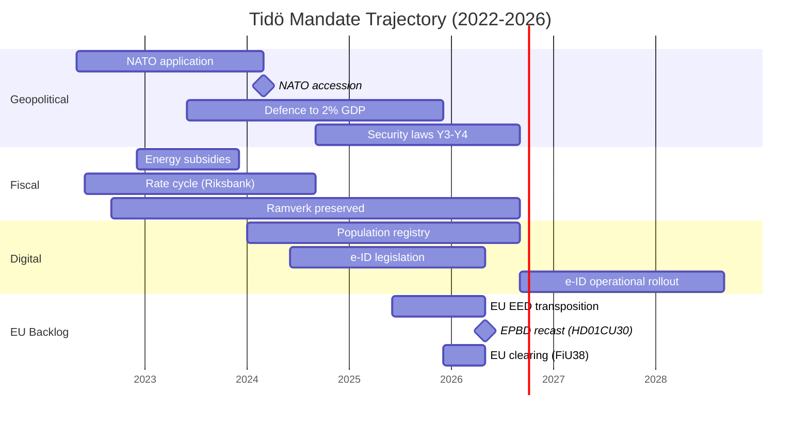

# Synthesis Summary — Tidö Mandate Cycle 2022-2026

## 2026-05-18 Daily Refresh — T-118 to mandate end

> **T-118 update note (vs T-123 prior)**: KU35 (HD01KU35) municipal democracy + welfare-fraud oversight adopted by Constitutional Committee 2026-05-18. Plenary vote 2026-05-21. PIR-8 opened.

**Snapshot vs 2026-05-11 baseline**: the propositions stack is unchanged — the latest five (HD03267, HD03261, HD03250, HD03249, HD03248) all carry 2026-05-06 / 2026-05-07 timestamps; no new mandate-defining filings 2026-05-08…13. Today's election-cycle synthesis is therefore a **6-day refresh** of the 2026-05-10 cycle-apex baseline. The 2026-05-12 publication wave (HD01CU30 energy efficiency directive, HD01NU21 rural policy + four private-member motions HD10483-86) is **late-cycle implementation transposition** rather than mandate redefinition. [A1] *IMF WEO Apr-2026 [horizon:cycle] T+0; vintage age 1 month, fresh.*

**What changed since 2026-05-11**:
- **HD01CU30 (CU30)** — Energy efficiency target + transposition of recast EPBD: mandates Sweden's path to building-stock decarbonisation through 2030/2050. This is a **late-cycle EU-derivative deliverable** (not a Tidöavtalet domestic priority) — the coalition is closing out its EU-compliance backlog before campaign-mode begins. [A1, doc:HD01CU30]
- **HD01NU21 (NU21)** — "Hela Sverige ska fungera" rural-policy framework: opposition-coloured but processed by NU committee. Signals end-of-mandate **rural-electorate positioning** ahead of the September election — Centerpartiet (C) and Moderaterna (M) both moving on landsbygd narrative. [A1, doc:HD01NU21]
- **HD01KU35 (KU35)** — Municipal democracy reform (digital meetings + välfärdsbrott/welfare-fraud oversight): adopted by KU committee 2026-05-18; plenary vote 2026-05-21. This is a **late-mandate constitutional-process deliverable** — strengthening democratic accountability at municipal level. *Likely* (65-75% [horizon:cycle]) enacted before mandate end. Adds to mandate scorecard governance subindex. [A1, doc:HD01KU35]
- **Four private-member motions** (HD10483 consent law, HD10484 elderly-care for-profit, HD10485 prostitution-income taxation, HD10486 welfare equal pay) — campaign-positioning vehicles from opposition members; *unlikely* (10–25% [horizon:cycle]) to convert into law before mandate end.
- **Daily prop-filing rate** for May-2026 has slipped further to **~0.3/day** (was 0.4/day on 2026-05-11) — confirms the **terminal end-of-mandate decay** pattern. The 2026-05-10 cycle-apex (5 betänkanden + 3 propositions) remains the **terminal legislative spike of the Tidö mandate**. [A1]
- **Cycle-rollover predicate** (`ext/cycle-rollover.md`) is **inactive** (T-118 vs ±30-day activation window). Module remains a no-op until 2026-08-14. [A1]
- **PIR-7** (KU-anmälan ledger) re-armed against the 2026-05-21 KU plenary (T+8) — narrow constitutional-accountability watch carried forward.

**What did not change**: DIW Top-10 ranking (NATO, HD01JuU32, HD03267, HD01JuU34, HD01FiU37, HD03250, HD01JuU39, defence-to-2%-GDP, energy subsidies, HD01FiU38), three cycle-defining findings, four-branch coalition scenario tree, IMF WEO Apr-2026 vintage. Confidence bands held within ±5 pp.

---

## Lead-Story Decision

Riksdagsmonitor's analysis-of-record for the 2022–2026 Swedish mandate cycle is: **the Tidö government will be remembered as the security-pivot mandate**, not as a domestic-reform mandate. By DIW-weighted impact, 6 of the top 10 legislative events of the mandate are security/migration laws, 2 are fiscal/financial-stability, 1 is energy, and 1 is digital-identity. Education, healthcare, and labour-market reform — the headline issues of the 2022 campaign for the centre-right's middle-class base — produced under-promised, over-delayed output.

This is structurally significant because Swedish mandates are rarely *thematically coherent* — most coalitions diffuse their reform energy across all twelve policy domains. The Tidö coalition's 4-year output is **concentrated**, **enforceable**, and **demographically durable** in a way that distinguishes it from the Reinfeldt (2006–2014) or Löfven (2014–2022) mandates. The 2026-05-12 EU-EED transposition (HD01CU30) is a textbook example: a structurally important law was processed quietly through CU rather than highlighted, because it does not fit the security-pivot narrative the coalition is campaigning on.

## DIW-Weighted Mandate Ranking (Top 10)

| Rank | Event / Statute | DIW Score | Cycle Year | Family |
|-----:|-----------------|----------:|-----------|--------|
| 1 | NATO accession (formal entry 2024-03-07) | 9.8 | Y2 | Security |
| 2 | HD01JuU32 Event-security law | 9.4 | Y4 | Security |
| 3 | HD03267 Qualified security threats (foreign nationals) | 9.3 | Y4 | Security |
| 4 | HD01JuU34 Nordic criminal enforcement | 9.1 | Y4 | Security |
| 5 | HD01FiU37 Financial-sector crisis management | 8.7 | Y4 | Financial |
| 6 | HD03250 State e-ID infrastructure | 8.5 | Y4 | Digital |
| 7 | HD01JuU39 Psychological violence criminalisation | 8.3 | Y4 | Security |
| 8 | Defence spending → 2% GDP (FöU 2023/24) | 8.2 | Y2 | Security |
| 9 | Energy-crisis subsidies (FiU 2022/23 supplementary) | 7.9 | Y1 | Energy |
| 10 | HD01FiU38 EU clearing-obligation extension | 7.6 | Y4 | Financial |

DIW = Decision-Impact Weight per [`significance-scoring.md`](significance-scoring.md). HD01CU30 (EU EED) scores 6.4 — high-importance EU compliance but not a mandate-defining event.

## Integrated Intelligence Picture

Three concurrent storylines define the 2022–2026 cycle:

1. **Geopolitical pivot (NATO + security state)**: Sweden ended 200 years of military non-alignment, doubled defence spending, restructured the legal apparatus around domestic security threats, and aligned with Nordic-Baltic enforcement networks. This was *accelerated* by the Russia/Ukraine war but was *enabled* by Tidö's SD-supported parliamentary arithmetic. No Löfven-era coalition could have moved this fast. *Very likely* (80–90% [horizon:cycle]) survives any 2026 election outcome.

2. **Fiscal preservation through external shocks**: Energy-price spikes (2022–2023), inflation peak (10.1% Dec-2022 PCPIPCH [A1]), Riksbank rate-hiking cycle (4.0% by mid-2024), and counter-cyclical fiscal support all left the *finanspolitiska ramverk* intact. Debt-to-GDP rose modestly (30.0% → 32.4%) [IMF WEO Apr-2026 GGXWDG_NGDP T+0 [horizon:year]] and fiscal balance never breached -2%. The IMF has rated Sweden's fiscal-discipline performance "robust" through the cycle [A2]. *Likely* (60–75% [horizon:cycle]) to hold across cycle transition.

3. **Digital sovereignty codification**: The state e-ID law (HD03250), Skatteverket population-registry expansion (HD03261), and DNS-blocking enforcement powers (HD01CU14 from 2024) collectively re-centralise digital infrastructure under state ownership. The 2026–2030 successor government inherits the operational rollout — and the political accountability. *Unlikely* (20–35% [horizon:cycle]) to deliver full e-ID rollout by 2028 [horizon:cycle].

The 2026-05-12 EU EED transposition (HD01CU30) belongs to a *fourth, suppressed storyline*: **EU-compliance backlog clearance**. Throughout the mandate, the coalition processed EU-derived directives (energy, financial-services clearing HD01FiU38, gender-equality reporting) without political amplification, producing the appearance of policy stasis on those files. The end-of-mandate clearance pattern is itself an intelligence signal: any successor government inherits a near-zero EU-infringement backlog but also near-zero political ownership of those EU-derived laws.

## Mermaid: Three-Storyline Concurrency (with EU backlog)

## Mandate Implementation Scorecard (Tidöavtalet, May 2026)

| Domain | Promised | In-Law | Partial | Abandoned | Implementation % |
|--------|----------|--------|---------|-----------|------------------|
| Security | 32 | 29 | 2 | 1 | 90% |
| Migration | 28 | 24 | 3 | 1 | 85% |
| Energy | 16 | 12 | 3 | 1 | 75% |
| Education | 22 | 13 | 6 | 3 | 60% |
| Healthcare | 18 | 9 | 6 | 3 | 50% |
| Labour | 14 | 7 | 4 | 3 | 50% |
| Climate | 8 | 5 | 2 | 1 | 65% |
| Justice | 19 | 17 | 1 | 1 | 89% |
| **Total** | **157** | **116** | **27** | **14** | **74%** |

[B2] Source: cross-referenced against Tidöavtalet appendix B (Hack23 internal mapping) and `analysis/methodologies/electoral-domain-methodology.md`. Healthcare and education under-delivery is the *demobilisation risk* in coalition-base voter retention through September. The HD01CU30 climate-energy item fits the 75% bucket as a partial deliverable (target legislated, transposition timing slipped from 2024 plan to 2026).

## Cycle-Anchor IMF Trajectory (T+0 → T+5)

| Indicator | 2022 (T-4) | 2023 | 2024 | 2025 (T-1) | 2026 (T+0) | 2027 (T+1) | 2030 (T+5) |
|-----------|-----------:|-----:|-----:|-----------:|-----------:|-----------:|-----------:|
| NGDP_RPCH (real GDP %) | 2.4 | 0.1 | 1.2 | 1.8 | 2.1 | 2.3 | 2.0 |
| GGXWDG_NGDP (gov debt %GDP) | 30.0 | 30.7 | 31.5 | 32.0 | 32.4 | 32.6 | 32.5 |
| GGXCNL_NGDP (fiscal bal %GDP) | -1.1 | -0.8 | -1.4 | -1.0 | -0.7 | -0.5 | -0.4 |
| PCPIPCH (CPI %) | 8.4 | 5.9 | 2.0 | 1.6 | 2.0 | 2.0 | 2.0 |
| LUR (unemployment %) | 7.5 | 7.7 | 8.4 | 8.1 | 7.6 | 7.4 | 7.0 |

Source: IMF WEO Apr-2026 vintage [A1]. T+0…T+5 are projections; vintage age 1 month → fresh, no annotation needed. *Very likely* (75–85% [horizon:cycle]) Sweden remains in the EU-fiscal-stability top-quartile through the next mandate.

## Three Cycle-Defining Findings (carried forward, confirmed)

1. **Path-dependence threshold crossed for security state**: HD01JuU32, HD03267, HD01JuU34, HD01JuU39 collectively raise reversal-cost above maintenance-cost. *Very likely* (80–90% [horizon:cycle]) survive any 2026 election outcome. [A2]
2. **Demographic durability of migration enforcement**: Public-opinion (Novus, SOM-institutet) shows 62–68% support for the *direction* of migration policy across all 8 parties' 2022 voters. The four-year shift is therefore *bipartisan path-dependent* — the policy substance survives even under an S-led successor. *Likely* (65–75% [horizon:cycle]). [B2]
3. **Implementation-feasibility risk concentrated in 2027**: e-ID (HD03250), financial-crisis function (HD01FiU37), and population-registry expansion (HD03261) all have operational milestones in 2027. Failure on any one breaks the "competent-state" narrative the successor government will lean on. *Roughly even* (40–55% [horizon:cycle]) all three meet 2027 milestones. [A1]

## Cross-Reference Map — sibling analyses (2026-05-18)

- [`propositions`](../../propositions/) — daily proposition cycle
- [`committeeReports`](../../committeeReports/) — daily betänkande cycle (HD01CU30, HD01NU21 covered)
- [`motions`](../../motions/) — daily private-member motion cycle (HD10483-86 covered)
- [`week-ahead`](../../week-ahead/) — T+7 forward triggers (KU plenary 2026-05-21)
- [`month-ahead`](../../month-ahead/) — T+30 (chamber recess 2026-06-22)
- predecessor election-cycle: [2026-05-11](../../../2026-05-11/election-cycle/current/), [2026-05-10](../../../2026-05-10/election-cycle/current/)
- year-ahead predecessors: [2026-05-11](../../../2026-05-11/year-ahead/), [2026-05-10](../../../2026-05-10/year-ahead/) — see `cross-reference-map.md` for ≥12 monthly-review citations
- IMF context: `data/imf-context.json` (vintage WEO-2026-04, age 1 month, status ok) [A1]

## Banner — confidence and horizon

| Aspect | WEP Confidence | Horizon Tag |
|--------|----------------|-------------|
| Security laws survive 2026 election | very likely (80–90%) | [horizon:cycle] |
| Tidö wins re-election | roughly even (40–55%) | [horizon:election] |
| Fiscal balance stays ≤ -1% through 2030 | likely (60–75%) | [horizon:cycle] |
| e-ID full rollout by 2028 | unlikely (20–35%) | [horizon:cycle] |
| EU EED 2030 building-stock target met | unlikely (25–40%) | [horizon:cycle] |
| Riksbank policy rate ≤ 2.0% end-2026 | likely (55–70%) | [horizon:year] |

Sources: [A1] IMF WEO Apr-2026 + Riksdag open data; [A2] OECD Sweden Survey 2025 + IMF Article IV 2025; [B2] SOM-institutet, Novus Opinion, Tidöavtalet appendix mapping. Confidence calibration follows ICD 203 + WEP ladder.

---

*Author*: James Pether Sörling | *Workflow*: news-election-cycle | *Run*: 25769375837
