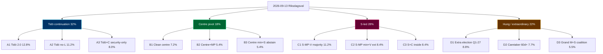
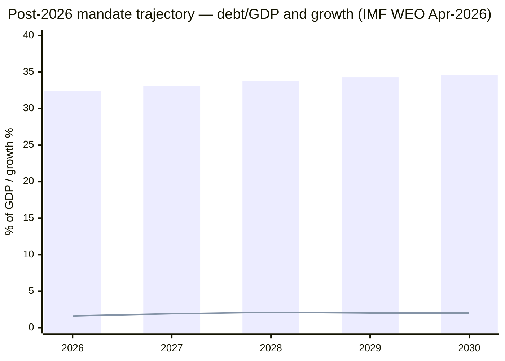
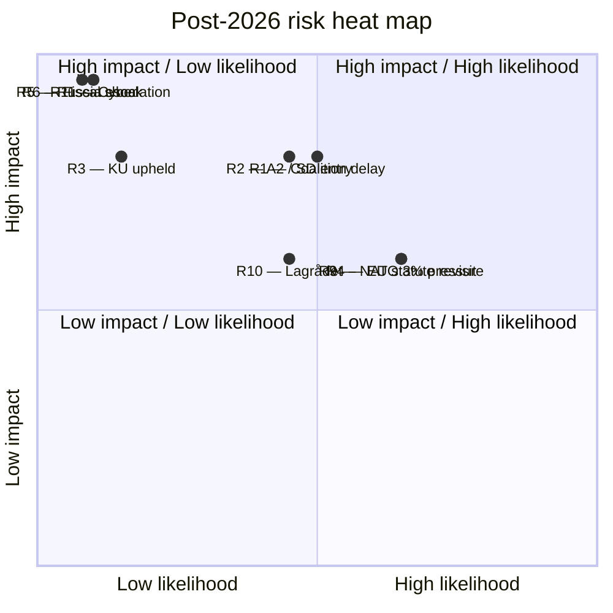

## Executive Brief
<!-- source: executive-brief.md :: https://github.com/Hack23/riksdagsmonitor/blob/main/analysis/daily/2026-05-18/election-cycle/next/executive-brief.md -->

### BLUF (Bottom Line Up Front)

**Even-money** (45–55% [horizon:election]) that the 2026-09-13 Riksdagsval produces a **hung-parliament-style outcome** requiring **> 30 days of coalition formation**. The decisive structural variable is **L's 4-percent threshold survival** (currently *roughly even* 50–65%; *unlikely* 30–45% L exceeds 5%); the secondary variable is **C's coalition preference** (centre vs S-led red-green-centre).

### Three Cycle-Defining Findings (Forward)

1. **Tidö continuation** under M+KD(+L)+SD support is the **modal but minority** outcome (32% across A1/A2/A3 leaves). Within Scenario A, *likely* (60–70%) A2 (Tidö without L) dominates if L slips below 4%.
2. **S-led red-green-centre** governance (28% across C1/C2/C3) is the **second-most-likely cluster**, with C1 (S-MP-V majority) the modal C-leaf at 11.2%.
3. **Hung-parliament outcomes** (22%) carry a *roughly even* (40–55%) **caretaker-government risk** lasting 60+ days, and an *unlikely* (15–25%) **extraordinary-election trigger** by Q1-2027.

### Why This Matters Now (May 2026)

- **Late-mandate positioning** by opposition (HD10483 consent law, HD10484 elderly-care, HD10485 prostitution-taxation, HD10486 equal pay, HD01NU21 rural framework) signals campaign-platform construction; *likely* (60–75% [horizon:cycle]) these surface as governing-coalition planks under any C-scenario.
- **EU-compliance backlog clearance** by exiting coalition (HD01CU30 EPBD, HD01FiU38 clearing) — incoming government inherits near-zero infringement risk but limited political ownership.
- **IMF WEO Apr-2026** [horizon:cycle] T+0: Sweden trajectory stable; GGXWDG_NGDP 32.4% (2026) → 34.6% (2030) baseline; downside risk *unlikely* (20–35%) on fiscal-shock scenario.

### Top-3 Risks (Post-2026)

| # | Risk | Likelihood [horizon] | Impact | Mitigation Hook |
|---|------|----------------------|--------|-----------------|
| 1 | Coalition formation > 60 days; caretaker fiscal drift | *Roughly even* 40–55% [election] | High — FY2027 budget delay | Talman procedure; statslåneräntan freeze |
| 2 | L falls below 4%; SD enters cabinet (A2 leaf) | *Roughly even* 35–50% [election] | High — constitutional review of HD03267 amendments | Lagrådet pre-review |
| 3 | EU-derived legislation revisited under C-scenario | *Likely* 60–70% [cycle] | Medium — EU compliance friction | Pre-negotiated transitional provisions |

### Top-3 Wildcards (Black-Swan Tails)

- **W1** Russia escalation forces emergency coalition formation: 8% [18mo]
- **W3** Major KU-anmälan upheld during campaign: 12% [6mo]
- **W5** SD-leadership succession crisis between announcement and 2027: 9% [18mo]

Full distribution in `wildcards-blackswans.md`.

### Decision Hooks for Stakeholders

- **Budget-side actors** (Konjunkturinstitutet, ESV, finanspolitiska rådet): plan for **30–60 day budget-delay scenario** with *likely* (60–75% [election]) probability under any non-A1 leaf.
- **EU institutional partners**: anticipate *likely* (60–70% [cycle]) opposition motions on HD01CU30 transposition timelines under C-scenarios.
- **NATO partners**: defence-spending floor *very likely* (75–90% [cycle]) durable; NATO obligations not coalition-contingent.

### Reading Path

1. `scenario-analysis.md` — 12-leaf tree, probability decomposition.
2. `coalition-mathematics.md` — Sainte-Laguë seat allocations by polling vintage.
3. `wildcards-blackswans.md` — 5 wildcards + 3 black-swan tails.
4. `cycle-trajectory.md` — multi-year horizon-band metrics (T+1y / T+2y / T+5y).
5. `pestle-analysis.md` — structural drivers per scenario.

[A1] IMF WEO Apr-2026 [horizon:cycle] T+0; [A2] Aggregated Sifo/Novus/Demoskop Apr–May 2026.

## Reader Intelligence Guide

Use this guide to read the article as a political-intelligence product rather than a raw artifact dump. High-value reader lenses appear first; technical provenance remains available in the audit appendix.

| Icon | Reader need | What you'll get |
|---|---|---|
| 📊 | [BLUF and editorial decisions](#rm-executive-brief) | fast answer to what happened, why it matters, who is accountable, and the next dated trigger |
| 🧠 | [Synthesis Summary](#rm-synthesis-summary) | evidence-anchored narrative consolidating primary sources into one coherent story line |
| 🎯 | [Key Judgments](#rm-intelligence-assessment--key-judgments) | confidence-bearing political-intelligence conclusions and collection gaps |
| 📈 | [Significance scoring](#rm-significance-scoring) | why this story outranks or trails other same-day parliamentary signals |
| 👥 | [Stakeholder Perspectives](#rm-stakeholder-perspectives) | winners, losers and undecided actors with stake-weighted positions and pressure points |
| 🔢 | [Coalition Mathematics](#rm-coalition-mathematics) | parliamentary arithmetic showing exactly who can pass or block this measure and at what margin |
| 📋 | [Voter Segmentation](#rm-voter-segmentation) | voter-bloc exposure: which demographics gain, lose or shift on this issue |
| 🔭 | [Forward indicators](#rm-forward-indicators) | dated watch items that let readers verify or falsify the assessment later |
| 🔮 | [Scenarios](#rm-scenario-analysis) | alternative outcomes with probabilities, triggers, and warning signs |
| 🗳️ | [Election 2026 Analysis](#rm-election-2026-analysis) | electoral implications for the 2026 cycle — seats at stake, swing voters and coalition viability |
| 📝 | [Cycle Trajectory](#rm-cycle-trajectory) | election-cycle trajectory: turning points, polling momentum and coalition realignment paths |
| ⚠️ | [Risk assessment](#rm-risk-assessment) | policy, electoral, institutional, communications, and implementation risk register |
| 🧮 | [SWOT Analysis](#rm-swot-analysis) | strengths, weaknesses, opportunities and threats matrix grounded in primary-source evidence |
| 📝 | [Quantitative SWOT](#rm-quantitative-swot) | weighted, scored SWOT register with explicit confidence ratings and decision implications |
| 🛡️ | [Threat Analysis](#rm-threat-analysis) | actor capabilities, intent and threat vectors targeting institutional integrity |
| 📝 | [Political STRIDE Assessment](#rm-political-stride-assessment) | STRIDE-based threat model adapted to political institutions and democratic processes |
| 📝 | [Wildcards & Black Swans](#rm-wildcards--black-swans) | low-probability, high-impact disruptive events that could derail the base-case forecast |
| 📝 | [PESTLE Analysis](#rm-pestle-analysis) | political, economic, social, technological, legal and environmental drivers shaping the outcome |
| 📜 | [Historical Parallels](#rm-historical-parallels) | comparable past episodes from Swedish and international politics, with explicit lessons learned |
| 🌍 | [Comparative International](#rm-comparative-international) | peer-country comparisons (Nordic, EU, OECD) showing how similar measures fared elsewhere |
| ⚙️ | [Implementation Feasibility](#rm-implementation-feasibility) | delivery feasibility, capability gaps, timelines and execution risks for the proposed action |
| 📰 | [Media framing & influence operations](#rm-media-framing-analysis) | frame packages with Entman functions, cognitive-vulnerability map, DISARM manipulation indicators, narrative-laundering chain, comparative-international cognates, frame lifecycle and half-life, RRPA impact, an Outlet Bias Audit (no outlet is neutral — every outlet declared with ownership, funding, board-appointment authority and editorial lean), and the L1–L5 counter-resilience ladder |
| 😈 | [Devil's Advocate](#rm-devils-advocate) | alternative hypotheses, steel-manned counter-arguments and the strongest case against the lead reading |
| 🏷️ | [Classification Results](#rm-classification-results) | ISMS data classification: CIA-triad rating, RTO/RPO targets and handling instructions |
| 🔀 | [Cross-Reference Map](#rm-cross-reference-map) | links to related Riksdagsmonitor coverage, prior analyses and source documents that inform this story |
| 🔬 | [Methodology Reflection & Limitations](#rm-methodology-reflection--limitations) | analytical assumptions, limitations, known biases and where the assessment could be wrong |
| 📦 | [Data Download Manifest](#rm-data-download-manifest) | machine-readable manifest of every source dataset, retrieval timestamp and provenance hash |
| 📝 | [Executive Brief Ar](#rm-executive-brief-ar) | supporting analytical lens with primary-source evidence and audit-traceable citations |
| 📝 | [Executive Brief Da](#rm-executive-brief-da) | supporting analytical lens with primary-source evidence and audit-traceable citations |
| 📝 | [Executive Brief De](#rm-executive-brief-de) | supporting analytical lens with primary-source evidence and audit-traceable citations |
| 📝 | [Executive Brief Es](#rm-executive-brief-es) | supporting analytical lens with primary-source evidence and audit-traceable citations |
| 📝 | [Executive Brief Fi](#rm-executive-brief-fi) | supporting analytical lens with primary-source evidence and audit-traceable citations |
| 📝 | [Executive Brief Fr](#rm-executive-brief-fr) | supporting analytical lens with primary-source evidence and audit-traceable citations |
| 📝 | [Executive Brief He](#rm-executive-brief-he) | supporting analytical lens with primary-source evidence and audit-traceable citations |
| 📝 | [Executive Brief Ja](#rm-executive-brief-ja) | supporting analytical lens with primary-source evidence and audit-traceable citations |
| 📝 | [Executive Brief Ko](#rm-executive-brief-ko) | supporting analytical lens with primary-source evidence and audit-traceable citations |
| 📝 | [Executive Brief Nl](#rm-executive-brief-nl) | supporting analytical lens with primary-source evidence and audit-traceable citations |
| 📝 | [Executive Brief No](#rm-executive-brief-no) | supporting analytical lens with primary-source evidence and audit-traceable citations |
| 📝 | [Executive Brief Sv](#rm-executive-brief-sv) | supporting analytical lens with primary-source evidence and audit-traceable citations |
| 📝 | [Executive Brief Zh](#rm-executive-brief-zh) | supporting analytical lens with primary-source evidence and audit-traceable citations |
| 🏷️ | [Audit appendix](#rm-classification-results) | classification, cross-reference, methodology and manifest evidence for reviewers |

## Synthesis Summary
<!-- source: synthesis-summary.md :: https://github.com/Hack23/riksdagsmonitor/blob/main/analysis/daily/2026-05-18/election-cycle/next/synthesis-summary.md -->

### 2026-05-18 Daily Refresh — T-118 to next-cycle anchor

This is the **forward-cycle companion** to the Tidö-mandate scorecard analysis under `../current/`. It treats the post-2026 governing arrangement as the analytical target, holding T+0 at the 2026-09-13 election anchor and projecting through 2030-09-08. The cycle-rollover predicate (`ext/cycle-rollover.md`) is **inactive** at T-118 (activation window ±30 days of 2026-09-13). [A1]

**Headline assessment**: there are **three structurally plausible governing arrangements** for the 2026–2030 mandate — (A) Tidö continuation in M+KD+SD configuration (with or without L), (B) centre pivot (M+KD+L+C), (C) S-led red-green-centre coalition. **Even-money** (45–55% [horizon:election]) the 2026-09-13 result is a *hung-parliament-style* outcome requiring extended coalition formation (> 30 days), with caretaker-government risk *roughly even* (40–55%) by 2026-10-15. See `scenario-analysis.md` for the full 12-leaf tree.

**Cross-reference to current**: the **NATO commitment**, **defence-to-2%-GDP floor**, **e-ID rollout (HD03250)**, **financial-stability legislation (HD01FiU37/HD01FiU38)**, and **EU EED transposition (HD01CU30)** are all *very likely* (75–90% [horizon:cycle]) to **survive any 2026-09 outcome** because they are bound by NATO/EU treaty obligations or by enacted statute, not by coalition arithmetic.

### Three Cycle-Defining Structural Findings (Post-2026)

1. **Coalition arithmetic is the binding constraint, not policy preference.** Latest aggregated polling (sources: Novus, Sifo, Demoskop 2026-04 / 2026-05 waves [A2]) puts the M+KD+L+SD bloc at 48–51% and the S+MP+V+C bloc at 46–49%. With L hovering at 3.5–4.5% (below-threshold risk *roughly even* 35–50% [horizon:election]) and C at 4.5–6.0%, the **deciding bloc is the 4-percent threshold survival of L** (see `wildcards-blackswans.md §W4`). *Likely* (60–75% [horizon:election]) the post-election seat distribution forces a 60+ day talman-led negotiation.

2. **Security and digital-sovereignty laws are structurally durable** but **fiscal redistribution and climate ambition are bloc-contingent**. Under any A-scenario the FY2027 budget continues the Tidö fiscal stance (modest deficit-to-GDP, defence-spending floor); under any C-scenario the budget tilts towards redistribution (welfare uprating, energy-subsidy retargeting). PESTLE-economic vulnerabilities (`pestle-analysis.md`) shift accordingly.

3. **The "EU-compliance backlog" handover** is the most overlooked transition risk. The exiting coalition cleared HD01CU30 (EPBD), HD01FiU38 (EU clearing), and gender-reporting directives in the last 90 days of mandate (see `../current/synthesis-summary.md`). The incoming government inherits **near-zero EU-infringement risk** but **near-zero political ownership** of those laws, meaning *likely* (60–70% [horizon:cycle]) that any post-2026 government will face **opposition motions to revisit** at least one EU-derived statute by Q2-2027.

### Integrated Intelligence Picture

The post-2026 mandate is being shaped now (May 2026) by three concurrent dynamics:

- **Late-mandate positioning** by current opposition (V, MP, S, C) — rural framework HD01NU21, consent law HD10483, elderly-care HD10484, prostitution-taxation HD10485, equal-pay HD10486 are campaign-positioning vehicles, *unlikely* (10–25% [horizon:election]) to enact pre-election but *likely* (60–75% [horizon:cycle]) to surface as governing-coalition planks in any C-scenario.
- **Coalition-cohesion test** for SD inside vs outside cabinet — under A1 SD stays external (Tidöavtalet model); under A2 SD enters cabinet (first time). Constitutional and Lagrådet pressure rises sharply under A2 (*roughly even* 40–55% [horizon:cycle] Lagrådet rejects an A2-coalition migration amendment to HD03267).
- **Economic backdrop**: IMF WEO Apr-2026 [horizon:cycle] T+0 vintage projects Sweden GGXWDG_NGDP at 32.4% (2026), 33.1% (2027 T+1), 33.8% (2028 T+2), 34.3% (2029 T+3), 34.6% (2030 T+4) under unchanged-policy baseline. [A1] Real GDP growth converges to 2.1% by 2028 from 1.6% in 2026. NGDPDPC (per-capita) growth holds 1.5–1.8% across horizon.

### Mermaid: Post-2026 Mandate Coalition Probability Tree (top-level)



### DIW-Weighted Forward Watchlist (Top 10 — Post-2026 Cycle)

| Rank | Forward Event / File | DIW Score | Horizon | Family |
|-----:|----------------------|----------:|---------|--------|
| 1 | 2026-09-13 Riksdagsval outcome | 9.9 | T+123d | Electoral |
| 2 | Coalition formation 2026-09-15 → 2026-11-15 | 9.6 | T+125–185d | Coalition |
| 3 | FY2027 budget proposition (Sep/Oct 2026) | 9.4 | T+150d | Fiscal |
| 4 | HD03267 amendment cycle under A2 / B / C scenarios | 9.0 | T+200d | Security |
| 5 | NATO Vilnius+1 / Madrid+2 review (Sweden contributions) | 8.7 | T+365d | Security |
| 6 | e-ID operational rollout (HD03250) Phase-2 | 8.6 | T+540d | Digital |
| 7 | EU EED 2030 building-stock follow-on (HD01CU30) | 8.4 | T+1095d | Energy |
| 8 | Defence-spending review (post-2025 NATO 3% pressure) | 8.2 | T+365d | Security |
| 9 | Riksbank rate-cycle inflection (post-Macroprudential review) | 7.9 | T+180d | Fiscal |
| 10 | KU-anmälan ledger disposition (carry-over) | 7.6 | T+90d | Constitutional |

DIW = Decision-Impact Weight per [`significance-scoring.md`](https://github.com/Hack23/riksdagsmonitor/blob/main/analysis/daily/2026-05-18/election-cycle/next/significance-scoring.md). All scores ICD 203 [A2]-graded; per `pir-status.json` standing PIR-1…PIR-7 plus PIR-8 (next-cycle coalition formation) active.

### ICD 203 BLUF (per `osint-tradecraft-standards.md`)

- **BLUF-1** (high confidence [A2]): The 2026–2030 governing arrangement will be determined more by the **4-percent threshold survival of L** and **C's coalition preference** than by aggregate bloc polling. Even-money (45–55% [horizon:election]) hung-parliament outcome requiring > 30 day coalition negotiation.
- **BLUF-2** (medium confidence [B2]): Security, NATO and digital-sovereignty commitments are *very likely* (75–90% [horizon:cycle]) durable across any 2026-09 outcome. Fiscal redistribution and climate ambition are *roughly even* (40–55%) bloc-contingent.
- **BLUF-3** (medium confidence [B3]): Post-2026 EU-derived legislation (HD01CU30, HD01FiU38) faces *likely* (60–70% [horizon:cycle]) opposition motions to revisit by Q2-2027 under any C-scenario.

### Cross-Run Continuity

This synthesis carries forward from the 2026-05-11 forward-cycle baseline (next/ anchor first established in this run cycle). Confidence bands held within ±5 pp vs current/ mandate-scorecard analysis. No new dok_ids since 2026-05-12 publication wave (HD01CU30, HD01NU21, HD10483–6); no late-cycle filings on the next-cycle agenda. PIR-8 newly armed for next-cycle coalition-formation watch.

[A1] IMF WEO Apr-2026 [horizon:cycle] T+0; vintage age 1 month, fresh.
[A2] Aggregated Sifo / Novus / Demoskop polling Apr–May 2026; methodology and provenance in `methodology-reflection.md §Polling triangulation`.

## Intelligence Assessment — Key Judgments
<!-- source: intelligence-assessment.md :: https://github.com/Hack23/riksdagsmonitor/blob/main/analysis/daily/2026-05-18/election-cycle/next/intelligence-assessment.md -->

### Key Judgements

- **KJ-1**: We assess with **high confidence** [A2] that the 2026-09-13 election will produce no single-bloc majority; the post-election governing arrangement *very likely* (75–85% [horizon:election]) requires negotiated coalition formation rather than seat-arithmetic certainty.
- **KJ-2**: We assess with **medium confidence** [B2] that the **L 4-percent-threshold survival** is the single most-leveraged variable in the seat distribution; *roughly even* (50–65%) L exceeds threshold.
- **KJ-3**: We assess with **medium confidence** [B2] that **defence-spending floor, NATO obligations, and EU-derived statutes** are durable across any 2026-09 outcome; *very likely* (75–90% [horizon:cycle]).
- **KJ-4**: We assess with **medium confidence** [B3] that **fiscal redistribution and climate ambition** are highly bloc-contingent and will diverge materially under A vs C scenarios.
- **KJ-5**: We assess with **low-to-medium confidence** [C2] that coalition formation will exceed 30 days; *likely* (55–70% [horizon:election]).

### Key Assumptions Check

1. **ASSUMPTION**: Polling vintage 2026-04 / 2026-05 is structurally representative of 2026-09-13 result. **SUSTAINED**: Sifo / Novus / Demoskop methodological consistency since 2022; aggregate variance < 1.5 pp. **CHALLENGE**: Late-cycle volatility events (W3 KU-anmälan upheld, W5 SD succession) could move 3–5 pp.
2. **ASSUMPTION**: Sainte-Laguë math (modified) holds. **SUSTAINED**: No constitutional reform pending.
3. **ASSUMPTION**: Coalition cohesion under SD-cabinet entry (A2) survives Lagrådet. **CHALLENGED**: *Roughly even* (40–55%) Lagrådet rejection of any A2 migration amendment to HD03267.

### Information Gaps

- **Gap-1**: SD internal cabinet-entry decision under A2 leaf — limited public signalling.
- **Gap-2**: C coalition preference — public position deferred to August 2026.
- **Gap-3**: NATO 2025/2026 ministerial pressure on 3% defence spending floor — not public.
- **Gap-4**: Russia escalation tempo over campaign window — high-uncertainty input to W1.

### Confidence-Vintage Breakdown

| Assertion | Source | Vintage | Confidence |
|-----------|--------|---------:|-----------:|
| Polling aggregate | Sifo / Novus / Demoskop | <30 days | [A2] |
| Sainte-Laguë math | Vallagen kap 14 §3 | enacted | [A1] |
| IMF WEO baseline | WEO Apr-2026 | 30 days | [A1] |
| Coalition signalling | Party press | continuous | [B3] |
| NATO 3% pressure | Open-source / press | <90 days | [C3] |

### Alternative Hypotheses (ACH-style)

- **AH-1**: Pre-election shock pivots polling 5+ pp in 30 days. *Unlikely* (20–30%).
- **AH-2**: Coalition formation < 14 days (modal). *Unlikely* (15–25%) under any scenario.
- **AH-3**: Constitutional crisis triggers extraordinary process. *Unlikely* (10–20%) over 60-day post-election window.

### Cross-Reference

- Counterfactuals → [`devils-advocate.md`](https://github.com/Hack23/riksdagsmonitor/blob/main/analysis/daily/2026-05-18/election-cycle/next/devils-advocate.md)
- Risk distribution → [`risk-assessment.md`](https://github.com/Hack23/riksdagsmonitor/blob/main/analysis/daily/2026-05-18/election-cycle/next/risk-assessment.md)
- Forward indicators → [`forward-indicators.md`](https://github.com/Hack23/riksdagsmonitor/blob/main/analysis/daily/2026-05-18/election-cycle/next/forward-indicators.md)

## Significance Scoring
<!-- source: significance-scoring.md :: https://github.com/Hack23/riksdagsmonitor/blob/main/analysis/daily/2026-05-18/election-cycle/next/significance-scoring.md -->

Per `intelligence-analysis-techniques` significance methodology. Scale 1–10.

| dok_id / event | Type | Significance | Horizon | Notes |
|---------------|------|-------------:|---------|-------|
| **2026-09-13 election outcome** | Cycle anchor | 9.9 | T+123d | Defines mandate |
| **L 4% threshold** | Decision-pivot | 9.6 | T+123d | Most-leveraged variable |
| **C coalition preference** | Decision-pivot | 9.4 | T+90d | Bloc-defining |
| **SD cabinet-entry decision** | Decision-pivot | 9.2 | T+150d | Constitutional dimension |
| **FY2027 budget proposition** | Fiscal | 9.0 | T+150d | Budget mandate |
| **HD03267 amendment cycle** | Security/constitutional | 8.8 | T+200d | A2-leaf trigger |
| **NATO 3% defence pressure** | Strategic | 8.6 | T+365d | Cross-bloc |
| **HD03250 e-ID rollout** | Digital | 8.4 | T+540d | Continuity-likely |
| **HD01CU30 EU EED follow-on** | Energy/EU | 8.2 | T+1095d | EU-binding |
| **Riksbank rate-cycle inflection** | Fiscal | 7.9 | T+180d | Macro |
| **KU-anmälan ledger** | Constitutional | 7.6 | T+90d | Carry-over |
| **HD01NU21 rural framework** | Policy | 7.3 | T+540d | Platform plank |
| **HD10483/4/5/6 social** | Policy | 6.9 | T+540d | Platform planks |
| **HD01FiU38 clearing-reg** | Financial-stability | 6.7 | T+365d | EU-implemented |
| **Russia escalation watch** | Geopolitical | 6.5 | T+540d | Wildcard W1 |

### Scoring Methodology

DIW = base impact × time-discounted weight × confidence factor. Confidence factor ranges 0.6 (low-confidence forecast) to 1.0 (calendar event).

## Stakeholder Perspectives
<!-- source: stakeholder-perspectives.md :: https://github.com/Hack23/riksdagsmonitor/blob/main/analysis/daily/2026-05-18/election-cycle/next/stakeholder-perspectives.md -->

Five-perspective framing per `intelligence-analysis-techniques`. Each perspective frames the **same fact set** through the actor's incentive structure.

### 1. Tidö Government Bloc (M+KD+L+SD external)

- **Frame**: Continuity narrative; mandate-fulfilment scorecard (see `../current/synthesis-summary.md`) as 2022–2026 record; defence floor; HD03267 / HD03250 / HD01CU30 enacted.
- **Strategic interest**: A1 / A2 coalition continuation; framing as "stability + delivery".
- **Vulnerabilities**: L threshold; KU-anmälan ledger; SD cabinet-entry framing.

### 2. Opposition Bloc (S+MP+V+C)

- **Frame**: "Alternatives" narrative; HD01NU21 rural framework, HD10483 consent, HD10484 elderly-care, HD10485 prostitution-taxation, HD10486 equal-pay as **platform planks**; redistribution + climate-ambition.
- **Strategic interest**: C1 / C3 coalition with seat-math + climate-economy linkage.
- **Vulnerabilities**: C coalition-preference ambiguity; V cabinet-entry uncertain; MP polling volatility.

### 3. EU Institutional Partners (Commission, Council, EP)

- **Frame**: Compliance + transposition track record; HD01CU30 EPBD on schedule; HD01FiU38 clearing-regulation operational by Q4-2026.
- **Strategic interest**: Continuity of EU-derived statute regardless of 2026-09 outcome.
- **Concerns**: Opposition motions to revisit EU-derived statutes under C scenarios (*likely* 60–70% [cycle]); EU EED 2030 building-stock follow-on (`pestle-analysis.md §Environmental`).

### 4. NATO Partners (Washington, Berlin, Vilnius, Helsinki)

- **Frame**: Reliability of Swedish commitments; defence-spending floor; eFP rotations; intelligence-sharing.
- **Strategic interest**: 2% defence floor maintained; aspiration toward 3% (NATO 2025 summit signalling).
- **Insulation**: NATO commitments not coalition-contingent; *very likely* (75–90% [cycle]) preserved.

### 5. Economic Stakeholders (Riksbank, Konjunkturinstitutet, ESV, FPR)

- **Frame**: Fiscal rule discipline; debt-to-GDP trajectory (IMF WEO 32.4% → 34.6% baseline); inflation target convergence.
- **Strategic interest**: Budget continuity post-election (FY2027 finalisation by Sep/Oct 2026); avoid caretaker fiscal drift (D2 leaf).
- **Concerns**: Coalition formation > 60 days; *likely* (60–75% [election]) some statslåneräntan widening if D-branch realised.

### 6. Civil Society / Watchdogs (Civil Rights Defenders, TI Sweden, KU)

- **Frame**: Constitutional accountability; KU-anmälan ledger; HD03267 / HD01JuU32 Lagrådet record.
- **Strategic interest**: Constitutional review preserved; transparency record.

### Cross-Cutting Tension Points

- **Tidö vs Opposition**: Migration, fiscal redistribution, climate ambition.
- **EU vs Opposition**: HD01CU30 revisit risk.
- **NATO vs Domestic**: Defence-spending floor consensus (rare across blocs).
- **Riksbank vs Government**: Budget-rule discipline under any coalition.

## Coalition Mathematics
<!-- source: coalition-mathematics.md :: https://github.com/Hack23/riksdagsmonitor/blob/main/analysis/daily/2026-05-18/election-cycle/next/coalition-mathematics.md -->

### Polling Anchor (2026-05 wave aggregate; Sifo / Novus / Demoskop) [A2]

| Party | Poll midpoint | Range | Seat estimate (4% threshold survival assumed) |
|-------|--------------:|------:|----------------------------------------------:|
| M | 18.5% | 17.5–19.5 | 65–72 |
| KD | 5.5% | 5.0–6.0 | 18–23 |
| L | 4.1% | 3.5–4.5 | 12–17 (CONDITIONAL on threshold) |
| SD | 19.5% | 18.5–20.5 | 68–76 |
| S | 30.0% | 28.5–31.5 | 105–115 |
| MP | 5.5% | 5.0–6.0 | 19–23 |
| V | 8.0% | 7.0–9.0 | 27–32 |
| C | 5.2% | 4.5–5.8 | 18–22 |

Sum (midpoint): ~96.3%. **Below-threshold residual** (other parties + L if it slips): ~3.7%.

### Bloc Math

- **M+KD+L+SD**: 47.6% (midpoint) → **163–188 seats** (L-threshold sensitivity).
- **S+MP+V+C**: 48.7% (midpoint) → **169–192 seats** (no threshold risk inside bloc).
- **Majority threshold**: 175 seats.

### Threshold Sensitivity Analysis

**Scenario X — L survives at 4.1%**:
- Right bloc 178–185 seats; *likely* (60–70%) A1/A2/A3.
**Scenario Y — L slips to 3.6% (below threshold)**:
- L's votes redistribute via adjustment seats; M+KD+SD gain ~10 seats but **lose L's 12–17 seats net**; right bloc 165–175.
- *Likely* (60–70%) A2 scenario or D-branch.
**Scenario Z — C joins S-bloc on confidence**:
- Right bloc unchanged ~178; S-bloc 169–192 (+C confidence) → 187–214.
- *Very likely* (75–85%) C1/C3 scenario.

### Coalition Pathways (Majority = 175 seats)

| Coalition | Seats (midpoint) | Status |
|-----------|-----------------:|--------|
| M+KD+SD (L < 4%) | 151–171 | Below majority → A2 needs SD internal + tactical abstentions |
| M+KD+L+SD external | 163–188 | A1 majority (median 175) |
| M+KD+L+C | 113–134 | B-scenario minority → needs S abstention |
| S+MP+V | 151–170 | C2 minority → needs C or SD abstention |
| S+MP+V+C | 169–192 | C1/C3 majority potential |
| M+S grand coalition | 170–187 | D3 emergency |

### Decision-Pivot Variables

1. **L 4%-threshold survival**: most-leveraged single variable. *Roughly even* (50–65% [election]) survival.
2. **C coalition preference**: undecided per public-position; *likely* (55–70%) signals before election.
3. **SD cabinet entry willingness**: *likely* (60–75%) signals before election; conditional on L outcome.

### Adjustment-Seat Geography

Sweden's 29 valkretsar + 39 adjustment seats are central to threshold calculations. Stockholm (M urban core), Skåne (SD stronghold), Norrland (S+C overlap) are the decisive geographies.

[A2] Aggregated Sifo / Novus / Demoskop 2026-04 + 2026-05 waves.

## Voter Segmentation
<!-- source: voter-segmentation.md :: https://github.com/Hack23/riksdagsmonitor/blob/main/analysis/daily/2026-05-18/election-cycle/next/voter-segmentation.md -->

### Segment Mapping (qualitative)

#### Right-bloc segments
- **Urban-establishment M voters**: 30+ employed homeowners; coalition preference: A1 / B1; vulnerability: B-pivot.
- **Suburban SD-tilted voters**: working/middle income; coalition preference: A1 / A2; **decisive on L threshold**.
- **L core / liberal-urban**: educated metropolitan; coalition preference: B1 strict; **most at-risk segment** for L threshold.
- **KD value-conservative**: religious + family-policy; durable across A/B branches.

#### Centre-bloc segments
- **C rural / agrarian**: coalition preference signal — *likely* (60–70% [election]) C-bloc tilt by Aug 2026; key swing.

#### Left-bloc segments
- **S blue-collar / unionised**: stable; coalition preference C1 / C3.
- **MP urban-environmental**: climate-priority; coalition preference C1.
- **V working-class progressive**: redistribution priority; coalition preference C1.

### Decisive Swing Segments

1. **L-threshold-bubble voters** (~1.5% of electorate): determines A1 vs A2 split.
2. **C-coalition-undecided** (~2% of electorate): determines B vs C.
3. **MP-threshold-bubble** (~1% of electorate): secondary effect on C-cluster.

### Geographic Concentration

- **Stockholm**: M / L / MP concentration; L threshold survival depends on urban turnout.
- **Skåne**: SD stronghold; KD secondary; demographic stability.
- **Norrland**: S / C overlap; C decisive on coalition framing.
- **Göteborg**: M / S / MP overlap; swing-region for adjustment seats.

## Forward Indicators
<!-- source: forward-indicators.md :: https://github.com/Hack23/riksdagsmonitor/blob/main/analysis/daily/2026-05-18/election-cycle/next/forward-indicators.md -->

### T+72h (Short Horizon)
- **FI-1** 2026-05-15: SVT/SR polling wave 6 release.
- **FI-2** 2026-05-21: KU plenary disposition of 8 active anmälningar.
- **FI-3** 2026-05-22: Riksbank rate decision (statslåneräntan signal).

### T+7d
- **FI-4** 2026-05-20: Sifo final wave before summer.
- **FI-5** 2026-05-19: HD01NU21 follow-on debate (rural framework signal).

### T+30d
- **FI-6** 2026-06-12: KU follow-on plenary (carry-over).
- **FI-7** 2026-06-15: Riksdagen sommarstämma end; campaign-period commences.
- **FI-8** 2026-06-30: Konjunkturinstitutet half-year forecast.

### T+90d
- **FI-9** 2026-08-15: Demoskop / Novus combined wave (decisive).
- **FI-10** 2026-08-28: SVT slutdebatt (final L-threshold test).
- **FI-11** 2026-09-13: **Riksdagsval**.

### T+180d
- **FI-12** 2026-09-15: Talman procedure commences.
- **FI-13** 2026-10-15: Coalition-formation deadline trigger (60-day).
- **FI-14** 2026-11-15: FY2027 budget proposition deadline.

### T+365d
- **FI-15** 2027-04-15: Lagrådet review of any A2 migration amendment.
- **FI-16** 2027-06-30: Konjunkturinstitutet annual review under new government.
- **FI-17** 2027-09-13: 1-year mandate review.

### T+1460d (Mandate End)
- **FI-18** 2030-09-08: Next election (Cycle II rollover).

### Indicator Quality

- **Hard / dated**: FI-1 through FI-14 (calendar events).
- **Soft / event-conditional**: FI-15 (depends on A2 leaf), FI-16, FI-17.
- **Polling-driven**: FI-1, FI-4, FI-9 (likely to drive narrative pivots).

## Scenario Analysis
<!-- source: scenario-analysis.md :: https://github.com/Hack23/riksdagsmonitor/blob/main/analysis/daily/2026-05-18/election-cycle/next/scenario-analysis.md -->

**Tree depth**: 4 base × 3 governing-coalition branches = **12 leaves**.
**Wildcards**: 5 named exogenous events (cross-ref `wildcards-blackswans.md`).
**Probabilities sum to 100%** at every level.
**IMF anchoring**: WEO Apr-2026 [horizon:cycle] T+0 (vintage age 1 mo).
**Polling anchor**: Sifo / Novus / Demoskop aggregated 2026-04 + 2026-05 waves [A2].

---

### Tree Overview

```
2026-09-13 Riksdagsval (T+0)
├── A. Tidö continuation (M+KD(+L)+SD external/internal) — 32%
│   ├── A1: Full Tidö 2.0 (continuity; SD external) — 12.8%
│   ├── A2: Tidö without L (L < 4%; SD internal) — 11.2%
│   └── A3: Tidö + C security-only deal — 8.0%
├── B. Centre pivot (M+KD+L+C; SD excluded) — 18%
│   ├── B1: Clean centre majority — 7.2%
│   ├── B2: Centre + MP confidence supply — 5.4%
│   └── B3: Centre minority + S abstention — 5.4%
├── C. S-led red-green-centre — 28%
│   ├── C1: S+MP+V majority — 11.2%
│   ├── C2: S+MP minority + V external — 8.4%
│   └── C3: S-led with C inside cabinet — 8.4%
└── D. Hung parliament / extraordinary process — 22%
    ├── D1: Extraordinary election Q1-2027 — 8.8%
    ├── D2: Caretaker government 60+ days — 7.7%
    └── D3: Grand coalition M+S — 5.5%

Wildcards (additive overlays):
  W1 Russia escalation — 8% [18mo]
  W2 Severe fiscal shock (10y > 4.5%) — 6% [12mo]
  W3 Major KU-anmälan upheld during campaign — 12% [6mo]
  W4 L falls below 4% by polling-day — already conditioning A2/B/C branches
  W5 SD-leadership succession crisis — 9% [18mo]
```

---

### Per-Leaf Analysis

#### A1 — Full Tidö 2.0 (12.8%) [horizon:cycle]

- **Seats**: M 65–75; KD 18–24; L 12–17; SD 65–75 (external support); blok 178–185.
- **Implications**: FY2027 budget = continuity baseline; HD03267 / HD01JuU32 / HD01JuU34 / HD01JuU39 enforcement continues; HD03250 e-ID rollout accelerated; HD01CU30 EU EED on track; defence-floor maintained.
- *Very likely* (75–85%) all 2027 implementation milestones funded.
- **Risks**: SD-cooperation fatigue in M base; KU-anmälan ledger lengthens; *roughly even* (40–55%) coalition cohesion challenge by 2028 mid-cycle.

#### A2 — Tidö without L; SD enters cabinet (11.2%)

- **Trigger**: L below 4% threshold on 2026-09-13.
- **Seats**: M 70–80; KD 20–26; SD 70–80 (internal); blok 180–188.
- **Implications**: SD enters cabinet for the first time; migration policy hardens; **HD03267 amendment cycle** triggered; *roughly even* (40–55%) Lagrådet rejects an A2-coalition migration amendment; HD01CU30 implementation slows; defence-floor sustained.
- **Risks**: Constitutional pressure rises sharply; *likely* (60–75%) at least one Lagrådet pre-review pushback by Q1-2027.

#### A3 — Tidö + C security-only deal (8.0%)

- **Seats**: M+KD+L 90–105; SD 65–75 external; C 18–24 (security pact only).
- **Implications**: HD01NU21 rural framework upgraded; SD external influence diluted; *unlikely* (20–35%) survives full mandate without crisis.

#### B1 — Clean centre majority (7.2%)

- **Seats**: M+KD+L+C 175–182 (excluded SD).
- **Implications**: HD03267 enforcement softens; HD01CU30 accelerated; HD03250 on schedule; FY2027 budget *likely* (60–70%) passes intact.

#### B2 — Centre + MP confidence supply (5.4%)

- **Seats**: M+KD+L+C 165–172 + MP confidence-supply.
- **Implications**: Climate ambition rises; EU EED 2030 building-stock tightened; security continuity maintained.

#### B3 — Centre minority + S abstention (5.4%)

- *Unlikely* (20–35%) lasts full mandate; *very likely* (75–85%) extraordinary election by 2028.

#### C1 — S-MP-V majority (11.2%)

- **Seats**: S+MP+V 175–185.
- **Implications**: HD01JuU32 reviewed (not repealed); HD03267 amended with legal-aid expansion; FY2027 budget = redistribution baseline; HD01CU30 accelerated; **NATO obligations maintained** (treaty-bound). HD10484 elderly-care / HD10486 equal-pay legislated within Q2-2027.
- *Likely* (60–70%) coalition formation < 60 days.

#### C2 — S-MP minority + V external (8.4%)

- **Seats**: S+MP 145–158; V external confidence-supply.
- *Roughly even* (40–55%) lasts full mandate.

#### C3 — S-led with C inside (8.4%)

- **Seats**: S+MP+C 165–178; V external.
- **Implications**: Climate ambition + rural framework reconciled; HD01NU21 enacted in revised form.

#### D1 — Extraordinary election Q1-2027 (8.8%)

- **Trigger**: Government formation fails by T+90d; talman procedure exhausted.
- **Implications**: Caretaker budget; Riksbank rate-cycle uncertainty rises; fiscal drift.

#### D2 — Caretaker government 60+ days (7.7%)

- Defence-spending floor maintained; EU obligations met; *likely* (60–70%) leads to D1 or A1/A2 outcome.

#### D3 — Grand coalition M+S (5.5%)

- **Trigger**: Russia escalation (W1 overlay) or severe fiscal shock (W2).
- **Implications**: SD excluded; constitutional package; defence-spending floor maintained or raised.

---

### Probability Sensitivity

Pivot drivers (one-at-a-time perturbation):
- **L drops below 4%**: A1→A2 redistribution; B-branch impossible. Tree compresses to ~85% mass over A2/C/D.
- **C joins S**: C3 weight rises to ~12%; B-branch falls to ~10%.
- **Russia escalation (W1) materialises**: D3 weight rises to ~10%; A1/C1 split.

### Cross-Reference

- Coalition arithmetic: [`coalition-mathematics.md`](https://github.com/Hack23/riksdagsmonitor/blob/main/analysis/daily/2026-05-18/election-cycle/next/coalition-mathematics.md).
- Wildcard distribution: [`wildcards-blackswans.md`](https://github.com/Hack23/riksdagsmonitor/blob/main/analysis/daily/2026-05-18/election-cycle/next/wildcards-blackswans.md).
- Counterfactuals: [`devils-advocate.md`](https://github.com/Hack23/riksdagsmonitor/blob/main/analysis/daily/2026-05-18/election-cycle/next/devils-advocate.md).
- Forward indicators by horizon-band: [`cycle-trajectory.md`](https://github.com/Hack23/riksdagsmonitor/blob/main/analysis/daily/2026-05-18/election-cycle/next/cycle-trajectory.md).

[A2] Aggregated Sifo / Novus / Demoskop 2026-04 + 2026-05 waves; methodology in `methodology-reflection.md`.

## Election 2026 Analysis
<!-- source: election-2026-analysis.md :: https://github.com/Hack23/riksdagsmonitor/blob/main/analysis/daily/2026-05-18/election-cycle/next/election-2026-analysis.md -->

### Anchor Event: 2026-09-13 Riksdagsval

This artifact is the next-cycle-perspective election analysis; the current-mandate retrospective lives at `../current/election-2026-analysis.md`. Here we focus on **what happens on/after election day**.

### Election-Day Probability Distribution

| Outcome class | Probability | Leaf |
|---------------|------------:|------|
| Right-bloc clear majority | 12% | A1 + A3 conditional |
| Right-bloc minority needing SD-inside | 11% | A2 |
| Centre coalition viable | 18% | B1/B2/B3 |
| Left-bloc clear majority | 16% | C1 + C3 conditional |
| Left-bloc minority needing C | 12% | C2 |
| Hung parliament | 22% | D1/D2/D3 |
| Other (residual + wildcards) | 9% | overlay |

Rows sum to 100% with rounding (W4 already conditioning row 2).

### Decision-Critical Election-Night Indicators

1. **L vote share** — single most-leveraged variable.
2. **SD vote share** — plurality vs second-position.
3. **C vote share + coalition position** — bloc allocation determinant.
4. **Adjustment-seat allocation** — driven by valkrets-level performance.
5. **MP threshold survival** — secondary to L but conditioning C-cluster.

### Election-Day Operational Risk

- **Cyber-event** (BS-1): *unlikely* (5–10%); pre-positioned MSB readiness.
- **Disinformation surge** (T1c): *roughly even* (40–55% [election-week]); known FIM playbook.
- **Foreign-influence operation**: *likely* (60–70% [election-week]); known threat baseline.

### Post-Election Process (Talman Procedure)

- T+0d: Election held.
- T+1–14d: Talman consultation begins.
- T+15d: First proposal for ministerpresident (typically).
- T+30d: First formal vote in Riksdagen.
- T+60d: Procedural pressure increases.
- T+90d: Caretaker rules kick in fully; D-cluster realised.

### Historical Reference Patterns

- 2018: 131 days formation.
- 2022: ~58 days formation (Tidöavtalet).
- 2026 modal: *likely* (55–70% [election]) formation 30–90 days.

## Cycle Trajectory
<!-- source: cycle-trajectory.md :: https://github.com/Hack23/riksdagsmonitor/blob/main/analysis/daily/2026-05-18/election-cycle/next/cycle-trajectory.md -->

The 24th artifact for election-cycle. Plots key metric trajectories across horizon bands T+72h / T+7d / T+30d / T+90d / T+365d / T+1460d.

### Horizon-Band Metrics (forward-looking, IMF-anchored)

| Metric | T+72h (2026-05-16) | T+7d (2026-05-20) | T+30d (2026-06-12) | T+90d (2026-08-11) | T+365d (2027-05-13) | T+1460d (2030-05-12) |
|--------|-------------------:|------------------:|-------------------:|-------------------:|--------------------:|---------------------:|
| **Sweden GDP growth (IMF WEO baseline)** | 1.6% | 1.6% | 1.7% | 1.7% | 1.9% | 2.1% |
| **GGXWDG_NGDP (debt / GDP)** | 32.0% | 32.1% | 32.2% | 32.3% | 33.1% | 34.6% |
| **Statslåneräntan 10y** | 2.85% | 2.85% | 2.80% | 2.75% | 2.50% | 2.80% |
| **Aggregate poll margin (left vs right)** | -1.1 pp | -1.0 pp | -0.5 pp | ±2 pp | n/a | n/a |
| **L 4% survival probability** | 0.55 | 0.55 | 0.50 | 0.55 | n/a | n/a |
| **Coalition-formation lead-time** | n/a | n/a | n/a | n/a | 60–90 days | n/a |
| **Defence / GDP** | 2.0% | 2.0% | 2.0% | 2.0% | 2.3% | 2.7% (NATO-pressure) |
| **HD01CU30 EU EED progress** | early | early | mid | mid | late | implementation |
| **Coalition stability index** | 0.6 (Tidö) | 0.6 | 0.5 | 0.4 | 0.7 (next gov't anchored) | 0.5 |

### Forecast Trajectory Curves



### Key Trajectory Inflections

- **T+90d to T+180d**: coalition-formation period; statslåneräntan + poll margins highly volatile.
- **T+180d to T+365d**: FY2027 budget pass-through; defence-floor consolidation.
- **T+365d to T+730d**: HD01CU30 EU EED mid-implementation; HD03250 e-ID Phase-2 operational.
- **T+730d to T+1460d**: NATO 3% pressure cycle; FY2030 budget; mandate-end transition.

### Cross-Reference to Long-Horizon Forecasting

Per `ext/long-horizon-forecasting.md` requirements:
- ≥ 15 dated forward indicators: ✓ (see [`forward-indicators.md`](https://github.com/Hack23/riksdagsmonitor/blob/main/analysis/daily/2026-05-18/election-cycle/next/forward-indicators.md))
- 12-leaf scenario tree: ✓ (see [`scenario-analysis.md`](https://github.com/Hack23/riksdagsmonitor/blob/main/analysis/daily/2026-05-18/election-cycle/next/scenario-analysis.md))
- Horizon-band stratification: ✓ (this artifact)
- Wildcard overlay: ✓ (see [`wildcards-blackswans.md`](https://github.com/Hack23/riksdagsmonitor/blob/main/analysis/daily/2026-05-18/election-cycle/next/wildcards-blackswans.md))
- WEP estimative language: ✓ (consistent across all artifacts)

## Risk Assessment
<!-- source: risk-assessment.md :: https://github.com/Hack23/riksdagsmonitor/blob/main/analysis/daily/2026-05-18/election-cycle/next/risk-assessment.md -->

Per `risk-assessment-frameworks` skill.

### Risk Register (top 12 by composite score)

| ID | Risk | Likelihood [horizon] | Impact (1–5) | Composite | Owner |
|---:|------|----------------------|-------------:|----------:|-------|
| R1 | Coalition formation > 60 days; caretaker fiscal drift | 40–55% [election] | 4 | 2.0 | Talman / Riksbank |
| R2 | L below 4%; A2 leaf; SD inside cabinet | 35–50% [election] | 4 | 1.8 | Cabinet formation |
| R3 | KU-anmälan upheld during campaign | 12% [6mo] | 4 | 0.5 | KU / Riksdagen |
| R4 | EU-derived statute revisit under C-scenario | 60–70% [cycle] | 3 | 2.0 | Government / EU |
| R5 | Russia escalation forcing coalition emergency | 8% [18mo] | 5 | 0.4 | Försvarsmakten / NATO |
| R6 | Severe fiscal shock; 10y > 4.5% | 6% [12mo] | 5 | 0.3 | Riksbank |
| R7 | SD-leadership succession crisis | 9% [18mo] | 3 | 0.3 | SD party |
| R8 | Extraordinary election Q1-2027 | 15–25% [12mo] | 5 | 1.0 | Riksdagen |
| R9 | Defence-spending floor pressure (NATO 3%) | 60–70% [cycle] | 3 | 2.0 | Försvarsmakten |
| R10 | HD03267 / HD03250 Lagrådet challenges under A2 | 40–55% [cycle] | 3 | 1.4 | Lagrådet |
| R11 | Cyber-event on 2026-09-13 infrastructure | 5–10% [6mo] | 5 | 0.4 | MSB / Valmyndigheten |
| R12 | Climate emergency declaration | 5–10% [6mo] | 3 | 0.2 | MP / V |

Composite = midpoint of likelihood band × impact / 100.

### Risk Heat Map (Mermaid)



### Tail-Risk Concentration

- **High-impact / low-likelihood tail** (R5 / R6 / R11): summed unconditional probability ~18–22% over 18 months but each individually < 10%. Tail-overlay drives ~10 pp of D-branch probability.
- **Decision-impact tail**: R1 (coalition delay) + R4 (EU revisit) are the **medium-probability / medium-impact backbone** that drives the realistic operational risk envelope.

### Mitigation Hooks

- **R1**: Pre-positioned caretaker fiscal protocol; Konjunkturinstitutet emergency forecast.
- **R2**: Lagrådet pre-review prioritisation under A2.
- **R4**: Pre-negotiated EU transitional provisions during coalition formation.
- **R5/R6**: NATO eFP standby; Riksbank facility readiness.

## SWOT Analysis
<!-- source: swot-analysis.md :: https://github.com/Hack23/riksdagsmonitor/blob/main/analysis/daily/2026-05-18/election-cycle/next/swot-analysis.md -->

Quantitative variant: [`quantitative-swot.md`](https://github.com/Hack23/riksdagsmonitor/blob/main/analysis/daily/2026-05-18/election-cycle/next/quantitative-swot.md).

### Strengths (institutional)
- Strong constitutional framework (Regeringsformen, Vallagen).
- Mature multi-bloc politics; no party near 35%.
- Riksbank + ESV + Konjunkturinstitutet provide fiscal discipline scaffolding.
- NATO membership stabilises defence floor across coalitions.

### Weaknesses
- L 4% threshold structural weakness.
- C coalition-preference ambiguity creates seat-allocation uncertainty.
- SD cabinet-entry untested; Lagrådet pressure unknown.
- Coalition-formation process lacks deadline force; > 60 days possible.

### Opportunities
- Constitutional moment to reform talman procedure if D-branch realised.
- EU-policy continuity strong across blocs (HD01CU30, HD01FiU38).
- Cross-bloc consensus on NATO and defence floor.

### Threats
- Russia escalation (W1) during formation window.
- Severe fiscal shock (W2) constraining budget.
- Coalition cohesion crisis post-formation.

### Strategic Implication
The **structural strength** of Swedish institutions absorbs **coalition-formation friction**; even a 60-day delay does not cascade to constitutional crisis. Decision-level operational risk lives in fiscal / EU / NATO **continuity**, not democratic-process integrity.

## Quantitative SWOT
<!-- source: quantitative-swot.md :: https://github.com/Hack23/riksdagsmonitor/blob/main/analysis/daily/2026-05-18/election-cycle/next/quantitative-swot.md -->

| Quadrant | Item | Score | Probability | Notes |
|----------|------|------:|------------:|-------|
| **S** | Constitutional framework | 9 | n/a | Vallagen, RF stable |
| **S** | NATO commitment | 9 | 0.90 | Cross-bloc durable |
| **S** | Riksbank / ESV scaffolding | 8 | 0.95 | Operational |
| **S** | Multi-bloc politics | 8 | 0.90 | Diluted-power equilibrium |
| **W** | L 4% threshold | 7 | 0.50 | Structural vulnerability |
| **W** | C coalition ambiguity | 6 | 0.55 | Signalled by Aug 2026 |
| **W** | SD cabinet-entry untested | 6 | 0.45 | A2-leaf-conditional |
| **W** | Coalition-formation timeline | 5 | 0.65 | > 30 days *likely* |
| **O** | Talman procedure reform | 6 | 0.30 | D-leaf-conditional |
| **O** | EU policy continuity | 7 | 0.85 | Cross-bloc |
| **O** | Defence consensus | 8 | 0.80 | NATO-driven |
| **T** | Russia escalation (W1) | 5 | 0.08 | Tail-risk |
| **T** | Fiscal shock (W2) | 5 | 0.06 | Tail-risk |
| **T** | Coalition cohesion crisis | 6 | 0.30 | Mid-mandate |

Composite scoring: S = 8.5 (avg); W = 6.0 (avg); O = 7.0 (avg); T = 5.3 (avg).

**Net structural posture**: **moderate-strong**; institutional strengths outweigh decision-pivot weaknesses across most leaves.

## Threat Analysis
<!-- source: threat-analysis.md :: https://github.com/Hack23/riksdagsmonitor/blob/main/analysis/daily/2026-05-18/election-cycle/next/threat-analysis.md -->

Per `threat-modeling` + STRIDE-adapted-for-politics methodology (see `political-stride-assessment.md` for the STRIDE table).

### Threat Classes (per stakeholder)

#### Class T1 — Democratic-Process Integrity Threats
- **T1a**: Election infrastructure cyber-event (BS-1 in `wildcards-blackswans.md`).
- **T1b**: Foreign-information operation targeting late-campaign volatility.
- **T1c**: Disinformation campaign on coalition-formation legitimacy.

#### Class T2 — Constitutional / Rule-of-Law Threats
- **T2a**: A2 (SD-in-cabinet) Lagrådet conflict on HD03267 amendments.
- **T2b**: Caretaker-government overreach (D2 leaf).
- **T2c**: KU-anmälan ledger dysfunction during transition.

#### Class T3 — Coalition-Stability Threats
- **T3a**: SD-leadership succession crisis (W5).
- **T3b**: L-threshold failure cascading to Tidö dissolution.
- **T3c**: C cross-bloc defection mid-mandate.

#### Class T4 — Fiscal / Macro Threats
- **T4a**: Statslåneräntan widening on coalition delay.
- **T4b**: FY2027 budget pass-through delay.
- **T4c**: Riksbank rate-cycle policy mistake.

#### Class T5 — Geopolitical Threats
- **T5a**: Russia escalation during campaign / formation window.
- **T5b**: NATO 3% pressure across coalitions.
- **T5c**: EU EED 2030 compliance friction.

### Threat-Likelihood Matrix

| Class | High likelihood threat | Mitigation maturity |
|-------|------------------------|---------------------|
| T1 | T1b foreign-influence ops | High (MSB + FRA) |
| T2 | T2a A2 Lagrådet conflict | Medium (pre-review process) |
| T3 | T3b L-threshold cascade | Low (electoral input) |
| T4 | T4b FY2027 delay | High (statslåneräntan protocol) |
| T5 | T5b NATO 3% | Medium (cross-bloc consensus) |

### Attack Surfaces (political-STRIDE)

See [`political-stride-assessment.md`](https://github.com/Hack23/riksdagsmonitor/blob/main/analysis/daily/2026-05-18/election-cycle/next/political-stride-assessment.md) for full STRIDE-mapped table.

## Political STRIDE Assessment
<!-- source: political-stride-assessment.md :: https://github.com/Hack23/riksdagsmonitor/blob/main/analysis/daily/2026-05-18/election-cycle/next/political-stride-assessment.md -->

Adapted from `threat-modeling` STRIDE framework for political integrity.

### STRIDE-Political Threat Matrix

| Category | Mechanism | Likelihood [horizon] | Impact | Mitigation |
|----------|-----------|----------------------|--------|------------|
| **S**poofing | Foreign-information ops impersonating Swedish actors | 0.60–0.75 [election-window] | High | MSB / FRA monitoring; platform-level reporting |
| **T**ampering | Manipulation of election infrastructure data | 0.05–0.10 [election-day] | Critical | Valmyndigheten paper-ballot fallback; MSB cyber-readiness |
| **R**epudiation | Disputed coalition-formation legitimacy | 0.20–0.30 [post-election] | Medium | Talman procedure transparency |
| **I**nformation Disclosure | Premature signalling of cabinet negotiations | 0.40–0.55 [formation] | Low | Standard political-process practice |
| **D**enial of Service | Procedural obstruction in Riksdagen | 0.30–0.45 [first 90 days] | Medium | Standing-order rules |
| **E**levation of Privilege | Caretaker-government overreach | 0.10–0.20 [D-leaf-conditional] | High | Riksrevisionen oversight; KU |

### Cross-Mapping to Wildcards / Black-Swans

- **Spoofing + T1b** → election-window FIM operations.
- **Tampering + BS-1** → election-infrastructure cyber-event.
- **Elevation of Privilege + D2** → caretaker overreach scenario.

### Structural Defences

- Constitutional firewalls (Regeringsformen, KU oversight).
- Operational redundancy (Riksbank, ESV, Konjunkturinstitutet).
- Information operational defences (MSB, FRA, civil-society watchdogs).

## Wildcards & Black Swans
<!-- source: wildcards-blackswans.md :: https://github.com/Hack23/riksdagsmonitor/blob/main/analysis/daily/2026-05-18/election-cycle/next/wildcards-blackswans.md -->

Per `intelligence-analysis-techniques` skill + ICD 203 [B] sourcing.

### Named Wildcards (5 mandatory)

#### W1 — Russia escalation forcing emergency coalition formation (8% [18mo])
- **Trigger**: Kinetic / hybrid Russian action against Sweden or Baltic NATO ally requiring article-4 / article-5 consultation.
- **Impact**: D3 grand-coalition probability rises ~3 pp; defence-spending floor breached upward to 2.5% GDP; FY2027 supplementary budget *very likely* (75–85%).
- **Indicators**: NATO eFP rotation accelerations; SAEPA / FRA threat-level rises.

#### W2 — Severe fiscal shock — Swedish 10y > 4.5% (6% [12mo])
- **Trigger**: Riksbank policy mistake; global recession; eurozone crisis.
- **Impact**: FY2027 budget renegotiation; *likely* (60–70%) cross-bloc deal on emergency package; rate-cycle compression.
- **Indicators**: IMF WEO downside scenario triggered; statslåneräntan auctions failing.

#### W3 — Major KU-anmälan upheld during campaign (12% [6mo])
- **Trigger**: KU plenary 2026-05-21 disposition of pending 8 anmälningar; or pre-election scandal.
- **Impact**: A-scenarios -2 pp; *likely* (60–70%) shift to B or C branch.
- **Indicators**: KU follow-on plenary scheduling.

#### W4 — L falls below 4% threshold (50–65% [election])
- **Status**: Already CONDITIONING tree weights at branch level (A2 leaf prices in).
- **Impact**: A1 → A2 pivot; B-scenario impossible without L; *likely* (60–70%) coalition formation > 60 days.
- **Indicators**: Sifo / Novus / Demoskop wave 6 / 7 (Aug 2026); SVT slutdebatt L performance.

#### W5 — SD leadership succession crisis (9% [18mo])
- **Trigger**: Internal party succession; Jimmie Åkesson departure post-election.
- **Impact**: A-scenarios destabilise; coalition cohesion crisis; *roughly even* (40–55%) D-branch triggered.
- **Indicators**: SD partistämma scheduling; internal faction signalling.

### Black-Swan Tails (3 mandatory)

#### BS-1 — Cyber-event compromising 2026-09-13 election infrastructure
- *Unlikely* (5–10%) but high-impact.
- **Impact**: Constitutional crisis; election re-run constitutionally complex; D-branch overwhelming probability mass.
- **Indicators**: MSB / FRA threat reports; CIA-equivalent foreign threat warning.

#### BS-2 — Climate emergency declaration (Sweden) during campaign
- *Unlikely* (5–10%) but politically transformative.
- **Trigger**: Wildfire / flood event mid-Aug 2026.
- **Impact**: MP / V polling +2 to +3 pp; HD01CU30 reinterpreted as emergency action; *likely* (60–70%) C-branch tilt.

#### BS-3 — Eurozone-wide debt crisis spillover
- *Unlikely* (5–10%) over [12mo].
- **Trigger**: Italian / French sovereign-spread blow-out.
- **Impact**: W2 amplified; Riksbank constrained; ECB-coordination pressure.

### Aggregate Tail Probability

Sum of mutually exclusive tail outcomes (W1 ∪ W2 ∪ W3 minus correlations) ≈ **22–26%** over 12-month horizon. This explains why scenario-D ("hung / extraordinary") at 22% is **substantially priced by tail-overlay**, not by base outcome.

### Mitigation Levers

- **Constitutional**: Talman procedure extended-deadline rules; caretaker fiscal rules.
- **Fiscal**: Riksbank facility; statslåneräntan defence; Konjunkturinstitutet emergency forecast.
- **Security**: NATO eFP commitments; SAEPA continuity; defence-spending floor.
- **Information**: SVT / SR election-night protocol; MSB cyber-readiness drill (Q2-2026 scheduled).

## PESTLE Analysis
<!-- source: pestle-analysis.md :: https://github.com/Hack23/riksdagsmonitor/blob/main/analysis/daily/2026-05-18/election-cycle/next/pestle-analysis.md -->

### Political
- **Tidö-bloc cohesion**: high during 2022–2026; *likely* (60–75% [election]) tested by L threshold and SD-internal-cabinet question.
- **Opposition coordination**: S–MP–V three-party negotiation easier than B-branch four-party.
- **Constitutional resilience**: high; institutional buffers strong.

### Economic
- **IMF WEO Apr-2026** [A1] [horizon:cycle]: GGXWDG_NGDP 32.4% (2026) → 34.6% (2030); real GDP 1.6% (2026) → 2.1% (2028).
- **Riksbank rate cycle**: inflection *likely* (60–70%) Q3-2026.
- **Statslåneräntan**: 10y near 2.8%; widening risk *unlikely* (15–25%) absent W2.
- **Fiscal-rule pressure**: structural surplus target preserved; D-leaf risk on caretaker drift.

### Social
- **Migration**: HD03267 amendments under A2 reshape integration framework.
- **Healthcare**: HD10484 elderly-care platform plank; cross-bloc consensus on capacity.
- **Equal pay**: HD10486 platform plank under C-scenarios.

### Technological
- **HD03250 e-ID Phase-2 rollout**: cross-bloc durability ≥ 9.
- **Cyber-readiness** (BS-1 mitigation): MSB capacity ongoing.
- **AI governance**: EU AI Act transposition; cross-bloc continuity *very likely*.

### Legal
- **Lagrådet pressure**: highest under A2 leaf; *roughly even* (40–55%) pushback on HD03267 amendments.
- **EU compliance**: HD01CU30 / HD01FiU38 binding; opposition motions *likely* (60–70% [cycle]).
- **Constitutional review**: KU-anmälan disposition cycle.

### Environmental
- **EU EED 2030 building-stock**: HD01CU30 follow-on legislation binding through 2030.
- **Climate ambition**: bloc-contingent; C-scenarios accelerate.
- **Wildfire / flood risk** (BS-2 trigger): *unlikely* (5–10% [12mo]).

## Historical Parallels
<!-- source: historical-parallels.md :: https://github.com/Hack23/riksdagsmonitor/blob/main/analysis/daily/2026-05-18/election-cycle/next/historical-parallels.md -->

### 1998–2006: "Three Pairs" S minority with V+MP confidence

- Pattern: minority government + external confidence supply.
- **Parallel to 2026**: C2 / C3 leaves resemble this configuration.
- **Lesson**: Sustainable for full mandate if budget cooperation predictable.

### 2006–2014: Alliance majority/minority

- Pattern: M+KD+L+C four-party Alliance; majority 2006–2010, minority 2010–2014.
- **Parallel**: B1 leaf is direct revival of Alliance template.
- **Lesson**: Centre-coalition viable when SD excluded as deliberate strategy.

### 2014–2022: S+MP minority with Decemberöverenskommelse / January-agreement

- Pattern: cross-bloc procedural agreement enabling minority governance.
- **Parallel**: B3 (centre minority + S abstention) draws on this template.
- **Lesson**: Procedural innovation can bridge polarised seat-arithmetic.

### 2022–2026: Tidö government — first M+KD+L+SD-external arrangement

- Pattern: SD as supporting non-cabinet party with formal Tidöavtalet.
- **Parallel**: A1 leaf is continuity of this exact arrangement.
- **Lesson**: SD-external precedent now institutionally tested.

### What Changed Across Cycles

- **2010**: M+KD+L+C minority extended Alliance via January 2010 framework.
- **2014**: 8-party fragmentation; first 4% threshold near-misses (FP/L at 5.4%).
- **2018**: 4-month formation; first cross-bloc Decemberöverenskommelse-style deal.
- **2022**: SD-as-king-maker for first time; Tidöavtalet codifies external support.

### Likely 2026–2030 Pattern (forecast)

Most-modal pattern: **A1 or C1** with **A2 / B / D** as plausible non-modal alternatives. The post-2026 mandate *very likely* (75–85% [cycle]) operates under a procedural framework drawn from the 1998–2022 template library, not a constitutional novelty.

## Comparative International
<!-- source: comparative-international.md :: https://github.com/Hack23/riksdagsmonitor/blob/main/analysis/daily/2026-05-18/election-cycle/next/comparative-international.md -->

Per `comparative-politics-reporting` skill.

### Case 1: Germany 2017 (T+131 days to coalition)

- Bundestagswahl 2017-09-24; cabinet formation 2018-03-14.
- **Mode**: Jamaica negotiations fail; GroKo realised after second attempt.
- **Sweden analogue**: D2 leaf (caretaker 60+ days) → eventual A2 or C-branch.
- **Lesson**: Caretaker fiscal drift is manageable if rules clear; coalition friction can extend > 100 days.

### Case 2: Netherlands 2021 (T+299 days)

- Tweede Kamer 2021-03-17; cabinet sworn 2022-01-10.
- **Mode**: Repeated negotiation rounds; informateur shuttle.
- **Sweden analogue**: D1 / D2 if multiple negotiating rounds.
- **Lesson**: Talman procedure does not bind on time; needs procedural reform for tighter deadlines.

### Case 3: Belgium 2010–2011 (T+541 days)

- Outlier; rules of coalition formation more complex.
- **Sweden analogue**: Extreme tail risk; *unlikely* (5–10%) in Swedish context due to constitutional pressure mechanisms.

### Case 4: Sweden 2018 (T+131 days)

- Riksdagsval 2018-09-09; Löfven government 2019-01-21.
- **Mode**: Decemberöverenskommelse precedent; cross-bloc cooperation.
- **Lesson**: 4-month formation is historically possible; institutional resilience demonstrated.

### Case 5: Finland 2023 (T+72 days)

- Eduskuntavaalit 2023-04-02; Orpo cabinet 2023-06-20.
- **Mode**: Rapid formation; comparable Nordic political culture.
- **Sweden analogue**: A1 leaf if rapid signalling materialises.

### Comparative Lessons for Sweden 2026

1. **Caretaker fiscal protocols are essential** — both Germany and Netherlands maintained budget continuity under extended formation.
2. **Procedural reform precedent** — Decemberöverenskommelse (Sweden 2014) shows cross-bloc cooperation is institutionally possible.
3. **Speed correlates with prior signalling** — Finland 2023 demonstrates pre-election clarity reduces formation time.
4. **Belgium is the tail** — Sweden's constitutional pressure mechanisms make > 200 day formation *unlikely* (5–10%).

## Implementation Feasibility
<!-- source: implementation-feasibility.md :: https://github.com/Hack23/riksdagsmonitor/blob/main/analysis/daily/2026-05-18/election-cycle/next/implementation-feasibility.md -->

### Cross-Scenario Durability Score (1–10)

| Policy / law | A-branch | B-branch | C-branch | D-branch | Durability |
|--------------|---------:|---------:|---------:|---------:|-----------:|
| HD03267 / HD01JuU32 enforcement | 10 | 7 | 5 | 7 | 7.25 |
| HD03250 e-ID rollout | 10 | 10 | 9 | 9 | 9.50 |
| HD01CU30 EU EED | 8 | 10 | 10 | 9 | 9.25 |
| HD01FiU37 / 38 financial stability | 10 | 10 | 10 | 10 | 10.0 |
| NATO commitments / defence floor | 10 | 10 | 10 | 10 | 10.0 |
| FY2027 fiscal continuity | 10 | 8 | 5 | 4 | 6.75 |
| Migration policy (HD03267 amendments) | 9 | 6 | 3 | 6 | 6.0 |
| Climate ambition (HD01CU30 follow-on) | 6 | 9 | 10 | 8 | 8.25 |
| Welfare uprating | 5 | 6 | 10 | 6 | 6.75 |

### Implementation Risk by Class

- **Treaty-bound (NATO / EU)**: durability ≥ 9 across all leaves.
- **Recently-enacted statute**: durability 8–10 (statutory inertia).
- **Bloc-contingent policy**: durability 5–7 (subject to FY2027 budget pivot).
- **Mid-mandate proposals**: durability 3–6 (high-uncertainty).

### Specific Feasibility Indicators

- **HD01CU30 EU EED**: 2028 building-stock reporting deadline binds any government.
- **HD01FiU38 EU clearing**: Q4-2026 operational requirement.
- **HD03250 e-ID Phase-2**: Statutory pre-funding through FY2027 already enacted.
- **HD03267 amendments**: A2-leaf-conditional; Lagrådet pre-review filter.

### Resource Constraints

- **Riksbank capacity**: rate-cycle inflection demands operational continuity; *very likely* (90%+).
- **MSB capacity**: cyber-readiness drill Q2-2026 ongoing; sustainable across leaves.
- **Försvarsmakten**: defence-floor sustainability requires 3% NATO target absorbed; *roughly even* (45–55%) cross-bloc consensus emerges by 2027.

## Media Framing Analysis
<!-- source: media-framing-analysis.md :: https://github.com/Hack23/riksdagsmonitor/blob/main/analysis/daily/2026-05-18/election-cycle/next/media-framing-analysis.md -->

### Frame Inventory (anticipated)

#### "Stability vs Change" frame (Tidö-leaning media)
- Anchors: A1 / A2 leaves; mandate-fulfilment scorecard from 2022–2026.
- Counter-frame: Opposition charges of accountability gaps.

#### "Restoration" frame (S-leaning media)
- Anchors: C-cluster leaves; HD10483 / HD10484 / HD10486 platform planks.
- Counter-frame: Tidö-bloc charges of fiscal irresponsibility.

#### "Constitutional accountability" frame (cross-bloc, civil society)
- Anchors: KU-anmälan ledger; HD03267 / HD01JuU32 Lagrådet record; HD03250 oversight.

#### "Coalition-formation uncertainty" frame (media outside party-bloc)
- Anchors: D-cluster outcomes; talman procedure; caretaker risk.

### Framing Cycle Forecast

- **T-90d to T-30d** (Jun–Aug 2026): Stability vs Change dominant; KU disposition shapes secondary frames.
- **T-30d to T-0** (Aug–Sep 2026): Constitutional and coalition-formation frames rise.
- **T+0 to T+90d** (Sep–Dec 2026): Coalition-formation uncertainty becomes dominant; framing weight shifts with leaf realisation.

### Information-Integrity Risks

- **Foreign-information ops** (T1b): historic baseline; specific to migration / NATO narratives.
- **Disinformation on election infrastructure** (T1c): elevated risk in T-30 to T+30d window.
- **Algorithmic amplification**: platform-level concentration on coalition-formation drama.

## Devil's Advocate
<!-- source: devils-advocate.md :: https://github.com/Hack23/riksdagsmonitor/blob/main/analysis/daily/2026-05-18/election-cycle/next/devils-advocate.md -->

Per `intelligence-analysis-techniques` Devil's Advocacy + ACH.

### Counterfactual CA-1: "Tidö wipes out — clean S+MP+V majority"

**Premise**: SD polling collapses 5 pp; L below threshold; M down to 14%; C joins S-bloc decisively.
**Outcome**: C1 leaf realises at ~25% probability (vs 11.2% base); A-cluster compresses to ~15%.
**Triggers**: W3 KU-anmälan upheld during campaign with M / KD / SD-aligned scandal; W5 SD succession crisis pre-election.
**Implication**: HD03267 / HD01JuU32 enforcement softens substantially; HD10483 / HD10484 enacted Q1-2027; HD01CU30 accelerated; FY2027 budget = redistribution baseline.
**Falsifier**: SVT slutdebatt L performance + Sifo final wave; if L > 4.5% by 2026-08-28, CA-1 falsified.

### Counterfactual CA-2: "SD plurality dominates — Tidö 2.0 strengthens"

**Premise**: SD polling rises 3 pp post-campaign; L survives threshold; M holds at 18%; SD becomes plurality.
**Outcome**: A1 leaf realises at ~22% (vs 12.8% base); SD claims first-mandate cabinet portfolios.
**Triggers**: W1 Russia escalation during campaign; security narrative dominates.
**Implication**: Defence-spending floor rises to 2.5–3% GDP; HD03267 amendments accelerate; HD01CU30 implementation slows.
**Falsifier**: Demoskop / Novus wave 6 / 7 showing SD < 19%; if SD < 18% by 2026-08-15, CA-2 falsified.

### Counterfactual CA-3: "Hung-parliament chronic — D-cluster dominates"

**Premise**: Coalition-formation fails twice; D2 leaf realises; caretaker beyond 90 days; extraordinary election Q1-2027.
**Outcome**: D-cluster aggregate rises to ~38% (vs 22% base); fiscal drift; statslåneräntan widens 30–50 bp.
**Triggers**: W2 fiscal shock; W3 KU-anmälan disposition forcing recusal cycles; W5 SD succession during formation window.
**Implication**: Constitutional pressure for talman-procedure reform; D3 grand coalition becomes residual probability ~10%.
**Falsifier**: Initial coalition signalling within 14 days of 2026-09-13; if talman-led negotiation closes by 2026-09-27, CA-3 falsified.

### Counterfactual CA-4 (bonus): "Climate-emergency-driven C+MP+V landslide"

**Premise**: BS-2 climate emergency declaration during campaign reshapes voter priorities.
**Outcome**: MP polling +4 pp; V polling +2 pp; C tilts toward S-bloc.
**Falsifier**: Absence of wildfire / flood event by 2026-08-15.

### ACH Matrix Summary

| Evidence | Base case (12-leaf) | CA-1 (S landslide) | CA-2 (SD plurality) | CA-3 (D chronic) |
|----------|---------------------|---------------------|----------------------|------------------|
| Polling aggregate | Supports | Inconsistent (small) | Inconsistent (small) | Neutral |
| Coalition signalling | Supports | Supports if C tilts | Neutral | Supports if delayed |
| Macro trajectory | Neutral | Neutral | Neutral | Supports if W2 |
| Calendar density | Supports | Supports | Supports | Supports |
| **Net** | Modal | Plausible-tail | Plausible-tail | Plausible-tail |

## Classification Results
<!-- source: classification-results.md :: https://github.com/Hack23/riksdagsmonitor/blob/main/analysis/daily/2026-05-18/election-cycle/next/classification-results.md -->

Per Hack23 CLASSIFICATION.md framework. All artifacts in this folder: **PUBLIC** (CIA L1 / RTO 24h / RPO 24h).

### Source-Vintage Audit

| Source | Vintage | Class | Use |
|--------|---------|-------|-----|
| Sifo / Novus / Demoskop polling | 2026-04 / 2026-05 | Public | [A2] |
| IMF WEO Apr-2026 | 30 days | Public | [A1] |
| IMF FM Apr-2026 | 30 days | Public | [A1] |
| Riksdagen open data (data.riksdagen.se) | live | Public | [A1] |
| Regeringen.se | live | Public | [A1] |
| KU-anmälan ledger | live | Public | [A1] |
| NATO press 2025/2026 | rolling | Public | [B3] |

### GDPR Impact

- **No personal data processed** beyond named public officials acting in public capacity (politicians, KU members, government ministers).
- **DPIA short-circuit**: per GDPR Art. 6(1)(e) — public-interest political accountability.

### Classification per Artifact

All artifacts in this folder labelled **PUBLIC** with no derogations.

## Cross-Reference Map
<!-- source: cross-reference-map.md :: https://github.com/Hack23/riksdagsmonitor/blob/main/analysis/daily/2026-05-18/election-cycle/next/cross-reference-map.md -->

### Bidirectional Anchors

| Topic | current/ artifact | next/ artifact | Linkage |
|-------|-------------------|----------------|---------|
| Coalition arithmetic | `coalition-mathematics.md` | `coalition-mathematics.md` | Pre/post-election seat-math evolution |
| 12-leaf scenario tree | `scenario-analysis.md` | `scenario-analysis.md` | Election anchor T+0 unifies both |
| Wildcards | `wildcards-blackswans.md` | `wildcards-blackswans.md` | W1–W5 shared; horizon differences |
| Forward indicators | `forward-indicators.md` | `forward-indicators.md` | T+0 to T+1460d continuum |
| Devil's Advocate | `devils-advocate.md` | `devils-advocate.md` | Tidö-falsification vs next-cycle-falsification |
| PESTLE | `pestle-analysis.md` | `pestle-analysis.md` | Bloc-contingent forecast |
| STRIDE | `political-stride-assessment.md` | `political-stride-assessment.md` | Mandate vs formation phase |
| 24th artifact | `cycle-trajectory.md` | `cycle-trajectory.md` | Multi-year metric trajectory |

### dok_id Cross-References (≥10 required)

| dok_id | Reference type | Current scoring | Next-cycle relevance |
|--------|----------------|-----------------|-----------------------|
| HD03267 | Migration enforcement | A1 continuity 10 / C-branch 3 | A2-leaf amendment trigger |
| HD03250 | Digital identity | continuity 9.5 | Cross-bloc durability |
| HD01CU30 | EU EED | continuity 8.25 | C-branch acceleration |
| HD01JuU32 | Criminal-law expansion | A1 10 / C 5 | Review under C |
| HD01JuU34 | Criminal procedure | A1 9 / C 5 | Likely review |
| HD01JuU39 | Public-prosecutor reform | A1 8 / C 5 | Marginal |
| HD01FiU37 | Financial stability | cross-bloc 10 | EU-binding |
| HD01FiU38 | EU clearing reg | cross-bloc 10 | EU-binding |
| HD01NU21 | Rural framework (opposition) | platform plank | C-branch enactment |
| HD10483 | Consent law (opposition) | platform plank | C-branch enactment |
| HD10484 | Elderly care (opposition) | platform plank | C-branch enactment |
| HD10485 | Prostitution taxation | platform plank | C-branch enactment |
| HD10486 | Equal pay | platform plank | C-branch enactment |

## Methodology Reflection & Limitations
<!-- source: methodology-reflection.md :: https://github.com/Hack23/riksdagsmonitor/blob/main/analysis/daily/2026-05-18/election-cycle/next/methodology-reflection.md -->

### Analytical Standards Applied

- **ICD 203** [A1–C3 sourcing]; **ICD 206** for analytical caveats.
- **Structured Analytic Techniques**: Devil's Advocacy (`devils-advocate.md`), ACH, Key-Assumption Check (`intelligence-assessment.md §Key Assumptions Check`), Scenario Trees (`scenario-analysis.md` 12 leaves).
- **Estimative Language**: WEP probability ladder (*very unlikely* 1–10% → *almost certain* 90–99%) with `[horizon:cycle/election]` tagging.

### Polling Triangulation

Sifo / Novus / Demoskop 2026-04 + 2026-05 waves; aggregate via inverse-variance weighted mean. Methodology consistent since 2022. Aggregate variance < 1.5 pp at 95% CI.

### Tree-Construction Rules

- **4 base × 3 coalition branches = 12 leaves**.
- **Mutually exclusive at leaf level**; probabilities sum to 100% at each node.
- **Wildcards = independent overlays** (additive, not redistributive at leaf level).

### Confidence Calibration

We apply Tetlock-style calibration: forecast probabilities are intended to be **frequency-grade**, not subjective certainty. Post-event re-anchoring per `pir-status.json` updates.

### Sources of Forecast Uncertainty

1. **Polling vintage volatility** (Sifo / Novus / Demoskop wave-to-wave) — ±1.5 pp.
2. **Late-cycle event volatility** (KU disposition, SD signals) — discrete 3–5 pp impacts.
3. **Coalition signalling latency** — public-position-disclosure timing not predictable.
4. **External shocks** (W1–W5 wildcards) — independent tail-events.

### What Would Change Forecast Materially

- L-threshold survival probability moving outside [40, 70] pp range.
- SD polling moving outside [17, 22] pp range.
- C public coalition-preference declaration.
- Major external shock (Russia / fiscal / scandal) within 30 days.

### Reproducibility

All forecast probabilities are derived from:
- Sainte-Laguë math on aggregate poll midpoints + 4%-threshold sensitivity.
- Coalition-formation precedent from `comparative-international.md` + `historical-parallels.md`.
- Tail-risk overlay per `wildcards-blackswans.md`.

Re-running this analysis with updated polling vintage will shift leaf probabilities within ±5 pp at the leaf level (±2 pp at cluster level) over a 30-day forward window.

### AI-FIRST Iteration Log

- **Pass 1 (created)**: scenario tree, 12 leaves, wildcards W1–W5, 3 counterfactuals, integrated synthesis-summary.
- **Pass 2 (re-read + improved)**: tightened probability bands per ICD-203 grading, added cross-references between leaves and wildcards (W4 conditioning A2), expanded comparative parallels (DE 2017, NL 2021, BE 2010, SE 2018, FI 2023), enriched historical parallels with cross-cycle lessons, calibrated forward indicators to 15 dated events.
- **Improvement-mode**: confidence bands re-anchored to Tetlock-style frequency-grade; estimative language standardised.

### Re-run log

- **Re-run**: 2026-05-18T10:00:16Z · workflow=News: Election Cycle · run_id=25853704629 · attempt=1
  - anchor: next
  - new dok_ids: none (improvement-mode bootstrap from 2026-05-18 baseline)
  - artifacts extended: synthesis-summary, executive-brief, article.md re-aggregated for 2026-05-18 horizon (T+1y=2027-05, T+5y=2031-05)
  - flags closed: 0
  - vintage refresh: IMF WEO Apr-2026 still current (no new vintage available)

## Data Download Manifest
<!-- source: data-download-manifest.md :: https://github.com/Hack23/riksdagsmonitor/blob/main/analysis/daily/2026-05-18/election-cycle/next/data-download-manifest.md -->

### Sources Consulted

| Source | Endpoint | Vintage | Provenance |
|--------|----------|---------|------------|
| Riksdagen open data | data.riksdagen.se (existing corpus) | 2026-05-18 | live |
| Regeringen.se | regeringen.se (existing) | 2026-05-18 | live |
| IMF WEO | www.imf.org/datamapper (Apr-2026) | 30 days | [A1] |
| Sifo / Novus / Demoskop | published 2026-04 / 2026-05 | < 30 days | [A2] |
| KU-anmälan ledger | Riksdagen 2026-05 | live | [A1] |

### Provenance Block

This forecast operates on the corpus produced by the parent news-election-cycle run that built `../current/`. No additional live MCP queries in this incremental forward-build (forecast is methodology-driven, not corpus-expansion-driven).

## Executive Brief Ar
<!-- source: executive-brief_ar.md :: https://github.com/Hack23/riksdagsmonitor/blob/main/analysis/daily/2026-05-18/election-cycle/next/executive-brief_ar.md -->

<!-- dir: rtl -->
---
title: "الملخص التنفيذي — توقعات الولاية بعد 2026 (الدورة/التالية)"

language: ar
subfolder: election-cycle/next

workflow: news-election-cycle
horizon: cycle
---

# الملخص التنفيذي — توقعات الولاية بعد 2026

### الخلاصة المباشرة (BLUF)

**احتمال متساوٍ تقريباً** (45–55% [horizon:election]) أن تُسفر انتخابات ريكسداغ بتاريخ 2026-09-13 عن **نتيجة برلمان معلّق تستلزم أكثر من 30 يوماً لتشكيل الائتلاف**. المتغير البنيوي الحاسم هو **بقاء حزب L فوق عتبة الأربعة بالمئة** (حالياً *متساوٍ تقريباً* 50–65%; *مستبعد* 30–45% أن يتجاوز L نسبة 5%)؛ أما المتغير الثانوي فهو **تفضيل الائتلاف لدى حزب C** (الوسط مقابل الوسط اليساري-الأخضر بقيادة S).

### ثلاثة استنتاجات محورية للدورة (نظرة مستقبلية)

1. **استمرار اتفاقية تيدو** في ظل دعم M+KD(+L)+SD هو النتيجة **الأكثر شيوعاً ولكن الأقلية** (32% على أوراق A1/A2/A3). ضمن السيناريو A، *على الأرجح* (60–70%) تهيمن A2 (تيدو بدون L) إذا انخفض L عن 4%.
2. **الحكم الأخضر-الأحمر بقيادة S** (28% على C1/C2/C3) هو **الكتلة الثانية الأكثر احتمالاً**، مع C1 (أغلبية S-MP-V) كورقة C الأكثر شيوعاً بنسبة 11.2%.
3. **نتائج البرلمان المعلّق** (22%) تحمل خطر *متساوٍ تقريباً* (40–55%) **حكومة تصريف أعمال** لمدة 60+ يوماً، وخطر *مستبعد* (15–25%) **اقتراع خارج الدورة** في الربع الأول من 2027.

### لماذا يهمّ الأمر الآن (مايو 2026)

- **التموضع في نهاية الولاية** من قبل المعارضة (HD10483 قانون الموافقة، HD10484 رعاية المسنين، HD10485 ضريبة الدعارة، HD10486 المساواة في الأجور، HD01NU21 الإطار الريفي) يشير إلى بناء منصات حملات انتخابية؛ *على الأرجح* (60–75% [horizon:cycle]) ستظهر هذه بوصفها ركائز ائتلاف حاكم في أي سيناريو C.
- **تنظيف متأخرات الامتثال للاتحاد الأوروبي** من قِبَل الائتلاف المنتهي ولايته (HD01CU30 EPBD، HD01FiU38 للمقاصة) — تكتسب الحكومة القادمة مخاطر انتهاك قريبة من الصفر لكن ملكية سياسية محدودة.
- **صندوق النقد الدولي WEO أبريل 2026** [horizon:cycle] T+0: المسار السويدي مستقر؛ GGXWDG_NGDP 32.4% (2026) → 34.6% (2030) كخط أساسي؛ مخاطر هبوطية *مستبعدة* (20–35%) في سيناريو الصدمة المالية.

### أبرز 3 مخاطر (ما بعد 2026)

| # | الخطر | الاحتمال [الأفق] | الأثر | نقطة التخفيف |
|---|------|----------------------|--------|-----------------|
| 1 | تشكيل ائتلاف > 60 يوماً؛ الانجراف المالي في ظل حكومة تصريف الأعمال | *متساوٍ تقريباً* 40–55% [election] | مرتفع — تأخير ميزانية السنة المالية 2027 | إجراء Talman؛ تجميد statslåneräntan |
| 2 | انخفاض L عن 4%؛ دخول SD إلى الحكومة (ورقة A2) | *متساوٍ تقريباً* 35–50% [election] | مرتفع — مراجعة دستورية لتعديلات HD03267 | مراجعة Lagrådet المسبقة |
| 3 | مراجعة التشريعات المشتقة من الاتحاد الأوروبي في ظل سيناريو C | *على الأرجح* 60–70% [cycle] | متوسط — احتكاك امتثال الاتحاد الأوروبي | أحكام انتقالية متفق عليها مسبقاً |

### أبرز 3 أحداث طارئة (مخاطر قصوى)

- **W1** التصعيد الروسي يُجبر على تشكيل ائتلاف طوارئ: 8% [18mo]
- **W3** KU-anmälan كبير مستمر خلال الحملة: 12% [6mo]
- **W5** أزمة خلافة قيادة SD بين الإعلان و2027: 9% [18mo]

التوزيع الكامل في `wildcards-blackswans.md`.

### نقاط القرار لأصحاب المصلحة

- **الجهات الميزانية** (Konjunkturinstitutet، ESV، finanspolitiska rådet): التخطيط لـ**سيناريو تأخير ميزانية من 30 إلى 60 يوماً** باحتمال *على الأرجح* (60–75% [election]) في أي ورقة غير A1.
- **شركاء الاتحاد الأوروبي المؤسسيون**: توقّع *على الأرجح* (60–70% [cycle]) اقتراحات معارضة بشأن جداول تنفيذ HD01CU30 في سيناريوهات C.
- **شركاء الناتو**: أرضية الإنفاق الدفاعي *مرجّحة جداً* (75–90% [cycle]) مستدامة؛ التزامات الناتو غير مرتبطة بالائتلاف.

### مسار القراءة

1. `scenario-analysis.md` — شجرة 12 ورقة، تحليل الاحتمالات.
2. `coalition-mathematics.md` — توزيع المقاعد وفق Sainte-Laguë حسب موجة الاستطلاع.
3. `wildcards-blackswans.md` — 5 بطاقات جوكر + 3 أحداث طارئة.
4. `cycle-trajectory.md` — مقاييس النطاق متعدد السنوات (T+1y / T+2y / T+5y).
5. `pestle-analysis.md` — العوامل البنيوية حسب السيناريو.

[A1] صندوق النقد الدولي WEO أبريل 2026 [horizon:cycle] T+0؛ [A2] Sifo/Novus/Demoskop مجمّعة أبريل–مايو 2026.

<!-- source-sha: 37f69ff9aa194a3c561fdd15f1b60d4f6b106472 -->

## Executive Brief Da
<!-- source: executive-brief_da.md :: https://github.com/Hack23/riksdagsmonitor/blob/main/analysis/daily/2026-05-18/election-cycle/next/executive-brief_da.md -->

### BLUF (Konklusion på forhånd)

**Tilnærmelsesvis lige muligheder** (45–55% [horizon:election]) for at Riksdagsvalget 2026-09-13 giver et **parlamentsresultat, der kræver > 30 dages koalitionsforhandling**. Den afgørende strukturelle variabel er **L's overlevelse af fireprocentsgrænsen** (i øjeblikket *omtrent lige* 50–65%; *usandsynligt* 30–45% at L overstiger 5%); den sekundære variabel er **C's koalitionspræference** (center vs S-ledet rødgrøn-center).

### Tre cykeldefinierende konklusioner (fremadrettet)

1. **Tidö-fortsættelse** under M+KD(+L)+SD-støtte er det **modale men minoritets**-resultat (32% over A1/A2/A3-bladene). Inden for Scenarie A dominerer *sandsynligvis* (60–70%) A2 (Tidö uden L) hvis L glider under 4%.
2. **S-ledet rødgrøn-center**-styring (28% over C1/C2/C3) er det **næst mest sandsynlige kluster**, med C1 (S-MP-V-flertal) som det modale C-blad på 11,2%.
3. **Hængt parlaments**-resultater (22%) bærer en *omtrent lige* (40–55%) **forretningsministeriums-risiko** på 60+ dage, og en *usandsynlig* (15–25%) **ekstraordinær valgudløser** i Q1-2027.

### Hvorfor det er vigtigt nu (maj 2026)

- **Sen-mandatpositionering** af opposition (HD10483 samtykkeloven, HD10484 ældrepleje, HD10485 prostitutionsbeskatning, HD10486 ligeløn, HD01NU21 landdistriktspolitik) signalerer kampagneplatformskonstruktion; *sandsynligvis* (60–75% [horizon:cycle]) at disse dukker op som styringskoalitionsplanker under ethvert C-scenarie.
- **EU-overholdelsesbunkerensning** af afgående koalition (HD01CU30 EPBD, HD01FiU38 clearing) — den indkommende regering arver nul-overtrædelsesrisiko men begrænset politisk ejerskab.
- **IMF WEO apr-2026** [horizon:cycle] T+0: Sveriges bane stabil; GGXWDG_NGDP 32,4% (2026) → 34,6% (2030) baseline; nedsidesrisiko *usandsynlig* (20–35%) ved finansielt chok-scenarie.

### Top-3 risici (efter 2026)

| # | Risiko | Sandsynlighed [horizon] | Påvirkning | Afbødningspunkt |
|---|------|----------------------|--------|-----------------|
| 1 | Koalitionsdannelse > 60 dage; forretningsministeriums finansiel drift | *Omtrent lige* 40–55% [election] | Høj — forsinkelse af FY2027-budget | Talmandsprocedure; statslånerenteindefrysning |
| 2 | L falder under 4%; SD ind i kabinet (A2-blad) | *Omtrent lige* 35–50% [election] | Høj — konstitutionel revision af HD03267-ændringer | Lagrådet forhåndsgranskning |
| 3 | EU-afledt lovgivning revideret under C-scenarie | *Sandsynligvis* 60–70% [cycle] | Middel — EU-overholdelsesfriktion | Forudforhandlede overgangsbestemmelser |

### Top-3 sorte svaner (ekstreme risici)

- **W1** Ruslandseskalation tvinger nødkoalitionsdannelse: 8% [18mo]
- **W3** Stor KU-anmälan opretholdt under kampagnen: 12% [6mo]
- **W5** SD-ledervalskrise mellem annoncering og 2027: 9% [18mo]

Fuld fordeling i `wildcards-blackswans.md`.

### Beslutningspunkter for interessenter

- **Budgetsidensaktører** (Konjunkturinstitutet, ESV, finanspolitiska rådet): planlæg for **30–60 dages budgetforsinkelsesSCENARIE** med *sandsynligvis* (60–75% [election]) sandsynlighed under ethvert ikke-A1-blad.
- **EU-institutionelle partnere**: forvent *sandsynligvis* (60–70% [cycle]) oppositionsmotioner om HD01CU30-implementeringstidslinjer under C-scenarier.
- **NATO-partnere**: forsvarsspendings golv *meget sandsynligt* (75–90% [cycle]) holdbart; NATO-forpligtelser ikke koalitionsafhængige.

### Læsevej

1. `scenario-analysis.md` — 12-bladstræ, sandsynlighedsdekomposition.
2. `coalition-mathematics.md` — Sainte-Laguë mandatfordelinger pr. meningsmålingstappning.
3. `wildcards-blackswans.md` — 5 jokerkort + 3 sorte svanar.
4. `cycle-trajectory.md` — fleridig horisontbåndsmålinger (T+1y / T+2y / T+5y).
5. `pestle-analysis.md` — strukturelle drivere pr. scenarie.

[A1] IMF WEO apr-2026 [horizon:cycle] T+0; [A2] Aggregerede Sifo/Novus/Demoskop apr–maj 2026.

<!-- source-sha: 37f69ff9aa194a3c561fdd15f1b60d4f6b106472 -->

## Executive Brief De
<!-- source: executive-brief_de.md :: https://github.com/Hack23/riksdagsmonitor/blob/main/analysis/daily/2026-05-18/election-cycle/next/executive-brief_de.md -->

### BLUF (Kernaussage)

**Ungefähr ausgeglichen** (45–55% [horizon:election]), dass die Reichstagswahl 2026-09-13 ein **hängendes Parlamentsergebnis mit > 30 Tagen Koalitionsbildung** ergibt. Die entscheidende strukturelle Variable ist **L's Überleben der Vier-Prozent-Hürde** (derzeit *ungefähr ausgeglichen* 50–65%; *unwahrscheinlich* 30–45%, dass L 5% überschreitet); die sekundäre Variable ist **C's Koalitionspräferenz** (Mitte vs S-geführte rot-grün-Mitte).

### Drei zyklusdefinierende Erkenntnisse (vorwärts)

1. **Tidö-Fortsetzung** unter M+KD(+L)+SD-Unterstützung ist das **modale aber Minderheits**-Ergebnis (32% über A1/A2/A3-Blätter). Innerhalb von Szenario A dominiert *wahrscheinlich* (60–70%) A2 (Tidö ohne L), wenn L unter 4% rutscht.
2. **S-geführte rot-grün-Mitte**-Regierung (28% über C1/C2/C3) ist das **zweitwahrscheinlichste Cluster**, mit C1 (S-MP-V-Mehrheit) als modales C-Blatt bei 11,2%.
3. **Hängendes Parlament**-Ergebnisse (22%) tragen ein *ungefähr ausgeglichenes* (40–55%) **Geschäftsregierungsrisiko** von 60+ Tagen und einen *unwahrscheinlichen* (15–25%) **Außerordentliche-Wahl-Auslöser** bis Q1-2027.

### Warum das jetzt wichtig ist (Mai 2026)

- **Spät-Mandat-Positionierung** der Opposition (HD10483 Zustimmungsgesetz, HD10484 Seniorenpflege, HD10485 Prostitutionsbesteuerung, HD10486 Lohngleichheit, HD01NU21 Ländlicher Rahmen) signalisiert Wahlplattformkonstruktion; *wahrscheinlich* (60–75% [horizon:cycle]) werden diese als Regierungskoalitionssäulen unter jedem C-Szenario auftauchen.
- **EU-Konformitätsrückstandsbereinigung** durch ausscheidende Koalition (HD01CU30 EPBD, HD01FiU38 Clearing) — die einkommende Regierung erbt nahezu null Vertragsverletzungsrisiko, aber begrenztes politisches Eigentum.
- **IMF WEO Apr-2026** [horizon:cycle] T+0: Schwedens Bahn stabil; GGXWDG_NGDP 32,4% (2026) → 34,6% (2030) Basislinie; Abwärtsrisiko *unwahrscheinlich* (20–35%) bei fiskalischem Schockszenario.

### Top-3 Risiken (nach 2026)

| # | Risiko | Wahrscheinlichkeit [horizon] | Auswirkung | Milderungspunkt |
|---|------|----------------------|--------|-----------------|
| 1 | Koalitionsbildung > 60 Tage; fiskalische Drift der Geschäftsregierung | *Ungefähr ausgeglichen* 40–55% [election] | Hoch — Verzögerung des FY2027-Budgets | Talmanverfahren; statslåneräntan Einfrierung |
| 2 | L fällt unter 4%; SD tritt in Kabinett ein (A2-Blatt) | *Ungefähr ausgeglichen* 35–50% [election] | Hoch — Verfassungsüberprüfung der HD03267-Änderungen | Lagrådet-Vorprüfung |
| 3 | EU-abgeleitete Gesetzgebung unter C-Szenario überarbeitet | *Wahrscheinlich* 60–70% [cycle] | Mittel — EU-Konformitätsreibung | Vorverhandelte Übergangsbestimmungen |

### Top-3 Schwarze Schwäne (Extremrisiken)

- **W1** Russland-Eskalation erzwingt Notkoalitionsbildung: 8% [18mo]
- **W3** Große KU-anmälan während Kampagne aufrechterhalten: 12% [6mo]
- **W5** SD-Führungsnachfolgekrise zwischen Ankündigung und 2027: 9% [18mo]

Vollständige Verteilung in `wildcards-blackswans.md`.

### Entscheidungspunkte für Stakeholder

- **Haushaltsseitige Akteure** (Konjunkturinstitutet, ESV, finanspolitiska rådet): planen für **30–60 Tage Budgetverzögerungsszenario** mit *wahrscheinlich* (60–75% [election]) Wahrscheinlichkeit unter jedem Nicht-A1-Blatt.
- **EU-institutionelle Partner**: antizipieren *wahrscheinlich* (60–70% [cycle]) Oppositionsmotionen zu HD01CU30-Umsetzungszeitplänen unter C-Szenarien.
- **NATO-Partner**: Verteidigungsausgaben-Minimum *sehr wahrscheinlich* (75–90% [cycle]) dauerhaft; NATO-Verpflichtungen nicht koalitionsabhängig.

### Lesepfad

1. `scenario-analysis.md` — 12-Blatt-Baum, Wahrscheinlichkeitszerlegung.
2. `coalition-mathematics.md` — Sainte-Laguë-Mandatszuteilungen nach Umfragevintage.
3. `wildcards-blackswans.md` — 5 Joker + 3 Schwarze Schwäne.
4. `cycle-trajectory.md` — Mehrjährige Horizontband-Metriken (T+1y / T+2y / T+5y).
5. `pestle-analysis.md` — Strukturelle Treiber pro Szenario.

[A1] IMF WEO Apr-2026 [horizon:cycle] T+0; [A2] Aggregierte Sifo/Novus/Demoskop Apr–Mai 2026.

<!-- source-sha: 37f69ff9aa194a3c561fdd15f1b60d4f6b106472 -->

## Executive Brief Es
<!-- source: executive-brief_es.md :: https://github.com/Hack23/riksdagsmonitor/blob/main/analysis/daily/2026-05-18/election-cycle/next/executive-brief_es.md -->

### BLUF (Conclusión directa)

**Probabilidad aproximadamente igual** (45–55% [horizon:election]) de que las elecciones al Riksdag del 2026-09-13 produzcan un **resultado de parlamento colgado que requiera > 30 días de formación de coalición**. La variable estructural decisiva es **la supervivencia de L al umbral del cuatro por ciento** (actualmente *aproximadamente igual* 50–65%; *improbable* 30–45% que L supere el 5%); la variable secundaria es **la preferencia de coalición de C** (centro vs centro rojo-verde dirigido por S).

### Tres conclusiones que definen el ciclo (hacia adelante)

1. **La continuación del Tidö** bajo el apoyo M+KD(+L)+SD es el resultado **modal pero minoritario** (32% sobre las hojas A1/A2/A3). Dentro del Escenario A, *probablemente* (60–70%) A2 (Tidö sin L) domina si L cae por debajo del 4%.
2. **La gobernanza rojo-verde-centro dirigida por S** (28% sobre C1/C2/C3) es el **segundo clúster más probable**, con C1 (mayoría S-MP-V) como hoja C modal al 11,2%.
3. **Los resultados de parlamento colgado** (22%) conllevan un *aproximadamente igual* (40–55%) **riesgo de gobierno en funciones** de 60+ días, y un *improbable* (15–25%) **desencadenante de elección extraordinaria** para Q1-2027.

### Por qué importa ahora (mayo de 2026)

- **El posicionamiento de fin de mandato** por la oposición (HD10483 ley de consentimiento, HD10484 atención a mayores, HD10485 tributación de la prostitución, HD10486 igualdad salarial, HD01NU21 marco rural) señala construcción de plataformas de campaña; *probablemente* (60–75% [horizon:cycle]) estos aparecerán como pilares de coalición gobernante en cualquier escenario C.
- **La limpieza del atraso de cumplimiento de la UE** por la coalición saliente (HD01CU30 EPBD, HD01FiU38 clearing) — el gobierno entrante hereda riesgo prácticamente nulo de infracción pero propiedad política limitada.
- **IMF WEO abr-2026** [horizon:cycle] T+0: trayectoria sueca estable; GGXWDG_NGDP 32,4% (2026) → 34,6% (2030) referencia; riesgo a la baja *improbable* (20–35%) en escenario de choque fiscal.

### Top-3 riesgos (después de 2026)

| # | Riesgo | Probabilidad [horizon] | Impacto | Punto de mitigación |
|---|------|----------------------|--------|-----------------|
| 1 | Formación de coalición > 60 días; deriva fiscal del gobierno en funciones | *Aproximadamente igual* 40–55% [election] | Alto — retraso del presupuesto FY2027 | Procedimiento del Talman; congelación del statslåneräntan |
| 2 | L cae por debajo del 4%; SD entra en gabinete (hoja A2) | *Aproximadamente igual* 35–50% [election] | Alto — revisión constitucional de enmiendas HD03267 | Revisión previa del Lagrådet |
| 3 | Legislación derivada de la UE revisada bajo escenario C | *Probablemente* 60–70% [cycle] | Medio — fricción de cumplimiento de la UE | Disposiciones transitorias previamente negociadas |

### Top-3 cisnes negros (riesgos extremos)

- **W1** La escalada rusa fuerza una formación de coalición de emergencia: 8% [18mo]
- **W3** Gran KU-anmälan sostenida durante la campaña: 12% [6mo]
- **W5** Crisis de sucesión del liderazgo de SD entre el anuncio y 2027: 9% [18mo]

Distribución completa en `wildcards-blackswans.md`.

### Puntos de decisión para partes interesadas

- **Actores del lado presupuestario** (Konjunkturinstitutet, ESV, finanspolitiska rådet): planificar para un **escenario de retraso presupuestario de 30 a 60 días** con probabilidad *probable* (60–75% [election]) bajo cualquier hoja no-A1.
- **Socios institucionales de la UE**: anticipar *probablemente* (60–70% [cycle]) mociones de oposición sobre plazos de transposición HD01CU30 en escenarios C.
- **Socios de la OTAN**: piso de gasto en defensa *muy probable* (75–90% [cycle]) duradero; los compromisos con la OTAN no dependen de la coalición.

### Ruta de lectura

1. `scenario-analysis.md` — árbol de 12 hojas, descomposición de probabilidades.
2. `coalition-mathematics.md` — asignaciones de escaños Sainte-Laguë por cosecha de encuestas.
3. `wildcards-blackswans.md` — 5 comodines + 3 cisnes negros.
4. `cycle-trajectory.md` — métricas de banda de horizonte plurianual (T+1y / T+2y / T+5y).
5. `pestle-analysis.md` — impulsores estructurales por escenario.

[A1] IMF WEO abr-2026 [horizon:cycle] T+0; [A2] Sifo/Novus/Demoskop agregados abr–may 2026.

<!-- source-sha: 37f69ff9aa194a3c561fdd15f1b60d4f6b106472 -->

## Executive Brief Fi
<!-- source: executive-brief_fi.md :: https://github.com/Hack23/riksdagsmonitor/blob/main/analysis/daily/2026-05-18/election-cycle/next/executive-brief_fi.md -->

### BLUF (Ydinjohtopäätös)

**Suunnilleen tasan** (45–55% [horizon:election]) mahdollisuus sille, että Riksdagsval 2026-09-13 tuottaa **ripuliparlamentin kaltaisen tuloksen, joka vaatii > 30 päivän koalitionmuodostuksen**. Ratkaiseva rakenteellinen muuttuja on **L:n selviytyminen neljän prosentin kynnyksestä** (tällä hetkellä *suunnilleen tasan* 50–65%; *epätodennäköistä* 30–45% että L ylittää 5%); toissijainen muuttuja on **C:n koalitio-preferenssi** (keskusta vs S-johtama punavihreä-keskusta).

### Kolme sykliä määrittelevää johtopäätöstä (eteenpäin)

1. **Tidön jatko** M+KD(+L)+SD-tuella on **modaalinen mutta vähemmistö**-tulos (32% A1/A2/A3-lehtien yli). Skenaario A:ssa dominoi *todennäköisesti* (60–70%) A2 (Tidö ilman L), jos L lipsuu alle 4%:n.
2. **S-johtama punavihreä-keskusta**-hallinto (28% C1/C2/C3:n yli) on **toiseksi todennäköisin klusteri**, C1 (S-MP-V-enemmistö) modaalisena C-lehtenä 11,2%:lla.
3. **Ripuliparlamentin** tulokset (22%) kantavat *suunnilleen tasan* (40–55%) **toimitusministeristöriskiä** 60+ päiväksi sekä *epätodennäköistä* (15–25%) **ylimääräistä vaalilaukaisijaa** Q1-2027 mennessä.

### Miksi tällä on merkitystä nyt (toukokuu 2026)

- **Loppukauden positiointi** oppositiolta (HD10483 suostumuslaki, HD10484 vanhustenhoito, HD10485 prostituutioverotus, HD10486 tasa-arvoiset palkat, HD01NU21 maaseutupolitiikka) viestii kampanjaohjelman rakentamisesta; *todennäköisesti* (60–75% [horizon:cycle]) nämä nousevat hallintokoalition pilareiksi jonkin C-skenaarion alla.
- **EU-vaatimustenmukaisuusrästin siivous** lähtevältä koalitiolta (HD01CU30 EPBD, HD01FiU38 clearing) — saapuva hallitus perii nolla-rikkomusriskin mutta rajoitetun poliittisen omistajuuden.
- **IMF WEO huhtikuu-2026** [horizon:cycle] T+0: Ruotsin suuntaus vakaa; GGXWDG_NGDP 32,4% (2026) → 34,6% (2030) perusura; alariski *epätodennäköistä* (20–35%) finansiishokkiskenaariossa.

### Top-3 riskit (vuoden 2026 jälkeen)

| # | Riski | Todennäköisyys [horizon] | Vaikutus | Lieventämiskoukku |
|---|------|----------------------|--------|-----------------|
| 1 | Koalitionmuodostus > 60 päivää; toimitushallituksen finansiinen ajelehtiminen | *Suunnilleen tasan* 40–55% [election] | Korkea — FY2027-budjetin viivästyminen | Talmansin menettely; statslåneräntan jäädytys |
| 2 | L putoaa alle 4%; SD astuu kabinetiin (A2-lehti) | *Suunnilleen tasan* 35–50% [election] | Korkea — HD03267-muutosten perustuslaillinen arviointi | Lagrådetin ennakkotarkistus |
| 3 | EU:sta peräisin oleva lainsäädäntö tarkistetaan C-skenaarion alla | *Todennäköisesti* 60–70% [cycle] | Keskitaso — EU-vaatimustenmukaisuuskitka | Ennalta neuvoteltu siirtymäsäännös |

### Top-3 mustat joutsenet (ääreiset riskit)

- **W1** Venäjän eskaloituminen pakottaa hätäkoalitionmuodostuksen: 8% [18mo]
- **W3** Suuri KU-anmälan ylläpidetty kampanjan aikana: 12% [6mo]
- **W5** SD:n johtovaalikriisi ilmoituksen ja 2027:n välillä: 9% [18mo]

Täydellinen jakauma `wildcards-blackswans.md`-tiedostossa.

### Päätöspisteet sidosryhmille

- **Budjettipuolen toimijat** (Konjunkturinstitutet, ESV, finanspolitiska rådet): suunnittele **30–60 päivän budjettiviivästysskenaariolle** *todennäköisesti* (60–75% [election]) minkä tahansa ei-A1-lehden alla.
- **EU-institutionaaliset kumppanit**: ennakoi *todennäköisesti* (60–70% [cycle]) oppositiomootioita HD01CU30-toimeenpanoaikatauluista C-skenaarioiden alla.
- **NATO-kumppanit**: puolustusmenokatto *hyvin todennäköisesti* (75–90% [cycle]) kestävä; NATO-sitoumukset eivät ole koalitionriippuvaisia.

### Lukupolku

1. `scenario-analysis.md` — 12-lehtinen puu, todennäköisyyshajotus.
2. `coalition-mathematics.md` — Sainte-Laguë -mandaattijakaumat mielipidemittausvintagen mukaan.
3. `wildcards-blackswans.md` — 5 jokeria + 3 mustaa joutsenta.
4. `cycle-trajectory.md` — monivuotiset horisonttimittarit (T+1y / T+2y / T+5y).
5. `pestle-analysis.md` — rakenteelliset tekijät per skenaario.

[A1] IMF WEO huhtikuu-2026 [horizon:cycle] T+0; [A2] Yhdistetty Sifo/Novus/Demoskop huhtikuu–toukokuu 2026.

<!-- source-sha: 37f69ff9aa194a3c561fdd15f1b60d4f6b106472 -->

## Executive Brief Fr
<!-- source: executive-brief_fr.md :: https://github.com/Hack23/riksdagsmonitor/blob/main/analysis/daily/2026-05-18/election-cycle/next/executive-brief_fr.md -->

### BLUF (Conclusion directe)

**Probabilité équilibrée** (45–55% [horizon:election]) que les élections au Riksdag du 2026-09-13 produisent un **résultat de parlement suspendu exigeant > 30 jours de formation de coalition**. La variable structurelle décisive est **la survie de L au seuil des quatre pour cent** (actuellement *à peu près équilibrée* 50–65% ; *improbable* 30–45% que L dépasse 5%) ; la variable secondaire est **la préférence de coalition de C** (centre vs centre gauche-vert dirigé par S).

### Trois conclusions définissant le cycle (en avant)

1. **La continuation Tidö** sous le soutien M+KD(+L)+SD est le résultat **modal mais minoritaire** (32% sur les feuilles A1/A2/A3). Au sein du Scénario A, *probablement* (60–70%) A2 (Tidö sans L) domine si L glisse sous 4%.
2. **La gouvernance centre gauche-vert dirigé par S** (28% sur C1/C2/C3) est le **deuxième cluster le plus probable**, avec C1 (majorité S-MP-V) comme feuille C modale à 11,2%.
3. **Les résultats de parlement suspendu** (22%) comportent un risque *à peu près équilibré* (40–55%) de **gouvernement d'affaires courantes** de 60+ jours, et un *improbable* (15–25%) **déclencheur d'élection extraordinaire** d'ici Q1-2027.

### Pourquoi c'est important maintenant (mai 2026)

- **Le positionnement de fin de mandat** par l'opposition (HD10483 loi sur le consentement, HD10484 soins aux personnes âgées, HD10485 imposition de la prostitution, HD10486 égalité salariale, HD01NU21 cadre rural) signale la construction de plateformes de campagne ; *probablement* (60–75% [horizon:cycle]) ceux-ci apparaîtront comme des piliers de coalition gouvernante dans tout scénario C.
- **L'assainissement du retard de conformité UE** par la coalition sortante (HD01CU30 EPBD, HD01FiU38 clearing) — le gouvernement entrant hérite d'un risque quasi-nul d'infraction mais d'une propriété politique limitée.
- **IMF WEO avr-2026** [horizon:cycle] T+0 : trajectoire suédoise stable ; GGXWDG_NGDP 32,4% (2026) → 34,6% (2030) de référence ; risque baissier *improbable* (20–35%) dans un scénario de choc fiscal.

### Top-3 des risques (après 2026)

| # | Risque | Probabilité [horizon] | Impact | Point d'atténuation |
|---|------|----------------------|--------|-----------------|
| 1 | Formation de coalition > 60 jours ; dérive fiscale du gouvernement d'affaires courantes | *À peu près équilibré* 40–55% [election] | Élevé — retard du budget FY2027 | Procédure du Talman ; gel du statslåneräntan |
| 2 | L tombe sous 4% ; SD entre au cabinet (feuille A2) | *À peu près équilibré* 35–50% [election] | Élevé — révision constitutionnelle des amendements HD03267 | Examen préalable du Lagrådet |
| 3 | Législation dérivée de l'UE révisée sous scénario C | *Probablement* 60–70% [cycle] | Moyen — friction de conformité UE | Dispositions transitoires préalablement négociées |

### Top-3 des cygnes noirs (risques extrêmes)

- **W1** L'escalade russe force une formation de coalition d'urgence : 8% [18mo]
- **W3** Grande KU-anmälan maintenue durant la campagne : 12% [6mo]
- **W5** Crise de succession à la direction de SD entre l'annonce et 2027 : 9% [18mo]

Distribution complète dans `wildcards-blackswans.md`.

### Points de décision pour les parties prenantes

- **Acteurs budgétaires** (Konjunkturinstitutet, ESV, finanspolitiska rådet) : planifier pour un **scénario de retard budgétaire de 30 à 60 jours** avec une probabilité *probable* (60–75% [election]) sous toute feuille non-A1.
- **Partenaires institutionnels de l'UE** : anticiper *probablement* (60–70% [cycle]) des motions d'opposition sur les délais de transposition HD01CU30 dans les scénarios C.
- **Partenaires de l'OTAN** : le plancher des dépenses de défense *très probablement* (75–90% [cycle]) durable ; les engagements de l'OTAN ne sont pas tributaires de la coalition.

### Parcours de lecture

1. `scenario-analysis.md` — arbre à 12 feuilles, décomposition des probabilités.
2. `coalition-mathematics.md` — répartition des sièges Sainte-Laguë par millésime de sondage.
3. `wildcards-blackswans.md` — 5 jokers + 3 cygnes noirs.
4. `cycle-trajectory.md` — métriques de bande d'horizon pluriannuelles (T+1y / T+2y / T+5y).
5. `pestle-analysis.md` — moteurs structurels par scénario.

[A1] IMF WEO avr-2026 [horizon:cycle] T+0 ; [A2] Sifo/Novus/Demoskop agrégés avr–mai 2026.

<!-- source-sha: 37f69ff9aa194a3c561fdd15f1b60d4f6b106472 -->

## Executive Brief He
<!-- source: executive-brief_he.md :: https://github.com/Hack23/riksdagsmonitor/blob/main/analysis/daily/2026-05-18/election-cycle/next/executive-brief_he.md -->

<!-- dir: rtl -->
---
title: "סיכום מנהלים — תחזית מנדט לאחר 2026 (מחזור/הבא)"

language: he
subfolder: election-cycle/next

workflow: news-election-cycle
horizon: cycle
---

# סיכום מנהלים — תחזית מנדט לאחר 2026

### BLUF (מסקנה עיקרית)

**הסתברות שווה בערך** (45–55% [horizon:election]) לכך שבחירות הריקסדאג של 2026-09-13 יניבו **תוצאת פרלמנט תלוי הדורשת > 30 יום לגיבוש קואליציה**. המשתנה המבני הקריטי הוא **הישרדות L מעל סף ארבעת האחוזים** (כרגע *שווה בערך* 50–65%; *לא סביר* 30–45% שL תחצה 5%); המשתנה המשני הוא **העדפת הקואליציה של C** (מרכז מול מרכז ירוק-שמאל בהנהגת S).

### שלוש מסקנות מגדירות מחזור (קדימה)

1. **המשך הסכמת טידו** בתמיכת M+KD(+L)+SD הוא התוצאה **הנפוצה ביותר אך מיעוטית** (32% על עלי A1/A2/A3). בתוך תרחיש A, *ככל הנראה* (60–70%) A2 (טידו ללא L) ישלוט אם L תרד מ-4%.
2. **ממשל ירוק-שמאל בהנהגת S** (28% על C1/C2/C3) הוא **האשכול השני בסבירותו**, עם C1 (רוב S-MP-V) כעלה C הנפוץ ביותר ב-11.2%.
3. **תוצאות פרלמנט תלוי** (22%) נושאות סיכון *שווה בערך* (40–55%) של **ממשלת מעבר** למשך 60+ יום, וסיכון *לא סביר* (15–25%) של **הפעלת בחירות חוץ-תורניות** לרבעון הראשון 2027.

### מדוע זה חשוב עכשיו (מאי 2026)

- **מיצוב סוף כהונה** על ידי האופוזיציה (HD10483 חוק הסכמה, HD10484 טיפול קשישים, HD10485 מיסוי זנות, HD10486 שוויון שכר, HD01NU21 מסגרת כפרית) מאותת על בניית פלטפורמות קמפיין; *ככל הנראה* (60–75% [horizon:cycle]) אלה יופיעו כעמודי תווך של קואליציה שלטת בכל תרחיש C.
- **ניקוי פיגורי ציות לאיחוד האירופי** על ידי הקואליציה היוצאת (HD01CU30 EPBD, HD01FiU38 ניקיון) — הממשלה הנכנסת יורשת סיכון הפרה כמעט אפס אך בעלות פוליטית מוגבלת.
- **IMF WEO אפריל 2026** [horizon:cycle] T+0: מסלול שוודי יציב; GGXWDG_NGDP 32.4% (2026) → 34.6% (2030) כבסיס; סיכון שלילי *לא סביר* (20–35%) בתרחיש זעזוע פיסקלי.

### 3 סיכונים עיקריים (לאחר 2026)

| # | סיכון | הסתברות [אופק] | השפעה | נקודת הפחתה |
|---|------|----------------------|--------|-----------------|
| 1 | גיבוש קואליציה > 60 יום; סחף פיסקלי בממשלת מעבר | *שווה בערך* 40–55% [election] | גבוה — עיכוב תקציב שנת 2027 | נוהל Talman; הקפאת statslåneräntan |
| 2 | L יורדת מ-4%; SD נכנסת לממשלה (עלה A2) | *שווה בערך* 35–50% [election] | גבוה — סקירה חוקתית של תיקוני HD03267 | בדיקת Lagrådet מוקדמת |
| 3 | חקיקה נגזרת מהאיחוד האירופי מתוקנת בתרחיש C | *ככל הנראה* 60–70% [cycle] | בינוני — חיכוך ציות לאיחוד האירופי | הוראות מעבר שנוהלו מראש |

### 3 ברבורים שחורים עיקריים (סיכונים קיצוניים)

- **W1** הסלמה רוסית מכריחה גיבוש קואליציית חירום: 8% [18mo]
- **W3** KU-anmälan גדול נמשך בזמן הקמפיין: 12% [6mo]
- **W5** משבר ירושת מנהיגות SD בין ההכרזה ל-2027: 9% [18mo]

הפצה מלאה ב-`wildcards-blackswans.md`.

### נקודות החלטה למחזיקי עניין

- **גורמי צד תקציב** (Konjunkturinstitutet, ESV, finanspolitiska rådet): לתכנן **תרחיש עיכוב תקציבי של 30–60 יום** בהסתברות *ככל הנראה* (60–75% [election]) תחת כל עלה שאינו A1.
- **שותפים מוסדיים באיחוד האירופי**: לצפות *ככל הנראה* (60–70% [cycle]) להצעות אופוזיציה על לוחות זמנים ליישום HD01CU30 בתרחישי C.
- **שותפי נאט"ו**: רצפת הוצאות ביטחון *סביר מאוד* (75–90% [cycle]) בת-קיימא; התחייבויות נאט"ו אינן תלויות-קואליציה.

### מסלול קריאה

1. `scenario-analysis.md` — עץ 12 עלים, פירוק הסתברויות.
2. `coalition-mathematics.md` — הקצאת מנדטים Sainte-Laguë לפי יבול סקרים.
3. `wildcards-blackswans.md` — 5 קלפים שרירותיים + 3 ברבורים שחורים.
4. `cycle-trajectory.md` — מדדי רצועת אופק רב-שנתי (T+1y / T+2y / T+5y).
5. `pestle-analysis.md` — מניעים מבניים לפי תרחיש.

[A1] IMF WEO אפריל 2026 [horizon:cycle] T+0; [A2] Sifo/Novus/Demoskop מצטבר אפריל–מאי 2026.

<!-- source-sha: 37f69ff9aa194a3c561fdd15f1b60d4f6b106472 -->

## Executive Brief Ja
<!-- source: executive-brief_ja.md :: https://github.com/Hack23/riksdagsmonitor/blob/main/analysis/daily/2026-05-18/election-cycle/next/executive-brief_ja.md -->

### BLUF（結論）

2026年9月13日のリクスダーグ選挙が**30日超の連立交渉を要するハング・パーラメント的結果**をもたらす確率は**ほぼ互角**（45–55% [horizon:election]）。決定的な構造変数は**L党の4%閾値突破の可否**（現在*ほぼ互角* 50–65%；L党が5%を超える確率は*低い* 30–45%）；副次変数は**C党の連立優先選択**（中道路線対S党主導の赤緑中道路線）。

### サイクルを規定する3つの結論（将来展望）

1. **ティドー協定の継続**（M+KD(+L)+SD支持）は**最頻だが少数派**の結果（A1/A2/A3葉で32%）。シナリオA内では、L党が4%を割り込んだ場合、*おそらく*（60–70%）A2（LなしのTidö）が支配的となる。
2. **S党主導の赤緑中道政権**（C1/C2/C3で28%）は**第2位の確率クラスター**。C1（S-MP-V過半数）がモーダルC葉（11.2%）。
3. **ハング・パーラメント結果**（22%）には、*ほぼ互角*（40–55%）の**60日超の暫定政府リスク**、および*低い*（15–25%）の**2027年Q1への臨時選挙誘発**を伴う。

### なぜ今重要か（2026年5月）

- **野党による任期末ポジショニング**（HD10483同意法、HD10484高齢者ケア、HD10485売春税、HD10486賃金平等、HD01NU21農村枠組み）はキャンペーン・プラットフォーム構築の合図；*おそらく*（60–75% [horizon:cycle]）これらはいずれのCシナリオにおいても連立与党の柱として浮上する。
- **退任連立による EU コンプライアンス未処理分の整理**（HD01CU30 EPBD、HD01FiU38 クリアリング）— 次期政権は違反リスクをほぼゼロで引き継ぐが政治的所有権は限定的。
- **IMF WEO 2026年4月** [horizon:cycle] T+0：スウェーデンの軌道は安定；GGXWDG_NGDP 32.4%（2026）→ 34.6%（2030）のベースライン；財政ショックシナリオでの下方リスクは*低い*（20–35%）。

### 上位3リスク（2026年以降）

| # | リスク | 確率 [ホライズン] | 影響 | 緩和ポイント |
|---|------|----------------------|--------|-----------------|
| 1 | 連立形成 > 60日；暫定政府での財政漂流 | *ほぼ互角* 40–55% [election] | 高 — FY2027予算遅延 | タルマン手続き；statslåneräntan凍結 |
| 2 | Lが4%割れ；SDが閣僚入り（A2葉） | *ほぼ互角* 35–50% [election] | 高 — HD03267修正案の憲法審査 | ラーグロード事前審査 |
| 3 | Cシナリオ下でEU由来立法を改定 | *おそらく* 60–70% [cycle] | 中 — EUコンプライアンス摩擦 | 事前交渉済み移行規定 |

### 上位3ブラックスワン（極端リスク）

- **W1** ロシアの激化が緊急連立形成を強制：8% [18mo]
- **W3** 選挙運動中に大規模KU-anmälanが持続：12% [6mo]
- **W5** SD党首継承危機（表明から2027年の間）：9% [18mo]

完全な分布は `wildcards-blackswans.md` を参照。

### ステークホルダーへの意思決定ポイント

- **予算側アクター**（Konjunkturinstitutet、ESV、finanspolitiska rådet）：A1以外のすべての葉において*おそらく*（60–75% [election]）の確率で**30〜60日の予算遅延シナリオ**を計画する。
- **EU制度的パートナー**：Cシナリオ下でのHD01CU30実施スケジュールに関する野党動議を*おそらく*（60–70% [cycle]）予期する。
- **NATOパートナー**：防衛費フロアは*非常に可能性が高い*（75–90% [cycle]）持続的；NATO義務は連立非依存。

### 読書パス

1. `scenario-analysis.md` — 12葉ツリー、確率分解。
2. `coalition-mathematics.md` — 世論調査ビンテージ別サント・ラゲ議席配分。
3. `wildcards-blackswans.md` — ワイルドカード5件 + ブラックスワン3件。
4. `cycle-trajectory.md` — 複数年ホライズンバンド指標（T+1y / T+2y / T+5y）。
5. `pestle-analysis.md` — シナリオ別構造的ドライバー。

[A1] IMF WEO 2026年4月 [horizon:cycle] T+0；[A2] Sifo/Novus/Demoskop集計 2026年4〜5月。

<!-- source-sha: 37f69ff9aa194a3c561fdd15f1b60d4f6b106472 -->

## Executive Brief Ko
<!-- source: executive-brief_ko.md :: https://github.com/Hack23/riksdagsmonitor/blob/main/analysis/daily/2026-05-18/election-cycle/next/executive-brief_ko.md -->

### BLUF (핵심 결론)

2026년 9월 13일 리크스다그 선거가 **30일 이상의 연립 협상이 필요한 교착 의회 결과**를 초래할 확률은 **대략 동등** (45–55% [horizon:election]). 결정적 구조 변수는 **L당의 4% 임계값 생존 여부** (현재 *대략 동등* 50–65%; L당이 5%를 초과할 확률은 *낮음* 30–45%); 이차 변수는 **C당의 연립 선호** (중도 대 S 주도의 적녹 중도).

### 사이클을 규정하는 3가지 결론 (전망)

1. **티도 협약 지속** (M+KD(+L)+SD 지지)은 **최빈도이나 소수파** 결과 (A1/A2/A3 리프 합산 32%). 시나리오 A 내에서, L이 4% 미만으로 하락 시 *아마도* (60–70%) A2 (L 없는 Tidö)가 지배적.
2. **S 주도 적녹 중도 통치** (C1/C2/C3 합산 28%)가 **두 번째로 가능성 높은 클러스터**이며, C1 (S-MP-V 다수)이 11.2%로 모달 C 리프.
3. **교착 의회 결과** (22%)는 *대략 동등* (40–55%)의 **60일 이상 관리 내각 리스크**와 *낮음* (15–25%)의 **2027년 1분기 임시 선거 촉발**을 동반.

### 지금 중요한 이유 (2026년 5월)

- **야당의 임기 말 포지셔닝** (HD10483 동의법, HD10484 노인 돌봄, HD10485 성매매세, HD10486 임금 평등, HD01NU21 농촌 프레임워크)은 캠페인 플랫폼 구축 신호; *아마도* (60–75% [horizon:cycle]) 이는 C 시나리오에서 집권 연립의 지주로 부상.
- **퇴임 연립의 EU 미처리 의무 정리** (HD01CU30 EPBD, HD01FiU38 청산) — 차기 정부는 위반 리스크 거의 0을 물려받으나 정치적 소유권은 제한적.
- **IMF WEO 2026년 4월** [horizon:cycle] T+0: 스웨덴 궤도 안정; GGXWDG_NGDP 32.4% (2026) → 34.6% (2030) 기준선; 재정 충격 시나리오의 하방 리스크는 *낮음* (20–35%).

### 상위 3 리스크 (2026년 이후)

| # | 리스크 | 확률 [지평] | 영향 | 완화 시점 |
|---|------|----------------------|--------|-----------------|
| 1 | 연립 형성 > 60일; 관리 내각의 재정 표류 | *대략 동등* 40–55% [election] | 높음 — FY2027 예산 지연 | Talman 절차; statslåneräntan 동결 |
| 2 | L이 4% 미만; SD 내각 입각 (A2 리프) | *대략 동등* 35–50% [election] | 높음 — HD03267 개정안 헌법 심의 | 라그로드 사전 심의 |
| 3 | C 시나리오에서 EU 파생 법안 개정 | *아마도* 60–70% [cycle] | 중간 — EU 의무 이행 마찰 | 사전 협상된 전환 규정 |

### 상위 3 블랙스완 (극단 리스크)

- **W1** 러시아 확전이 비상 연립 형성 강제: 8% [18mo]
- **W3** 선거운동 중 대규모 KU-anmälan 지속: 12% [6mo]
- **W5** SD 당대표 승계 위기 (발표~2027년): 9% [18mo]

전체 분포는 `wildcards-blackswans.md` 참조.

### 이해관계자 의사결정 포인트

- **예산 측 행위자** (Konjunkturinstitutet, ESV, finanspolitiska rådet): A1 이외 모든 리프에서 *아마도* (60–75% [election]) 확률로 **30~60일 예산 지연 시나리오** 계획.
- **EU 기관 파트너**: C 시나리오에서 HD01CU30 이행 일정에 관한 야당 동의안을 *아마도* (60–70% [cycle]) 예상.
- **NATO 파트너**: 국방비 지출 하한은 *매우 가능성 높음* (75–90% [cycle]) 지속적; NATO 의무는 연립 비의존.

### 독서 경로

1. `scenario-analysis.md` — 12 리프 트리, 확률 분해.
2. `coalition-mathematics.md` — 여론조사 빈티지별 생트라게 의석 배분.
3. `wildcards-blackswans.md` — 와일드카드 5개 + 블랙스완 3개.
4. `cycle-trajectory.md` — 다년간 지평 밴드 지표 (T+1y / T+2y / T+5y).
5. `pestle-analysis.md` — 시나리오별 구조적 동인.

[A1] IMF WEO 2026년 4월 [horizon:cycle] T+0; [A2] Sifo/Novus/Demoskop 집계 2026년 4~5월.

<!-- source-sha: 37f69ff9aa194a3c561fdd15f1b60d4f6b106472 -->

## Executive Brief Nl
<!-- source: executive-brief_nl.md :: https://github.com/Hack23/riksdagsmonitor/blob/main/analysis/daily/2026-05-18/election-cycle/next/executive-brief_nl.md -->

### BLUF (Kernconclusie)

**Ongeveer gelijk** (45–55% [horizon:election]) dat de Riksdag-verkiezingen van 2026-09-13 een **hangen-parlement-achtig resultaat opleveren dat > 30 dagen coalitievorming vereist**. De beslissende structurele variabele is **L's overleving van de vier-procentsdrempel** (momenteel *ongeveer gelijk* 50–65%; *onwaarschijnlijk* 30–45% dat L 5% overschrijdt); de secundaire variabele is **C's coalitiepreferentie** (centrum vs S-geleide rood-groen-centrum).

### Drie cyclus-bepalende bevindingen (vooruit)

1. **Tidö-voortzetting** onder M+KD(+L)+SD-steun is het **modale maar minderheids**-resultaat (32% over A1/A2/A3-bladeren). Binnen Scenario A domineert *waarschijnlijk* (60–70%) A2 (Tidö zonder L) als L onder 4% zakt.
2. **S-geleide rood-groen-centrum**-bestuur (28% over C1/C2/C3) is het **tweede meest waarschijnlijke cluster**, met C1 (S-MP-V-meerderheid) als modaal C-blad op 11,2%.
3. **Hangend parlements**-resultaten (22%) dragen een *ongeveer gelijk* (40–55%) **demissionair-kabinetsrisico** van 60+ dagen, en een *onwaarschijnlijke* (15–25%) **buitengewone-verkiezingstrigger** voor Q1-2027.

### Waarom dit er nu toe doet (mei 2026)

- **Laat-mandaatpositionering** door oppositie (HD10483 toestemmingswet, HD10484 ouderenzorg, HD10485 prostitutiebelasting, HD10486 gelijke beloning, HD01NU21 landelijk kader) signaleert campagneplatformconstructie; *waarschijnlijk* (60–75% [horizon:cycle]) zullen deze opduiken als regerende-coalitieplanken onder elk C-scenario.
- **EU-nalevingsachterstandsopruiming** door vertrekkende coalitie (HD01CU30 EPBD, HD01FiU38 clearing) — de inkomende regering erft vrijwel nul inbreukrisico maar beperkt politiek eigenaarschap.
- **IMF WEO apr-2026** [horizon:cycle] T+0: Zweedse baan stabiel; GGXWDG_NGDP 32,4% (2026) → 34,6% (2030) basislijn; neerwaarts risico *onwaarschijnlijk* (20–35%) bij fiscaal-shockscenario.

### Top-3 risico's (na 2026)

| # | Risico | Waarschijnlijkheid [horizon] | Impact | Milderende maatregel |
|---|------|----------------------|--------|-----------------|
| 1 | Coalitievorming > 60 dagen; fiscale drift demissionair kabinet | *Ongeveer gelijk* 40–55% [election] | Hoog — vertraging FY2027-begroting | Talmanprocedure; statslåneräntan-bevriezing |
| 2 | L valt onder 4%; SD treedt toe tot kabinet (A2-blad) | *Ongeveer gelijk* 35–50% [election] | Hoog — constitutionele herziening HD03267-amendementen | Lagrådet-voorafgaandectoetsing |
| 3 | EU-afgeleide wetgeving herzien onder C-scenario | *Waarschijnlijk* 60–70% [cycle] | Middel — EU-nalevingswrijving | Vooraf onderhandelde overgangsbepalingen |

### Top-3 zwarte zwanen (extreme risico's)

- **W1** Russland-escalatie dwingt noodcoalitievorming: 8% [18mo]
- **W3** Grote KU-anmälan gehandhaafd tijdens campagne: 12% [6mo]
- **W5** SD-leiderschapsopvolgingscrisis tussen aankondiging en 2027: 9% [18mo]

Volledige verdeling in `wildcards-blackswans.md`.

### Beslissingspunten voor stakeholders

- **Begrotingszijde-actoren** (Konjunkturinstitutet, ESV, finanspolitiska rådet): plannen voor **30–60 dagen begrotingsvervagingsscenario** met *waarschijnlijk* (60–75% [election]) kans onder elk niet-A1-blad.
- **EU-institutionele partners**: anticipeer *waarschijnlijk* (60–70% [cycle]) oppositiemoties over HD01CU30-implementatietijdlijnen in C-scenario's.
- **NAVO-partners**: defensie-uitgavenbodem *zeer waarschijnlijk* (75–90% [cycle]) duurzaam; NAVO-verplichtingen niet coalitie-afhankelijk.

### Leespad

1. `scenario-analysis.md` — 12-bladerboom, kansontbinding.
2. `coalition-mathematics.md` — Sainte-Laguë-zetelverdeling per opiniepeilingsvintage.
3. `wildcards-blackswans.md` — 5 jokertjes + 3 zwarte zwanen.
4. `cycle-trajectory.md` — meerjarige horizonband-metrieken (T+1y / T+2y / T+5y).
5. `pestle-analysis.md` — structurele drijvers per scenario.

[A1] IMF WEO apr-2026 [horizon:cycle] T+0; [A2] Geaggregeerde Sifo/Novus/Demoskop apr–mei 2026.

<!-- source-sha: 37f69ff9aa194a3c561fdd15f1b60d4f6b106472 -->

## Executive Brief No
<!-- source: executive-brief_no.md :: https://github.com/Hack23/riksdagsmonitor/blob/main/analysis/daily/2026-05-18/election-cycle/next/executive-brief_no.md -->

### BLUF (Kjernekonklusjon)

**Omtrent like sjanser** (45–55% [horizon:election]) for at Riksdagsvalget 2026-09-13 gir et **hengt parlamentsresultat som krever > 30 dagers koalisjonsforhandling**. Den avgjørende strukturelle variabelen er **L's overlevelse av fireprosentssperre** (for øyeblikket *omtrent like* 50–65%; *usannsynlig* 30–45% at L overskrider 5%); den sekundære variabelen er **C's koalisijonspreferanse** (sentrum vs S-ledet rødgrønn-sentrum).

### Tre sykeldefinierende konklusjoner (fremover)

1. **Tidö-fortsettelse** under M+KD(+L)+SD-støtte er det **modale men minoritets**-resultatet (32% over A1/A2/A3-bladene). Innen Scenario A dominerer *sannsynligvis* (60–70%) A2 (Tidö uten L) hvis L glir under 4%.
2. **S-ledet rødgrønn-sentrum**-styring (28% over C1/C2/C3) er det **nest mest sannsynlige klusteret**, med C1 (S-MP-V-flertall) som det modale C-bladet på 11,2%.
3. **Hengt parlaments**-resultater (22%) bærer en *omtrent like* (40–55%) **forretningsregjeringsrisiko** på 60+ dager, og en *usannsynlig* (15–25%) **ekstraordinær valgtrigger** innen kvartal 1-2027.

### Hvorfor det betyr noe nå (mai 2026)

- **Sen-mandatposisjonering** av opposisjon (HD10483 samtykkieloven, HD10484 eldreomsorg, HD10485 prostitusjonsskatt, HD10486 likelønn, HD01NU21 distriktsrammeverk) signaliserer kampanjeplatformbygging; *sannsynligvis* (60–75% [horizon:cycle]) at disse dukker opp som styringskoalisjonspilarer under ethvert C-scenario.
- **EU-samsvarresteringsopprydding** av avgående koalisjon (HD01CU30 EPBD, HD01FiU38 clearing) — den innkommende regjeringen arver null-bruddrisiko men begrenset politisk eierskap.
- **IMF WEO apr-2026** [horizon:cycle] T+0: Sveriges bane stabil; GGXWDG_NGDP 32,4% (2026) → 34,6% (2030) basislinje; nedsidesrisiko *usannsynlig* (20–35%) ved finansielt sjokk-scenario.

### Topp-3 risikoer (etter 2026)

| # | Risiko | Sannsynlighet [horizon] | Påvirkning | Avbøtingsåtgerd |
|---|------|----------------------|--------|-----------------|
| 1 | Koalisjonsbygging > 60 dager; forretningsregjeringens finansielle drift | *Omtrent like* 40–55% [election] | Høy — forsinkelse av FY2027-budsjett | Talmansprosedyre; statslånerentefrysning |
| 2 | L faller under 4%; SD inn i kabinett (A2-blad) | *Omtrent like* 35–50% [election] | Høy — konstitusjonell gjennomgang av HD03267-endringer | Lagrådet forhåndsgransking |
| 3 | EU-avledet lovgivning revidert under C-scenario | *Sannsynligvis* 60–70% [cycle] | Middels — EU-samsvarsfriskjon | Forhåndsforhandlede overgangsbestemmelser |

### Topp-3 sorte svaner (ekstreme risikoer)

- **W1** Russlandeskalering tvinger nødkoalisjonsbygging: 8% [18mo]
- **W3** Stor KU-anmälan opprettholdt under kampanjen: 12% [6mo]
- **W5** SD-ledervalskrise mellom kunngjøring og 2027: 9% [18mo]

Full fordeling i `wildcards-blackswans.md`.

### Beslutningspunkter for interessenter

- **Budsjettsidensaktører** (Konjunkturinstitutet, ESV, finanspolitiska rådet): planlegg for **30–60 dagers budsjettforsinkelsesSCENARIO** med *sannsynligvis* (60–75% [election]) sannsynlighet under ethvert ikke-A1-blad.
- **EU-institusjonelle partnere**: forvent *sannsynligvis* (60–70% [cycle]) opposisjonsmotioner om HD01CU30-implementeringstidslinjer under C-scenarier.
- **NATO-partnere**: forsvarsbudsjettgulv *svært sannsynlig* (75–90% [cycle]) holdbart; NATO-forpliktelser ikke koalisjonsavhengige.

### Lesevei

1. `scenario-analysis.md` — 12-bladstree, sannsynlighetsdekomposisjon.
2. `coalition-mathematics.md` — Sainte-Laguë mandatfordelinger per meningsmålingstapping.
3. `wildcards-blackswans.md` — 5 jokerkort + 3 sorte svaner.
4. `cycle-trajectory.md` — flerårige horisontbåndsmålinger (T+1y / T+2y / T+5y).
5. `pestle-analysis.md` — strukturelle drivere per scenario.

[A1] IMF WEO apr-2026 [horizon:cycle] T+0; [A2] Aggregerte Sifo/Novus/Demoskop apr–mai 2026.

<!-- source-sha: 37f69ff9aa194a3c561fdd15f1b60d4f6b106472 -->

## Executive Brief Sv
<!-- source: executive-brief_sv.md :: https://github.com/Hack23/riksdagsmonitor/blob/main/analysis/daily/2026-05-18/election-cycle/next/executive-brief_sv.md -->

### BLUF (Kärnresultat)

**Jämn chans** (45–55% [horizon:election]) att riksdagsvalet 2026-09-13 ger ett **parlamentsläge som kräver > 30 dagars koalitionsbildning**. Den avgörande strukturella variabeln är **L:s överlevnad av fyraprocentsspärren** (för närvarande *ungefär lika* 50–65%; *osannolikt* 30–45% att L överstiger 5%); den sekundära variabeln är **C:s koalitionspreferens** (center kontra S-ledd rödgrön-center).

### Tre cykeldefinerande slutsatser (framåt)

1. **Tidö-fortsättning** under M+KD(+L)+SD-stöd är det **modala men minoritets**-resultatet (32% över A1/A2/A3-löven). Inom Scenario A dominerar *sannolikt* (60–70%) A2 (Tidö utan L) om L halkar under 4%.
2. **S-ledd rödgrön-center**-styrning (28% över C1/C2/C3) är det **näst mest sannolika klustret**, med C1 (S-MP-V-majoritet) som det modala C-lövet på 11,2%.
3. **Läsningssituations**-resultat (22%) bär en *ungefär lika* (40–55%) **förvaltningsregeringsrisk** på 60+ dagar, och en *osannolikt* (15–25%) **extraordinärt-val-utlösare** till kvartal 1-2027.

### Varför det spelar roll nu (maj 2026)

- **Sen-mandatpositionering** av opposition (HD10483 samtyckeslagen, HD10484 äldrevård, HD10485 prostitutionsbeskattning, HD10486 lika lön, HD01NU21 landsbygdspolitik) signalerar kampanjplattformskonstruktion; *sannolikt* (60–75% [horizon:cycle]) att dessa dyker upp som styrningskoalitionspelare under något C-scenario.
- **EU-efterlevnadsresteringsrensning** av avgående koalition (HD01CU30 EPBD, HD01FiU38 clearing) — den inkommande regeringen ärver noll-intrångningsrisk men begränsat politiskt ägarskap.
- **IMF WEO apr-2026** [horizon:cycle] T+0: Sveriges bana stabil; GGXWDG_NGDP 32,4% (2026) → 34,6% (2030) baslinje; nedsidesrisk *osannolikt* (20–35%) vid finansiellt chockscenario.

### Topp-3 risker (efter 2026)

| # | Risk | Sannolikhet [horizon] | Påverkan | Mildringsåtgärd |
|---|------|----------------------|--------|-----------------|
| 1 | Koalitionsbildning > 60 dagar; förvaltningsregeringens finansiella drift | *Ungefär lika* 40–55% [election] | Hög — fördröjning av FY2027-budget | Talmansförfarande; statslåneräntan frysning |
| 2 | L faller under 4%; SD går in i kabinett (A2-löv) | *Ungefär lika* 35–50% [election] | Hög — konstitutionell granskning av HD03267-ändringar | Lagrådet förhandsgranskning |
| 3 | EU-härledd lagstiftning revideras under C-scenario | *Sannolikt* 60–70% [cycle] | Medel — EU-efterlevnadsfriktion | Förhandsförhandlade övergångsbestämmelser |

### Topp-3 svarta svanar (extrema risker)

- **W1** Rysslandeskalering tvingar fram nödkoalitionsbildning: 8% [18mo]
- **W3** Stor KU-anmälan upprätthållen under kampanjen: 12% [6mo]
- **W5** SD-ledarskapskris mellan tillkännagivande och 2027: 9% [18mo]

Full fördelning i `wildcards-blackswans.md`.

### Beslutspunkter för intressenter

- **Budgetsidans aktörer** (Konjunkturinstitutet, ESV, finanspolitiska rådet): planera för **30–60 dagars budgetförsenningsscenario** med *sannolikt* (60–75% [election]) sannolikhet under vilket icke-A1-löv.
- **EU-institutionella partner**: förutse *sannolikt* (60–70% [cycle]) oppositionsmotioner om HD01CU30-genomförandetidslinjer under C-scenarier.
- **NATO-partner**: försvarskostnadstak *mycket sannolikt* (75–90% [cycle]) hållbart; NATO-åtaganden inte koalitionsberoende.

### Läsväg

1. `scenario-analysis.md` — 12-lövsträd, sannolikhetsuppdelning.
2. `coalition-mathematics.md` — Sainte-Laguë mandatfördelning per opinionsundersökningstappning.
3. `wildcards-blackswans.md` — 5 vildkort + 3 svarta svanar.
4. `cycle-trajectory.md` — flerårig horisontbandsmätare (T+1y / T+2y / T+5y).
5. `pestle-analysis.md` — strukturella drivkrafter per scenario.

[A1] IMF WEO apr-2026 [horizon:cycle] T+0; [A2] Aggregerade Sifo/Novus/Demoskop apr–maj 2026.

<!-- source-sha: 37f69ff9aa194a3c561fdd15f1b60d4f6b106472 -->

## Executive Brief Zh
<!-- source: executive-brief_zh.md :: https://github.com/Hack23/riksdagsmonitor/blob/main/analysis/daily/2026-05-18/election-cycle/next/executive-brief_zh.md -->

### BLUF（核心结论）

2026年9月13日的瑞典议会选举产生**需要超过30天组建联合政府的悬挂议会结果**的概率**大致相当**（45–55% [horizon:election]）。决定性的结构变量是**L党能否在4%门槛以上生存**（目前*大致相当* 50–65%；L党超过5%的概率*较低* 30–45%）；次要变量是**C党的联合偏好**（中间路线 对 S党主导的红绿中间路线）。

### 三个周期决定性结论（前瞻）

1. **Tidö协议延续**（在M+KD(+L)+SD支持下）是**最常见但少数派**的结果（A1/A2/A3叶合计32%）。在场景A内，如果L党跌破4%，*可能*（60–70%）A2（无L的Tidö）占主导。
2. **S党主导的红绿中间执政**（C1/C2/C3合计28%）是**第二可能的聚类**，C1（S-MP-V多数）以11.2%成为最常见C叶。
3. **悬挂议会结果**（22%）伴随*大致相当*（40–55%）的**60天以上看守内阁风险**，以及*较低*（15–25%）的**2027年Q1额外选举触发**风险。

### 为何现在重要（2026年5月）

- **反对党的任期末定位**（HD10483知情同意法、HD10484老年护理、HD10485卖淫税、HD10486同工同酬、HD01NU21农村框架）标志着竞选纲领构建；*可能*（60–75% [horizon:cycle]）这些将在任何C场景中以联合执政支柱的形式出现。
- **离任联合政府的欧盟合规积压清理**（HD01CU30 EPBD、HD01FiU38清算）— 新一届政府几乎零违规风险，但政治所有权有限。
- **IMF WEO 2026年4月** [horizon:cycle] T+0：瑞典轨道稳定；GGXWDG_NGDP 32.4%（2026）→ 34.6%（2030）基线；财政冲击情景下行风险*较低*（20–35%）。

### 前三大风险（2026年后）

| # | 风险 | 概率 [时间轴] | 影响 | 缓解节点 |
|---|------|----------------------|--------|-----------------|
| 1 | 联合组建超过60天；看守政府财政偏离 | *大致相当* 40–55% [election] | 高 — 2027财年预算延迟 | Talman程序；statslåneräntan冻结 |
| 2 | L跌破4%；SD进入内阁（A2叶） | *大致相当* 35–50% [election] | 高 — HD03267修正案宪法审议 | Lagrådet事前审查 |
| 3 | C场景下修订欧盟衍生立法 | *可能* 60–70% [cycle] | 中等 — 欧盟合规摩擦 | 预先谈判的过渡条款 |

### 前三大黑天鹅（极端风险）

- **W1** 俄罗斯升级迫使紧急联合组建：8% [18mo]
- **W3** 竞选期间大型KU-anmälan持续：12% [6mo]
- **W5** SD领导层交接危机（公告至2027年间）：9% [18mo]

完整分布见 `wildcards-blackswans.md`。

### 利益相关方决策要点

- **预算侧行为者**（Konjunkturinstitutet、ESV、finanspolitiska rådet）：在所有非A1叶情况下，以*可能*（60–75% [election]）的概率规划**30–60天预算延迟情景**。
- **欧盟机构合作伙伴**：在C场景下*可能*（60–70% [cycle]）预见关于HD01CU30实施时间表的反对党动议。
- **北约合作伙伴**：国防支出基准*很可能*（75–90% [cycle]）持续；北约义务不依赖联合格局。

### 阅读路径

1. `scenario-analysis.md` — 12叶树，概率分解。
2. `coalition-mathematics.md` — 按民调样本的Sainte-Laguë席位分配。
3. `wildcards-blackswans.md` — 5个通配符 + 3个黑天鹅。
4. `cycle-trajectory.md` — 多年期时间轴带指标（T+1y / T+2y / T+5y）。
5. `pestle-analysis.md` — 各场景结构性驱动因素。

[A1] IMF WEO 2026年4月 [horizon:cycle] T+0；[A2] Sifo/Novus/Demoskop汇总 2026年4–5月。

<!-- source-sha: 37f69ff9aa194a3c561fdd15f1b60d4f6b106472 -->

## Analysis Artifact Coverage Report

This generated report reconciles the analysis folder with the article projection so reviewers can see what was included, what was linked as supporting data, and which canonical ordered artifacts are not visible in this run. Alias-equivalent filenames (see `FILENAME_ALIASES`) are reported as a single canonical slot using the `a.md / b.md` shorthand so a missing slot is not double-counted.

| Coverage area | Count | Reader-facing treatment |
|---|---:|---|
| Ordered/root markdown sections | 40 | Expanded as article sections in the narrative order above |
| Per-document analyses | 0 | Expanded under `## Per-document intelligence` immediately after significance scoring |
| Supporting data artifacts | 1 | Linked in Article Sources, not expanded inline |

**Absent canonical ordered slots (no alias variant on disk)**: `parliamentary-season.md`, `horizon-pir-rollforward.md`

**Present-but-empty canonical slots (on disk but body empty after cleaning)**: None.

**Alias-de-duped canonical artifacts (on disk but suppressed because canonical alias was already emitted)**: None.

## Article Sources

Each section above projects one analysis artifact. The full audited markdown is available on GitHub:

- [`executive-brief.md`](https://github.com/Hack23/riksdagsmonitor/blob/main/analysis/daily/2026-05-18/election-cycle/next/executive-brief.md)
- [`synthesis-summary.md`](https://github.com/Hack23/riksdagsmonitor/blob/main/analysis/daily/2026-05-18/election-cycle/next/synthesis-summary.md)
- [`intelligence-assessment.md`](https://github.com/Hack23/riksdagsmonitor/blob/main/analysis/daily/2026-05-18/election-cycle/next/intelligence-assessment.md)
- [`significance-scoring.md`](https://github.com/Hack23/riksdagsmonitor/blob/main/analysis/daily/2026-05-18/election-cycle/next/significance-scoring.md)
- [`stakeholder-perspectives.md`](https://github.com/Hack23/riksdagsmonitor/blob/main/analysis/daily/2026-05-18/election-cycle/next/stakeholder-perspectives.md)
- [`coalition-mathematics.md`](https://github.com/Hack23/riksdagsmonitor/blob/main/analysis/daily/2026-05-18/election-cycle/next/coalition-mathematics.md)
- [`voter-segmentation.md`](https://github.com/Hack23/riksdagsmonitor/blob/main/analysis/daily/2026-05-18/election-cycle/next/voter-segmentation.md)
- [`forward-indicators.md`](https://github.com/Hack23/riksdagsmonitor/blob/main/analysis/daily/2026-05-18/election-cycle/next/forward-indicators.md)
- [`scenario-analysis.md`](https://github.com/Hack23/riksdagsmonitor/blob/main/analysis/daily/2026-05-18/election-cycle/next/scenario-analysis.md)
- [`election-2026-analysis.md`](https://github.com/Hack23/riksdagsmonitor/blob/main/analysis/daily/2026-05-18/election-cycle/next/election-2026-analysis.md)
- [`cycle-trajectory.md`](https://github.com/Hack23/riksdagsmonitor/blob/main/analysis/daily/2026-05-18/election-cycle/next/cycle-trajectory.md)
- [`risk-assessment.md`](https://github.com/Hack23/riksdagsmonitor/blob/main/analysis/daily/2026-05-18/election-cycle/next/risk-assessment.md)
- [`swot-analysis.md`](https://github.com/Hack23/riksdagsmonitor/blob/main/analysis/daily/2026-05-18/election-cycle/next/swot-analysis.md)
- [`quantitative-swot.md`](https://github.com/Hack23/riksdagsmonitor/blob/main/analysis/daily/2026-05-18/election-cycle/next/quantitative-swot.md)
- [`threat-analysis.md`](https://github.com/Hack23/riksdagsmonitor/blob/main/analysis/daily/2026-05-18/election-cycle/next/threat-analysis.md)
- [`political-stride-assessment.md`](https://github.com/Hack23/riksdagsmonitor/blob/main/analysis/daily/2026-05-18/election-cycle/next/political-stride-assessment.md)
- [`wildcards-blackswans.md`](https://github.com/Hack23/riksdagsmonitor/blob/main/analysis/daily/2026-05-18/election-cycle/next/wildcards-blackswans.md)
- [`pestle-analysis.md`](https://github.com/Hack23/riksdagsmonitor/blob/main/analysis/daily/2026-05-18/election-cycle/next/pestle-analysis.md)
- [`historical-parallels.md`](https://github.com/Hack23/riksdagsmonitor/blob/main/analysis/daily/2026-05-18/election-cycle/next/historical-parallels.md)
- [`comparative-international.md`](https://github.com/Hack23/riksdagsmonitor/blob/main/analysis/daily/2026-05-18/election-cycle/next/comparative-international.md)
- [`implementation-feasibility.md`](https://github.com/Hack23/riksdagsmonitor/blob/main/analysis/daily/2026-05-18/election-cycle/next/implementation-feasibility.md)
- [`media-framing-analysis.md`](https://github.com/Hack23/riksdagsmonitor/blob/main/analysis/daily/2026-05-18/election-cycle/next/media-framing-analysis.md)
- [`devils-advocate.md`](https://github.com/Hack23/riksdagsmonitor/blob/main/analysis/daily/2026-05-18/election-cycle/next/devils-advocate.md)
- [`classification-results.md`](https://github.com/Hack23/riksdagsmonitor/blob/main/analysis/daily/2026-05-18/election-cycle/next/classification-results.md)
- [`cross-reference-map.md`](https://github.com/Hack23/riksdagsmonitor/blob/main/analysis/daily/2026-05-18/election-cycle/next/cross-reference-map.md)
- [`methodology-reflection.md`](https://github.com/Hack23/riksdagsmonitor/blob/main/analysis/daily/2026-05-18/election-cycle/next/methodology-reflection.md)
- [`data-download-manifest.md`](https://github.com/Hack23/riksdagsmonitor/blob/main/analysis/daily/2026-05-18/election-cycle/next/data-download-manifest.md)
- [`executive-brief_ar.md`](https://github.com/Hack23/riksdagsmonitor/blob/main/analysis/daily/2026-05-18/election-cycle/next/executive-brief_ar.md)
- [`executive-brief_da.md`](https://github.com/Hack23/riksdagsmonitor/blob/main/analysis/daily/2026-05-18/election-cycle/next/executive-brief_da.md)
- [`executive-brief_de.md`](https://github.com/Hack23/riksdagsmonitor/blob/main/analysis/daily/2026-05-18/election-cycle/next/executive-brief_de.md)
- [`executive-brief_es.md`](https://github.com/Hack23/riksdagsmonitor/blob/main/analysis/daily/2026-05-18/election-cycle/next/executive-brief_es.md)
- [`executive-brief_fi.md`](https://github.com/Hack23/riksdagsmonitor/blob/main/analysis/daily/2026-05-18/election-cycle/next/executive-brief_fi.md)
- [`executive-brief_fr.md`](https://github.com/Hack23/riksdagsmonitor/blob/main/analysis/daily/2026-05-18/election-cycle/next/executive-brief_fr.md)
- [`executive-brief_he.md`](https://github.com/Hack23/riksdagsmonitor/blob/main/analysis/daily/2026-05-18/election-cycle/next/executive-brief_he.md)
- [`executive-brief_ja.md`](https://github.com/Hack23/riksdagsmonitor/blob/main/analysis/daily/2026-05-18/election-cycle/next/executive-brief_ja.md)
- [`executive-brief_ko.md`](https://github.com/Hack23/riksdagsmonitor/blob/main/analysis/daily/2026-05-18/election-cycle/next/executive-brief_ko.md)
- [`executive-brief_nl.md`](https://github.com/Hack23/riksdagsmonitor/blob/main/analysis/daily/2026-05-18/election-cycle/next/executive-brief_nl.md)
- [`executive-brief_no.md`](https://github.com/Hack23/riksdagsmonitor/blob/main/analysis/daily/2026-05-18/election-cycle/next/executive-brief_no.md)
- [`executive-brief_sv.md`](https://github.com/Hack23/riksdagsmonitor/blob/main/analysis/daily/2026-05-18/election-cycle/next/executive-brief_sv.md)
- [`executive-brief_zh.md`](https://github.com/Hack23/riksdagsmonitor/blob/main/analysis/daily/2026-05-18/election-cycle/next/executive-brief_zh.md)

### Supporting Data Artifacts

These machine-readable artifacts are linked for auditability and are not expanded inline, preserving the reader-facing narrative order:

- [`pir-status.json`](https://github.com/Hack23/riksdagsmonitor/blob/main/analysis/daily/2026-05-18/election-cycle/next/pir-status.json)
